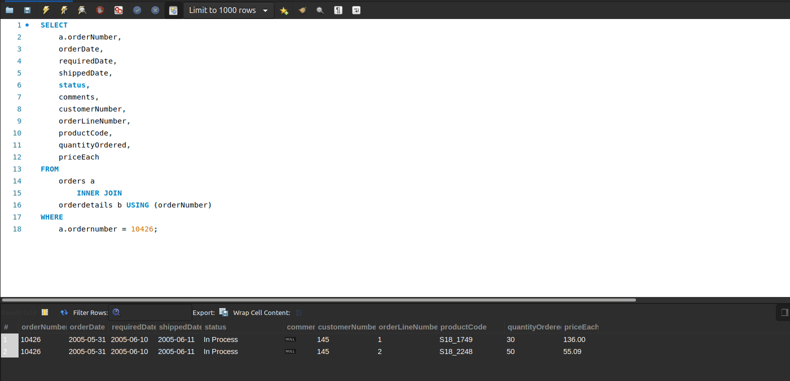
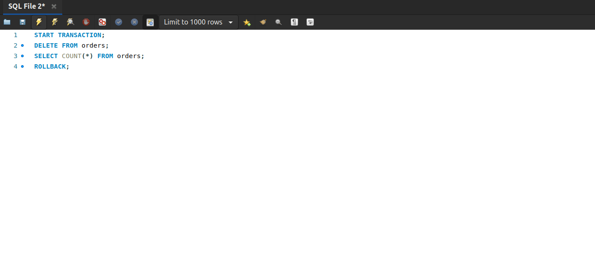
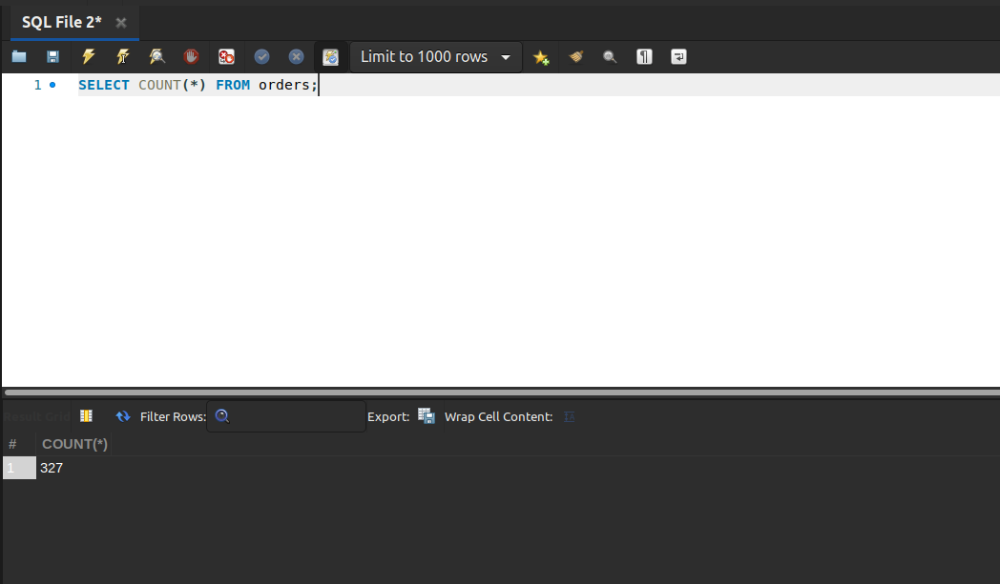

#  Transaction in MySQL

## Mục lục.

[1. Tìm hiểu Transaction.](#1)

[2. Lệnh Commit](#2)

[3. Lệnh ROLLBACK](#3)

[4.Lệnh SAVEPOINT](#4)

----

<a name ="1"></a>
## 1. Tìm hiểu Transaction.
Transaction trong SQL là một nhóm các câu lệnh SQL. Nếu một transaction được thực hiện thành công, tất cả các thay đổi dữ liệu được thực hiện trong transaction được lưu vào cơ sở dữ liệu. Nếu một transaction bị lỗi và được rollback, thì tất cả các sửa đổi dữ liệu sẽ bị xóa (dữ liệu được khôi phục về trạng thái trước khi thực hiện transaction).
Đặc điểm của Transaction

Transaction có bốn đặc điểm tiêu chuẩn sau:

- Bảo toàn - đảm bảo rằng tất cả các câu lệnh trong nhóm lệnh được thực thi thành công. Nếu không, transaction bị hủy bỏ tại thời điểm thất bại và tất cả các thao tác trước đó được khôi phục về trạng thái cũ.
- Nhất quán - đảm bảo rằng cơ sở dữ liệu thay đổi chính xác các trạng thái khi một transaction được thực thi thành công.
- Độc lập - cho phép các transaction hoạt động độc lập và minh bạch với nhau.
- Bền bỉ - đảm bảo rằng kết quả của một transaction được commit vẫn tồn tại trong trường hợp lỗi hệ thống.

Cách sử dụng Transaction SQL.
- Để bắt đầu transtion, sử dụng câu lệnh START TRANSACTION. BEGIN hoặc BEGIN WORK là bí danh của START TRANSACTION .
- Để thực hiện các thay đổi vĩnh viễn, sử dụng câu COMMIT .
- Để khôi phục giao dịch hiện tại và hủy các thay đổi của giao dịch đó, sử dụng câu ROLLBACK .
- Để vô hiệu hóa hoặc kích hoạt chế độ tự động cam kết cho giao dịch hiện tại, sử dụng câu lệnh SET autocommit . 

SQL không tự động thay đổi sử dụng câu lệnh:
```
SET autocommit =0;
SET autocommit = OFF;
```
Sử dụng SQL tự động thay đôi sau khi Transaction thì sử dụng lệnh sau:
```
SET autocommit = 1;
SET autocommit = ON;
```

<a name ="2"></a>
## 2. Lệnh Commit.

Ví dụ về việc thêm đơn đặt hàng mới trong cơ sở dữ liệu mẫu.Ở đây t sử dụng bảng orders và orderdetails.

Các bước thực hiện:
Khởi tạo một Transaction mới.
```
START TRANSACTION;
```
Chọn số order cuối cùng.
```
SELECT @orderNumber := MAX(orderNumber)+1
FROM orders;
```

Chèn dữ liệu mới vào cột orders.
```
 INSERT   INTO  orders(orderNumber,
                   orderDate,
                   requiredDate,
                   shippedDate,
                    status ,
                   customerNumber)
 VALUES (@orderNumber,
        '2005-05-31' ,
        '2005-06-10' ,
        '2005-06-11' ,
        'In Process' ,
        145);
```
Chèn dòng mới vào cột orders.
```
 INSERT   INTO  orderdetails(orderNumber,
                         productCode,
                         quantityOrdered,
                         priceEach,
                         orderLineNumber)
 VALUES (@orderNumber, 'S18_1749' , 30,  '136' , 1),
      (@orderNumber, 'S18_2248' , 50,  '55.09' , 2); 
```
Cuối dùng là sử dụng lệnh Commit.
```
Commit;
```

Kiểm tra kết quả xem đã thực hiện thành công chưa t thưc hiện câu lệnh sau:
```
SELECT 
    a.orderNumber,
    orderDate,
    requiredDate,
    shippedDate,
    status,
    comments,
    customerNumber,
    orderLineNumber,
    productCode,
    quantityOrdered,
    priceEach
FROM
    orders a
        INNER JOIN
    orderdetails b USING (orderNumber)
WHERE
    a.ordernumber = 10426;
```
Kết quả là có hai giá trị khác nhau của cột quannityOrdered và pieceEach nhưng cùng có số OrderNumber giống nhau.



<a name ="2"></a>
## 2. Lệnh ROLLBACK.
Lệnh ROLLBACK được sử dụng để hoàn tác các transaction chưa được lưu vào cơ sở dữ liệu. Lệnh này chỉ có thể được sử dụng để hoàn tác các transaction kể từ khi lệnh COMMIT hoặc ROLLBACK cuối cùng được phát hành.

Bây giờ tôi có thể tạo một Transaction mới và xóa một cột trong bảng order và có thể ROLLBACK lại như cũ.

Các bước thực hiện. Thứ tự giống COMMIT.
```
START TRANSACTION;
DELETE FROM orders;
SELECT COUNT(*) FROM orders;
ROLLBACK;
```

Kết quả trả về là không có gì vì trước đó tôi đã xóa bảng nên đến lúc câu lệnh SELECT sẽ không đêm đc gì cả.

Nếu tôi thực hiện câu lênh SELECT riêng thì toàn bộ dữ liệu sẽ được dữ nguyên vì nó sẽ ROLLBACK lại dữ liệu trước khi xóa.
```
SELECT COUNT(*) FROM orders;
```

<a name ="3"></a>
## 3.Lệnh SAVEPOINT.

SAVEPOINT là một điểm trong một transaction khi bạn có thể cuộn transaction trở lại một điểm nhất định mà không quay trở lại toàn bộ transaction.

Cú pháp của lệnh SAVEPOINT như thể hiện dưới đây.
?
1
	
SAVEPOINT SAVEPOINT_NAME;

Lệnh này chỉ phục vụ trong việc tạo ra SAVEPOINT trong số tất cả các câu lệnh transaction. Lệnh ROLLBACK được sử dụng để hoàn tác một nhóm các transaction.

Cú pháp để cuộn lại một SAVEPOINT như thể hiện dưới đây.
?
1
	
ROLLBACK TO SAVEPOINT_NAME;