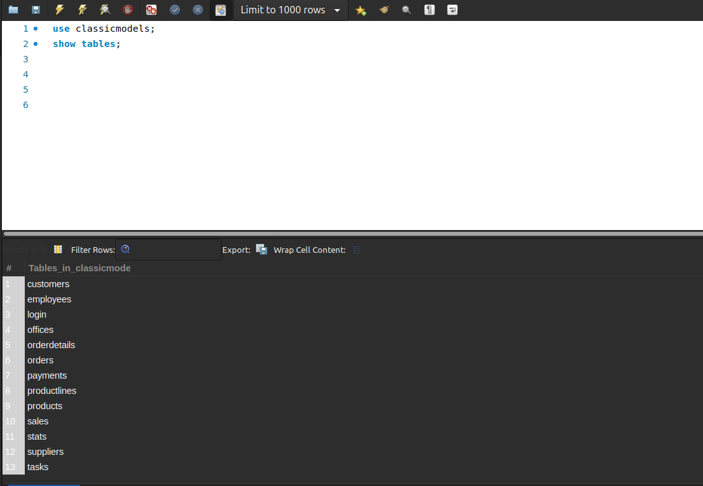
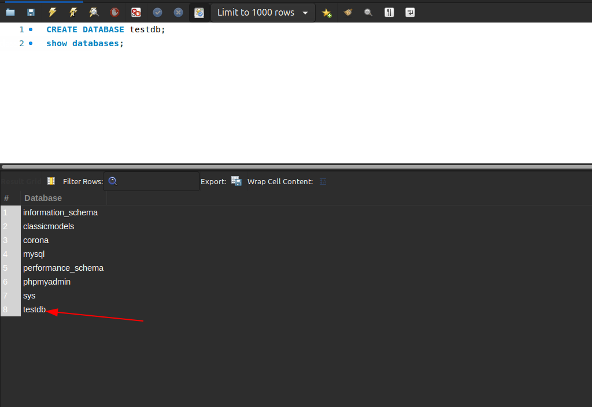
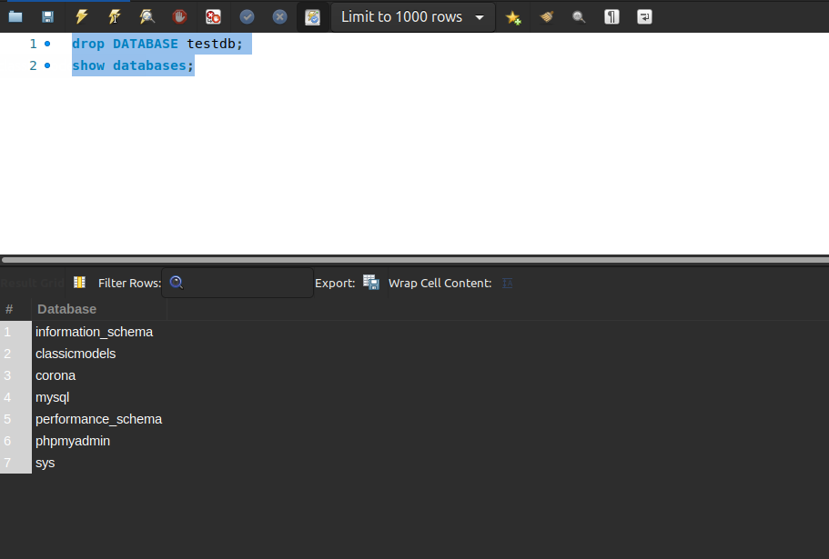

# Managing MySQL databases and tables part 1

[1.Selecting a MySQL database](#1)

[2.Managing databases](#2)

[3.CREATE DATABASE ](#3)

[4.DROP DATABASE](#4)

[5.MySQL storage engines](#5)

[6.CREATE TABLE](#6)

[7.MySQL sequence](#7)

-----

<a name ="1"></a>
## 1.Selecting a MySQL database

Chọn và thao tác với  MySQL bằng USE Statement.

Cú pháp:
```
USE  database_name;
```

<a name ="2"></a>
## 2.Managing databases

### Tạo cơ sở dữ liệu

Cú pháp:
```
CREATE   DATABASE  [ IF NOT EXISTS ] database_name;
```
Trong đó:
- DATABASE là tên cơ sở dữ liệu mà bạn muốn tạo. Tên cơ sở dữ liệu nên có ý nghĩa và mô tả càng tốt.
- IF NOT EXISTS là một mệnh đề tùy chọn của câu lệnh. Mệnh đề IF NOT EXISTS ngăn bạn khỏi lỗi tạo cơ sở dữ liệu mới đã tồn tại trong máy chủ cơ sở dữ liệu. Bạn không thể có 2 cơ sở dữ liệu có cùng tên trong máy chủ cơ sở dữ liệu MySQL. 


### Hiển thị cơ sở dữ liệu

Hiển thị tất cả các database trong SQL.

Cú pháp:
```
SHOW databases;
```

Hiển thị tất cả các bảng của một database ta sử dụng lệnh.
```
USE DATABASE_NAME;
SHOW tables;
```
Ở đây ta có thể thấy tất cả các bảng có trong database "classicmodels".

### Xóa cơ sở dữ liệu

Cú pháp:
```
DROP   DATABASE  [ IF EXISTS ] database_name;
```
Trong đó:
- DATABASE là tên cơ sở dữ liệu mà bạn muốn xóa.
- IF EXISTS là một phần tùy chọn của câu lệnh để ngăn bạn xóa cơ sở dữ liệu không tồn tại trong máy chủ cơ sở dữ liệu.
<a name ="3"></a>
## 3.CREATE DATABASE
Cú pháp:
```
CREATE   DATABASE  [ IF NOT EXISTS ] database_name;
```
Trong đó:
- DATABASE là tên cơ sở dữ liệu mà bạn muốn tạo. Tên cơ sở dữ liệu nên có ý nghĩa và mô tả càng tốt.
- IF NOT EXISTS là một mệnh đề tùy chọn của câu lệnh. Mệnh đề IF NOT EXISTS ngăn bạn khỏi lỗi tạo cơ sở dữ liệu mới đã tồn tại trong máy chủ cơ sở dữ liệu. Bạn không thể có 2 cơ sở dữ liệu có cùng tên trong máy chủ cơ sở dữ liệu MySQL. 

Ví dụ tạo một cơ sở dữ liệu mới có tên "testdb" ta sẽ làm như sau.
```
CREATE DATABASE testdb;
```


<a name ="4"></a>
## 4.DROP DATABASE
Xóa cơ sở dũ liệu.

Cú pháp:
```
DROP   DATABASE  [ IF EXISTS ] database_name;
```
Trong đó:
- DATABASE là tên cơ sở dữ liệu mà bạn muốn xóa.
- IF EXISTS là một phần tùy chọn của câu lệnh để ngăn bạn xóa cơ sở dữ liệu không tồn tại trong máy chủ cơ sở dữ liệu.

Như vậy ta đã không còn thấy database "testdb" nữa.


<a name ="5"></a>
## 5.MySQL storage engines
Storage Engine thực chất là cách MySQL lưu trữ dữ liệu trên đĩa cứng. MySQL lưu mỗi database như là một thư mục con nằm dưới thư mục data. Khi một table được tạo ra, MySQL sẽ lưu định nghĩa bảng ở file đuôi .frm và tên trùng với tên của bảng được tạo. Việc quản lý định nghĩa bảng là nhiệm vụ của MySQL server, dù rằng mỗi storage engine sẽ lưu trữ và đánh chỉ mục (index) dữ liệu khác nhau.

MySQL cung cấp các công cụ lưu trữ khác nhau cho các bảng của nó như sau:
- Maria engine
- MyISAM
- InnoDB
- MERGE


## Maria engine
Đặc điểm

- Được thiết kế bởi những người dày dạn kinh nghiêm của MySQL, với mục đích thay thế MyISAM
- Hỗ trợ transactions theo lựa chọn
- Khôi phục lỗi
- Row-level locking và MVCC
- Hỗ trợ BLOB tốt hơn.

### MyISAM

Đặc điểm

- full-text indexing
- compression.
- spatial functions (GIS)
- Không hỗ trợ transactions
- Không hỗ trợ row-level lock.

Lưu trữ

MyISAM lưu mỗi bảng dữ liệu trên 2 file: .MYD cho dữ liệu và .MYI cho chỉ mục. Row có 2 loại: dynamic và static (tuỳ thuộc bạn có dữ liệu thay đổi độ dài hay không). Số lượng row tối đa có thể lưu trữ bị giới hạn bởi hệ điều hành, dung lượng đĩa cứng. MyISAM mặc định sử dụng con trỏ độ dài 6 bytes để trỏ tới bản ghi dữ liệu, do vậy giới hạn kích thước dữ liệu xuống 256TB.

Tính năng:

- MyISAM lock toàn bộ table. User (MySQL server) chiếm shared-lock khi đọc và chiếm exclusive-lock khi ghi. Tuy vậy, việc đọc ghi có thể diễn ra đồng thời!
- MyISAM có khả năng tự sửa chữa và phục hồi dữ liệu sau khi hệ thống crashed.
- Dùng command check table / repair table để kiểm tra lỗi và phục hồi sau khi bị lỗi.
- MyISAM có thể đánh chỉ mục full-text, hỗ trợ tìm kiếm full-text.
- MyISAM không ghi dữ liệu ngay vào ổ đĩa cứng, mà ghi vào 1 buffer trên memory (và chỉ ghi vào đĩa cứng sau 1 khoảng thời gian), do đó tăng tốc độ ghi. Tuy vậy, sau khi server crash, ta cần phải phục hồi dữ liệu bị hư hỏng bằng myisamchk.
- MyISAM hỗ trợ nén dữ liệu, hỗ trợ tăng tốc độ đọc dữ liệu. Mặc dù vậy dữ liệu sau khi nén không thể cập nhật được.

### InnoDB
Đặc điểm

- Là engine phức tạp nhất trong các engine của MySQL
- Hỗ trợ transactions
- Hỗ trợ phục hồi, sửa chữa tốt

Lưu trữ

InnoDB lưu dữ liệu trên 1 file (thuật ngữ gọi là tablespace).

Tính năng:

- InnoDB hỗ trợ MVCC (Multiversion Concurrency Control) để cải thiện việc truy cập đồng thời và hỗ trợ chiến thuật next-key locking.
- InnoDB được xây dựng dựa trên clustered index, do đó việc tìm kiếm theo primary key có hiệu năng rất cao. InnoDB không hỗ trợ sắp xếp index do vậy việc thay đổi cấu trúc bảng sẽ dẫn tới toàn bộ dữ liệu phải được đánh chỉ mục từ đầu (CHẬM với những bảng lớn).

### MERGE

Còn được gọi là HEAP tables.

Lưu trữ

Tất cả dữ liệu đều nằm trên memory

Tính năng:

- Sau khi server restart, cấu trúc bảng được bảo toàn, dữ liệu bị mất hết.
- Memory engine sử dụng HASH index nên rất nhanh cho query lookup.
- Memory engine dùng table-level locking do vậy tính concurrency không cao.
 
## Tiêu chí lựa chọn engine

- Transactions: Nếu ứng dụng yêu cầu transactions, InnoDB là lựa chọn duy nhất. Nếu không yêu cầu transactions, MyISAM là lựa chọn tốt.
- Concurrency: Nếu yêu cầu chịu tải cao và không cần thiết transactions, MyISAM là lựa chọn số 1.
- Sao lưu: Các engine đều phần nào hỗ trợ sao lưu. Ngoài ra ta cần hỗ trợ sao lưu trên cả quan điểm thiết kế hệ thống. Ví dụ: bạn thiết kế database server gồm master và slave, master yêu cần transaction nên dùng innodb, slave cần sao lưu và đọc nên có thể dùng MyISAM. Cơ chế đồng bộ master-slave sẽ giúp bạn quản lý sự khác nhau giữa các engine nhưng đảm bảo tính sao lưu. Tiêu chí này có trọng số nhỏ.
- Phục hồi sau crash: MyISAM có khả năng phục hồi sau crash kém hơn InnoDB.
- Tính năng theo yêu cầu hệ thống: Nếu yêu cầu là logging, MyISAM hoặc Archive là lựa chọn hợp lý. Nếu cần lưu trực tiếp CSV, CSV engine là lựa chọn đáng cân nhắc. Nếu ứng dụng không thay đổi dữ liệu mấy (ví dụ cơ sở dữ liệu sách), MyISAM và tính năng nén là lựa chọn phù hợp.
<a name ="6"></a>
## 6.CREATE TABLE
Cú pháp:
```
 CREATE   TABLE  [ IF NOT EXISTS ] table_name(
   column_1_definition,
   column_2_definition,
   ...,
   table_constraints
)  ENGINE = storage_engine;
```
Trong đó:

- Chỉ định tên của bảng mà bạn muốn tạo sau các từ khóa CREATE TABLE . Tên bảng phải là duy nhất trong cơ sở dữ liệu. IF NOT EXISTS là tùy chọn. Nó cho phép bạn kiểm tra xem bảng mà bạn tạo đã tồn tại trong cơ sở dữ liệu chưa. Nếu đây là trường hợp, MySQL sẽ bỏ qua toàn bộ câu lệnh và sẽ không tạo bất kỳ bảng mới nào.

- Chỉ định danh sách các cột của bảng trong phần column_list , các cột được phân tách bằng dấu phẩy.

- Tùy ý chỉ định công cụ lưu trữ cho bảng trong mệnh đề ENGINE . MySQL sẽ sử dụng InnoDB theo mặc định. 

<a name ="7"></a>
## 7.MySQL sequence

Để tự động tạo một sequence trong MySQL, bạn đặt thuộc tính AUTO_INCREMENT thành một cột, thường là cột khóa chính .

Quy tắc áp dụng cho cột AUTO_INCREMENT:

- Mỗi bảng chỉ có một cột AUTO_INCREMENT có kiểu dữ liệu thường là số nguyên .
- Cột AUTO_INCREMENT phải được lập chỉ mục, có nghĩa là nó có thể là chỉ số PRIMARY KEY hoặc chỉ số UNIQUE .
- Cột AUTO_INCREMENT phải có ràng buộc NOT NULL . Khi bạn đặt thuộc tính AUTO_INCREMENT thành một cột, MySQL sẽ tự động thêm ràng buộc NOT NULL vào cột. 
