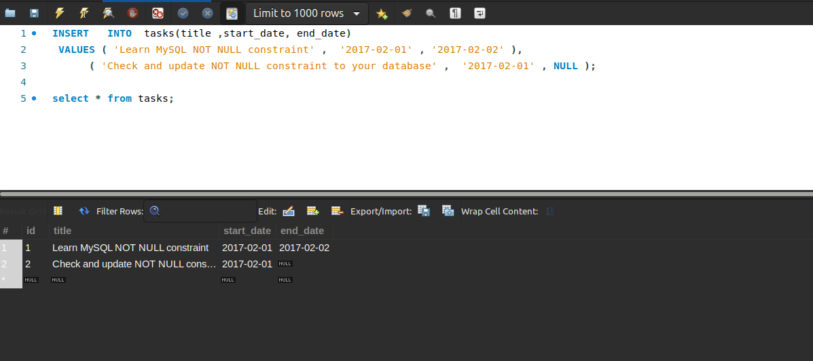
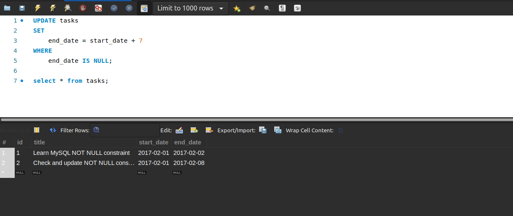
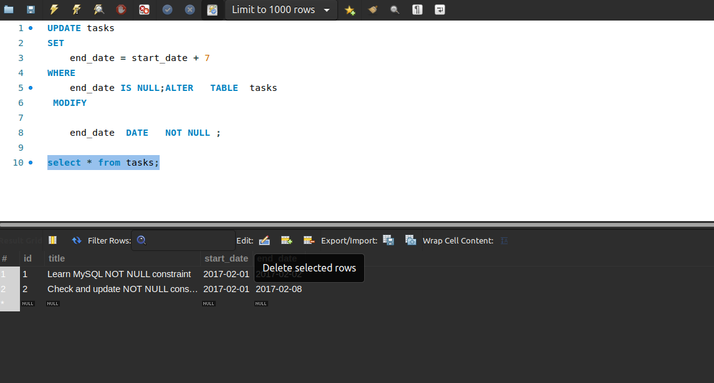
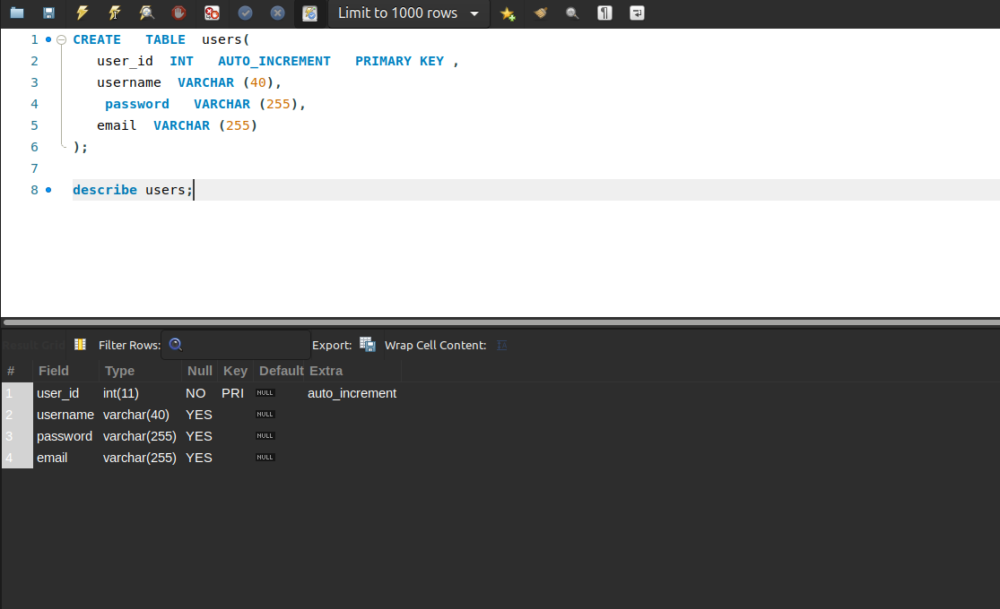
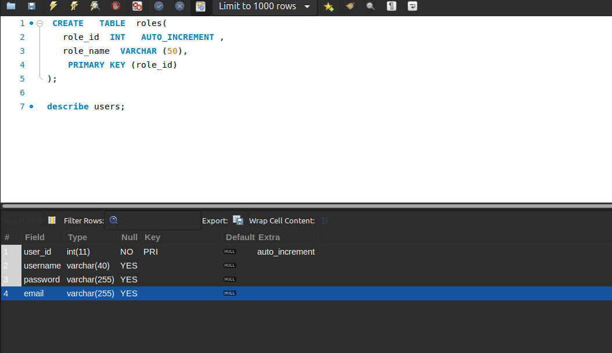
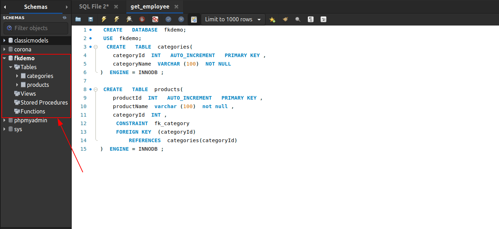
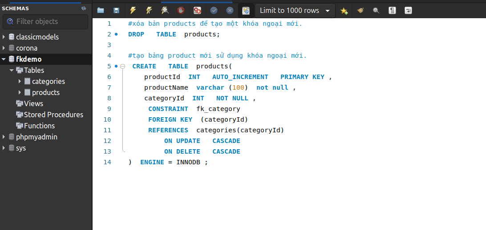
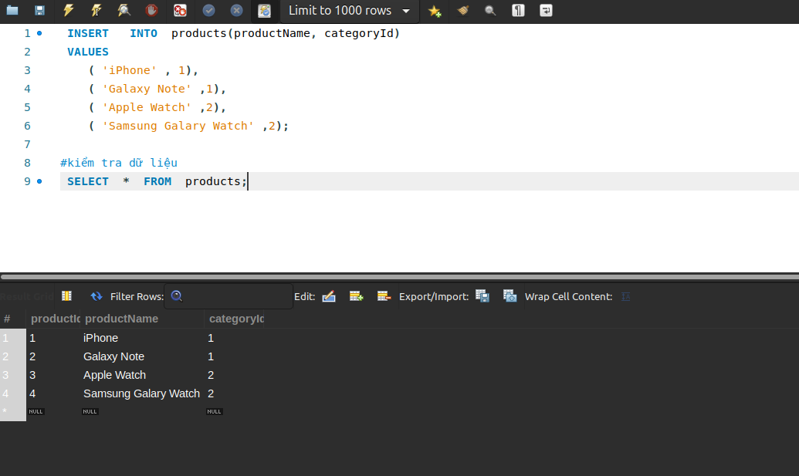
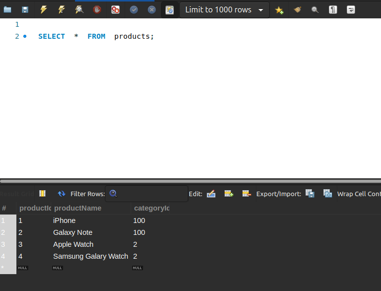

#   MySQL constraints


[1.NOT NULL constraint ](#1)

[2.Primary key constraint](#2)

[3.Foreign key constraint](#3)

[4.Disable foreign key checks](#4)

[5.UNIQUE constraint](#5)

[6.CHECK constraint ](#6)

[7.CHECK constraint emulation](#7)

------
<a name ="1"></a>
## 1.NOT NULL constraint
Ràng buộc NOT NULL là ràng buộc cột đảm bảo các giá trị được lưu trữ trong một cột không phải là NULL .
Cú pháp:
```
column_name data_type  NOT NULL ;
```
Một cột chỉ có thể chứa một ràng buộc NOT NULL chỉ định quy tắc rằng cột không được chứa bất kỳ giá trị NULL nào. Nói cách khác, nếu bạn cập nhật hoặc chèn NULL vào cột NOT NULL , MySQL sẽ báo lỗi.
 giá trị NULL làm cho các truy vấn của bạn phức tạp hơn vì bạn phải sử dụng các hàm như ISNULL() , IFNULL() và NULLIF() để xử lý NULL
Ví dụ: tạo môt bảng trong đó có cột NOT NULL.
```
 CREATE   TABLE  tasks (
    id  INT   AUTO_INCREMENT   PRIMARY KEY ,
    title  VARCHAR (255)  NOT NULL ,
    start_date  DATE   NOT NULL ,
    end_date  DATE 
);
```

Ví dụ: Thêm một ràng buộc NOT NULL vào một cột hiện có
Các bước thực hiện:

- Kiểm tra các giá trị hiện tại của cột nếu có bất kỳ NULL nào.
- Cập nhật NULL thành non- NULL nếu NULLs tồn tại.
- Sửa đổi cột với ràng buộc NOT NULL

Thêm một số dữ liệu vào database đêt thao tác trong đó có một côt chứa giá trị NULL.
```
 INSERT   INTO  tasks(title ,start_date, end_date)
 VALUES ( 'Learn MySQL NOT NULL constraint' ,  '2017-02-01' , '2017-02-02' ),
      ( 'Check and update NOT NULL constraint to your database' ,  '2017-02-01' , NULL );
```

Cập  nhật các giá trị NULL các giá trị khác null
```
 UPDATE  tasks 
 SET  
    end_date = start_date + 7
 WHERE 
    end_date  IS   NULL ;
```

Ví dụ: Bỏ một ràng buộc NOT NULL

Sử dụng ALTER TABLE..MODIFY
Cú pháp:
```
 ALTER   TABLE  table_name
 MODIFY  column_name column_definition;
```

Ví dụ: câu lệnh sau sẽ loại bỏ ràng buộc NOT NULL khỏi cột end_date trong bảng tasks
```
 ALTER   TABLE  tasks 
 MODIFY  
    end_date  DATE   NOT NULL ;
```

<a name ="2"></a>
## 2.Primary key constraint
Khóa chính là một cột hoặc một tập hợp các cột xác định duy nhất mỗi hàng trong bảng. Khóa chính tuân theo các quy tắc sau:

- Khóa chính phải chứa các giá trị duy nhất. Nếu khóa chính bao gồm nhiều cột, sự kết hợp các giá trị trong các cột này phải là duy nhất.
- Một cột khóa chính không thể có giá trị NULL . Mọi nỗ lực chèn hoặc cập nhật NULL vào các cột khóa chính sẽ dẫn đến lỗi. Lưu ý rằng MySQL ngầm thêm một ràng buộc NOT NULL vào các cột khóa chính.
- Một bảng có thể chỉ có một khóa chính. 

Vì MySQL hoạt động nhanh hơn với số nguyên, nên kiểu dữ liệu của cột khóa chính phải là số nguyên, ví dụ: INT , BIGINT.
Ví dụ 1: Xác định ràng buộc PRIMARY KEY trong CREATE TABLE
Cú pháp:
```
 CREATE   TABLE  table_name(
    primary_key_column datatype  PRIMARY KEY ,
    ...
);
```
Tạo bảng kèm theo khóa chính.
```
 CREATE   TABLE  users(
   user_id  INT   AUTO_INCREMENT   PRIMARY KEY ,
   username  VARCHAR (40),
    password   VARCHAR (255),
   email  VARCHAR (255)
);
```


Câu lệnh này tạo ra bảng roles có ràng buộc PRIMARY KEY như ràng buộc bảng:
```
 CREATE   TABLE  roles(
   role_id  INT   AUTO_INCREMENT ,
   role_name  VARCHAR (50),
    PRIMARY KEY (role_id)
);
```


Khi bạn tạo bảng mà chưa có khóa chính thì có thêm khóa chính bằng cách sử dụng câu lênh AFTER TABLE.
Cú pháp:
```
 ALTER   TABLE  table_name
 ADD   PRIMARY KEY (column_list);
```
<a name ="3"></a>
## 3.Foreign key constraint
Khóa ngoại là một cột hoặc nhóm cột trong bảng liên kết với một cột hoặc nhóm cột trong bảng khác. Khóa ngoại đặt các ràng buộc về dữ liệu trong các bảng liên quan, cho phép MySQL duy trì tính toàn vẹn tham chiếu.
xem các bảng customers và orders sau từ Classicmodels.

 Mối quan hệ giữa bảng customers và bảng orders là một-nhiều. Và mối quan hệ này được thiết lập bởi khóa ngoại trong bảng orders được chỉ định bởi cột customerNumber .

 Bảng customers được gọi là bảng cha hoặc bảng tham chiếu và bảng orders được gọi là bảng con hoặc bảng tham chiếu .


Thông thường, các cột khóa ngoại của bảng con thường đề cập đến các cột khóa chính của bảng cha.

Một bảng có thể có nhiều khóa ngoại trong đó mỗi khóa ngoại tham chiếu đến khóa chính của các bảng cha khác nhau.

Cú pháp khóa ngoại;
```
[ CONSTRAINT  constraint_name]
 FOREIGN KEY  [foreign_key_name] (column_name, ...)
 REFERENCES  parent_table(colunm_name,...)
[ ON DELETE  reference_option]
[ ON UPDATE  reference_option]
```
Trong cú pháp này:

- Đầu tiên, chỉ định tên của ràng buộc khóa ngoài mà bạn muốn tạo sau từ khóa CONSTRAINT . Nếu bạn bỏ qua tên ràng buộc, MySQL sẽ tự động tạo tên cho ràng buộc khóa ngoài.

- Tiếp đến, chỉ định danh sách các cột khóa ngoài được phân tách bằng dấu phẩy sau các từ khóa FOREIGN KEY . Tên khóa ngoại cũng là tùy chọn và được tạo tự động nếu bạn bỏ qua nó.

- Tiêp đến, chỉ định bảng cha theo sau là danh sách các cột được phân tách bằng dấu phẩy mà tham chiếu các cột khóa ngoài.

- Cuối cùng, xác định cách khóa ngoại duy trì tính toàn vẹn tham chiếu giữa các bảng con và bảng cha bằng cách sử dụng các mệnh đề ON DELETE và ON UPDATE . reference_option xác định hành động mà MySQL sẽ thực hiện khi các giá trị trong các cột khóa cha bị xóa ( ON DELETE ) hoặc được cập nhật ( ON UPDATE ).

MySQL có năm tùy chọn tham chiếu: CASCADE , SET NULL , NO ACTION , RESTRICT và SET DEFAULT .

- CASCADE : nếu một hàng từ bảng cha bị xóa hoặc cập nhật, các giá trị của các hàng khớp trong bảng con sẽ tự động bị xóa hoặc cập nhật.
- SET NULL : nếu một hàng từ bảng cha bị xóa hoặc cập nhật, các giá trị của cột khóa ngoài (hoặc cột) trong bảng con được đặt thành NULL .
- RESTRICT : nếu một hàng từ bảng cha có một hàng khớp trong bảng con, MySQL sẽ từ chối xóa hoặc cập nhật các hàng trong bảng cha.
- NO ACTION : giống như RESTRICT .
- SET DEFAULT : được công nhận bởi trình phân tích cú pháp MySQL. Tuy nhiên, hành động này bị từ chối bởi cả hai bảng InnoDB và NDB. 

Sử dụng khóa ngoại trong MySQL.
Trong bài này sử dụng một cơ sở dũ liệu mới. Trong cở sở dữ liệu mới có 2 bảng.
```
 CREATE   DATABASE  fkdemo;
 USE  fkdemo;
  CREATE   TABLE  categories(
    categoryId  INT   AUTO_INCREMENT   PRIMARY KEY ,
    categoryName  VARCHAR (100)  NOT NULL 
)  ENGINE = INNODB ;
 
 CREATE   TABLE  products(
    productId  INT   AUTO_INCREMENT   PRIMARY KEY ,
    productName  varchar (100)  not null ,
    categoryId  INT ,
     CONSTRAINT  fk_category
     FOREIGN KEY  (categoryId) 
         REFERENCES  categories(categoryId)
)  ENGINE = INNODB ;
```
Sau khi thực hiện ta có 1 database mới.


### Restrict và NO ACTION.
Cột categoryId trong bảng products là cột khóa ngoài tham chiếu đến cột categoryId trong bảng categories .

Vì  tôi không chỉ định bất kỳ mệnh đề ON UPDATE và ON DELETE , nên hành động mặc định là RESTRICT cho cả thao tác cập nhật và xóa. 
Để xem cách thực hiện của hành động RESTRCT tôi làm ví dụ sau;
```
#chèn dữ liệu vào bảng categories
 INSERT   INTO  categories(categoryName)
 VALUES 
    ( 'Smartphone' ),
    ( 'Smartwatch' );
#xem tất cả dữ liệu trong bảng categories
 SELECT  *  FROM  categories;
 ```

Tiếp đến chèn cột mới vào bảng Products:
```
 INSERT   INTO  products(productName, categoryId)
 VALUES ( 'iPhone' ,1);
```
Câu lệnh này sẽ hoạt động vị trong bảng categories đẽ tồn tại giá trị "categoryId =1".

Nếu ta chèn một cột mới mà ko có sô categoryId có trong trong bảng categories thì sẽ bị lỗi.
```
 INSERT   INTO  products(productName, categoryId)
 VALUES ( 'iPad' ,3);
```
Lập tưc nó sẽ bị lỗi và không thể thêm được.

Tùy chọn RESTRICT , bạn không thể xóa hoặc cập nhật categoryId 1 vì nó được tham chiếu bởi products 1 trong bảng products 

### CASCADE

Hoạt động ON UPDATE CASCADE và ON DELETE CASCADE của CASCADE.
```
#xóa bản products để tạo một khóa ngoại mới.
DROP   TABLE  products;

#tạo bảng product mới sử dụng khóa ngoại mới.
 CREATE   TABLE  products(
    productId  INT   AUTO_INCREMENT   PRIMARY KEY ,
    productName  varchar (100)  not null ,
    categoryId  INT   NOT NULL ,
     CONSTRAINT  fk_category
     FOREIGN KEY  (categoryId) 
     REFERENCES  categories(categoryId)
         ON UPDATE   CASCADE 
         ON DELETE   CASCADE 
)  ENGINE = INNODB ;
```


Thêm dữ liệu mới vào products
```
 INSERT   INTO  products(productName, categoryId)
 VALUES 
    ( 'iPhone' , 1), 
    ( 'Galaxy Note' ,1),
    ( 'Apple Watch' ,2),
    ( 'Samsung Galary Watch' ,2);

#kiểm tra dữ liệu 
 SELECT  *  FROM  products;
```


Cập nhập dữ liệu trong bảng categories
```
 UPDATE  categories
 SET  categoryId = 100
 WHERE  categoryId = 1;
# kiểm tra
SELECT  *  FROM  categories;
```

Lấy dữ liệu từ bảng products;
```
 SELECT  *  FROM  products;
```
Như ta thầy hành động cập nhật từ bảng catagories có ảnh huwognf đến bảng product vì chúng ta đang sử dụng khóa ngoại kiểu CASCADE.


Hành động này xẩy ra tương tự với hành đông xóa bảng.

khi xóa thì các trường liên kết bằng khóa ngoại của bảng kia cũng bị xóa.


<a name ="4"></a>
## 4.Disable foreign key checks
Thêm dữ liệu vào các bảng cha và con theo bất kỳ thứ tự nào lúc đó nó sẽ kiểm tra ràng buộc khóa ngoài nếu bị rang buộc thì ko thêm được. Lúc đó cần vô hiệu hóa khóa ngoại để thêm dữ liễu.
Để tắt kiểm tra khóa ngoại, bạn đặt biến foreign_key_checks về 0 như sau:

```
	
 SET  foreign_key_checks = 0;
```

Để bật lại kiểm tra ràng buộc khóa ngoại, bạn đặt giá trị của foreign_key_checks thành 1:
```	
 SET  foreign_key_checks = 1;
```

<a name ="5"></a>
## 5.UNIQUE constraint
Ràng buộc UNIQUE này là một ràng buộc cột. Và bạn có thể sử dụng nó để thực thi quy tắc duy nhất cho một cột.

Để xác định ràng buộc UNIQUE cho hai hoặc nhiều cột, bạn sử dụng cú pháp sau:
```
 CREATE   TABLE  table_name(
   ...
   column_name1 column_definition,
   column_name2 column_definition,
   ...,
    UNIQUE (column_name1,column_name2)
);
```

Trong cú pháp này, bạn thêm danh sách các cột được phân tách bằng dấu phẩy trong ngoặc đơn sau từ khóa UNIQUE . MySQL sử dụng kết hợp các giá trị trong cả cột column_name1 và column_name2 để đánh giá tính duy nhất.

Ví dụ sử dụng MySQL UNIQUE.
tạo một bảng mới có tên các suppliers với hai ràng buộc UNIQUE :
```
 CREATE   TABLE  suppliers (
    supplier_id  INT   AUTO_INCREMENT ,
    name  VARCHAR (255)  NOT NULL ,
    phone  VARCHAR (15)  NOT NULL   UNIQUE ,
    address  VARCHAR (255)  NOT NULL ,
     PRIMARY KEY  (supplier_id),
     CONSTRAINT  uc_name_address  UNIQUE  (name , address)
);
```

Ràng buộc UNIQUE đầu tiên được xác định cho cột "phone"

Ràng buộc thứ hai dành cho both cột tên và cột address.

Chèn thêm giá trị vào bảng:
```
 INSERT   INTO  suppliers(name, phone, address) 
 VALUES (  'ABC Inc' , 
        '(408)-908-2476' ,
        '4000 North 1st Street' );
```


Chèn một nhà cung cấp khác nhưng có số điện thoại đã tồn tại trong bảng suppliers. Lúc này nó sẽ bị lỗi vì hàng "phone" đã đặt là UNIQUE rồi nên ko thê thêm giá trị giốn như nó vào được.

Điều này cũng tương tự khi ta thêm 2 giá trị giốn nhau của hàng name , address. vì 2 hàng này cũng được đặt là UNIQUE.


<a name ="6"></a>
## 6.CHECK constraint
ràng buộc CHECK MySQL để đảm bảo rằng các giá trị được lưu trữ trong một cột hoặc nhóm cột thỏa mãn biểu thức Boolean.

Kể từ MySQL 8.0.16, CREATE TABLE hỗ trợ các tính năng thiết yếu của các ràng buộc CHECK bảng và cột cho tất cả các công cụ lưu trữ
Đây là cú pháp:
```
[ CONSTRAINT  [constraint_name]]  CHECK  (expression) [[ NOT ] ENFORCED] .
```
Trong đó:
- constraint_name : tên cho ràng buộc kiểm tra mà bạn muốn tạo
- expression Boolean phải ước tính thành TRUE hoặc UNKNOWN cho mỗi hàng của bảng. Nếu biểu thức ước lượng thành FALSE , các giá trị vi phạm ràng buộc hoặc vi phạm ràng buộc xảy ra.
- NOT , ENFORCED: tùy chọn chỉ định điều khoản thi hành để cho biết liệu ràng buộc kiểm tra có được thi hành hay không:
   - Sử dụng ENFORCED hoặc chỉ bỏ qua mệnh đề ENFORCED để tạo và thực thi các ràng buộc.
   - Sử dụng NOT ENFORCED để tạo ra các ràng buộc nhưng không thực thi nó. 

Ví dụ sử dụng CHECK Mysql.
```
 CREATE   TABLE  parts (
    part_no  VARCHAR (18)  PRIMARY KEY ,
    description  VARCHAR (40),
    cost  DECIMAL (10,2 )  NOT NULL   CHECK  (cost  > = 0),
    price  DECIMAL (10,2)  NOT NULL   CHECK  (price  > = 0)
);
```
Trong câu lệnh trên có 2 hàng CHECK: một là cột chi phí và một cột giá.

<a name ="7"></a>
## 7.CHECK constraint emulation

Sử dụng mô phỏng các ràng buộc CHECK trong MySQL bằng cách sử dụng trigger hoặc chế độ xem view

### Giả lập các ràng buộc CHECK bằng cách sử dụng kích hoạt

Để mô phỏng các ràng buộc CHECK trong MySQL, bạn có thể sử dụng hai trình kích hoạt : BEFORE INSERT và BEFORE UPDATE.

Tạo một Storage engin để kiểm tra các giá trị trong cột

Sau đó tạo BEFORE INSERT BEFORE UPDATE . Bên trong các trình kích hoạt vừa tạo. 

Tiếp đến chèn 1 hàng thỏa mãn đầu đủ điều kiện trong storage engin

Tiếp đến thử thêm các giá trị  vị phạm điều kiên với stogare thì nó sẽ không thực hiện được.

### Giả lập các ràng buộc CHECK bằng cách sử dụng các khung nhìn

Tạo ra một khung nhìn WITH CHECK OPTION dựa trên bảng bên dưới. Trong SELECT của định nghĩa khung nhìn, chúng tôi chỉ chọn các hàng hợp lệ thỏa mãn các điều kiện CHECK . Bất kỳ chèn hoặc cập nhật nào đối với chế độ xem sẽ bị từ chối nếu nó khiến hàng mới không xuất hiện trong chế độ xem