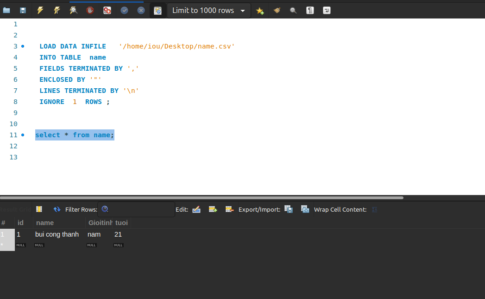

# bài 15 MySQL globalization

[15.1.Character Set ](#1)

[15.2. Collation](#2)

[Bài 16 MySQl import and export ](#3)

[16.1.Import CSV File Into MySQL Table](#4)

[16.2.Export MySQL Table to CSV ](#5)

<a name ="1"></a>
## 1.Character Set.

Character Set hay bộ ký tự MySQL là một bộ các ký tự hợp pháp trong một chuỗi.

MySQL hỗ trợ các bộ ký tự khác nhau cho phép bạn lưu trữ hầu hết mọi ký tự trong một chuỗi. Để có được tất cả các bộ ký tự có sẵn trong máy chủ cơ sở dữ liệu MySQL, bạn sử dụng câu lệnh SHOW CHARACTER SET như sau:
```
 SHOW   CHARACTER SET ;
```


Bộ ký tự mặc định trong MySQL là latin1 . Nếu bạn muốn lưu trữ các ký tự từ nhiều ngôn ngữ trong một cột, bạn có thể sử dụng các bộ ký tự Unicode, đó là utf8 hoặc ucs2 . 

MySQL cung cấp hàm LENGTH để lấy độ dài của chuỗi theo byte và hàm CHAR_LENGTH để lấy độ dài của chuỗi theo ký tự. Nếu một chuỗi chứa ký tự nhiều byte, kết quả của hàm LENGTH lớn hơn kết quả của hàm CHAR_LENGTH()

Hàm CONVERT chuyển đổi một chuỗi thành một bộ ký tự cụ thể. Trong ví dụ này, nó chuyển đổi bộ ký tự của chuỗi MySQL Character Set thành ucs2 . Vì ucs2 ký tự ucs2 chứa các ký tự 2 byte, do đó độ dài của chuỗi @str bằng byte lớn hơn độ dài tính bằng ký tự.

MySQL cung cấp hai hàm cho phép bạn chuyển đổi các chuỗi giữa các bộ ký tự khác nhau: CONVERT và CAST

Cú pháp của hàm CONVERT như sau:
```
 CONVERT (expression  USING  character_set_name)
```
<a name ="2"></a>
## 2. Collation

Đối chiếu MySQL là một tập hợp các quy tắc được sử dụng để so sánh các ký tự trong một bộ ký tự cụ thể. Mỗi ký tự được đặt trong MySQL có thể có nhiều đối chiếu và ít nhất có một đối chiếu mặc định. Hai bộ ký tự không thể có cùng đối chiếu.

Đặt bộ ký tự và đối chiếu ở cấp cơ sở dữ liệu

Khi bạn tạo cơ sở dữ liệu, nếu bạn không chỉ định bộ ký tự và đối chiếu của nó, MySQL sẽ sử dụng bộ ký tự mặc định và đối chiếu của máy chủ cho cơ sở dữ liệu. 

Bạn có thể ghi đè cài đặt mặc định ở cấp cơ sở dữ liệu bằng cách sử dụng câu CREATE DATABASE hoặc ALTER DATABASE như sau:
```
 CREATE   DATABASE  database_name
 CHARACTER SET  character_set_name;
 COLLATE  collation_name
```
```
 ALTER   DATABASE  database_name
 CHARACTER SET  character_set_name
 COLLATE  collation_name;
```

Đặt bộ ký tự và đối chiếu ở cấp cột

Một cột kiểu CHAR , VARCHAR hoặc TEXT có thể có bộ ký tự và đối chiếu riêng khác với bộ ký tự mặc định và đối chiếu của bảng.

Bạn có thể chỉ định một bộ ký tự và đối chiếu cho cột trong định nghĩa của cột trong câu CREATE TABLE hoặc ALTER TABLE như sau:
```	
column_name [ CHAR  |  VARCHAR  |  TEXT ] ( length )
 CHARACTER SET  character_set_name
 COLLATE  collation_name
```

Các quy tắc để thiết lập bộ ký tự và đối chiếu:

- Nếu bạn chỉ định rõ ràng cả bộ ký tự và đối chiếu, bộ ký tự và đối chiếu sẽ được sử dụng.
- Nếu bạn chỉ định một bộ ký tự và bỏ qua đối chiếu, đối chiếu mặc định của bộ ký tự sẽ được sử dụng.
- Nếu bạn chỉ định đối chiếu mà không có bộ ký tự, bộ ký tự được liên kết với đối chiếu sẽ được sử dụng.
- Nếu bạn bỏ qua cả bộ ký tự và đối chiếu, bộ ký tự và đối chiếu mặc định sẽ được sử dụng. 
<a name ="3"></a>
# Bài 16 MySQl import and export.
<a name ="4"></a>
## 1.Import CSV File Into MySQL Table

Câu LOAD DATA INFILE cho phép bạn đọc dữ liệu từ tệp văn bản và nhập dữ liệu của tệp vào bảng cơ sở dữ liệu rất nhanh.

Trước khi nhập tệp, bạn cần chuẩn bị như sau:

- Một bảng cơ sở dữ liệu mà dữ liệu từ tệp sẽ được nhập vào.
- Tệp CSV có dữ liệu khớp với số cột của bảng và loại dữ liệu trong mỗi cột.
- Tài khoản, kết nối với máy chủ cơ sở dữ liệu MySQL, có các đặc quyền FILE và INSERT. 

Ví dụ tôi có một file name.csv như sau


Sau đó ta phải tạo bảng có các cột có trường tương tự.
```
 CREATE   TABLE  name (
    id  INT   NOT NULL   AUTO_INCREMENT ,
    name VARCHAR (255)  NOT NULL ,
    Gioitinh varchar   NOT NULL ,
    tuoi int NOT NULL,
     PRIMARY KEY  (id)
);
```


Sử dụng câu lệnh **LOAD DATA INFILE** để import file vào bảng.
```
 LOAD DATA   INFILE   '/home/iou/Desktop/name.csv'
 INTO   TABLE  name 
 FIELDS   TERMINATED BY   ','  
 ENCLOSED BY   '"' 
 LINES   TERMINATED BY   '\n' 
 IGNORE  1  ROWS ;
```


<a name ="5"></a>
## 2.Export MySQL Table to CSV 

Để export một bảng trong SQL ra file CSV trên MySQL workbeck ta sẽ thự hiện các bước sau.


Tiếp đến đặt tên cho file csv sẽ lưu


Tiếp đó ấn save vậy là ta đã có một file csv có dữ liệu từ. Các bảng trong database.
