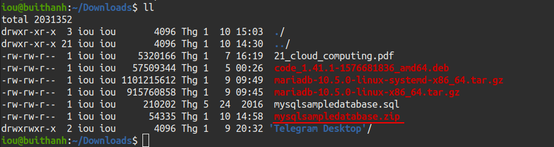
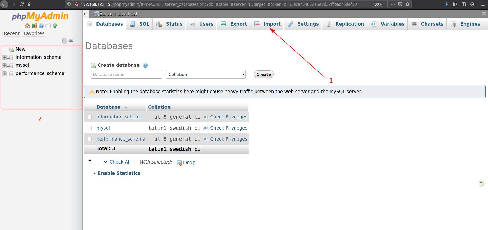
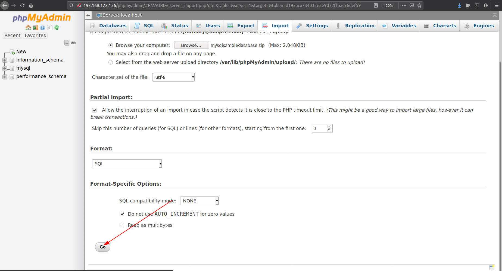
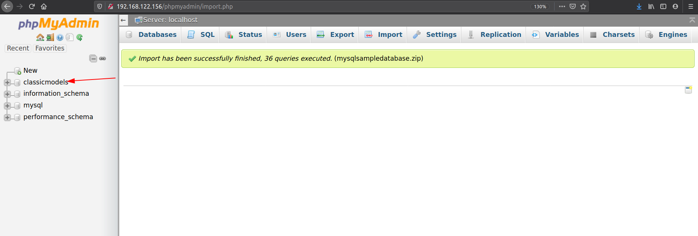

# Bài 1. Cài đặt các bảng.

## 1.1 Các bạn có thể tự tạo database cho riêng mình
## 1.2 Hoặc có thể sử dụng database có sẵn.

Trong loạt bài này tôi sử dụng Database sau.

Bản có thể tải database tại link **https://www.mysqltutorial.org/wp-content/uploads/2018/03/mysqlsampledatabase.zip**

Khi tải về ta sẽ được 1 file có định dạng **.zip**.

Để Import database bằng phpadmin ta làm như sau.

Click vào mục **Import**.Sau đó chọn brows đến files ta vừa tải về. Cuối cùng ấn **Go**.

Kết quả.

Vậy là ta đã import thành công 1 database ngoài vào database cảu ta.
