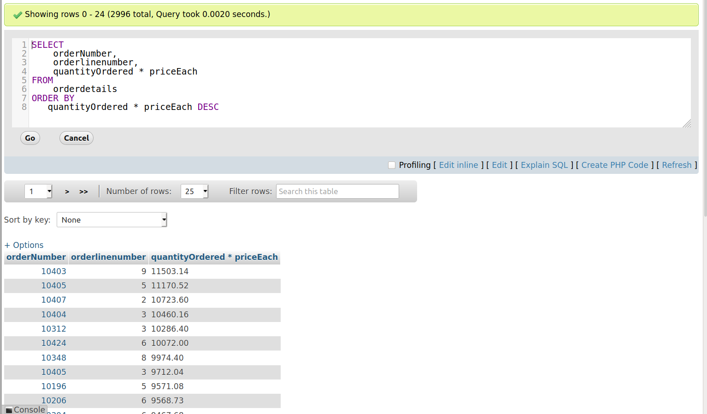

# Sorting data.

Sắp xếp dữ liệu trong database.

Để sắp xếp thì có 2 chiều :
- Giảm dần thì ta sử dụng **DESC**
- Tăng dần thì ta sử dụng **ASC**

Sử dụng cùng với Cụm từ **ORDER BY**

Cấu trúc:
```
SELECT 
   select_list
FROM 
   table_name
ORDER BY 
   column1 [ASC|DESC], 
   column2 [ASC|DESC],
   ...;
```

**Ví dụ 1:** Sắp xếp 1 cột trong bảng.

Chọn tất cả cột trong bảng employees sắp xếp tăng dần bởi cột employeeNumber.
```
SELECT * FROM employees ORDER BY `employeeNumber` ASC 
```


**Ví dụ 2:** 
```
SELECT * FROM employees ORDER BY `employeeNumber` ASC, reportsTo DESC;
```
Trong trường hợp này nó sẽ chỉ sắp xếp tăng dần của cột employees.


**Ví dụ 3:** Ta cũng có thể sắp xếp theo số lượng tính toán.

```
SELECT 
    orderNumber, 
    orderlinenumber, 
    quantityOrdered * priceEach
FROM
    orderdetails
ORDER BY 
   quantityOrdered * priceEach DESC;
```
Chọn cột orderNumber, orderlinenumber, quantityOrdered * priceEach từ bảng orderdetails sắp xếp giảm dần bởi tích quantityOrdered * priceEach.




Function **FIELD()** sử dụng để map các kết quả theo thứ tự trong function field.
**Ví dụ 4:** Sắp xếp  trường status theo function.
```
SELECT 
    orderNumber, 
    status
FROM
    orders
ORDER BY 
    FIELD(status,
        'In Process',
        'On Hold',
        'Cancelled',
        'Resolved',
        'Disputed',
        'Shipped');
```
 chọn cột orderNumber, status từ bảng orders sắp xếp hiện thị lần lượt cột status theo các giá trị 'In Process','On Hold','Cancelled','Resolved', 'Disputed','Shipped' .

