# Filtering data.

Mục lục

[1. Mệnh đề where](#1)

[2. Mệnh đề distinct](#2)

[3. Toán tử AND](#3)

[4. Toán tử OR](#4)

[5. Toán tử IN](#5)

[6. Toán tử BETWEEN](#6)

[7. Toán tử LIKE](#7)

[8. LIMIT](#8)

[9. Toán tử IS NULL](#9)

----

<a name ="1"></a>
## 1. Mệnh đề where
where lọc các điều kiên chỉ định. Mệnh đề WHERE cho phép bạn chỉ định một điều kiện tìm kiếm cho các hàng được trả về bởi một truy vấn. Sau đây cho thấy cú pháp của mệnh đề WHERE:
```
SELECT 
    select_list
FROM
    table_name
WHERE
    search_condition;
```
Search_condition là sự kết hợp của một hoặc nhiều vị từ bằng cách sử dụng toán tử logic and, or, between, like, in, not in, is , =, <, >, >=, <=, !=.

**Ví dụ 1:** Sử dụng mệnh đề WHERE với dấu bằng.

```
SELECT 
    lastname, 
    firstname, 
    jobtitle
FROM
    employees
WHERE
    jobtitle = 'Sales Rep';
```
chọn cột lastname, firstname, jobtitle từ bảng employees nơi jobtitle = sales rep.


**Ví dụ 2:** Sử dụng mệnh để where với toán tử AND.
```
SELECT 
    lastname, 
    firstname, 
    jobtitle,
    officeCode
FROM
    employees
WHERE
    jobtitle = 'Sales Rep' AND 
    officeCode = 1;
```
Chọn cột lastname, firstname, jobtitle, officeCode từ bảng employees nơi jobtitle = 'Sales Rep' và officeCode = 1.

Hiện thị kết quả đồng thời có cả 2 trường trên.


**Ví dụ 3:** Sử dụng mệnh đề where với toán từ Between.
```
SELECT 
    firstName, 
    lastName, 
    officeCode
FROM
    employees
WHERE
    officeCode BETWEEN 1 AND 3
ORDER BY firstName ASC
```

Chọn cột lastname, firstname, officeCode từ bảng employees nơi oficeCode giữa 1 và 3 sắp xếp tăng dần theo côt firstname.


**Ví dụ 4:** Sử dụng mệnh đề where với toán tử like.

Câu truy vấn này tìm người có  lastname kết thúc bằng 3 ký tự "son".
```
SELECT 
    firstName, 
    lastName
FROM
    employees
WHERE
    lastName LIKE '%son'
ORDER BY firstName;
```


**Ví dụ 5:** Sử dụng WHERE vói toán tử so sánh.
```
SELECT 
    lastname, 
    firstname, 
    jobtitle
FROM
    employees
WHERE
    jobtitle <> 'Sales Rep';
```
Chọn cột  lastname, firstname, jobtitle từ bảng employees nơi jobtitle khác giá trị 'Sales Rep'.
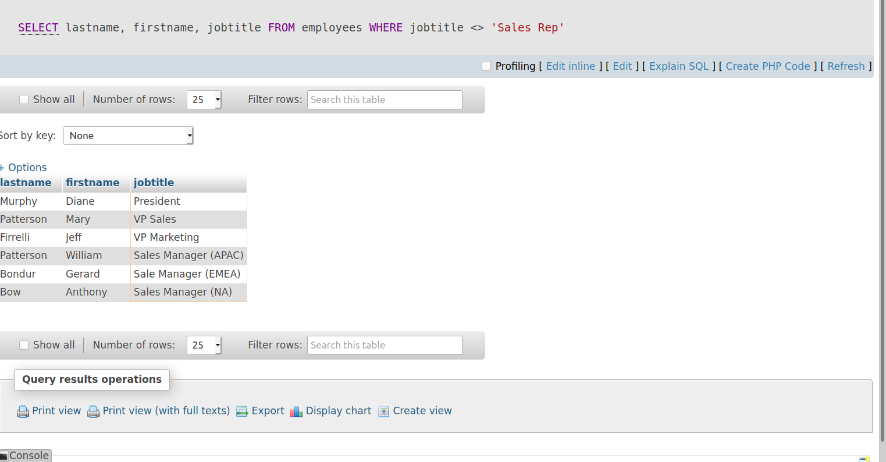

<a name ="2"></a>
## 2. Mệnh đề distinct

Trong truy vấn dữ liệu trên bảng có thể cột có gâp đôi giá trị. Nếu muốn cột đó chỉ có 1 giá trị và không lặp lại thì ta sử dụng DISTINCT.

Cấu trúc sử dụng DISTINCT.
```
SELECT DISTINCT
    select_list
FROM
    table_name;
```

**Ví Dụ 1:** Chọn cột và giá trị đó chỉ hiện thị 1 lần.
```
SELECT 
    DISTINCT lastname
FROM
    employees
ORDER BY 
    lastname;
```
Như ta thấy mỗi giá trị chỉ xuất hiện 1 lần.
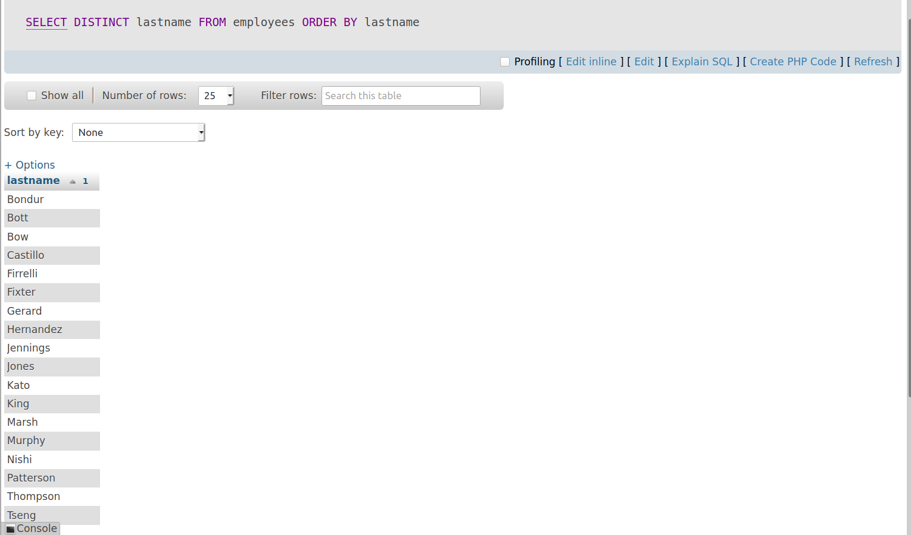

**Vi dụ 2:** Sử dụng DISTINCT với các function khác.
```
SELECT 
    COUNT(DISTINCT state)
FROM
    customers
WHERE
    country = 'USA';
```

Đếm số  state của country USA trong  bảng customers.
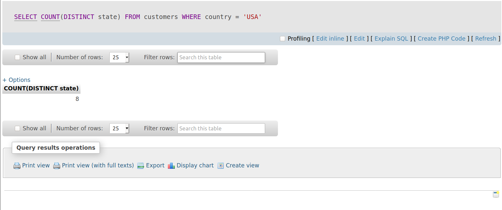

**Vi dụ 3:** Sử dụng DISTINCT với LIMIT 
Trong trường hợp này mySQL lập tức tìm kiếm số hàng và có giá trị duy nhất đưuọc chỉ định trong LIMIT.

```	
SELECT DISTINCT
    state
FROM
    customers
WHERE
    state IS NOT NULL
LIMIT 5;
```
Chọn trạng thái duy nhất của state từ bảng customers nơi state không có giá trị null hiện thị giớ hạn 5 kết quả đầu tiên.

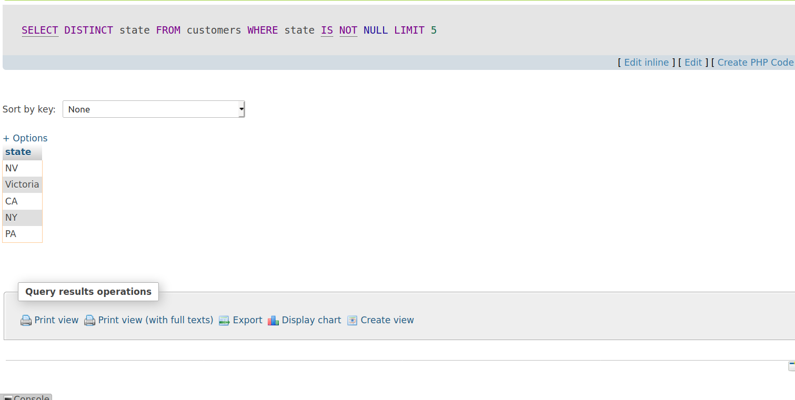

<a name ="3"></a>
## 3. Toán tử AND

Toán từ AND (và) đây là toán tử  so sánh kết hợp giữa true, flase và null.
Đây là toán tử đồng thời.

AND có thể kết hợp được với các mệnh đè như WHERE , SELECT, UPDATE, DETELE, INNER JOIN và LEFT JOIN.

**Ví Dụ 1:** Sư dụng toán tử  AND hiển thị đồng thời các giá trị lựa chọn.
```
SELECT 
    customername, 
    country, 
    state
FROM
    customers
WHERE
    country = 'USA' AND state = 'CA';
```
Chọn cột  customername, country, state từ bảng customers khi mà có cột country là USA và cột state là CA.

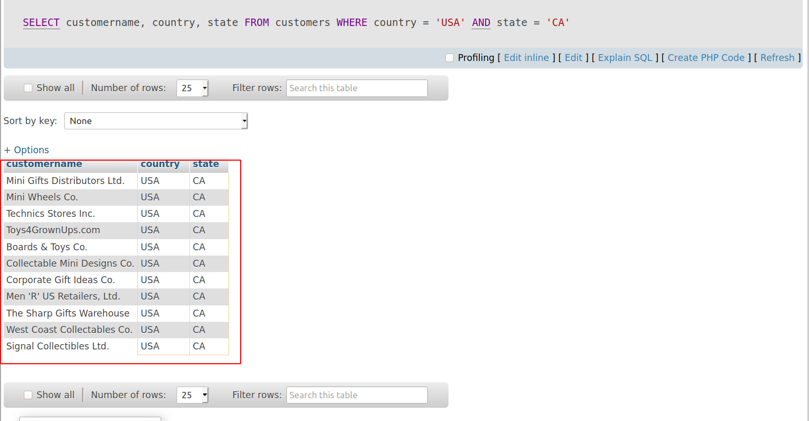

<a name ="4"></a>
## 4. Toán tử OR.

Toán tử OR (hoặc).
Toán tử OR hiện thị giá trị thỏa mãn cột 1 hoặc cột 2.

**Ví Dụ 1:** Sử dụng toán tử OR.

Sử dụng toán tử OR để hiển thị  giá trị country là USA hoặc France.
```
SELECT    
    customername, 
    country
FROM    
    customers
WHERE country = 'USA' OR 
      country = 'France';
```
trường country có giá trị là France hoặc USA thì sẽ hiện thị.
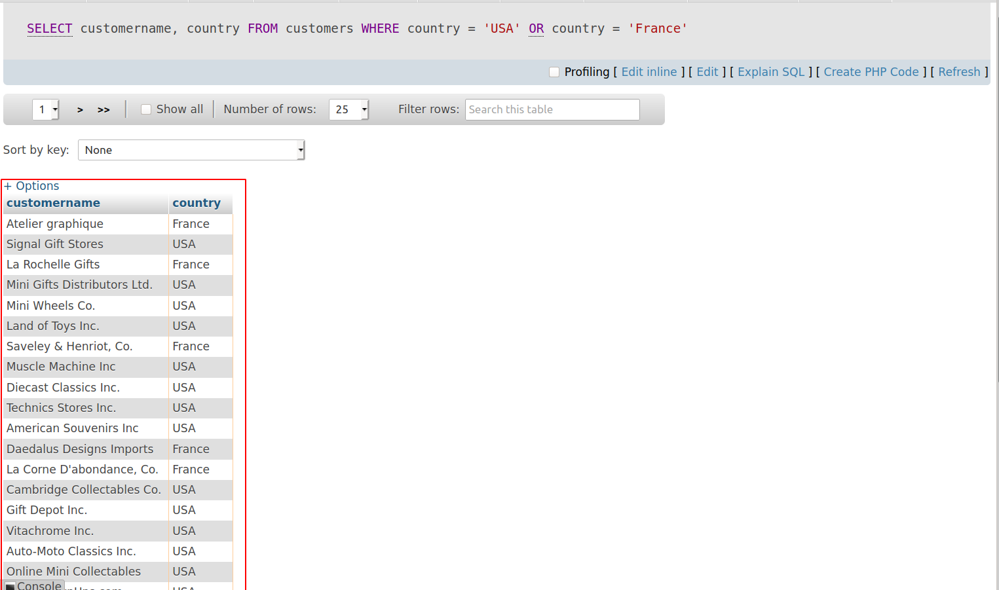

**Ví dụ 2:** Có thể sự dụng kết hợp OR và AND.

```
SELECT    
    customername, 
    country, 
    creditLimit
FROM    
    customers
WHERE country = 'USA'
        OR country = 'France'
        AND creditlimit > 10000
ORDER BY creditlimit DESC
```

Chọn cột  customername, country, creditLimit từ bảng customers khi  có country là USA hoặc France và có giá trị creditlimit > 10000  sắp xếp theo giá trị giảm dần của cột creditlimit.
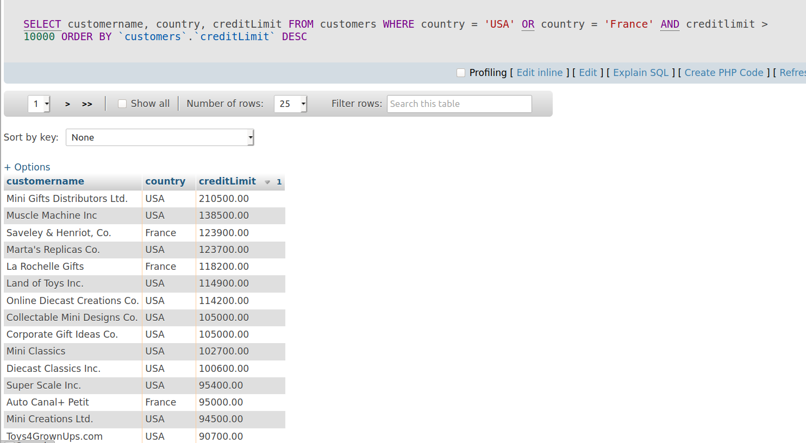

<a name ="5"></a>
## 5. Toán tử IN.

Toán tử IN để xác định xem một giá trị được chỉ định có khớp với bất kỳ giá trị nào trong danh sách hoặc truy vấn con hay không.

Cấu trúc sử dụng IN.
```
SELECT 
    column1,column2,...
FROM
    table_name
WHERE 
    (expr|column_1) IN ('value1','value2',...);
```


**Ví dụ 1:** Sư dụng toán tử IN  trong truy vấn.
```
SELECT 
    officeCode, 
    city, 
    phone, 
    country
FROM
    offices
WHERE
    country IN ('USA' , 'France');
```

Hiện thị các cột từ bảng offices trong đó có cột conuntry có giá trị USA và France.

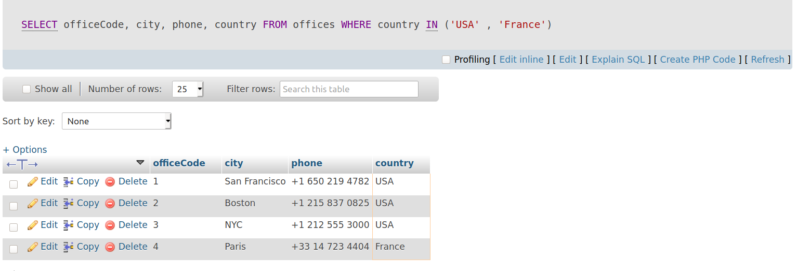
**Ví dụ 2:** Sử dụng toán tử NOT in trong truy vấn.
```	
SELECT 
    officeCode, 
    city, 
    phone
FROM
    offices
WHERE
    country NOT IN ('USA' , 'France');
```
hiện thị cột trong bảng offices mà cột country không chứa giá trị USA  hoặc France.
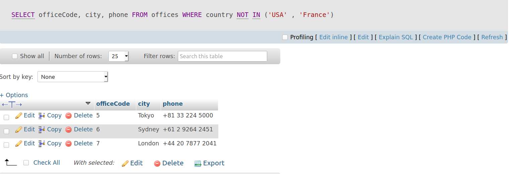


<a name ="6"></a>
## 6. Toán tử BETWEEN.

Hiện thị tùy chọn giá trị nằm giữa BETWEEN được chọn có giá trị đầu và giá trị cuối.

**Ví dụ 1:** chọn giá trị nằm trong khoản giá trị.

```	
SELECT 
    productCode, 
    productName, 
    buyPrice
FROM
    products
WHERE
    buyPrice BETWEEN 90 AND 100;
```
Chọn cột trong bảng products mà giá trí buyPrice nằm giữa khoảng 90 và 100.

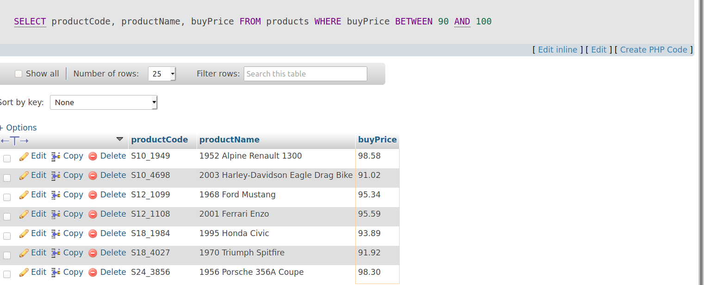

**Ví dụ 2:** Kết hợp BETWEEN và NOT.
```
SELECT 
    productCode, 
    productName, 
    buyPrice
FROM
    products
WHERE
    buyPrice NOT BETWEEN 20 AND 100;
```

Chọn cột từ bảng products mà cột buyPrice không nằm trong khoảng giá trị 20 đến 100.

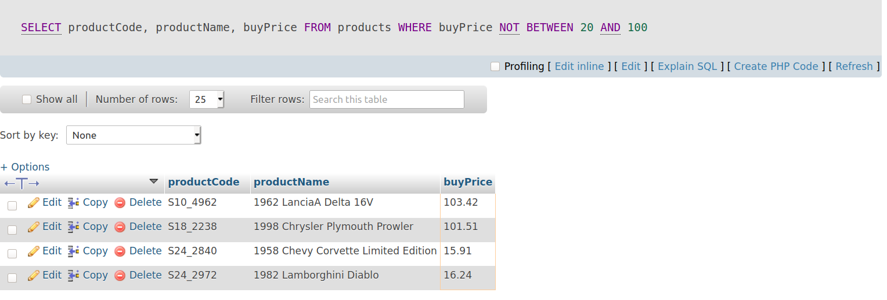


<a name ="7"></a>
## 7. Toán tử  LIKE.

Toán tử này sử dụng  sẽ hiện thị kết mà trong đó gần giống hoặc chứa kỳ tự đó.


MySQL cung cấp hai ký tự đại diện để xây dựng các mẫu: % và gạch dưới _.

     Ký tự đại diện phần trăm (%) khớp với bất kỳ chuỗi nào có 0 hoặc nhiều ký tự.
     Ký tự đại diện gạch dưới (_) phù hợp với bất kỳ ký tự đơn nào.

**Ví dụ 1:** Sư dụng LIKE với dấu %.
```
SELECT 
    employeeNumber, 
    lastName, 
    firstName
FROM
    employees
WHERE
    firstName LIKE 'a%';
```
chọn cột từ bảng employees  khi cột firstName có bắt đầu bằng ký tự a.

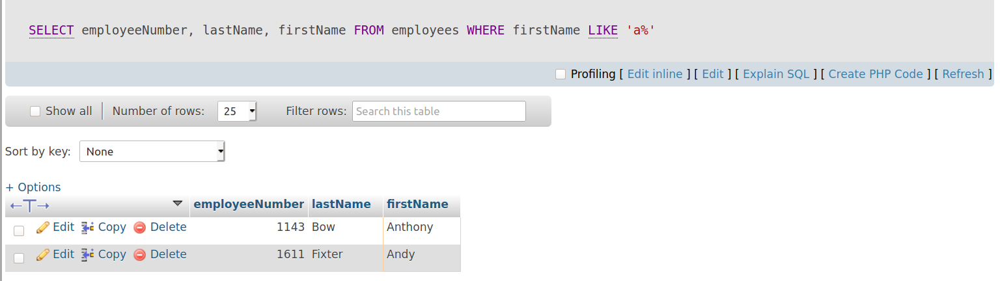

**Ví dụ 2:** Sử dụng LIKE vói dấu _.

```
SELECT 
    employeeNumber, 
    lastName, 
    firstName
FROM
    employees
WHERE
    firstname LIKE 'T_m';
```

Hiển thị kết quả có Ký tự đầu là t, tiếp đến là ký tự bất kỳ và cuối cùng kết thúc bằng ký tự m.

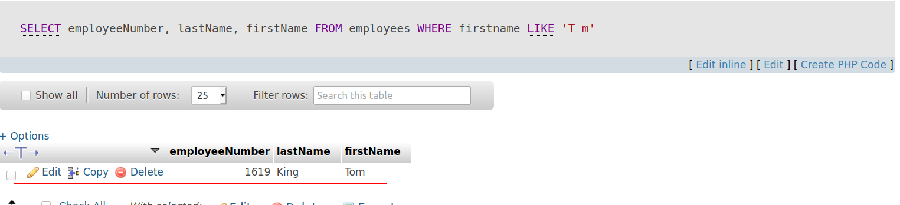

**Ví dụ 3:** sử dụng LIKE với NOT.

Hiện thị kết quả mà trong đó cột có giá trị không chưa ký tự đó.
```	
SELECT 
    employeeNumber, 
    lastName, 
    firstName
FROM
    employees
WHERE
    lastName NOT LIKE 'B%';
```

chọn cột trong bảng employees mà cột lastName không chứa giá trị bắt đầu bằng Ký tự B.

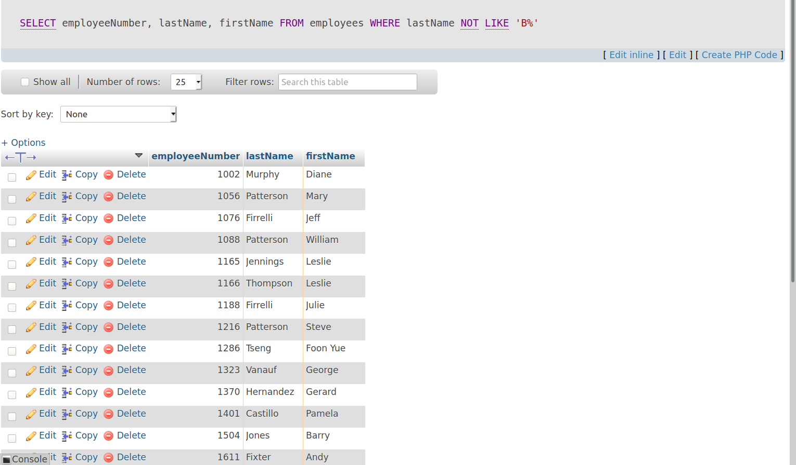

<a name ="8"></a>
## 8. Toán tử  LIMIT.

Mệnh đề LIMIT được sử dụng trong câu lệnh SELECT để giới hạn số lượng hàng cần trả về. Mệnh đề LIMIT chấp nhận một hoặc hai đối số. Các giá trị của cả hai đối số phải bằng 0 hoặc số nguyên dương.

Cấu trúc.
```	
SELECT 
    select_list
FROM
    table_name
LIMIT [offset,] row_count;
```
**Ví dụ 1:** Hiện thị giới hạn cột trả về.
```
SELECT 
    customerNumber, 
    customerName, 
    creditLimit
FROM
    customers
ORDER BY creditLimit DESC
LIMIT 5;
```
Chọn cột từ bảng customers sắp xếp giảm dần theo creditLimit và chỉ hiển thị 5 hàng đầu tiên.

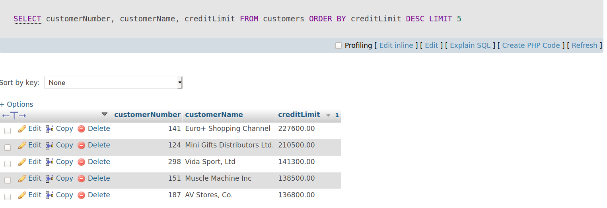

**Ví dụ 2:** Hiện thị x hàng từ hàng thứ y nào đó.
```
SELECT 
    customerNumber, 
    customerName
FROM
    customers
ORDER BY customerName    
LIMIT 15;
```
Đây là ảnh hiện thị giới hạn 15 hàng.
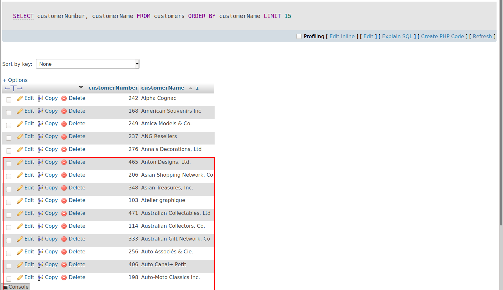

Chọn cột từ bảng customers sắp xếp bởi cột customerName hiện thị 10 hàng tiếp theo từ hang thứ 5.
```
SELECT 
    customerNumber, 
    customerName
FROM
    customers
ORDER BY customerName    
LIMIT 5, 10;
```
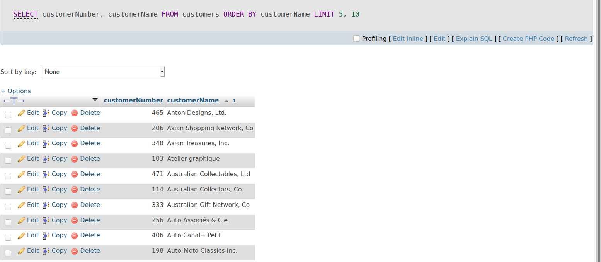

Ta thấy Cột customerNumber bắt đầu từ 465 đên 198.

<a name ="9"></a>
## 9. Toán tử IS NULL

Để kiểm tra xem giá trị có phải là NULL hay không, bạn sử dụng toán tử IS NULL . Đây là cú pháp cơ bản của toán tử IS NULL :
```
value IS NULL
```
Giá trị trả về của NULL là true hoặc false nên IS NULL sử dụng kiểu dữ liệu TINYINT(1) 


Để kiểm tra giá trị không phải là NULL thì sử dụng IS NOT NULL. Cú pháp cơ bản.
```
value IS NOT NULL
```

**Ví dụ 1:** Sử dụng IS NULL cơ bản.
Truy vấn sau đây sử dụng toán tử IS NULL để tìm các khách hàng không có đại diện bán hàng:
```
 SELECT  
    customerName, 
    country, 
    salesrepemployeenumber
 FROM 
    customers
 WHERE 
    salesrepemployeenumber  IS   NULL 
 ORDER BY  
    customerName; 
```
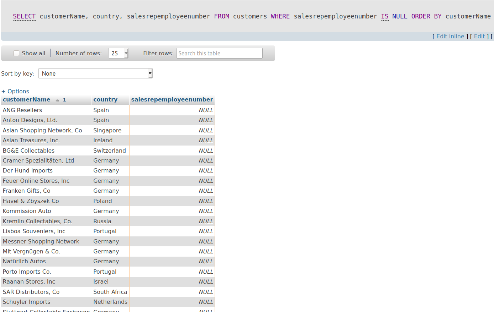

**Ví dụ 2:** Sử dụng IS NOT NULL cơ bản.

Sử dụng toán tuer IS NOT NULL để tìm khách hàng có đại diện bán hàng.
```
 SELECT  
    customerName, 
    country, 
    salesrepemployeenumber
 FROM 
    customers
 WHERE 
    salesrepemployeenumber  IS   NOT NULL 
 ORDER BY  
   customerName;
```
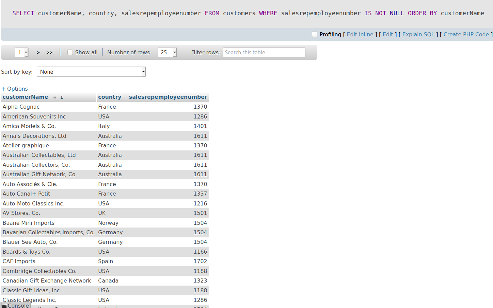

Ta có thể sử dụng IS NULL với các mệnh đề khác nhau.

**Ví dụ 3:** Sử dụng IS NULL với WHERE.

```
 SELECT  
    customerNumber, 
    salesRepEmployeeNumber
 FROM 
    customers
 WHERE 
    salesRepEmployeeNumber  IS   NULL ;
```

Chọn cột customerNumber, salesRepEmployeeNumber từ bảng customers nơi có cột salesRepEmployeeNumber là giá trị NULL.

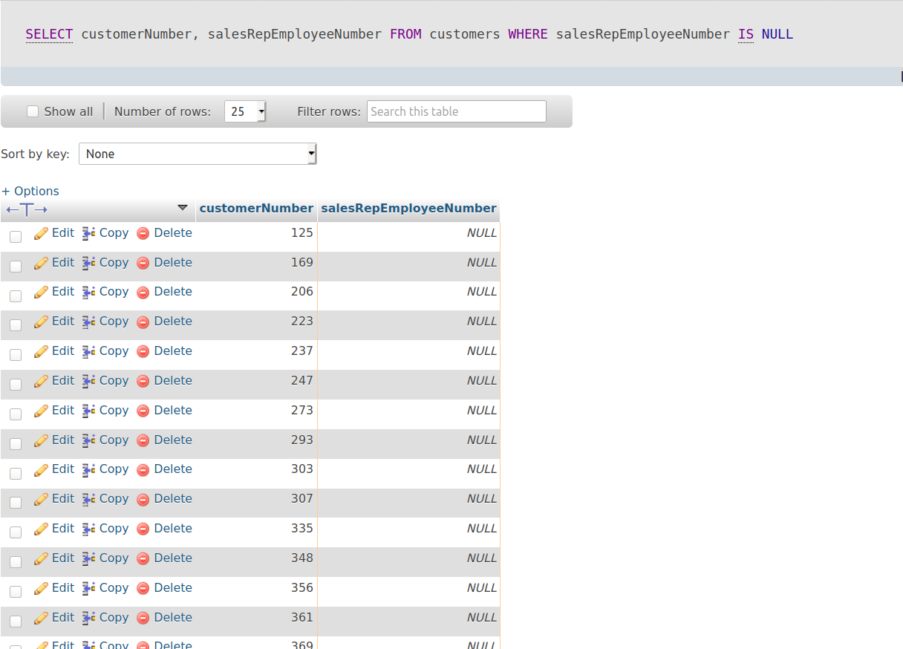