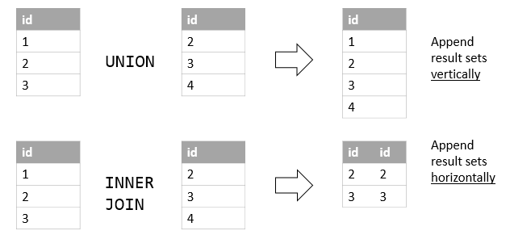
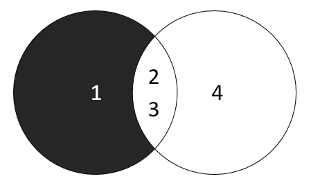

# Set operators

## Mục lục
[1. UNION and UNION ALL](#1)

[2. INTERSECT](#2)

[3. MINUS](#3)

----

<a name ="1"></a>
## 1. UNION and UNION ALL

Toán tử MySQL UNION cho phép bạn kết hợp hai hoặc nhiều bộ kết quả truy vấn thành một bộ kết quả. Dưới đây minh họa cú pháp của UNION tử UNION :
```
 SELECT  column_list
 UNION  [ DISTINCT  |  ALL ]
 SELECT  column_list
 UNION  [ DISTINCT  |  ALL ]
 SELECT  column_list
```
Để kết hợp tập kết quả của hai hoặc nhiều truy vấn bằng UNION tử UNION , đây là các quy tắc cơ bản mà bạn phải tuân theo:

    Đầu tiên, số lượng và thứ tự của các cột xuất hiện trong tất cả các SELECT phải giống nhau.
    Thứ hai, các kiểu dữ liệu của cột phải giống nhau hoặc tương thích. 

Theo mặc định, UNION tử UNION loại bỏ các hàng trùng lặp ngay cả khi bạn không chỉ định rõ ràng toán tử DISTINCT . 

**Ví dụ 1:** Sử dụng UNION và UNION ALL.


Khi sử dụng UNION thì sẽ cho ra kết quả là {1,2,3,4,}.
Vì các hàng có giá trị 2 và 3 là trùng lặp, UNION đã loại bỏ chúng và chỉ giữ các giá trị duy nhất

Khi sử dụng UNION ALL thì sẽ trả về kết quả {1,2,3,2,3,4}. UNION ALL không sử lý các phần tử lặp nên  nó họat đọng nhanh hơn.

**Ví dụ 2:** So sánh UNION và INNER JOIN.

JOIN kết hợp các tập kết quả theo chiều ngang, UNION thêm kết quả được đặt theo chiều dọc. Hình ảnh sau đây minh họa sự khác biệt giữa UNION và JOIN :


**Vi dụ 3:** Sử dụng UNION cơ bản
Kết hợp tên và họ của nhân viên  và khách hàng vào một tập kết quả duy nhất. Ở đây tôi sử dụng bảng customers và employees.
```
SELECT 
    firstName, 
    lastName
FROM
    employees 
UNION 
SELECT 
    contactFirstName, 
    contactLastName
FROM
    customers;
```

Như bạn có thể thấy từ đầu ra, UNION MySQL sử dụng tên cột của SELECT đầu tiên cho các tiêu đề cột của đầu ra.

**Ví dụ 4:** Sử dụng UNION với ORDER BY.
Sử dụng ORDER BY để sắp xếp kết quả của liên kết.
```
SELECT 
    concat(firstName,' ',lastName) fullname
FROM
    employees 
UNION SELECT 
    concat(contactFirstName,' ',contactLastName)
FROM
    customers
ORDER BY fullname;
```


<a name ="2"></a>
## 2. INTERSECT


Toán tử INTERSECT là toán tử được thiết lập chỉ trả về các hàng khác nhau của hai truy vấn hoặc nhiều truy vấn hơn.

Cú pháp:
```
( SELECT  column_list 
 FROM  table_1)
INTERSECT
( SELECT  column_list
 FROM  table_2);
```
Toán tử INTERSECT so sánh các tập kết quả của hai truy vấn và trả về các hàng riêng biệt được xuất ra bởi cả hai truy vấn.

Để sử dụng toán tử INTERSECT cho hai truy vấn, bạn tuân theo các quy tắc sau:

    Thứ tự và số lượng cột trong danh sách chọn của các truy vấn phải giống nhau.
    Các kiểu dữ liệu của các cột tương ứng phải tương thích. 

Sơ đồ sau minh họa toán tử INTERSECT . 

Toán tử INTERSECT trả về các hàng riêng biệt của cả hai tập kết quả bao gồm (2,3).

Không giống như UNION tử UNION , toán tử INTERSECT trả về giao điểm giữa hai vòng tròn. 

### 2.1 Sử dụng INTERSECT.
MySQL không hỗ trợ toán tử INTERSECT . Tuy nhiên, bạn có thể mô phỏng toán tử INTERSECT như sau.

#### 2.1.1 Giả lập INTERSECT bằng mệnh đề diDISTINCT và INNER JOIN.

Câu lệnh sau sử dụng toán tử DISTINCT và mệnh đề INNER JOIN để trả về các hàng riêng biệt trong cả hai bảng:
```
 SELECT   DISTINCT  
   id 
 FROM  t1
    INNER JOIN  t2  USING (id);
```
Các bước thực hiện: 
- Mệnh đề INNER JOIN trả về các hàng từ cả hai bảng bên trái và bên phải.
- Toán tử DISTINCT loại bỏ các hàng trùng lặp. 

#### 2.1.2 Giả lập INTERSECT bằng IN và subqueries.
Câu lệnh sau sử dụng toán tử IN và truy vấn con để trả về giao điểm của hai tập kết quả.
```
 SELECT   DISTINCT  id
 FROM  t1
 WHERE  id  IN  ( SELECT  id  FROM  t2);
```

Các bước thực hiện.
- Truy vấn con trả về tập kết quả đầu tiên.
- Truy vấn bên ngoài sử dụng toán tử IN để chỉ chọn các giá trị tồn tại trong tập kết quả đầu tiên. Toán tử DISTINCT đảm bảo rằng chỉ các giá trị riêng biệt được chọn. 


<a name ="3"></a>
## 3. MINUS

MINUS so sánh kết quả của hai truy vấn và trả về các hàng riêng biệt từ tập kết quả của truy vấn đầu tiên không xuất hiện trong tập kết quả của truy vấn thứ hai.



Toán tử MINUS là một trong ba toán tử được thiết lập trong tiêu chuẩn SQL bao gồm UNION , INTERSECT và MINUS 

MySQL không hỗ trợ toán tử MINUS . Hướng dẫn này chỉ cho bạn cách mô phỏng toán tử MINUS trong MySQL bằng cách sử dụng mệnh đề nối.

Cú pháp.
```
 SELECT  select_list1 
 FROM  table_name1
MINUS 
 SELECT  select_list2 
 FROM  table_name2;
```

Các quy tắc cơ bản cho truy vấn sử dụng toán tử MINUS như sau:

- Số lượng và thứ tự của các cột trong cả select_list1 và select_list2 phải giống nhau.
- Các kiểu dữ liệu của các cột tương ứng trong cả hai truy vấn phải tương thích. 


**Ví dụ 1:** Tạo và sử dụng MINUS.

Để mô phỏng MINUS của hai truy vấn, bạn sử dụng cú pháp sau:
```
 SELECT  
    select_list
 FROM  
    table1
 LEFT JOIN  table2 
     ON  join_predicate
 WHERE  
    table2.column_name  IS   NULL ; 
```
Ví dụ trên sử dụng mệnh đề LEFT JOIN để trả về kết quả giống như toán tử MINUS. Ta cũng sẽ làm tương tự với toán tử RIGHT JOIN.
