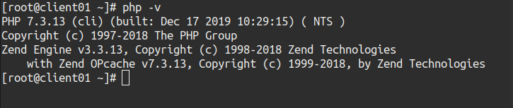
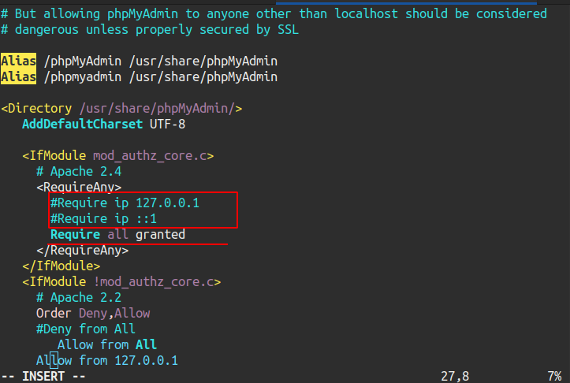
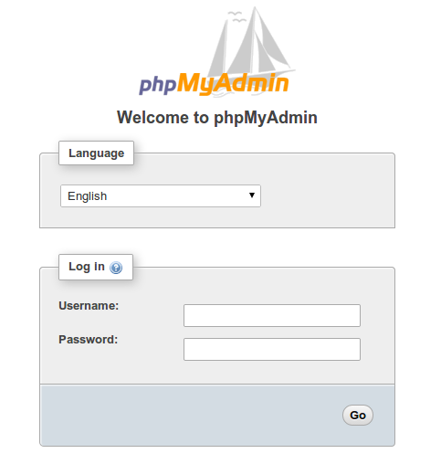
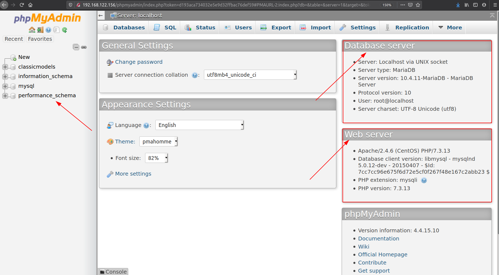

# Tìm hiểu và cài đặt MariaDB.

## 1. Tìm hiểu Mariadb.

MariaDB là một hệ thống quản lý cơ sở dữ liệu quan hệ mã nguồn mở (DBMS).  Là một sản phẩm mã nguồn mở tách ra từ mã mở do cộng đồng phát triển của hệ quản trị cơ sở dữ liệu quan hệ MySQL.
 MariaDB được phát triển từ sự dẫn dắt của những nhà phát triển ban đầu của MySQL.

Ưu điểm của mariaDB:
MariaDB có 2 nhánh:
    - 5.x : là phát triển dựa trên MySQL.
    - 10.x : là phát triển và xây dụng thêm nhiêu tính năng mới của maria.
- Là mã nguồn mở cung cấp và phát triển công khai.
- Bảo mật nhạn chóng rõ ràng.
- Cung cấp đông thời SQL và NoSQL.
- Có cung cấp nhiêu storage engine ví dụ như: MyISAM, InnoDB, Maria engine, ...
- Có hiệu suất tốt hơn Mysql.
- Clustering engine mới là galera.
- Tương thích dễ dàng và migrate.

## 2. Cài Đặt mariadb trên centos7.
Hiện tại đã có phiên bản mới nhất là mariadb 10.5 được phát hành ngày 03-12-2019 và đang là bản Alpha.Nên trong serise này tôi sử dụng mariadb phiên bản 10.4.11 phát hành ngày 11-12-2019.


Cài đặt mariadb trên máy tính có hệ điêu hành centos 7. RAM có dung lượng 1GB. Ổ cứng có dung lượng 30GB.

### 2.1 Các bước thực hiện.

Thêm repo mariadb.
```
cat <<EOF>> /etc/yum.repos.d/MariaDB.repo
[mariadb]
name = MariaDB
baseurl = http://yum.mariadb.org/10.4/centos7-amd64
gpgkey=https://yum.mariadb.org/RPM-GPG-KEY-MariaDB
gpgcheck=1 
EOF
```
Nếu máy tính đã cài bất cứ hệ quả trị cơ sở dữ liệu nào muốn gỡ bỏ và cài maria db 10.4.11 thì thì gỡ bỏ theo câu lệnh sau.
```
yum erase mysql
rm -rf /var/lib/mysql
rm /etc/my.cnf
```

Cài đăt Maria DB 10.4.11.

```
yum -y install MariaDB-server MariaDB-client
```
Khởi động dịch vụ.
```
systemctl start mariadb
```
Khởi động cùng hệ điều hành.
```
systemctl enable mariadb
```
Kiểm tra trạng thái hoạt động
```
systemctl status mariadb
```
**Cài đặt cấu hình cơ bản ban đầu cho mariadb**
```
mysql_secure_installation
```

## 3. Cài đặt phpmyadmin.

Bược đầu để cài phpmyadmin ta cần phải cài php trước đã.

Cài repo PHP.
```
yum install epel-release yum-utils -y
```

Cài đặt repo php từ trang chủ.
```
yum install http://rpms.remirepo.net/enterprise/remi-release-7.rpm
```
Hiện tại đang có phiên bản PHP mơi nhất là PHP 7.3.
```
yum-config-manager --enable remi-php73
```
Cài đặt các gói phụ trợ.
```
yum install php php-common php-opcache php-mcrypt php-cli php-gd php-curl php-mysqlnd
```
Kiểm tra phiên bản cài đặt.
```
php -v
```


Vậy là đã cài đặt xong php.

Vì phpmyadmin là làm việc qua web nên việc tiếp theo ta cần cài đặt là http.

**Cài đặt http Cho Centos 7**

Cài đặt httpd cho Centos 7
```
yum install httpd -y
```
Khởi động httpd.
```
systemctl start httpd
```
Khởi động cùng hệ thống.
```
systemctl enable httpd
```
Kiểm tra trạng thái hoạt động.
```
systemctl status httpd
```

**Cài đặt phpmyadmin**

Tiếp đến là cài đạt phpMyAdmin 

Cài đặt repo EPEL bởi vì phpMyAdmin nằm trong repo này.

```
 yum install epel-release -y
```
Cài đặt phpMyAdmin 
```
yum install phpmyadmin -y
```

Cấu hình file phpMyAdmin.conf
Cần cho phép truy cập các máy khác đên phpmyadmin.
```
vim /etc/httpd/conf.d/phpMyAdmin.conf
```
Các bạn comment dong 17,18 và gõ thêm lệnh sau đẻ cho phép tất cat truy cập.
```
require all granted
```



Lưu lại.

Khởi động lại httpd.
```
systemctl restart httpd
```

Vào browser tùy ý như chrome, firefox, ...
gõ địa chỉ ip của máy cài phpmyadmin kèm /phpmyadmin.
```
http://192.168.122.156/phpmyadmin
```


Đăng nhập bằng tài khoản mysql ta vừa tạo.

Trong đó:
 - Các database.
 - Thông số cấu hình của database server.
 - Thông số cấu hình của web server.
vậy là đã cài đặt thành công phpmyadmin.
