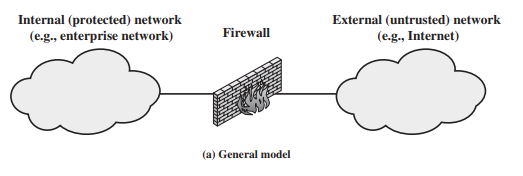
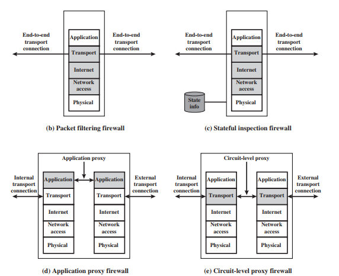
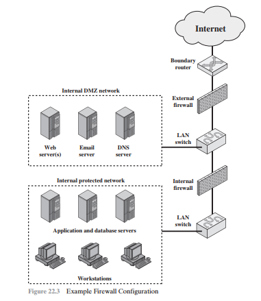
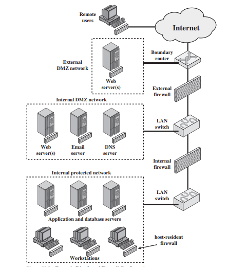

# Tìm hiểu về firewall

## Mục lục

[1. Firewall là gì và tại sao cần có firewall?](#1)

[2. Tính năng của firewall](#2)

[3. Các loại firewall](#3)
- [3.1 Packet Filtering Firewall](#3.1)
- [3.2 Stateful Inspection Firewalls](#3.2)
- [3.3 Application-Level Gateway](#3.3)
- [3.4 Circuit-Level Gateway](#3.4)

[4. Firewall topo](#4)

---------

## 1. Firewall là gì và tại sao cần có firewall?

Firewall là access control device, nó tập trung phân tích ip packet, so sánh nó với các rules và quyết định xem packet đó có được phép đi qua hay không hoặc thực hiện một số hành động khác.

Tại sao cần firewall?

Giờ đây kết nối internet là gần như bắt buộc đối với mọi tổ chức. Tuy nhiên việc kết nối internet cũng mang lại những mối nguy hại bởi nó cho phép bên ngoài có thể kết nối tới mạng local của bạn. Việc trang bị cho mỗi server những tính năng bảo mật cũng là một giải pháp tuy nhiên nó không thực sự tối ưu đối với những hệ thống có nhiều máy với những hệ điều hành khác nhau. Firewall được sinh ra để giải quyết vấn đề này, nó sẽ được đặt ở giữa internet và mạng local của bạn để control network vào và ra.

## <a name="2">2. Tính năng của firewall</a>

**Mục tiêu của firewall**

- Tất cả các traffic vào và ra đều phải đi qua firewall.

- Chỉ có những traffic được xác thực, được định nghĩa qua local policy mới được phép pass qua.

- Firewall không thể bị thâm nhập

Khi mới ra đời, firewall chủ yếu tập trung vào quản lí service, giờ đây, nó đã có thể làm nhiều hơn thế:

- Service control: Xác định loại internet services có thể được access. Firewall sẽ filter gói tin dựa trên IP address, protocol, or port number hoặc cung cấp proxy software tiếp nhận và phân tích service request trước khi cho phép nó đi qua.

- Direction control: Xác định hướng đi của từng service request

- User control: Điều khiển access tới dịch vụ dựa vào users

- Behavior control: Điều khiển cách sử dụng các dịch vụ đặc biệt. Ví dụ firewall sẽ filter e-mail để giảm spam.

**Khả năng của firewall**

- Firewall định nghĩa ra single choke point giữ các users chưa được xác thực khỏi network được bảo vệ, chặn những dịch vụ có khả năng gây hại tới hệ thống và cung cấp sự bảo vệ đối với IP spoofing và routing attacks.

- Firewall cũng cung cấp nơi để giám sát security-related events, thử nghiệm và đưa ra những cảnh báo.

- Firewall là platform cho một số tính năng như NAT hoặc ghi log lại về mức độ sử dụng internet.

- Firewall có thể được sử dụng để triển khai virtual private networks.

**Những hạn chế của firewall**

- Firewall không thể bảo vệ lại những cuộc tấn công đi vòng qua nó.

- Firewall không thể bảo vệ hoàn toàn khỏi những mối nguy hại từ bên trong (ví dụ nhân viên hợp tác với bên ngoài tổ chức tấn công)

- Firewall không thê bảo vệ những wireless communications giữa local systems trên các sides khác nhau của internal firewall.

-  Các thiết bị cầm tay, laptop có thể bị lây nhiễm từ bên ngoài và thâm nhập vào mạng nội bộ.

## <a name="3">3. Các loại firewall</a>
 

Mô hình phổ biến nhất của firewall

Các loại firewall và layer mà nó sử dụng tới

### <a name="3.1"> 3.1 Packet Filtering Firewall </a>

- Packet filtering firewall áp dụng một loạt các rules đối với incoming và outgoing IP packet rồi sau đó forward hoặc discard packet. Firewall thường được cấu hình để filter ở cả hai chiều. Filter rules bao gồm: source/destination ip address, source/destination port number, ip protocol field, interface.

- Nếu packet không match với rule nào thì policy sẽ được thực thi. Có 2 policy chính đó là forward và discard. policy discard được khuyến cáo sử dụng và thường nó được áp dụng đối với các doanh nghiệp và tổ chức. Ngược lại, policy forward lại thường được sử dụng bởi các tổ chức mở hơn ví dụ như các trường đại học.

### <a name="3.2"> 3.2 Stateful Inspection Firewalls </a>

- Như chúng ta đã biết, hầu hết các ứng dụng ngày nay chạy trên sử dụng giao thức TCP với mô hình client-server. Khi mà ứng dụng sử dụng TCP để tạo ra session, nó tạo ra 1 kết nối TCP với 2 port number, một cho server (0-1024) và 1 cho local (1024-65535).

- Packet filtering bình thường sẽ buộc phải cho phép inbound network traffic đối với tất cả các port xuất phát từ local (1024-65535). Điều này có thể dẫn tới một số nguy cơ về bảo mật.

- Stateful inspection packet firewall sẽ thiết chặt lại rules đối với tcp traffic bằng việc tạo ra directory cho outbound tcp connections. Nôm na ta có thể hiểu là nó sẽ giám sát trạng thái kết nối và ghi vào bảng. Sau đó sẽ chỉ những kết nối có trạng thái "Established" phù hợp mới được thông qua.

### <a name="3.3"> 3.3 Application-Level Gateway </a>

- Application-Level Gateway hay còn được gọi là application proxy hoạt động như một chiếc công tắc đối với các traffic trên tầng application. Khi người dùng liên lạc với Gateway thông qua các ứng dụng tcp/ip như telnet, ftp thì Gateway sẽ là nơi tiếp nhận và liên lạc với remote host để truyền tín hiệu. Vì vậy nó phải được implement proxy code đối với từng dịch vụ cụ thể. Cũng do vậy nên nó cũng có thể chặn một số dịch vụ không mong muốn.

- Tuy vậy, một trong những hạn chế của firewall này đó là việc có quá nhiều kết nối mà Gateway phải xử lí. Với 2 chiều kết nối thì Gateway phải phân tích và xử lí ở cả hai chiều mỗi bên.

### <a name="3.4"> 3.4 Circuit-Level Gateway </a>

Circuit-Level Gateway hay còn được gọi là circuit-level proxy. Có thể đứng một mình hoặc kết hợp với Application-Level Gateway. Khi kết hợp, nó sẽ không cho phép kết nối TCP end-to-end. Mặt khác Gateway sẽ setup 2 kết nối TCP, một giữa nó với TCP user trên inner host và 1 giữa nó với TCP user trên outside host.

Thông thường, circuit-level gateways được sử dụng cho outbound connections còn application-level được cấu hình để dùng cho inbound connections.

## <a name="4"> 4. Firewall topo </a>

**DMZ**

- DMZ là một vùng mạng trung lập giữa mạng nội bộ và mạng internet.
- DMZ là nơi chứa các thông tin cho phép người dùng từ internet truy xuất vào và chấp nhận các rủi ro tấn công từ internet.
- Các dịch vụ thường được triển khai trong vùng DMZ là: Mail, Web, FTP
- Có hai cách thiết lập vùng DMZ:
+ Đặt DMZ giữa 2 firewall, một để lọc các thông tin từ internet vào và một để kiểm tra các luồng thông tin vào mạng cục bộ.
+ Sử dụng Router có nhiều cổng để đặt vùng DMZ vào một nhánh riêng tách rời với mạng cục bộ

Nhìn chung ta có thể phân ra các topologies như sau:

- Host-resident firewall: Những firewall cá nhân trên máy tính hoặc server. Chúng có thể dùng 1 mình hoặc là 1 phần của hệ thống firewall.

- Screening router: Một router đứng giữa mạng nội bộ và internet với stateless or full packet filtering. Thường được sử dụng cho small
office/home office (SOHO).

- Single bastion inline: Một thiết bị firewall đứng giữa internal và external router. firewall này có thể implement stateful filters and/or
application proxies. Thường dùng cho doanh nghiệp vừa và lớn.

- Single bastion T: Giống với Single bastion inline nhưng có một interface thứ 3 nữa cho DMZ.

- Double bastion inline: Vùng DMZ nằm giữa 2 firewall. Thường dùng cho doanh nghiệp lớn và các tổ chức chính phủ.

- Double bastion T: Vùng DMZ sẽ nằm riêng trên một card mạng của bastion firewall.

- Distributed firewall configuration: DMZ được chia làm 2 vùng internal và external

**Link tham khảo:**

http://mercury.webster.edu/aleshunas/COSC%205130/Chapter-22.pdf
