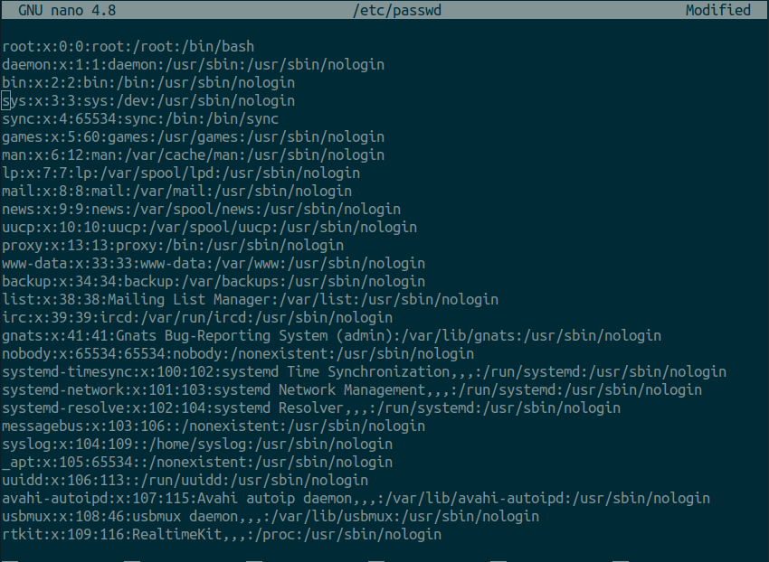
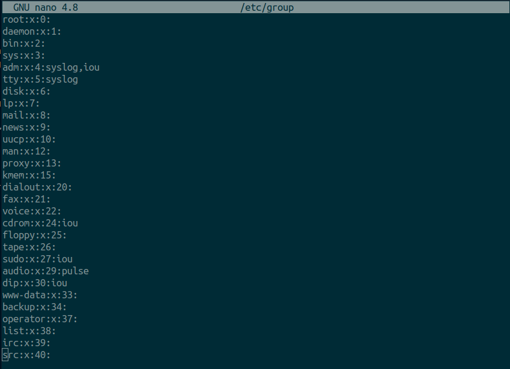
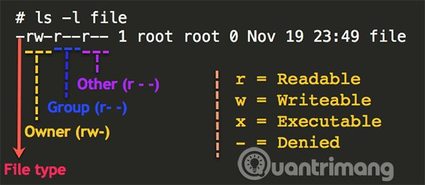

# Tìm hiểu thêm cấu trúc thư mục trong Linux

# Mục lục 

[1. Các thư mục trong linux](#1)

[2. Tìm hiểu cấu trúc của file `/etc/passwd` và `/etc/group`](#2)

- [ 2.1 Định dạng của file /etc/passwd](#2.1)

- [2.2 Định dạng của file /etc/group](#2.2)

[3. Tìm hiểu về chown, chgrp và chmod](#3)

- [3.1 LỆNH CHOWN ](#3.1)

- [3.2 LỆNH CHMOD ](#3.2)

- [3.3 LỆNH CHGRP ](#3.3)

---

## <a name="1">1. Các thư mục trong linux </a>

1. `/ ` -Root
   Đúng với tên gọi của mình: nút gốc (root) đây là nơi bắt đầu của tất cả các file và thư mục. Chỉ có root user mới có quyền ghi trong thư mục này. Chú ý rằng /root là thư mục home của root user chứ không phải là /.

2. `/bin` - Chương trình của người dùng
   Thư mục này chứa các chương trình thực thi. Các chương trình chung của Linux được sử dụng bởi tất cả người dùng được lưu ở đây. Ví dụ như: ps, ls, ping...

3. `/sbin `- Chương trình hệ thống
   Cũng giống như /bin, /sbinn cũng chứa các chương trình thực thi, nhưng chúng là những chương trình của admin, dành cho việc bảo trì hệ thống. Ví dụ như: reboot, fdisk, iptables...

4. `/etc` - Các file cấu hình
   Thư mục này chứa các file cấu hình của các chương trình, đồng thời nó còn chứa các shell script dùng để khởi động hoặc tắt các chương trình khác. Ví dụ: /etc/resolv.conf, /etc/logrolate.conf

5. `/dev` - Các file thiết bị
   Các phân vùng ổ cứng, thiết bị ngoại vi như USB, ổ đĩa cắm ngoài, hay bất cứ thiết bị nào gắn kèm vào hệ thống đều được lưu ở đây. Ví dụ: /dev/sdb1 là tên của USB bạn vừa cắm vào máy, để mở được USB này bạn cần sử dụng lệnh mount với quyền root: # mount /dev/sdb1 /tmp

6. `/tmp` - Các file tạm
   Thư mục này chứa các file tạm thời được tạo bởi hệ thống và các người dùng. Các file lưu trong thư mục này sẽ bị xóa khi hệ thống khởi động lại.

7. `/proc` - Thông tin về các tiến trình
   Thông tin về các tiến trình đang chạy sẽ được lưu trong /proc dưới dạng một hệ thống file thư mục mô phỏng. Ví dụ thư mục con /proc/{pid} chứa các thông tin về tiến trình có ID là pid (pid ~ process ID). Ngoài ra đây cũng là nơi lưu thông tin về về các tài nguyên đang sử dụng của hệ thống như: /proc/version, /proc/uptime...

8. `/var` - File về biến của chương trình
   Thông tin về các biến của hệ thống được lưu trong thư mục này. Như thông tin về log file: /var/log, các gói và cơ sở dữ liệu /var/lib...

9. `/usr` - Chương trình của người dùng
   Chứa các thư viện, file thực thi, tài liệu hướng dẫn và mã nguồn cho chương trình chạy ở level 2 của hệ thống. Trong đó

    /usr/bin chứa các file thực thi của người dùng như: at, awk, cc, less... Nếu bạn không tìm thấy chúng trong /bin hãy tìm trong /usr/bin

    /usr/sbin chứa các file thực thi của hệ thống dưới quyền của admin như: atd, cron, sshd... Nếu bạn không tìm thấy chúng trong /sbin thì hãy tìm trong thư mục này.
    
    /usr/lib chứa các thư viện cho các chương trình trong /usr/bin và /usr/sbin
    
    /usr/local chứa các chương tình của người dùng được cài từ mã nguồn. Ví dụ như bạn cài apache từ mã nguồn, nó sẽ được lưu dưới /usr/local/apache2
10. `/home` - Thư mục người của dùng
Thư mục này chứa tất cả các file cá nhân của từng người dùng. Ví dụ: /home/john, /home/marie

11. `/boot` - Các file khởi động
Tất cả các file yêu cầu khi khởi động như initrd, vmlinux. grub được lưu tại đây. Ví dụ vmlixuz-2.6.32-24-generic

12. `/lib` - Thư viện hệ thống
Chứa cá thư viện hỗ trợ cho các file thực thi trong /bin và /sbin. Các thư viện này thường có tên bắt đầu bằng ld* hoặc lib*.so.* . Ví dụ như ld-2.11.1.so hay libncurses.so.5.7

13. `/opt` - Các ứng dụng phụ tùy chọn
Tên thư mục này nghĩa là optional (tùy chọn), nó chứa các ứng dụng thêm vào từ các nhà cung cấp độc lập khác. Các ứng dụng này có thể được cài ở /opt hoặc một thư mục con của /opt

14. `/mnt` - Thư mục để mount
Đây là thư mục tạm để mount các file hệ thống. Ví dụ như # mount /dev/sda2 /mnt

15. `/media` - Các thiết bị gắn có thể gỡ bỏ
Thư mục tạm này chứa các thiết bị như CdRom /media/cdrom. floppy /media/floopy hay các phân vùng đĩa cứng /media/Data (hiểu như là ổ D:/Data trong Windows)

16. `/srv` - Dữ liệu của các dịch vụ khác
Chứa dữ liệu liên quan đến các dịch vụ máy chủ như /srv/svs, chứa các dữ liệu liên quan đến CVS.


## <a name="2"> 2. Tìm hiểu cấu trúc của file `/etc/passwd` và `/etc/group` </a>

Trước đây, file này chứa mật khẩu dạng mã hóa (encoded password) của mỗi tài khoản. Mọi user thông thường đều chỉ có duy nhất quyền đọc (read) đối với file này, điều này rất cần thiết cho nhiều chương trình, ví dụ lệnh ls cần đọc file này để biết được ánh xạ giữa Username và User ID. Chỉ riêng root được chỉnh sửa file này (quyền write).

Tuy nhiên theo thời gian nó đã không còn an toàn nên các hệ điều hành Linux sau này phải ứng dụng cơ chế shadow password nhằm khắc phục nguy cơ hacker sử dụng phương thức brute force, dictionary attack để dò tìm mật khẩu nguyên gốc từ encoded password được lưu trong file /etc/passwd. Lúc này:

- Encoded password được đưa vào file /etc/shadow, trường password trong file /etc/passwd được thay bằng dấu x.
- Chỉ có root mới có toàn quyền với file shadow, các user thông thường khác vẫn có quyền đọc file /etc/passwd nhưng không có bất cứ quyền hạn truy cập nào tới file shadow.
- File thực thi usr/bin/passw được gán bit SUID để khi user chạy lệnh passwd nhằm đổi lại mật khẩu thì họ vẫn có thể ghi vào file shadow hoặc khi đọc encoded password từ shadow trong quá trình chứng thực lúc đăng nhập.

### <a name="2.1"> 2.1 Định dạng của file /etc/passwd</a>

- Mỗi dòng trong file /etc/passwd là thông tin về 1 user. Có tất cả 7 trường trên mỗi dòng, các trường được phân tách bởi dấu 2 chấm ( : ). 

- Dưới đây là 1 ví dụ về thông tin của user oracle.


1. Username: Tên người dùng, được sử dụng khi user đăng nhập, không nên chứa các ký tự in hoa trong username.

2. Password: Nếu sử dụng shadow password thì nên sử dụng dấu x hoặc ký tự * (gõ man pwcnv, và man shadow để hiểu rõ hơn)

3. User ID (UID): Đây là 1 chuỗi số duy nhất được gán cho user, hệ thống sử dụng UID hơn là username để nhận dạng user.

4. Group ID (GID): Là 1 chuỗi số duy nhất được gán cho Group đầu tiên mà user này tham gia (thông tin các Group có trong file /etc/group)

5. User ID Info (còn gọi là GECOS): Trường này không quan trọng lắm, bạn để trống cũng được vì chỉ dùng cho mục đích khai báo các thông tin cá nhân về user như: tên đầy đủ, số điện thoại… Lệnh finger sẽ cung cấp thêm những thông tin phụ này.

6. Home directory: Phải là đường dẫn đầy đủ tới thư mục sẽ làm thư mục chủ cho user, mặc định đây sẽ là thư mục hiện hành (working direcroty) khi user đăng nhập. Nếu bạn chỉ đến 1 thư mục không tồn tại thì hệ thống sẽ tự gán là thư mục gốc (/) làm thư mục chủ.

7. Shell: Đường dẫn đầy đủ tới login shell. Nếu để trống trường này thì login shell mặc định là file /bin/sh, nếu chỉ tới 1 file không tồn tại thì user không thể đăng nhập vào hệ thống từ giao diện console hoặc qua SSH bằng lệnh login. Nhưng user vẫn có thể đăng nhập thông qua giao diện đồ họa bằng cách sử dụng non-login shell.

### <a name="2.2"> 2.2 Định dạng của file /etc/group</a>



1. Tên group
2. password, thường được thay bằng dấu x
3. Group ID (GID)
4. Danh sách member (có thể có hoặc không)


## <a name="3">3. Tìm hiểu về chown, chgrp và chmod trong Linux </a>

Quyền (permission) trên linux:

- Quyền đọc r được quy định bằng số 4
- Quyền ghi w được quy định bằng số 2
- Quyền thực thi x được quy định bằng số 1



Ký tự đầu thể hiện loại file:

- : Tệp tin thông thường
- d : Thư mục
-  l : Liên kết
- c : Special file
-  s : Socket
-  p : Named pipe
-  b : Thiết bị

9 dấu gạch ngang còn lại chỉ định quyền, từ trái qua phải mỗi đối tượng u,g,o chịu tác động của ba quyền r,w,x tương ứng. Các quyền này còn được thể hiện dưới dạng tổng các số rwx = 7, rw- = 6, r-x = 5 …  Cách viết quyền dưới dạng số còn được gọi là Octal Mode.

Định dạng thứ hai được gọi là numeric notation (ký hiệu số), là một chuỗi gồm ba chữ số, mỗi chữ số tương ứng với user, nhóm và các quyền khác. Mỗi chữ số có thể nằm trong khoảng từ 0 đến 7 và mỗi giá trị của chữ số có được bằng cách tính tổng các quyền của lớp:

- 0 có nghĩa là không có quyền nào được cho phép.
- +1 nếu lớp có thể thực thi file.
- +2 nếu lớp có thể ghi vào file.
- +4 nếu lớp có thể đọc file.

Nói cách khác, ý nghĩa của từng giá trị chữ số là:

- 0: Không được phép thực hiện bất kỳ quyền nào
- 1: Thực thi
- 2: Viết
- 3: Viết và thực thi
- 4: Đọc
- 5: Đọc và thực thi
- 6: Đọc và viết
- 7: Đọc, viết và thực thi

Như vậy:

- Quyền 755 trên folder tương ứng với drwxr-xr-x có nghĩa là user sở hữu folder có full quyền, group sở hữu folder có quyền đọc và thực thi, other cũng có quyền đọc và thực thi.
- Quyền 644 trên file tương ứng với -rw-r--r-- có nghĩa là user sở hữu file này có quyền đọc và ghi, group sở hữu có quyền đọc, other cũng có quyền đọc mà thôi

### <a name="3.1"> 3.1 LỆNH CHOWN </a>

Cú pháp:

```
   chown option user:group file/folder
```


### <a name="3.2"> 3.2 LỆNH CHMOD </a>
Cú pháp:
```
   chmod option permission file/folder
```

Cũng như chown muốn phân quyền cho các file/folder con bạn thêm option -R.

### <a name="3.3"> 3.3 LỆNH CHGRP </a>
****

Để thay đổi group cho đối tượng sử dụng lệnh chgrp nhưng phải thỏa một trong hai điều kiện sau:
1. Bạn sử dụng quyền root
2. Bạn là chủ sở hữu và thuộc Group (có tên là Group_Name trong lệnh) mà bạn muốn thay đổi Group cho file:

```
   chgrp Group_Name File_Name​
```

Để biết mình thuộc các nhóm nào, bạn sử dụng lệnh 'id'. Lệnh này cho biết id cùng với tên của bạn và các nhóm mà bạn tham gia.


