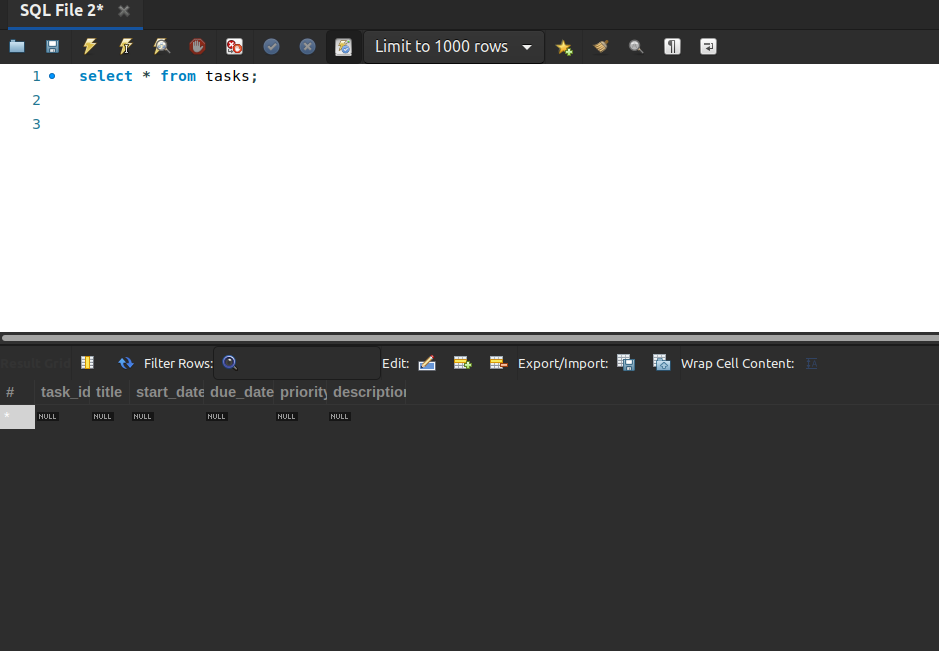
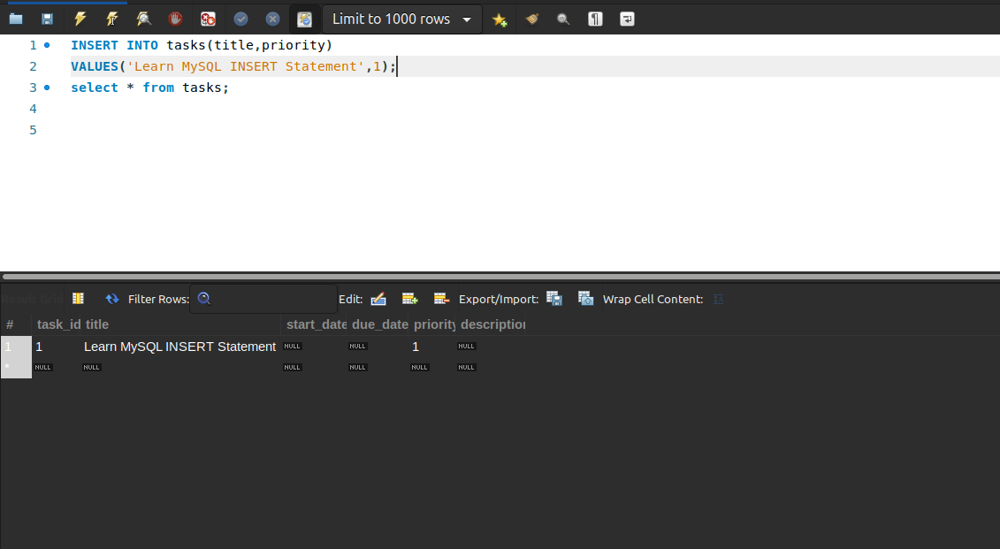
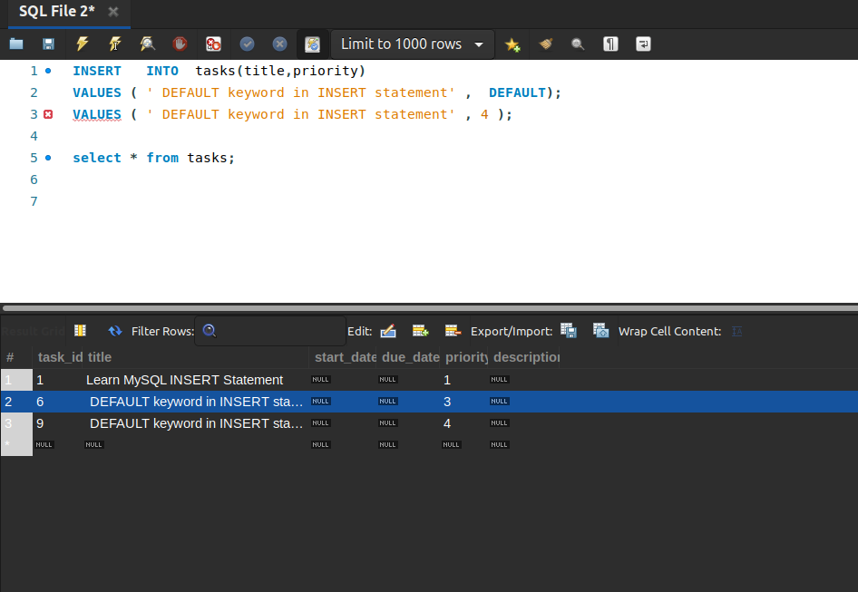
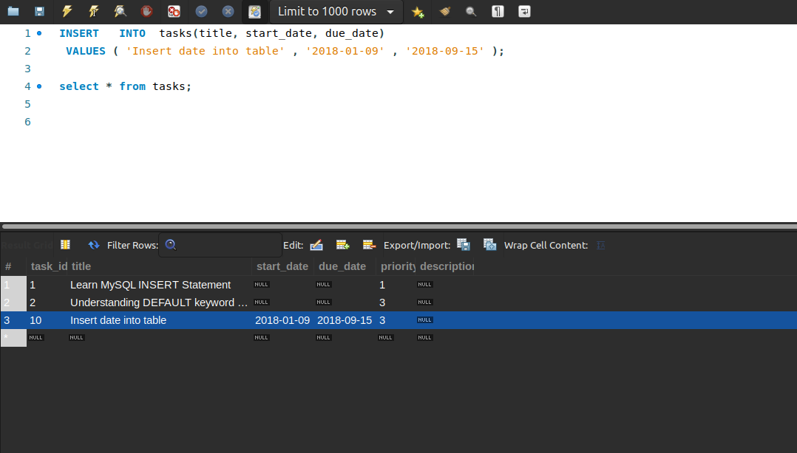
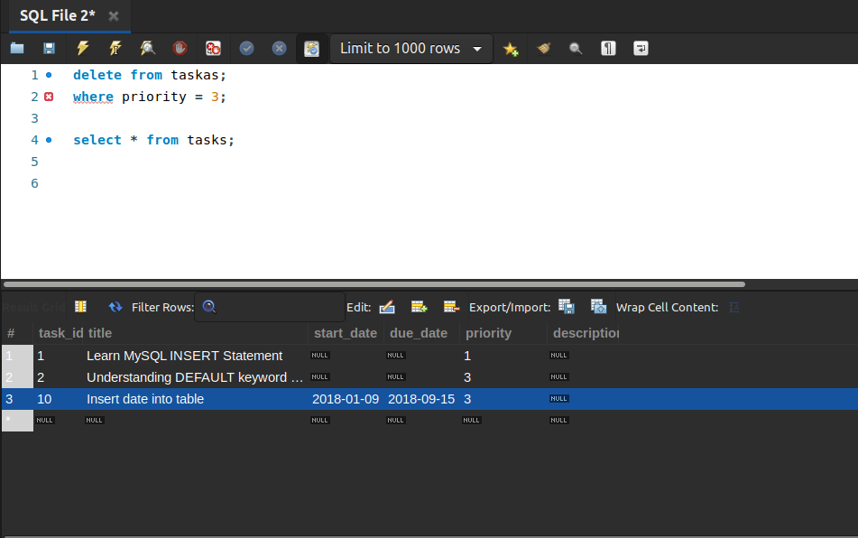

# Modifying data in MySQL

## Mục lục.

[1. INSERT](#1)

[2. UPDATE](#2)

[3. DELETE](#3)

[4. REPLACE](#4)

[5. Prepared Statement](#5)

---

<a name ="1"></a>
## 1. INSERT

Câu lệnh INSERT cho phép bạn chèn một hoặc nhiều hàng vào một bảng. 
Cú pháp.
```
 INSERT   INTO   table (c1,c2,...)
 VALUES  (v1,v2,...);
```

Trong đó:
- Đầu tiên, chỉ định bảng và danh sách các cột được phân tách bằng dấu phẩy bên trong dấu ngoặc đơn sau mệnh đề INSERT INTO. 
- Sau đó, đặt danh sách các giá trị được phân tách bằng dấu phẩy của các cột tương ứng bên trong dấu ngoặc đơn theo từ khóa VALUES .

Số lượng cột và giá trị phải giống nhau. Ngoài ra, vị trí của các cột phải tương ứng với vị trí của các giá trị của chúng.

Để thực hiện Insert vào bảng tôi tạo một bảng trống và Insert dữ liệu vào bảng.
```
CREATE TABLE IF NOT EXISTS tasks (
    task_id INT AUTO_INCREMENT,
    title VARCHAR(255) NOT NULL,
    start_date DATE,
    due_date DATE,
    priority TINYINT NOT NULL DEFAULT 3,
    description TEXT,
    PRIMARY KEY (task_id)
);
```
Kết quả sau khi tạo ta có một bảng mới không có dữ liệu.



**Ví dụ 1:** Sử dụng Insert cơ bản.
Chèn một cột mới vào bảng.
```
INSERT INTO tasks(title,priority)
VALUES('Learn MySQL INSERT Statement',1);
```

Kiểm tra bảng xem đã có đữ liệu  mới được thêm vào hay chưa.



**Ví dụ 2:** Chèn vào bảng giá trị mặc định.
```
 INSERT   INTO  tasks(title,priority)
 VALUES ( 'Understanding DEFAULT keyword in INSERT statement' , DEFAULT );
 VALUES ( ' DEFAULT keyword in INSERT statement' , 4 );
```
Ở đây tôi chen cột title có giá trị lần lượt là DEFAULT và 4.

Ví DEFAULT có giá trị mặc định là bằng 3 được khai báo trong định nghĩa bảng.


**Ví dụ 3:** Chèn ngày vào bảng.
Định dang ngày được định nghĩa dưới dạng.**YYYY-MM-DD**
Trong đó :
- YYYY là năm.
- MM là tháng.
- DD là ngày.
```
 INSERT   INTO  tasks(title, start_date, due_date)
 VALUES ( 'Insert date into table' , '2018-01-09' , '2018-09-15' );
```
Sau khi chèn thêm ngày và giờ vào bảng.


<a name ="2"></a>
## 2. UPDATE
Câu UPDATE sửa đổi dữ liệu hiện có trong một bảng. Bạn có thể sử dụng các giá trị thay đổi câu lệnh UPDATE trong một hoặc nhiều cột của một hàng hoặc nhiều hàng.

Cú pháp.
```
 UPDATE  [ LOW_PRIORITY ] [ IGNORE ] table_name 
 SET  
    column_name1 = expr1,
    column_name2 = expr2,
    ...
[ WHERE 
     condition ];
```
Trong đó:
- table_name: chỉ định tên của bảng mà bạn muốn cập nhật dữ liệu sau từ khóa UPDATE .
- Sau SET,chỉ định cột nào bạn muốn cập nhật và giá trị mới trong mệnh đề SET . Để cập nhật giá trị trong nhiều cột, bạn sử dụng danh sách các phép gán được phân tách bằng dấu phẩy bằng cách cung cấp một giá trị trong mỗi phép gán của cột dưới dạng giá trị bằng chữ, biểu thức hoặc truy vấn con.
- WHERE, chỉ định những hàng nào sẽ được cập nhật bằng một điều kiện trong WHERE . WHERE là tùy chọn. Nếu bạn bỏ qua nó, câu lệnh UPDATE sẽ cập nhật tất cả các hàng trong bảng.

MySQL hỗ trợ hai sửa đổi trong câu lệnh UPDATE .

- Công cụ sửa đổi LOW_PRIORITY hướng dẫn câu lệnh UPDATE trì hoãn cập nhật cho đến khi không có kết nối đọc dữ liệu từ bảng. LOW_PRIORITY có hiệu lực đối với các công cụ lưu trữ chỉ sử dụng khóa cấp bảng như MyISAM , MERGE và MEMORY .
- Công cụ sửa đổi IGNORE cho phép câu lệnh UPDATE tiếp tục cập nhật các hàng ngay cả khi xảy ra lỗi. Các hàng gây ra lỗi như xung đột khóa trùng lặp không được cập nhật. 


**Ví dụ 1:** Sử dụng lệnh UPDATE cơ bản.

<a name ="3"></a>
## 3. DELETE
Để xóa dữ liệu khỏi bảng, bạn sử dụng câu lệnh DELETE MySQL.
Cú pháp.
```
 DELETE   FROM  table_name
 WHERE   condition ;
```
Trong đó:
- table_name: Chỉ định bảng mà bạn cần xóa dữ liệu.
- condition :điều kiện để chỉ định những hàng cần xóa trong WHERE . Nếu hàng phù hợp với điều kiện, nó sẽ bị xóa.

**Ví dụ 1:** Sử dụng DELETE cơ bản.
Trong bảng trên ta có rất nhiều cột trùng nhau và ta muốn xóa nó.
```
delete from taskas;
where priority = 3;
```
Kết quả như sau.



<a name ="4"></a>
## 4. REPLACE

<a name ="5"></a>
5. Prepared Statement