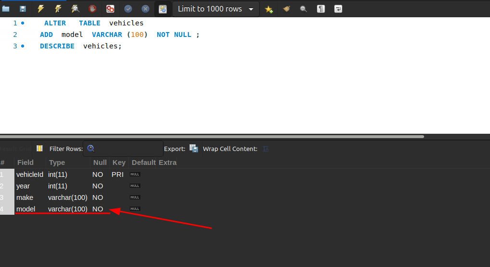
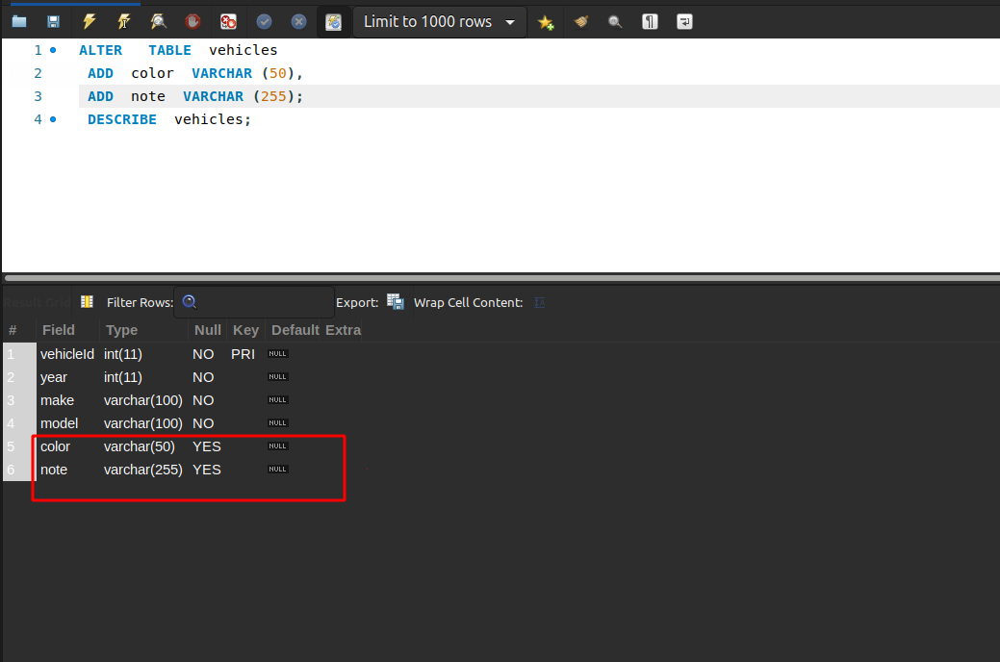
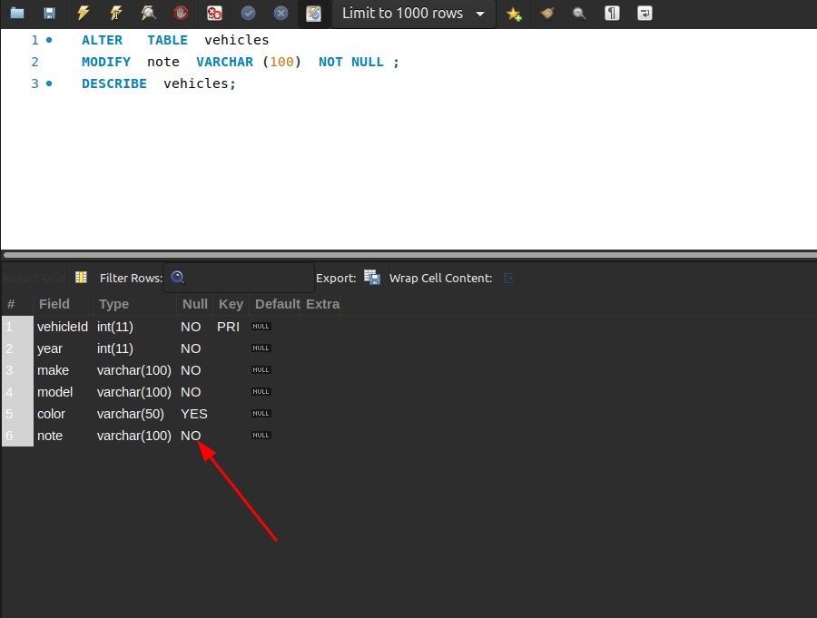
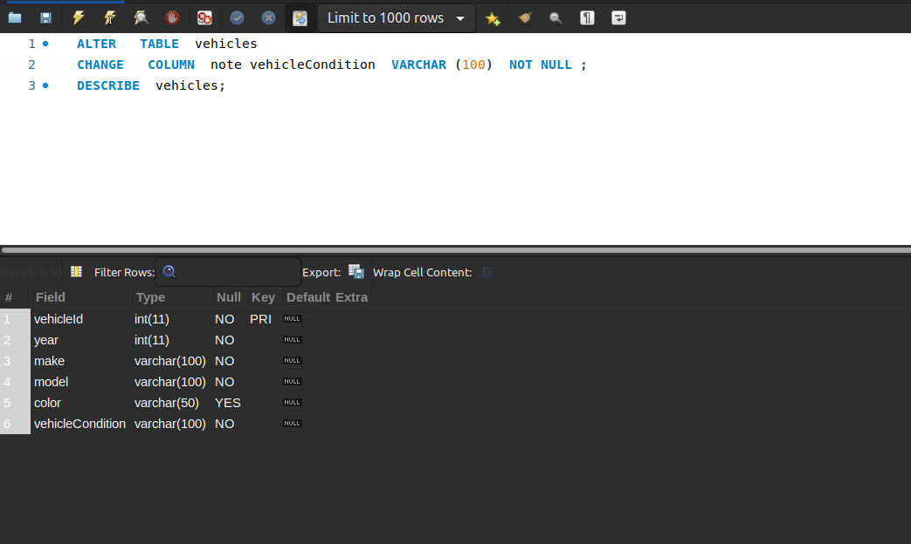
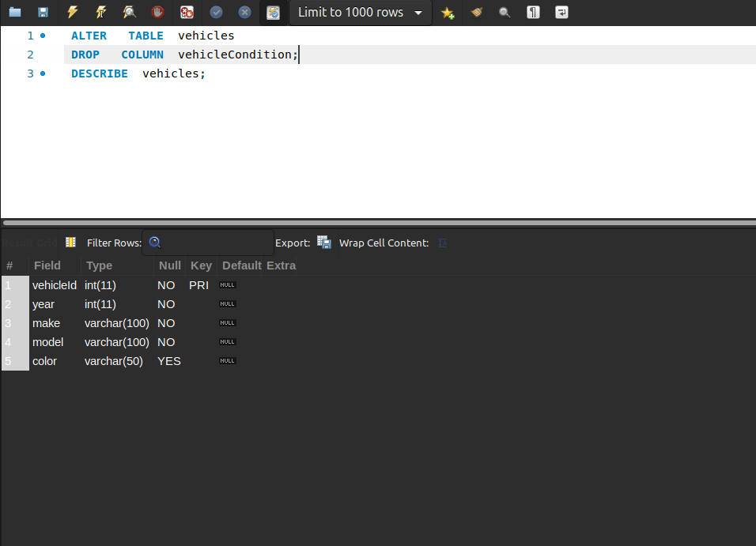
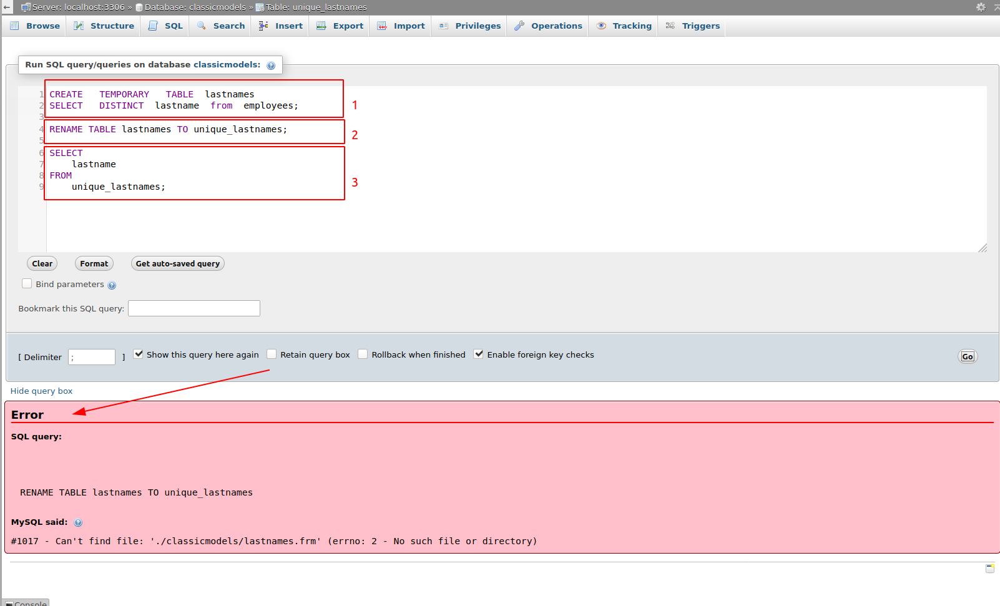
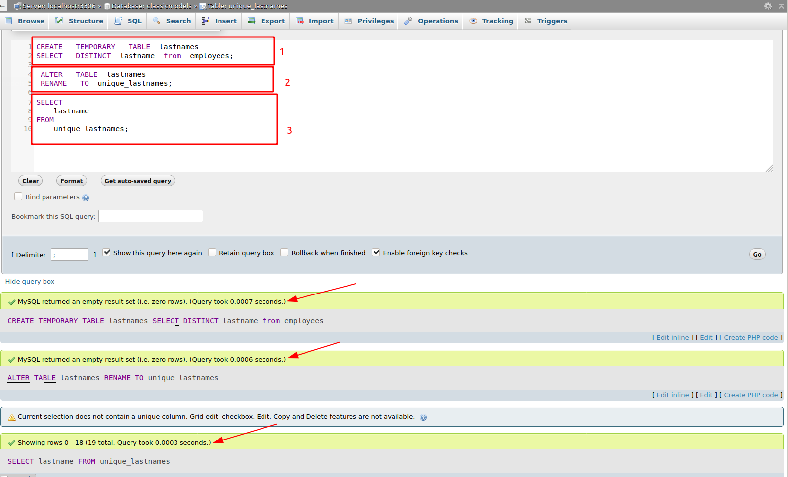

#  Managing MySQL databases and tables part 2


[1.ALTER TABLE ](#1)

[2.Renaming table](#2)

[3.Removing a column from a table](#3)

[4.Adding a new column to a table](#4)

[5.DROP TABLE](#5)

[6.Temporary tables](#6)

[7.TRUNCATE TABLE](#7)


------

<a name ="1"></a>
## 1.ALTER TABLE 

### 1.1 Thêm một cột
Để thêm một cột vào bảng, bạn sử dụng cú pháp ALTER TABLE.
```
 ALTER   TABLE  table_name
 ADD  
    new_column_name column_definition
    [ FIRST  |  AFTER  column_name]
```
Trong cú pháp này:

- table_name - chỉ định tên của bảng mà bạn muốn thêm một cột hoặc cột mới sau các từ khóa ALTER TABLE .
- new_column_name - chỉ định tên của cột mới.
- column_definition định nghĩa - chỉ định kiểu dữ liệu, kích thước tối đa và ràng buộc cột của cột mới
- FIRST | AFTER column_name chỉ định vị trí của cột mới trong bảng. Bạn có thể thêm một cột sau một cột hiện có ( ATER column_name ) hoặc làm cột đầu tiên ( FIRST ). Nếu bạn bỏ qua mệnh đề này, cột sẽ được thêm vào cuối của danh sách cột của bảng. 

Ví dụ thêm cột cho bảng "vehicles"
```
 ALTER   TABLE  vehicles
 ADD  model  VARCHAR (100)  NOT NULL ;
```


Để thêm nhiru cột vào 1 bảng cú pháp như sau:
```
 ALTER   TABLE  table_name
     ADD  new_column_name column_definition
    [ FIRST  |  AFTER  column_name],
     ADD  new_column_name column_definition
    [ FIRST  |  AFTER  column_name],
    ...;
```
Ví dụ thêm 2 cột vào bảng "vehicles"
```
 ALTER   TABLE  vehicles
 ADD  color  VARCHAR (50),
 ADD  note  VARCHAR (255);
```

### 1.2 Thay đổi một cột
Cú pháp cơ bản để sửa đổi một cột trong bảng:
```
 ALTER   TABLE  table_name
 MODIFY  column_name column_definition
[  FIRST  |  AFTER  column_name];    
```

Ví dụ ta muốn sửa cột **Note** từ dạng NULL thành NOT NULL như sau:
```
 ALTER   TABLE  vehicles 
 MODIFY  note  VARCHAR (100)  NOT NULL;
```



### 1.3 Đổi tên một cột
Đổi tên một cột, sử dụng câu lệnh sau:
```
 ALTER   TABLE  table_name
     CHANGE   COLUMN  original_name new_name column_definition
    [ FIRST  |  AFTER  column_name];
```

Trong cú pháp này:

- Đầu tiên, chỉ định tên của bảng mà cột thuộc về.
- Thứ hai, chỉ định tên cột và tên mới theo sau là định nghĩa cột sau các từ khóa CHANGE COLUMN .
- Thứ ba, sử dụng tùy chọn FIRST hoặc AFTER column_name để xác định vị trí mới của cột. 

ví dụ  đổi tên cột note thành vehicleCondition.
```
 ALTER   TABLE  vehicles 
 CHANGE   COLUMN  note vehicleCondition  VARCHAR (100)  NOT NULL ;
```



### 1.4 Xóa một cột

Để xóa một cột ta sử dụng cú pháp:
```
 ALTER   TABLE  table_name
 DROP   COLUMN  column_name;
```

Trong cú pháp này:

- Đầu tiên, chỉ định tên của bảng mà bạn muốn thả một cột sau các từ khóa ALTER TABLE .
- Thứ hai, chỉ định tên của cột mà bạn muốn thả sau các từ khóa DROP COLUMN.

Ví dụ muốn xóa cột "vehicleCondition"

```
 ALTER   TABLE  vehicles
 DROP   COLUMN  vehicleCondition;
```


### 1.5 đổi tên bảng

Để đổi tên bảng ta sử dụng cú pháp sau:
```
 ALTER   TABLE  table_name
 RENAME   TO  new_table_name;
```
Trong cú pháp này:

- Đầu tiên, chỉ định tên của bảng mà bạn muốn đổi tên sau các từ khóa ALTER TABLE .
- Thứ hai, chỉ định tên mới cho bảng sau từ khóa RENAME TO . 
Ví dụ  đổi tên bảng vehicles thành cars
```
 ALTER   TABLE  vehicles 
 RENAME   TO  cars; 
``` 


<a name ="2"></a>
## 2.Renaming table

Rename tabel sử dụng đưcọ trong các tường hợp như:
- Đổi tên bảng được tham chiếu bởi một khung nhìn view.
- Đổi tên bảng được tham chiếu bởi một thủ tục được lưu trữ
- Đổi tên nhiều bảng

So sánh cacs sử dụng after table rename và rename table.

Ở đây t sử dungj chuỗi câu lệnh đưọc phân tách làm 3 khối.

khối đầu và khối 3 giữ nguyên chỉ thay đổi khối 2.

Khối 2 sử dụng câu lệnh RENAME TABLE.
```
RENAME TABLE lastnames TO unique_lastnames;
```
Thực thi và trả về kết quả là sai.


Khối 2 sử dụng câu lênh AFTER TABLE.
```
ALTER   TABLE  lastnames
RENAME   TO  unique_lastnames;
```

Thực thi và trả về giá trị .


Như vậy trong trường hợp đổi tên trong bảng tạm thời thi không sử dụng RENAME TABLE được.


<a name ="3"></a>
## 3.Removing a column from a table

Để xóa một cột khỏi bảng. Ta sử dụng ALTER TABLE DROP COLUMN có cú pháp như sau:
```
 ALTER   TABLE  table_name
 DROP   COLUMN  column_name;
```
Trong cú pháp này:

- Đầu tiên, chỉ định tên của bảng chứa cột mà bạn muốn xóa sau các từ khóa ALTER TABLE .
- Thứ hai, chỉ định tên của cột mà bạn muốn xóa trong mệnh đề DROP COLUMN .

Để xóa nhiều cột khỏi bảng. ta sử dụng cú pháp sau:
```
 ALTER   TABLE  table_name
 DROP   COLUMN  column_name_1,
 DROP   COLUMN  column_name_2,
...;
```

Một số lưu ý khi xóa cột:

- Việc xóa một cột khỏi một bảng làm cho tất cả các đối tượng trong cơ sở dữ liệu như các thủ tục được lưu trữ , các view và các trình kích hoạt tham chiếu bị tác động, bị hủy, không hợp lệ.
- Xóa một cột từ một bảng lớn có thể ảnh hưởng đến hiệu suất của cơ sở dữ liệu trong thời gian loại bỏ.
- Khi xóa một cột có khóa ngoại ta phải xóa ràng buộc khóa ngoại trước.


<a name ="4"></a>
## 4.Adding a new column to a table
Để thêm một cột mới vào một bảng hiện có, bạn sử dụng câu lệnh ALTER TABLE ADD COLUMN như sau:
```
 ALTER   TABLE   table 
 ADD  [ COLUMN ] column_name column_definition [ FIRST | AFTER  existing_column];
``` 
Trong đó:

- Chỉ định tên bảng sau mệnh đề ALTER TABLE .
- Đặt cột mới và định nghĩa của nó sau mệnh đề ADD COLUMN . Lưu ý rằng từ khóa COLUMN là tùy chọn để bạn có thể bỏ qua nó.
- MySQL cho phép bạn thêm cột mới làm cột đầu tiên của bảng bằng cách chỉ định từ khóa FIRST . Nó cũng cho phép bạn thêm cột mới sau một cột hiện có bằng mệnh đề AFTER existing_column . Nếu bạn không chỉ định rõ ràng vị trí của cột mới, MySQL sẽ thêm nó làm cột cuối cùng. 
<a name ="5"></a>
## 5.DROP TABLE

Để xóa các bảng hiện có, bạn sử dụng câu lệnh MySQL DROP TABLE .
```
 DROP  [ TEMPORARY ]  TABLE  [ IF EXISTS ] table_name [, table_name] ...
[ RESTRICT  |  CASCADE ]
```
Trong đó:
- DROP TABLE xóa một bảng và dữ liệu của nó vĩnh viễn khỏi cơ sở dữ liệu. 

- Tùy chọn TEMPORARY cho phép bạn chỉ xóa các bảng tạm thời . Nó đảm bảo rằng bạn không vô tình xóa các bảng không tạm thời.

- Tùy chọn IF EXISTS điều kiện thả một bảng nếu nó tồn tại. Nếu bạn thả một bảng không tồn tại với tùy chọn IF EXISTS , MySQL tạo ra một LƯU Ý, có thể được truy xuất bằng câu lệnh SHOW WARNINGS .
- Lưu ý rằng câu lệnh DROP TABLE chỉ loại bỏ các bảng. Nó không xóa các đặc quyền người dùng cụ thể được liên kết với các bảng. Do đó, nếu bạn tạo một bảng có cùng tên với bảng bị loại bỏ, MySQL sẽ áp dụng các đặc quyền hiện có cho bảng mới, có thể gây ra rủi ro bảo mật.

- Các tùy chọn RESTRICT và CASCADE được dành riêng cho các phiên bản tương lai của MySQL.
- CASCADE nghĩa là dữ liệu con bị xóa hoặc cập nhật khi dữ liệu mẹ bị xóa hoặc cập nhật.
- RESTRICT: Từ chối thao tác xóa hoặc cập nhật cho bảng cha

- Để thực thi câu lệnh DROP TABLE , bạn phải có các đặc quyền DROP cho bảng mà bạn muốn xóa. 
<a name ="6"></a>
## 6.Temporary tables

Bảng tạm thời là một loại bảng đặc biệt cho phép bạn lưu trữ một tập kết quả tạm thời, bạn có thể sử dụng lại nhiều lần trong một phiên duy nhất.

Bảng tạm thời của MySQL có các tính năng:
- Bảng tạm thời được tạo bằng cách sử dụng câu CREATE TEMPORARY TABLE.
- MySQL tự động xóa bảng tạm thời khi phiên kết thúc hoặc kết nối bị chấm dứt.
- Một bảng tạm thời có thể có cùng tên với một bảng bình thường trong cơ sở dữ liệu,nhưng nó không được khuyến khích. Bởi vì điều này có thể dẫn đến nhầm lẫn và có khả năng gây mất dữ liệu không mong muốn.
Cú pháp:
```
 CREATE   TEMPORARY   TABLE  table_name(
   column_1_definition,
   column_2_definition,
   ...,
   table_constraints
);
```

<a name ="7"></a>
## 7.TRUNCATE TABLE

TRUNCATE TABLE cho phép bạn xóa tất cả dữ liệu trong một bảng.

Câu lệnh TRUNCATE TABLE giống như một câu lệnh DELETE mà không có WHERE xóa tất cả các hàng khỏi một bảng hoặc một chuỗi các câu lệnh DROP TABLE và CREATE TABLE .

Cú pháp:
```
 TRUNCATE  [ TABLE ] table_name;
```
Chỉ định tên của bảng mà bạn muốn xóa tất cả dữ liệu sau các từ khóa TRUNCATE TABLE .

Vài điều lưu ý

- TRUNCATE không thể chạy được khi bảng bạn định xóa có foreign_key (nếu bảng đó có foreign_key trỏ đến chính nó thì bạn có thể xóa bình thường)
- Dữ liệu bị xóa bởi DELETE có thể restored được còn TRUNCATE thì không.
- Tùy vào từng trường hợp thì bạn sẽ dùng DELETE hoặc TRUNCATE, TRUNCATE sẽ luôn nhanh hơn vì nó tiêu tốn ít bộ nhớ hơn, các bạn có thể cân nhắc điều này khi cần xóa 1 bảng lớn vs nhiều record.

