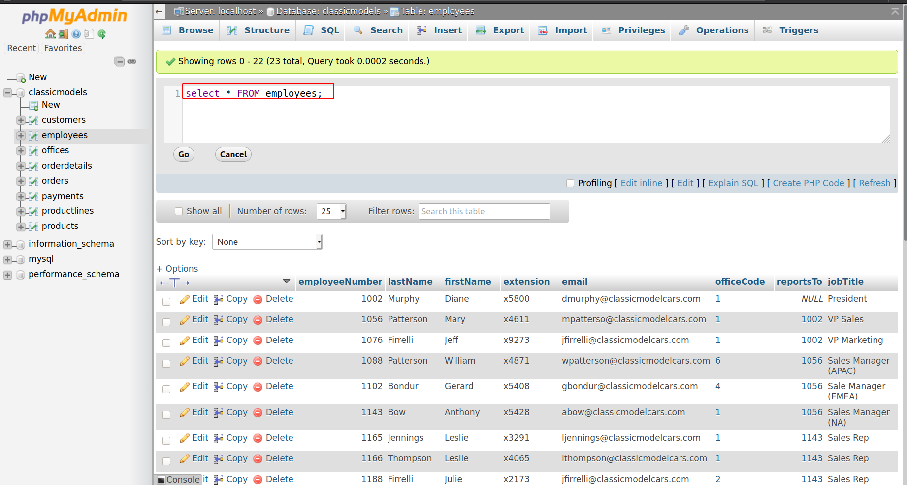

# Query data.

Giới thiệu về Select.

**Select** statement cho phép ta đọc dữ liệu từ 1 hoặc nhiều bảng.
Cấu trúc:
```
Select cột_chọn
FROM tên_bảng;
```
Luôn kết thúc bằng dấu **;**.

**Ví dụ 1:** Xem tất cả các cột của 1 bảng employees.
Chọn tất cả cột từ bảng employees.
```
select * from employees;
```


**Ví dụ 2:** Xem một số cột chỉ định trong bảng.
```
select lastname, firstname, jobtitle from employees;
```
Chọn lastname, firstname, jobtitle từ bảng employees
