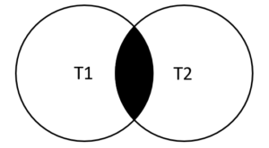

## Joining tables.
 Mục lục.

[1. Table & Column Aliase](#1)

[2. Joins ](#2)

[3. INNER JOIN](#3)

[4. LEFT JOIN](#4)

[5. RIGHT JOIN](#5)

[6. CROSS JOIN](#6)
---

<a name ="1"></a>
## 1. Table & Column Aliase
Đôi khi khi gọi tên cột nó rất dài nên có 1 cách là đặt bí danh cho cột đó.
 
Cấu trúc.
```
SELECT 
   [column_1 | expression] AS descriptive_name
FROM table_name;
```
**Ví dụ 1:** Sự khác biết giữa sử dụng alias và không sử dụng Alias.

Khi không sử dụng alias.
trong ví dụ này tôi sử dung thêm function CONCAT_WP để hiện thị cùng lúc 2 cốt trong 1 cột.

```
SELECT 
    CONCAT_WS(', ', lastName, firstname)
FROM
    employees;
```
Như ta thấy thì tên cột có rất là dài và phức tạp.


Khi sử dụng Alias.

```
SELECT
   CONCAT_WS(', ', lastName, firstname) AS `Full name`
FROM
   employees;
```
Như ta thấy khi sử dụng alias thì tên cột sẽ ngắn và dễ hiểu hơn.


**Ví dụ 2:** Sử dụng alias với group by và having.
```
SELECT
    orderNumber `Order no.`,
    SUM(priceEach * quantityOrdered) total
FROM
    orderDetails
GROUP BY
    `Order no.`
HAVING
    total > 60000;
```
Chọn cột orderNumber và tổng các kết quả (priceEach * quantityOrdered) từ bảng orderDetails  lấy từ nhóm orderNumber  có tổng của nhóm là lớn hơn 60000.


<a name ="2"></a>
## 2. Joins
Kết hợp và sử dụng giá trị từ nhiều bảng khác nhau. Sử dụng thông qua khóa ngoại.


Có các kiểu của joins như sau:
- Inner join
- Left join
- Right join
- Cross join


<a name ="3"></a>
## 3. INNER JOIN
INNER JOIN truy vấn các hàng từ một bảng có các hàng khớp trong một bảng khác.

Cấu trúc.
```
SELECT
    select_list
FROM t1
INNER JOIN t2 ON join_condition1
INNER JOIN t3 ON join_condition2
```
Vùng màu đen là vùng lưa chọn của INNER JOIN.


Ta có đây là hình ảnh của 2 bảng products và productlines.


**Ví dụ 1:** Sử dụng INNER JOIN với 2 bảng.

```
SELECT 
    productCode, 
    productName, 
    textDescription
FROM
    products t1
INNER JOIN productlines t2 
    ON t1.productline = t2.productline;
```

Chọn cột productCode , productname, textDescription từ bảng products kết hợp sử dụng mệnh đề inner join với bảng productlines qua cột productline.


**Ví dụ 2:** Sử dụng inner join với 3 bảng.
```
SELECT 
    orderNumber,
    orderDate,
    orderLineNumber,
    productName,
    quantityOrdered,
    priceEach
FROM
    orders
INNER JOIN
    orderdetails USING (orderNumber)
INNER JOIN
    products USING (productCode)
ORDER BY 
    orderNumber, 
    orderLineNumber;
```


**Ví dụ 3:** Sử dụng inner join với các toán tử


```
SELECT 
    orderNumber, 
    productName, 
    msrp, 
    priceEach
FROM
    products p
INNER JOIN orderdetails o 
   ON p.productcode = o.productcode
      AND p.msrp > o.priceEach;
```
Trong trường hợp này tôi sử dụng kèm toán tử AND.


<a name ="4"></a>
## 4. LEFT JOIN
Trả lại tất cả các hàng từ bảng bên trái và các hàng khớp từ bảng bên phải hoặc null nếu không tìm thấy hàng phù hợp trong bảng bên phải.

LEFT THAM GIA trả về tất cả các hàng từ bảng bên trái bất kể một hàng từ bảng bên trái có một hàng phù hợp từ bảng bên phải hay không. Nếu không có kết quả khớp, các cột của hàng từ bảng bên phải sẽ chứa NULL.

Cấu trúc.
```	
SELECT 
    select_list
FROM
    t1
LEFT JOIN t2 ON 
    join_condition;
```
Mệnh đề left join chon dữ liệu bắt đầu từ bảng bên trái (T1). Nó khớp với từng hàng bên trái t1 với mỗi hàng bên phải t2  qua lưa chọn cột join_condition.

LEFT THAM GIA trả về tất cả các hàng từ bảng bên trái bất kể một hàng từ bảng bên trái có một hàng phù hợp từ bảng bên phải hay không. Nếu không có kết quả khớp, các cột của hàng từ bảng bên phải sẽ chứa NULL.


**Ví dụ 1:** Sử dụng LEFT JOIN với 2 bảng.
```
SELECT
    c.customerNumber,
    customerName,
    orderNumber,
    status
FROM
    customers c
LEFT JOIN orders o 
    ON c.customerNumber = o.customerNumber;
```
Hai bảng này được khớp với nhau qua cột customerNumber.


**Ví dụ 2:** Sử dụng left join với using.
Using là cách gọi nhanh cột để khớp giữa 2 bảng.
```
SELECT
    customerNumber,
    customerName,
    orderNumber,
    status
FROM
    customers
LEFT JOIN orders USING (customerNumber);
```
Ở đau sử dụng using nên sẽ trông ngắn gọn hơn rất nhiều sơ với ví dụ trên không dung using.


**Ví dụ 3:** Sư dụng left join với 3 bảng.
```
SELECT 
    lastName, 
    firstName, 
    customerName, 
    checkNumber, 
    amount
FROM
    employees
LEFT JOIN customers ON 
    employeeNumber = salesRepEmployeeNumber
LEFT JOIN payments ON 
    payments.customerNumber = customers.customerNumber
ORDER BY 
    customerName, 
    checkNumber;
```
Ở đây t sử dụng ON thay vì sử dụng USING:
- Sử dụng ON sẽ hiện thi tất cả các giá trị kể cả giá trị NULL.
- Còn nếu sử dụng USING thì các giá trị NULL sẽ không được xuất hiện.


<a name ="5"></a>
## 5. RIGHT JOIN
Trả về tất cả các hàng từ bảng bên phải và các hàng khớp từ bảng bên trái hoặc null nếu không tìm thấy các hàng phù hợp trong bảng bên trái.

Cũng tương tự như cách hoạt động và sử dụng của LEFT JOIN nhưng với RGHT thì sẽ áp dụng từ bên phải

Cấu trúc.
```
SELECT 
    select_last
FROM t1
RIGHT JOIN t2 ON 
    join_condition;
```

**Ví dụ 1:** Sử dụng RIGHT JOIN với 2 bảng

```
 SELECT 
    employeeNumber, 
    customerNumber
FROM
    customers
RIGHT JOIN employees 
    ON salesRepEmployeeNumber = employeeNumber
ORDER BY 
    employeeNumber;
```


<a name ="6"></a>
## 6. CROSS JOIN
tạo một sản phẩm Cartesian của các hàng từ nhiều bảng.
```
SELECT 
    employeeNumber, 
    customerNumber
FROM
    customers
RIGHT JOIN employees 
    ON salesRepEmployeeNumber = employeeNumber
ORDER BY 
    employeeNumber;
```
Ở đây tôi sử dụng ON và kèm theo sắp xếp ORDER BY.


Thay vào đó t có thể sử dụng CROSS JOIN đê nối và hiển thị 2 bẳng lại với nhùa.
```
SELECT * FROM employees
CROSS JOIN customers
```


Vậy là ta đã có tất cả cả cột của 2 bảng.


<a name ="7"></a>
## 7. SELF JOIN

Nối một bảng với chính nó bằng bí danh bảng và kết nối các hàng trong cùng một bảng bằng cách sử dụng phép nối trong và phép nối trái.

Sử dụng dụng phân cấp chức năng trong bảng đó.

**Ví dụ 1:**
Trong bảng có 2 thành phần là người quản lý và nhân viên.

- Người quản lý thì chủ nhân báo cáo.
- Nhân viện thì phải làm 2 nhiệm vụ là nhân báo cáo và báo cáo.

Ta sử dụng self đề phần loại như sau.
```
SELECT 
    CONCAT(m.lastName, ', ', m.firstName) AS Manager,
    CONCAT(e.lastName, ', ', e.firstName) AS 'Direct report'
FROM
    employees e
INNER JOIN employees m ON 
    m.employeeNumber = e.reportsTo
ORDER BY 
    Manager;
```
Một người có thẻ quản lý nhiều nhân viên.


