# Grouping data.

### Mục lục

[1. Group by](#1)

[2. Having](#2)

[3. Rollup](#3)

----

<a name ="1"></a>
## 1. Group by

Mệnh đề **Group by** nhóm một tập hợp các hàng thành một tập hợp các hàng tóm tắt theo các giá trị của cột hoặc biểu thức. Mệnh đề GROUP BY trả về một hàng cho mỗi nhóm. Nói cách khác, nó làm giảm số lượng hàng trong tập kết quả.

Mệnh đề  GROUP BY với các hàm tổng hợp như SUM, AVG, MAX, MIN và COUNT. Hàm tổng hợp xuất hiện trong mệnh đề SELECT cung cấp thông tin về từng nhóm.

Mệnh đề GROUP BY là mệnh đề tùy chọn của câu lệnh SELECT. Mệnh đề GROUP BY phải xuất hiện sau mệnh đề FROM và WHERE.
```
SELECT 
    c1, c2,..., cn, aggregate_function(ci)
FROM
    table
WHERE
    where_conditions
GROUP BY c1 , c2,...,cn
```

**Ví dụ 1:** Sử dụng group by cơ bản.

```
SELECT 
    status
FROM
    orders
GROUP BY status;
```
Kết quả trả về dưới đây là là cột status có giá trị trả về 1 lần.
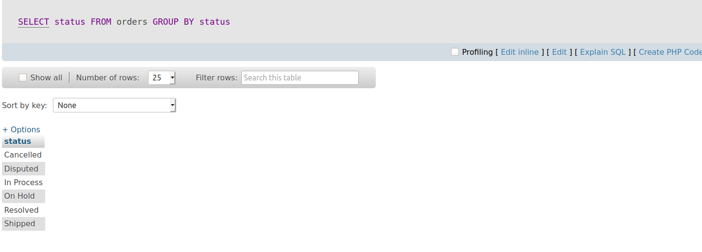

**Ví dụ 2:** Sử dụng group by với các function.
```
SELECT 
    status, COUNT(*)
FROM
    orders
GROUP BY status;
```

Ở đây tôi sử dụng funtion COUNT
Chọn cột status và đếm số lần xuất hiện giá trị từ bảng orders nhóm bởi cột status.
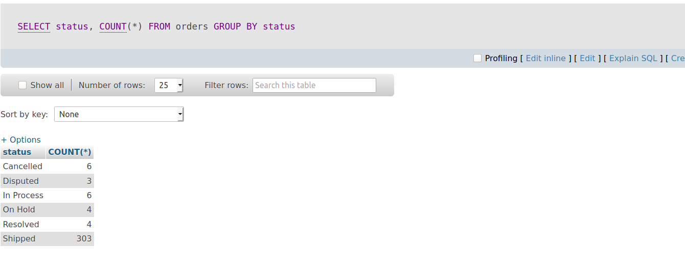


Tương tự với Function SUM.
Đây là bảng orderdetails  khi chưa sắp xếp.
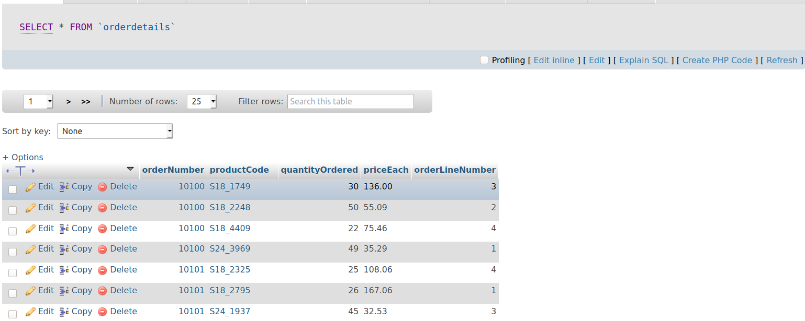


Ta thấy cột orderNumber có cùng giá trí xuất hiện nhiều lần bây giờ ta sẽ nhóm các hàng có cùng giá trị laị cùng 1 nhóm.
```
SELECT 
    orderNumber,
    SUM(quantityOrdered * priceEach) AS total
FROM
    orderdetails
GROUP BY 
    orderNumber;
```
Ta thấy cột orderNumber đã được nhóm lại thành 1 cột.
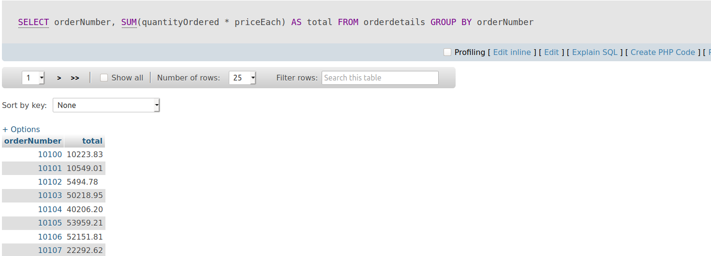

**Ví dụ 3:** Sử dụng Group by với các biểu thức.
Dưới đây tôi sử dụng joining tables và  biểu thức bằng trong WHERE.
```
SELECT 
    YEAR(orderDate) AS year,
    SUM(quantityOrdered * priceEach) AS total
FROM
    orders
INNER JOIN orderdetails 
    USING (orderNumber)
WHERE
    status = 'Shipped'
GROUP BY 
    YEAR(orderDate);
```

Tính tổng của các năm mà có cột status là shiper.
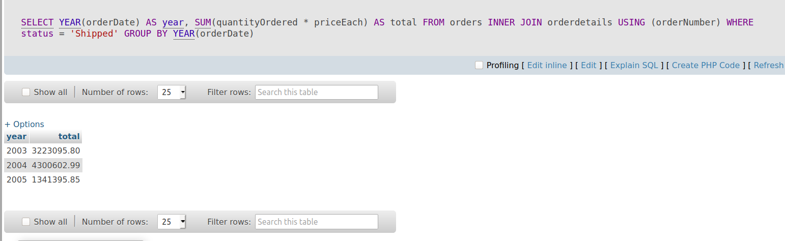

**Ví dụ 4:** Sư dụng group by với having.

Giống ví dụ trước tôi chỉ thêm HAVING để lọc ra năm lớn 2003.
```
SELECT 
    YEAR(orderDate) AS year,
    SUM(quantityOrdered * priceEach) AS total
FROM
    orders
INNER JOIN orderdetails 
    USING (orderNumber)
WHERE
    status = 'Shipped'
GROUP BY 
    YEAR(orderDate)
HAVING
    YEAR > 2003;
```
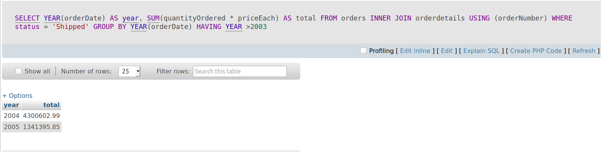

<a name ="2"></a>
## 2. Mệnh đề having.
Mệnh đề HAVING được sử dụng trong câu lệnh SELECT để chỉ định các điều kiện lọc cho một nhóm các hàng hoặc tổng hợp.

Mệnh đề HAVING thường được sử dụng với mệnh đề GROUP BY để lọc các nhóm dựa trên một điều kiện cụ thể. Nếu mệnh đề GROUP BY bị bỏ qua, mệnh đề HAVING hoạt động giống như mệnh đề WHERE.

Thứ tự sử  dụng Having.
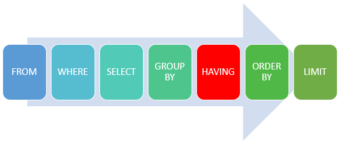

**Ví dụ 1:** Sử dụng Having cơ bản.
Khi chưa sử dụng having thì cột total là tất cả giá trị được tính trong bảng.
```
SELECT 
    ordernumber,
    SUM(quantityOrdered) AS itemsCount,
    SUM(priceeach*quantityOrdered) AS total
FROM
    orderdetails
GROUP BY ordernumber;
```
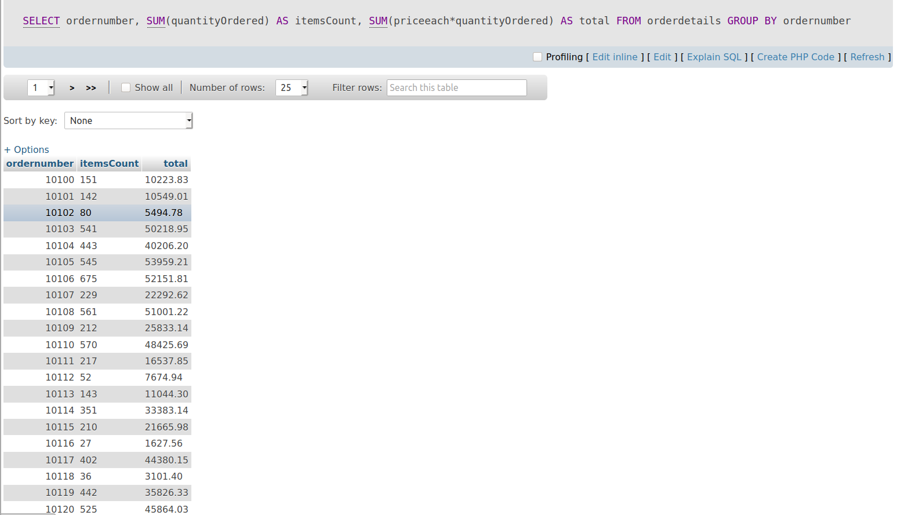

Sau khi sử dụng Having sẽ lọc các giá trị nhỏ hơn 1000 ra.
```
SELECT 
    ordernumber,
    SUM(quantityOrdered) AS itemsCount,
    SUM(priceeach*quantityOrdered) AS total
FROM
    orderdetails
GROUP BY 
   ordernumber
HAVING 
   total > 10000
ORDER BY 
    total ASC;
```
Ở đây t dùng thêm Order by để sắp xếp cho tiện quan sát.
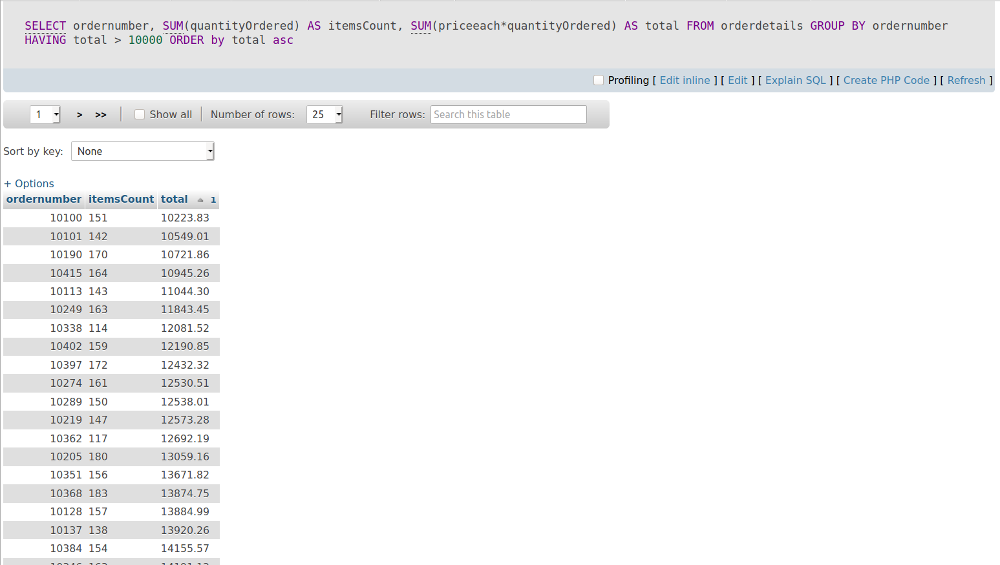

**Ví dụ 2:** Sử dụng HAVING với JOINING tables.

```
SELECT 
    a.ordernumber, 
    status, 
    SUM(priceeach*quantityOrdered) total
FROM
    orderdetails a
INNER JOIN orders USING (orderNumber)
GROUP BY  
    ordernumber, 
    status
HAVING 
    status = 'Shipped' AND 
    total > 1500
```

Ở đây tôi sử dụng USING để join các bảng.
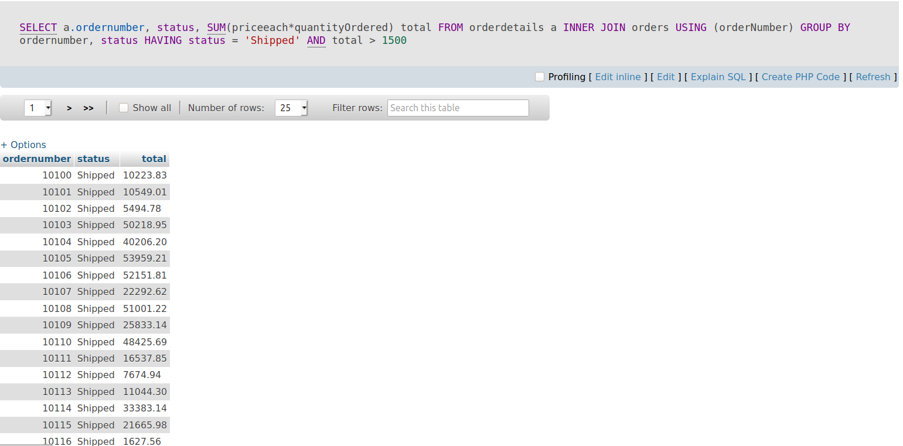

<a name ="3"></a>
## 3. Mệnh đề ROLL UP.
Trước khi tim hiể roll up ta cần tìm hiểu trước các khái niệm UNION.

UNION là hội kết quả của 2 câu truy vấn khi đã loại bỏ các dòng trùng lặp.

UNION ALL là hôi kết quả của 2 câu truy vấn không loại bỏ các dòng trùng lặp.

Ví dụ Truy vấn sau tạo một nhóm bởi productline.
```
 SELECT  
    productline, 
     SUM (orderValue) totalOrderValue
 FROM 
    sales
 GROUP   BY  
    productline;
````
Trả về kết quả.
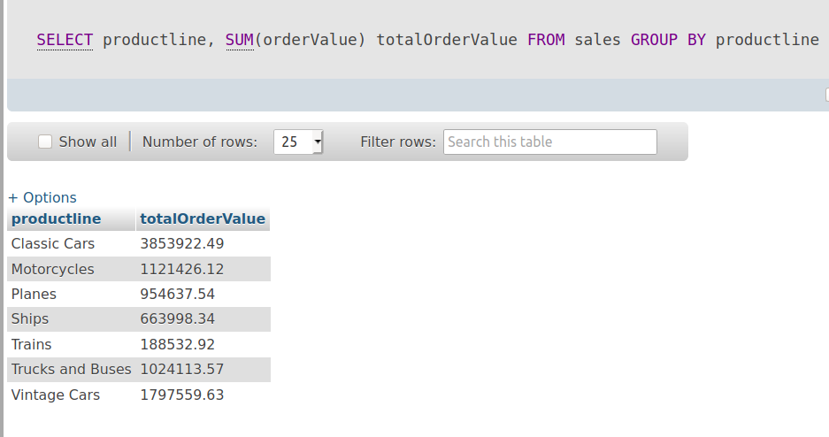

Tổng tất cả giá trị ở trên.
```
SELECT 
    SUM(orderValue) totalOrderValue
FROM
    sales;
```
Kết quả.
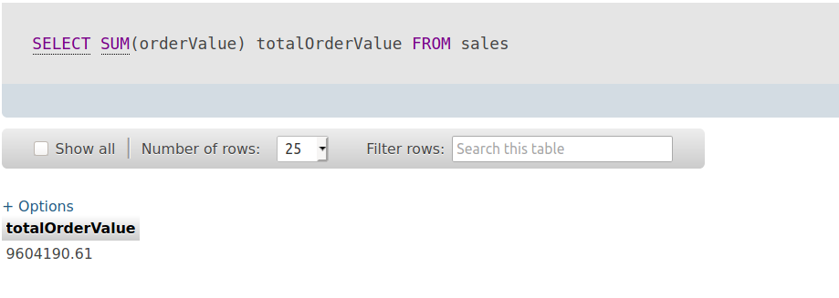

Nếu muốn hiện thị 2 kết quả trên trong cùng 1 bảng thi ta sử dụng UNION ALL như sau.

```
SELECT 
    productline, 
    SUM(orderValue) totalOrderValue
FROM
    sales
GROUP BY 
    productline 
UNION ALL
SELECT 
    NULL, 
    SUM(orderValue) totalOrderValue
FROM
    sales;
```
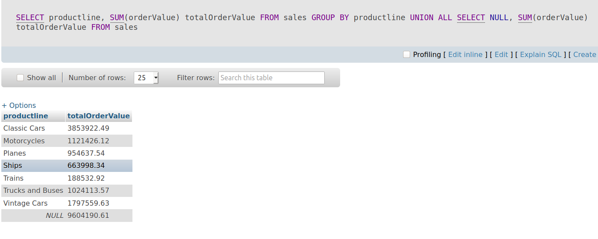

Có một cách đơn giản hơn là sử dụng ROLLUP  Như sau.
```
SELECT 
    productLine, 
    SUM(orderValue) totalOrderValue
FROM
    sales
GROUP BY 
    productline WITH ROLLUP;
``` 
Kết quả cho ra tương tự nhử trên.

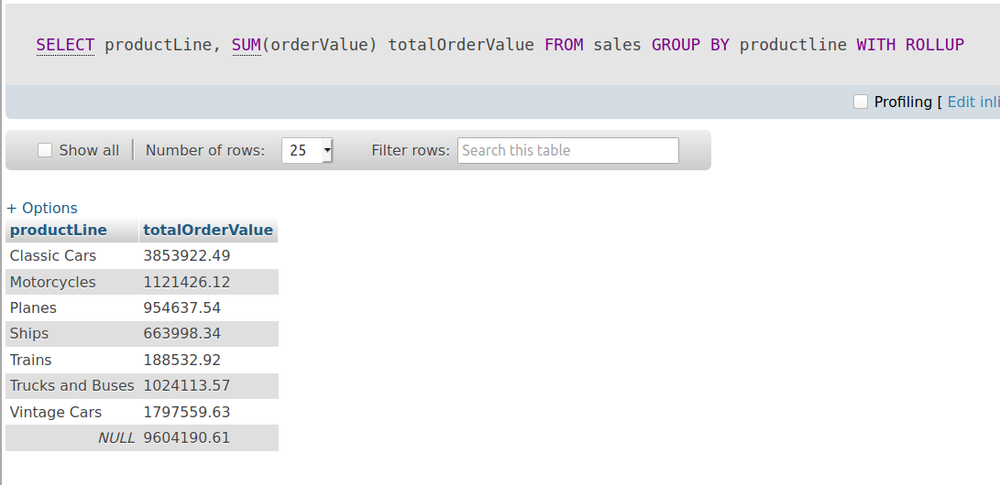

Vậy ROLLUP sử dụng để  giúp bạn thống kê được tổng phụ và tổng tòan cục.

Tổng phụ ở đây là tổng giá của các productline và tổng toàn cục là tổng của các tổng phụ dduwoj tính bên trên.

Ví dụ trên là tôi sử dụng group by với 1 cột còn nếu sử dụng group by với nhiều cột thì nó sẽ thực hiện theo cấu trúc phân tầng sau.

```
GROUP BY cot1, cot2 WITH ROLLUP.
```
Sau đó ROLLUP lần lượt tạo ra các nhóm và duyệt rồi sử dụng các biểu thức nếu có.
```
(cot1, cot2)
(cot1 )
()
```

**Ví dụ 2:** Sử dụng ROLLUP với 2 cột.
```
 SELECT  
    productLine, 
    orderYear,
     SUM (orderValue) totalOrderValue
 FROM 
    sales
 GROUP   BY  
    productline, 
    orderYear 
 WITH ROLLUP ;
```


Đầu tiên nó tạo ra các nhóm theo productline rồi productline và orderYeah. tiếp theo tính tổng phụ.
Cuối cùng nó sẽ nhóm theo productline rồi tính tống dây là tổng toàn cục.
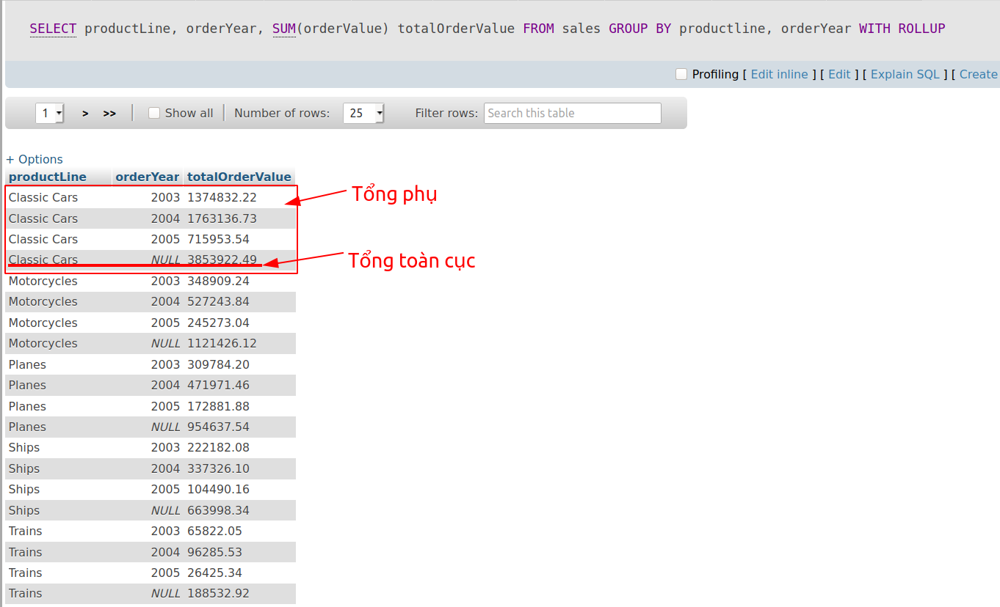
