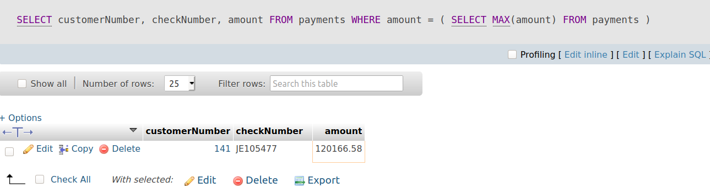
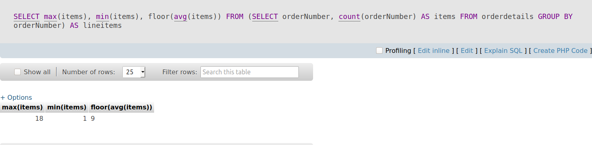

# Subqueries

### Muc lục

[1. Subquery](#1)

[2. Derived table](#2)

[3. Exists](#3)

----


<a name ="1"></a>
# 1. Subquery

Truy vấn con của MySQL là một truy vấn được lồng trong một truy vấn khác như SELECT , INSERT , UPDATE   hoặc DELETE . Ngoài ra, một truy vấn con có thể được lồng bên trong một truy vấn con khác.

**Ví dụ 1:** Sử dụng subqueri cơ bản.

Truy vấn sau đây trả về các nhân viên làm việc trong các văn phòng ở USA.
```
 SELECT  
    lastName, firstName
 FROM 
    employees
 WHERE 
    officeCode  IN  ( SELECT  
            officeCode
         FROM 
            offices
         WHERE 
            country =  'USA' );
```
Trong ví dụ này ta có lệnh.
```
SELECT  
    officeCode
    FROM 
        offices
    WHERE 
        country =  'USA'
```
Đây là subquery.

**Ví dụ 1:** Sử dụng Subquery với mệnh đề Where.
```
 SELECT  
    customerNumber, 
    checkNumber, 
    amount
 FROM 
    payments
 WHERE 
    amount = ( SELECT   MAX (amount)  FROM  payments);
```

Hiển thị kết quá lớn nhất cột amount từ bảng payments.


**Ví dụ 2:** Sử dụng subqueries với mệnh đề FROM.

```
 SELECT  
     MAX (items), 
     MIN (items), 
     FLOOR ( AVG (items))
 FROM 
    ( SELECT  
        orderNumber,  COUNT (orderNumber)  AS  items
     FROM 
        orderdetails
     GROUP   BY  orderNumber)  AS  lineitems;
```
Kết quả trả về  max, min, floor từ orderNumber từ bảng orderdetails .




