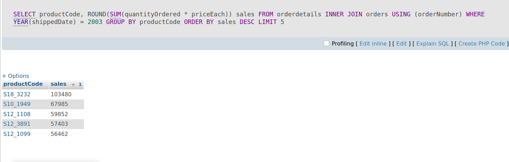
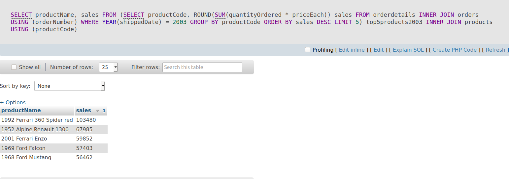
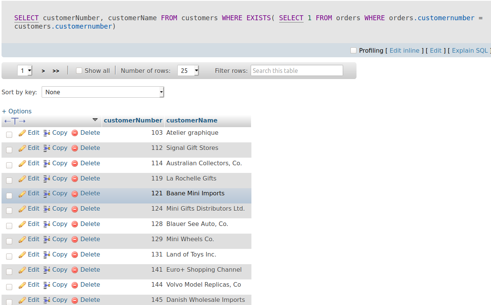
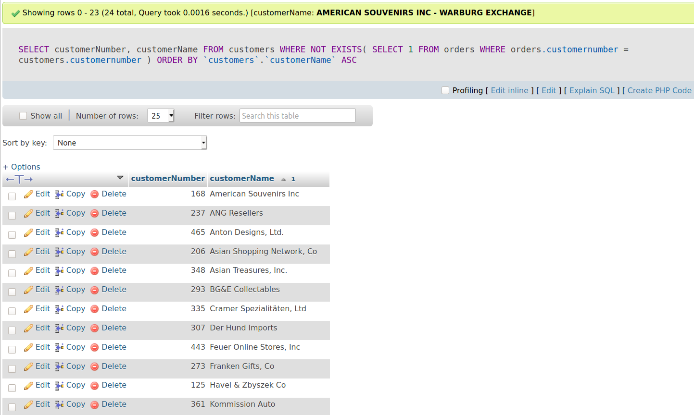
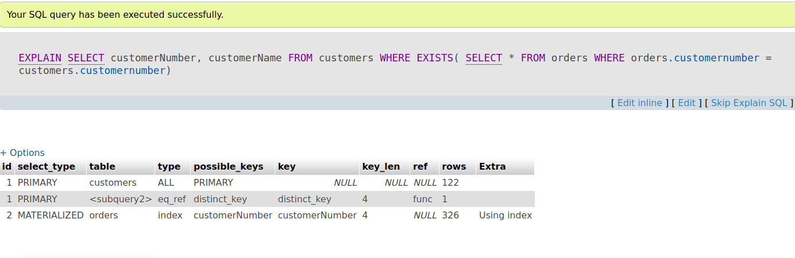

# Subqueries

### Muc lục

[1. Subquery](#1)

[2. Derived table](#2)

[3. Exists](#3)

----


<a name ="1"></a>
# 1. Subquery

Truy vấn con của MySQL là một truy vấn được lồng trong một truy vấn khác như SELECT , INSERT , UPDATE   hoặc DELETE . Ngoài ra, một truy vấn con có thể được lồng bên trong một truy vấn con khác.

**Ví dụ 1:** Sử dụng subqueri cơ bản.

Truy vấn sau đây trả về các nhân viên làm việc trong các văn phòng ở USA.
```
 SELECT  
    lastName, firstName
 FROM 
    employees
 WHERE 
    officeCode  IN  ( SELECT  
            officeCode
         FROM 
            offices
         WHERE 
            country =  'USA' );
```
Trong ví dụ này ta có lệnh.
```
SELECT  
    officeCode
    FROM 
        offices
    WHERE 
        country =  'USA'
```
Đây là subquery.

**Ví dụ 1:** Sử dụng Subquery với mệnh đề Where.
```
 SELECT  
    customerNumber, 
    checkNumber, 
    amount
 FROM 
    payments
 WHERE 
    amount = ( SELECT   MAX (amount)  FROM  payments);
```

Hiển thị kết quá lớn nhất cột amount từ bảng payments.


**Ví dụ 2:** Sử dụng subqueries với mệnh đề FROM.

```
 SELECT  
     MAX (items), 
     MIN (items), 
     FLOOR ( AVG (items))
 FROM 
    ( SELECT  
        orderNumber,  COUNT (orderNumber)  AS  items
     FROM 
        orderdetails
     GROUP   BY  orderNumber)  AS  lineitems;
```
Kết quả trả về  max, min, floor từ orderNumber từ bảng orderdetails .


<a name="2"></a>
## 2. Derived table

Derived table là bảng ảo được trả về từ SELECT. Bảng dẫn xuất tương tự như bảng tạm thời , nhưng sử dụng bảng dẫn xuất trong SELECT đơn giản hơn nhiều so với bảng tạm thời vì nó không yêu cầu các bước tạo bảng tạm thời.

Thuật ngữ bảng dẫn xuất và truy vấn con thường được sử dụng thay thế cho nhau. Khi truy vấn con độc lập được sử dụng trong mệnh đề FROM của SELECT , chúng ta gọi nó là bảng dẫn xuất.

Sau đây minh họa một truy vấn sử dụng bảng dẫn xuất: 
```
SELECT cột_chọn
FROM (
   SELECT cột_chọn
   FROM bảng_1
) tên_bảng_dân_xuât
WHERE tên_bảng_dẫn_xuất.c1 > 0;
```

**Ví dụ 1:** Sử dụng derived table cơ bản.

Truy vấn sau đây nhận được 5 sản phẩm hàng đầu theo doanh thu bán hàng trong năm 2003 sử dụng Grouping table từ các bảng orders và bảng orderdetails  trong cơ sở dữ liệu mẫu :

```
SELECT 
    productCode, 
    ROUND(SUM(quantityOrdered * priceEach)) sales
FROM
    orderdetails
        INNER JOIN
    orders USING (orderNumber)
WHERE
    YEAR(shippedDate) = 2003
GROUP BY productCode
ORDER BY sales DESC
LIMIT 5;
```


Bạn có thể sử dụng kết quả của truy vấn này dưới dạng bảng dẫn xuất và nối nó với bảng products như sau:
```
SELECT 
    productName, sales
FROM
    (SELECT 
        productCode, 
        ROUND(SUM(quantityOrdered * priceEach)) sales
    FROM
        orderdetails
    INNER JOIN orders USING (orderNumber)
    WHERE
        YEAR(shippedDate) = 2003
    GROUP BY productCode
    ORDER BY sales DESC
    LIMIT 5) top5products2003
INNER JOIN
    products USING (productCode);
```



Trong ví dụ này:
   - Đầu tiên, truy vấn con được thực thi để tạo tập kết quả hoặc bảng dẫn xuất.
   - Sau đó, truy vấn bên ngoài được thực hiện đã tham gia bảng dẫn xuất top5product2003 với bảng products bằng cột productCode . 

<a name="3"></a>
## Toán tử EXISTS.

Toán tử EXISTS là toán tử Boolean trả về giá trị đúng hoặc sai. Toán tử EXISTS thường được sử dụng để kiểm tra sự tồn tại của các hàng được trả về bởi truy vấn con.

Cấu trúc.
```
 SELECT  
    select_list
 FROM 
    a_table
 WHERE 
    [ NOT ]  EXISTS (subquery);
```


**Ví dụ 1:** Sử dụng SELECT EXISTS cơ bản.
Câu lệnh sau sử dụng toán tử EXISTS để tìm khách hàng có ít nhất một đơn hàng
```
SELECT 
    customerNumber, 
    customerName
FROM
    customers
WHERE
    EXISTS(
    SELECT 
            *
        FROM
            orders
        WHERE
            orders.customernumber 
        = customers.customernumber);
```


Trong ví dụ này, đối với mỗi hàng trong bảng customers , truy vấn sẽ kiểm tra số customerNumber trong bảng orders . Nếu số customerNumber , xuất hiện trong bảng customers , tồn tại trong bảng orders , truy vấn con trả về hàng khớp đầu tiên. Do đó, toán tử EXISTS trả về true và dừng kiểm tra bảng orders . Mặt khác, truy vấn con trả về không có hàng và toán tử EXISTS trả về false.

**Ví dụ 2:** HIệu suất củ EXISTS

```
SELECT 
    customerNumber, 
    customerName
FROM
    customers
WHERE
    customerNumber IN (
        SELECT 
            customerNumber
        FROM
            orders);
```



Sử dung truy vấn toán tử IN vói truy vấn bằng cách sử dung lệnh EXPLAIN.
```
EXPLAIN SELECT 
    customerNumber, 
    customerName
FROM
    customers
WHERE
    EXISTS( 
        SELECT 
            1
        FROM
            orders
        WHERE
            orders.customernumber = customers.customernumber)
```
