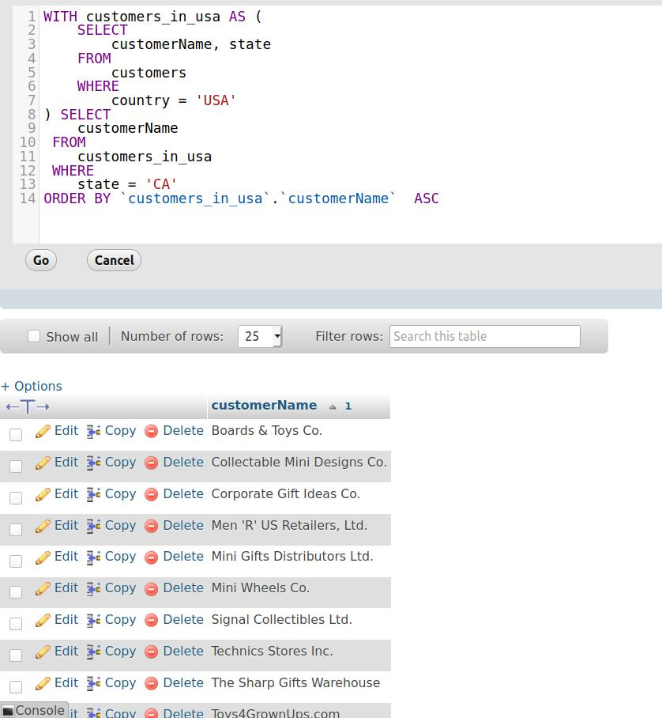
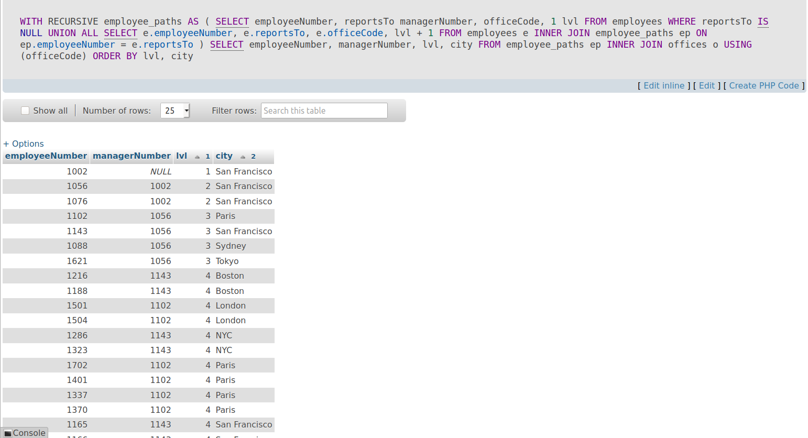

# Common table expression

### Mục lục

[1. Common table expression](#1)

[2. Recursive common table expression](#2)

----

<a name ="1"></a>
## 1. Common table expression.
Common table expression hay biểu thức bảng chung để xây dựng các truy vấn phức tạp theo cách dễ đọc hơn.

MySQL đã giới thiệu biểu thức bảng chung hoặc tính năng CTE kể từ phiên bản 8.0, do đó bạn nên có MySQL 8.0+ để thực hành với các câu lệnh trong hướng dẫn này.

Biểu thức bảng chung là một tập kết quả tạm thời được đặt tên chỉ tồn tại trong phạm vi thực thi của một câu lệnh SQL duy nhất, ví dụ: SELECT , INSERT , UPDATE hoặc DELETE .

Tương tự như bảng dẫn xuất , CTE không được lưu trữ dưới dạng đối tượng và chỉ tồn tại trong quá trình thực hiện truy vấn.

Không giống như bảng dẫn xuất, CTE có thể tự tham chiếu ( CTE đệ quy ) hoặc có thể được tham chiếu nhiều lần trong cùng một truy vấn. Ngoài ra, CTE cung cấp khả năng đọc và hiệu suất tốt hơn so với bảng dẫn xuất. 

Sau đây minh họa cú pháp cơ bản của CTE:
```
 WITH  cte_name (column_list)  AS  (
    query
) 
 SELECT  *  FROM  cte_name;
```

**Ví dụ 1:** Cách sử dụng CTE cơ bản trong SQL.

```
 WITH  customers_in_usa  AS  (
     SELECT  
        customerName, state
     FROM 
        customers
     WHERE 
        country =  'USA' 
)  SELECT  
    customerName
  FROM 
    customers_in_usa
  WHERE 
    state =  'CA' 
  ORDER BY  customerName;
```


Trong ví dụ này, tên của CTE là customers_in_usa hàng_in_usa, truy vấn xác định CTE trả về hai cột customerName và state . Do đó, customers_in_usa hàng_in_usa CTE trả lại tất cả các khách hàng ở USA.


**Ví dụ 2:** 

```
 WITH  salesrep  AS  (
     SELECT  
        employeeNumber,
         CONCAT (firstName,  ' ' , lastName)  AS  salesrepName
     FROM 
        employees
     WHERE 
        jobTitle =  'Sales Rep' 
),
customer_salesrep  AS  (
     SELECT  
        customerName, salesrepName
     FROM 
        customers
             INNER JOIN 
        salesrep  ON  employeeNumber = salesrepEmployeeNumber
)
 SELECT  
    *
 FROM 
    customer_salesrep
 ORDER BY  customerName;
```

Trong ví dụ này,tôi có hai CTE trong cùng một truy vấn. CTE đầu tiên ( salesrep ) có được những nhân viên có chức danh là đại diện bán hàng. CTE thứ hai ( customer_salesrep ) tham chiếu CTE đầu tiên trong mệnh đề INNER JOIN để có được đại diện bán hàng và khách hàng mà mỗi đại diện bán hàng chịu trách nhiệm.

Sau khi có CTE thứ hai, chúng tôi truy vấn dữ liệu từ CTE đó bằng cách sử dụng SELECT đơn giản với mệnh đề ORDER BY . 

## Mệnh đề WITH

With sử dụng với các common tables expression.

Đầu tiên, một mệnh đề WITH có thể được sử dụng ở đầu các SELECT , UPDATE và DELETE :
```
 WITH  ...  SELECT  ...
 WITH  ...  UPDATE  ...
 WITH  ...  DELETE  ...
```
Thứ hai, một mệnh đề WITH có thể được sử dụng khi bắt đầu truy vấn con hoặc truy vấn bảng con dẫn xuất (derived table):

```
 SELECT  ...  WHERE  id  IN  ( WITH  ...  SELECT  ...);
 
 SELECT  *  FROM  ( WITH  ...  SELECT  ...)  AS  derived_table;
```

Thứ ba, mệnh đề WITH có thể được sử dụng ngay trước SELECT các câu lệnh có chứa mệnh đề SELECT :

```
 CREATE   TABLE  ...  WITH  ...  SELECT  ...
 CREATE   VIEW  ...  WITH  ...  SELECT  ...
 INSERT  ...  WITH  ...  SELECT  ...
 REPLACE  ...  WITH  ...  SELECT  ...
 DECLARE   CURSOR  ...  WITH  ...  SELECT  ...
 EXPLAIN  ...  WITH  ...  SELECT 
```
<a name ="2"></a>
## 2. Recursive common table expression

Recursive common table expressionbiểu thức bảng chung đệ quy (CTE) là một CTE có một truy vấn con đề cập đến chính tên CTE

Cấu trúc:
```
 WITH  RECURSIVE cte_name  AS  (
    initial_query   -- anchor member 
     UNION ALL 
    recursive_query  -- recursive member that references to the CTE name 
)
 SELECT  *  FROM  cte_name;
```
Một CTE đệ quy bao gồm ba phần chính:

    Một truy vấn ban đầu hình thành tập kết quả cơ sở của cấu trúc CTE. Phần truy vấn ban đầu được gọi là một thành viên neo.
    Một phần truy vấn đệ quy là một truy vấn tham chiếu đến tên CTE, do đó, nó được gọi là thành viên đệ quy. Thành viên đệ quy được tham gia với thành viên neo bởi UNION ALL hoặc UNION DISTINCT .
    Một điều kiện chấm dứt đảm bảo đệ quy dừng khi thành viên đệ quy không trả về hàng. 

Trình tự thực hiện của CTE đệ quy như sau:

    Đầu tiên, tách các thành viên thành hai: thành viên neo và đệ quy.
    Tiếp theo, thực hiện thành viên neo để tạo tập kết quả cơ sở ( R0 ) và sử dụng tập kết quả cơ sở này cho lần lặp tiếp theo.
    Sau đó, thực hiện thành viên đệ quy với kết quả Ri được đặt làm đầu vào và đặt Ri+1 làm đầu ra.
    Sau đó, lặp lại bước thứ ba cho đến khi thành viên đệ quy trả về tập kết quả trống, nói cách khác, điều kiện kết thúc được đáp ứng.
    Cuối cùng, kết hợp các tập kết quả từ R0 đến Rn bằng UNION ALL . 


Sử dụng CTE đệ quy MySQL để truyền dữ liệu phân cấp.

Chúng tôi sẽ sử dụng bảng employees trong cơ sở dữ liệu mẫu classicmodels.
Bảng employees có cột reportsTo Tham chiếu đến cột workerNumber. Cột reportsTo lưu trữ id của người quản lý. Người quản lý cao nhất không báo cáo cho bất kỳ ai trong cấu trúc tổ chức của công ty, do đó, giá trị trong cột reportsTo là NULL
```
 WITH  RECURSIVE employee_paths  AS 
  (  SELECT  employeeNumber,
           reportsTo managerNumber,
           officeCode, 
           1 lvl
    FROM  employees
    WHERE  reportsTo  IS   NULL 
      UNION ALL 
      SELECT  e.employeeNumber,
            e.reportsTo,
            e.officeCode,
            lvl + 1
      FROM  employees e
      INNER JOIN  employee_paths ep  ON  ep.employeeNumber = e.reportsTo )
 SELECT  employeeNumber,
       managerNumber,
       lvl,
       city
 FROM  employee_paths ep
 INNER JOIN  offices o  USING  (officeCode)
 ORDER BY  lvl, city;
```

Hãy chia truy vấn thành các phần nhỏ hơn để dễ hiểu hơn.

Đầu tiên, tạo thành viên neo bằng cách sử dụng truy vấn sau: 
```
 SELECT  
    employeeNumber, 
    reportsTo managerNumber, 
    officeCode
 FROM 
    employees
 WHERE 
    reportsTo  IS   NULL 
```
Truy vấn này (thành viên neo) trả về người quản lý hàng đầu có reportsTo là NULL .

Thứ hai, tạo thành viên đệ quy bằng cách tham chiếu đến tên CTE, đó là employee_paths trong trường hợp này: 
```
 SELECT  
    e.employeeNumber, 
    e.reportsTo, 
    e.officeCode
 FROM 
    employees e
 INNER JOIN  employee_paths ep 
     ON  ep.employeeNumber = e.reportsTo
```

Truy vấn này (thành viên đệ quy) trả về tất cả các báo cáo trực tiếp của người quản lý cho đến khi không còn báo cáo trực tiếp nữa. Nếu thành viên đệ quy trả về không có báo cáo trực tiếp, đệ quy dừng lại.

Thứ ba, truy vấn sử dụng CTE worker_paths tham gia tập kết quả được CTE trả về với bảng offices để tạo tập kết quả cuối cùng. 

Kết quả.

