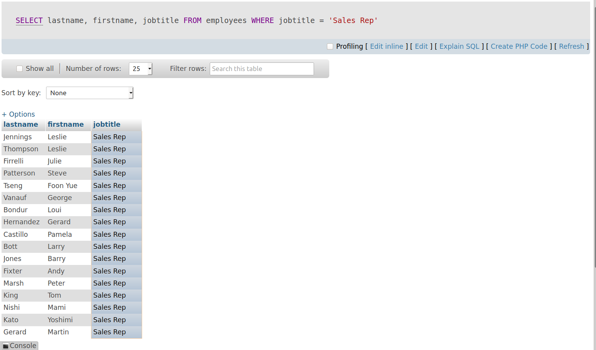
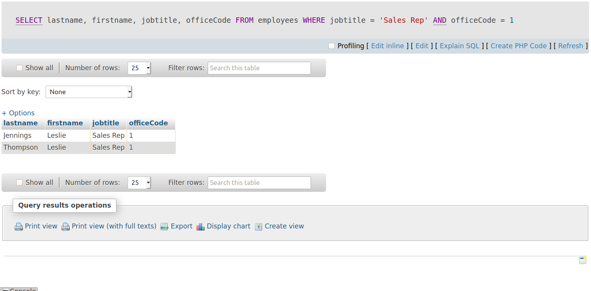
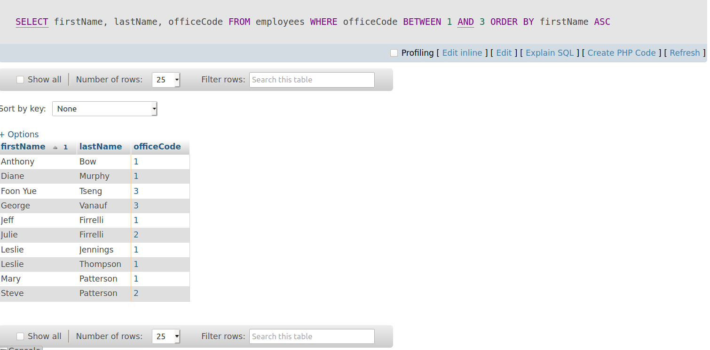
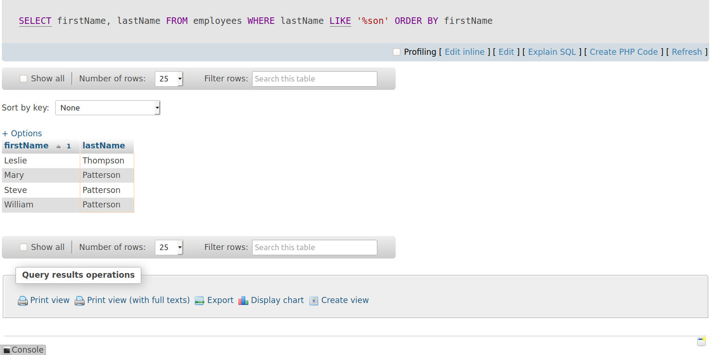

# Filtering data.

## where lọc các điều kiên chỉ định.
mệnh đề WHERE cho phép bạn chỉ định một điều kiện tìm kiếm cho các hàng được trả về bởi một truy vấn. Sau đây cho thấy cú pháp của mệnh đề WHERE:
```
SELECT 
    select_list
FROM
    table_name
WHERE
    search_condition;
```
Search_condition là sự kết hợp của một hoặc nhiều vị từ bằng cách sử dụng toán tử logic and, or, between, like, in, not in, is , =, <, >, >=, <=, !=.

**Vi dụ 1:** Sử dụng mệnh đề WHERE với dấu bằng.

```
SELECT 
    lastname, 
    firstname, 
    jobtitle
FROM
    employees
WHERE
    jobtitle = 'Sales Rep';
```
chọn cột lastname, firstname, jobtitle từ bảng employees nơi jobtitle = sales rep.


**Ví dụ 2:** Sử dụng mệnh để where với toán tử AND.
```
SELECT 
    lastname, 
    firstname, 
    jobtitle,
    officeCode
FROM
    employees
WHERE
    jobtitle = 'Sales Rep' AND 
    officeCode = 1;
```
Chọn cột lastname, firstname, jobtitle, officeCode từ bảng employees nơi jobtitle = 'Sales Rep' và officeCode = 1.

Hiện thị kết quả đồng thời có cả 2 trường trên.


**Ví dụ 3:** Sử dụng mệnh đề where với toán từ Between.
```
SELECT 
    firstName, 
    lastName, 
    officeCode
FROM
    employees
WHERE
    officeCode BETWEEN 1 AND 3
ORDER BY firstName ASC
```

Chọn cột lastname, firstname, officeCode từ bảng employees nơi oficeCode giữa 1 và 3 sắp xếp tăng dần theo côt firstname.



**Ví dụ 4:** Sử dụng mệnh đề where với toán tử like.

Câu truy vấn này tìm người có  lastname kết thúc bằng 3 ký tự "son".
```
SELECT 
    firstName, 
    lastName
FROM
    employees
WHERE
    lastName LIKE '%son'
ORDER BY firstName;
```
