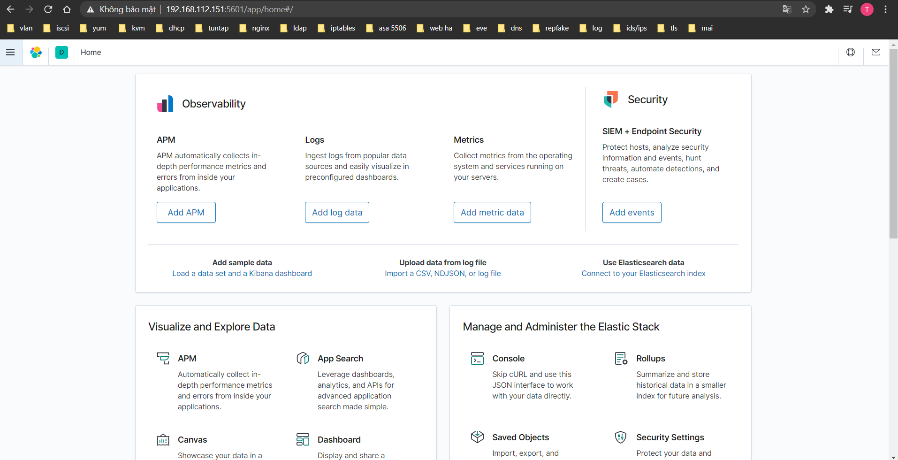

# Cài đặt ELK mô hình All-in-one

## Mục lục

[1. Cài đặt Elasticsearch ](#1)

[2. Cài đặt Logstash](#2)

[3. Cài đặt Kibana](#3)

---
<a name="1"></a>
## 1. Cài đặt Elastisearch
Cài đặt java:
```
yum -y install java-openjdk-devel java-openjdk
```

Import key elastic:
```
rpm --import http://packages.elastic.co/GPG-KEY-elasticsearch
```
Thêm repo elastic :
```
cat <<EOF > /etc/yum.repos.d/elasticsearch.repo
[elasticsearch-7.x]
name=Elasticsearch repository for 7.x packages
baseurl=https://artifacts.elastic.co/packages/7.x/yum
gpgcheck=1
gpgkey=https://artifacts.elastic.co/GPG-KEY-elasticsearch
enabled=1
autorefresh=1
type=rpm-md
EOF
```
Cài đặt Elasticsearch :
```
yum install elasticsearch -y
```
Tùy thuộc vào cấu hình của máy server. Đây là vùng nhớ đệm dể chạy.
Sửa file /etc/elasticsearch/jvm.options
```
-Xms256m
-Xmx512m
```
Chỉnh sửa file cấu hình của elasticsearch để mở port 9200.
```
sed s/\#http\.port\:\ 9200/http\.port\:\ 9200/g /etc/elasticsearch/elasticsearch.yml
```
Khởi động lại Elasticsearch và cho phép dịch vụ khởi động cùng hệ thống :
```
systemctl start elasticsearch
systemctl enable elasticsearch
```
Kiểm tra dịch vụ Elasticseach.

```
curl -X GET http://localhost:9200
```

Kết quả trả về như sau :
```
[root@ELK-stack ~]# curl -X GET http://localhost:9200
{
"name" : "w5M4X9m",
"cluster_name" : "elasticsearch",
"cluster_uuid" : "3a8frDXuRUaxZnKi1Y_tFQ",
"version" : {
    "number" : "6.3.1",
    "build_flavor" : "default",
    "build_type" : "rpm",
    "build_hash" : "eb782d0",
    "build_date" : "2019-01-30T10:21:26.107521Z",
    "build_snapshot" : false,
    "lucene_version" : "7.3.1",
    "minimum_wire_compatibility_version" : "5.6.0",
    "minimum_index_compatibility_version" : "5.0.0"
},
"tagline" : "You Know, for Search"
}
```

Như vậy là ta đã cài đăt và cấu hình thành công Elasticsearch.

Tiếp đến ta sẽ cài đặt và cấu hính Logstash

<a name="2"></a>
## 2. Cài đặt Logstash

Thêm repo logstash:
```
cat << EOF > /etc/yum.repos.d/logstash.repo
[logstash-7.x]
name=Elastic repository for 7.x packages
baseurl=https://artifacts.elastic.co/packages/7.x/yum
gpgcheck=1
gpgkey=https://artifacts.elastic.co/GPG-KEY-elasticsearch
enabled=1
autorefresh=1
type=rpm-md
EOF
```
Cài đặt logstash:
```
yum install logstash -y
```
Chỉnh sửa file cấu hình `/etc/logstash/jvm.options`
```
-Xms256m
-Xmx512m
```

Khởi động và cho phép dịch vụ khởi động cùng hệ thống.
```
systemctl daemon-reload
systemctl start logstash
systemctl enable logstash
```

Như vậy là ta đã cài đăt và cấu hình thành công Logstash

Tiếp đến ta sẽ cài đặt và cấu hính Kibana.

<a name="3"></a>
## 3. Cài đặt Kibana

Tạo repo cài đặt Kibana:
```
cat <<EOF > /etc/yum.repos.d/kibana.repo
[kibana-7.x]
name=Kibana repository for 7.x packages
baseurl=https://artifacts.elastic.co/packages/7.x/yum
gpgcheck=1
gpgkey=https://artifacts.elastic.co/GPG-KEY-elasticsearch
enabled=1
autorefresh=1
type=rpm-md
EOF
```
Cài đặt Kibana:
```
yum install kibana -y
```
Sửa đổi cấu hình kibana.

```
server port :5601
server.host: "192.168.112.150"
server.name: "localhost"
elasticsearch.hosts: "http://localhost:9200"
```

Ip 192.168.112.151 là địa chỉ ip của máy server. Mọi người cũng có thể thay thế sử dụng địa chỉ 0.0.0.0

Khởi động và cho phép dịch vụ khởi động cùng hệ thống:
```
systemctl daemon-reload
systemctl start kibana
systemctl enable kibana
```
Sau khi khơi động sau đợi vài phút để các thành phần kien kệt với nhau. Sau đó truy cập vào Kibana kiểm tra:
`http://192.168.112.151:5601`

Sau khi đăng nhập ta sẽ được kết quả như sau. 

