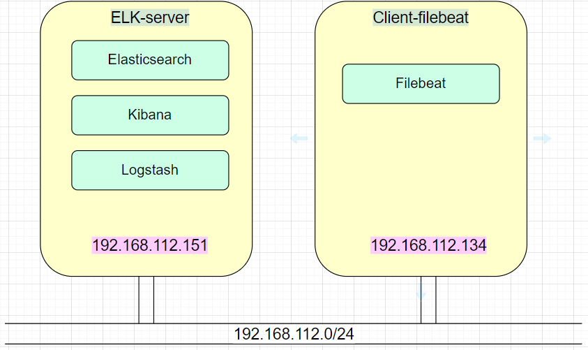
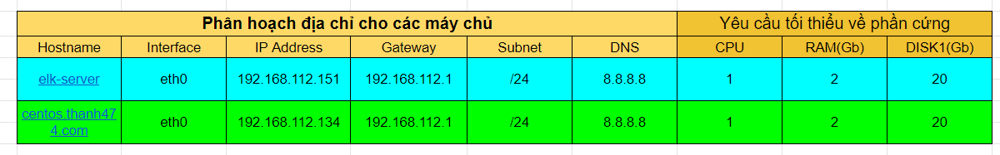

# Thu thập log về ELK stacks.

## Mục lục

[1. Mô hình, ip planning](#1)

[2. Cài đặt đồng bộ thời gian NTP](#2)

[3. Cấu hình thu thập thông qua filebeat](#3)

[4. Cấu hình thi thập thông qua auditbeat](#4)

----

## 1 Mô hình, Ip planning
Mô hình 


Ip planning


## 2. Cài đặt đồng bộ thời gian NTP

Cài đặt NTP
```
yum -y install ntp
```

Chỉnh sửa file cấu hình ntp để đồng bộ với đồng hồ chuẩn. Sử dụng lệnh `vim /etc/ntp.conf`

Thay thế các dòng sau
```
    server 0.asia.pool.ntp.org iburst
    server 1.asia.pool.ntp.org iburst
    server 2.asia.pool.ntp.org iburst
    server 3.asia.pool.ntp.org iburst
```

Tiếp đến mở firewall cho dịch vụ ntp
```
firewall-cmd --add-service=ntp --permanent
firewall-cmd --reload
```

Khởi chạy và bật dịch vụ chạy cùng hệ thống
```
systemctl start ntpd
systemctl enable ntpd
```   
Tiếp theo chúng ta thực hiện kiểm tra trạng thái của NTP Server
```
systemctl status ntpd
```
Sau khi NTP Sever được khởi động, chúng ta hãy đợi vài phút để server đồng bộ hóa thời gian với server trong danh sách nhóm, sau đó chạy các lệnh sau để xác minh trạng thái đồng bộ hóa NTP và thời gian hệ thống:

```
ntpq -p
```
Chúng ta cũng có thể dùng lệnh `ntpdate vn.pool.ntp.org` để đồng bộ giờ qua cụm máy chủ NTP tại Việt Nam.

## 3. Cấu hình thu thập thông qua filebeat.