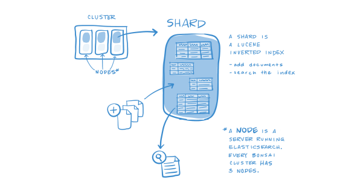
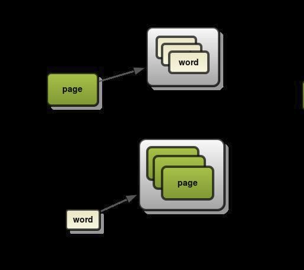
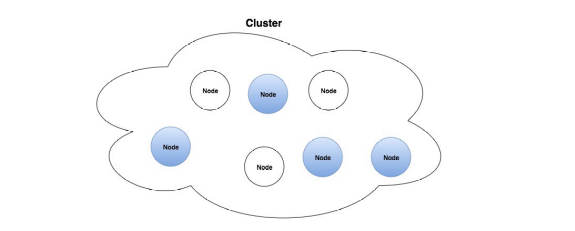

# Tìm hiểu Elasticsearch 

## Mục lục 

[1. Elasticsearch là gì ?](#1)

[2. Các khái niệm cơ bản của Elasticsearch](#2)

- [2.1 Document](#2.1)
- [2.2 Index](#2.2)
- [2.3 Shard](#2.3)
- [2.4 Node](#2.4)
- [2.5 Cluster](#2.5)

[3. Ưu điểm của Elasticsearch](#3)

[4. Nhược điểm của Elasticsearch](#4)

----
## <a name="1"> 1. Elasticsearch là gì ?</a>

Elasticsearch một search engine sử dụng trong ELK stack ngoài là một search engine nó cũng là backend chính trong mô hình ELK stack,

Elasticsearch là một công cụ tìm kiếm và phân tích phân tán, là một RESTful mã nguồn mở được xây dựng trên Apache Lucene. Kể từ khi phát hành vào năm 2010 thì Elasticsearch đã nhanh chóng trở thành một trong những công cụ tìm kiếm được sử dụng thông dụng nhất và được sử dụng rộng rãi trong những trường hợp liên quan đến phân tích nhật ký và tìm kiếm văn bản, thông tin bảo mật và phân tích nghiệp vụ cũng như thông tin vận hành.

Vì là một công cụ mã nguồn mở và miễn phí cho nên chúng ta có thể hoàn toàn cài đặt và sử dụng chỉ cần có một máy cài Linux.

## <a name="2">2. Các khái niệm cơ bản của Elasticsearch.</a>

### <a name="2.1"> 2.1. Document.</a>

- Là đơn vị nhỏ nhất để lưu trữ dữ liệu trong Elasticsearch. Đây là một đơn vị lưu trữ thông tin cơ bản trong Elasticsearch, là một JSON object đối với một số dữ liệu.

### <a name="2.2">2.2. Index. </a>

- Trong Elasticsearch có một cấu trúc tìm kiếm gọi là inverted index, nó được thiết kế để cho phép tìm kiếm full-text search. Cách thức khá đơn giản, các văn bản được tách ra thành từng từ có nghĩa sau đó sẽ được map xem thuộc văn bản nào và khi search sẽ ra kết quả cụ thể.

- Có 2 kiểu đánh index và forward index và inverted index. Bản chất của inverted index là đánh theo keyword: words -> pages còn forward đánh theo nội dung page -> words.

- Chúng ta có thể thấy vie ẹc đánh theo keyword thì việc tìm kiếm sẽ nhanh hơn việc chúng ta phải tìm kiếm theo từng page. Elasticsearch sử dụng Apache lucence để quản lý và tạo inverted index.

### <a name="2.3">2.3. Shard.</a>

- Shard là một đối tượng của Lucence, là tập hợp con của một Index. Một index có thể được lưu trên nhiều shard.

- Một node bao gồm nhiều Shard, shard chính là đối tượng nhỏ nhât hoạt động ở mức thấp nhất, đóng vai trò lưu trữ dữ liệu.

- Chúng ta sẽ không bao giờ làm việc với các shard vì Elasticsearch sẽ hỗ trợ chúng ta toàn bộ việc giao tiếp cũng như tự động thay đổi các Shard khi cần thiết.

- Elasticsearch cung cấp 2 cơ chế của shard đó là primary shard và replica shard.

    - Primary shard sẽ lưu trữ dữ liệu và đánh Index, sau khi đánh dữ liệu xong sẽ được vận chuyển đến các replica shard, mặc định của Elasticsearch mỗi index sẽ có 5 Primary shard thì sẽ đi kèm với 1 Replica shard.

    - Replica shard là nơi lưu trữ dữ liệu nhân bản của Elasticsearch, đóng vai trò đảm bảo tính toàn vẹn dữ liệu khi Primary shard xảy ra vấn đề, ngoài ra nó còn giúp tăng tốc độ tìm kiếm vì chúng ta có thể cấu hình lượng Replica shard nhiều hơn cấu hình mặc định của Elasticsearch.

### <a name="2.4">2.4. Node.</a>

- Là trung tâm hoạt động của Elasticsearch, là nơi lưu trữ dữ liệu, tham gia thực hiện đánh index của cluster cũng như thực hiện các thao tác tìm kiếm.

- Mỗi node được xác định bằng một tên riêng và không được phép trùng lặp.

### <a name="2.5">2.5. Cluster.</a>

Tập hợp các node hoạt động cùng với nhau, chia sẻ với nhau cùng một thuộc tính cluster name. Chính vì thế cluster sẽ được xác định bằng một tên riêng và không được phép trùng lặp. Việc tên của các cluster elasticsearch mà trùng nhai sẽ gây ra lỗi cho các node vì vậy khi cấu hình chúng ta cần phải chú ý.

Mỗi cluster có một node chính gọi là master, node master được lựa chọn một cách tự động và có thể thay đổi nếu như có sự cố xảy ra. Một cluster có thể bao gồm nhiều nodes. Các nodes có thể hoạt động trên cùng một server. Tuy nhiên trên thực tế, một cluster sẽ gồm nhiều nodes hoạt động trên các server khác nhau để đảm bảo nếu một server gặp sự cố thì các node trên các server khác có thể hoạt động đầy đủ chức năng. Các node có thể tìm thấy nhau để hoạt động trên cùng 1 clustẻ thông qua giao thức Unicast.

Chức năng chính của Cluster là quyết định xem shard nào được phân bổ cho node nào và khi nào thì di chuyển các Cluster để cần bằng lại Cluster.

## <a name="3"> 3. Ưu điểm của Elasticsearch.</a>

- Có khả năng tìm kiếm và phân tích dữ liệu.

- Có khả năng mở rộng theo chiều ngang.

- Hỗ trợ tìm kiếm khi từ khóa tìm kiếm có thể bị lỗi.

- Hỗ trợ các Elasticsearch client như Java, Php, JS, Ruby,….

## <a name="4">4. Nhược điểm của Elasticsearch.</a>

- Elasticsearch được thiết kế cho mục đích search cho nên khi sử dụng thì chúng ta nên sử dụng kèm theo một DB khac như MongoDB hay Mysql.

- Trong Elasticsearch không đảm bảo được toàn vẹn dữ liệu của các hoạt động như Insert, Update hay Delete.

- Không thích hợp với những hệ thống thường xuyên cập nhật dữ liệu. Sẽ rất tốn kém cho việc đánh index dữ liệ