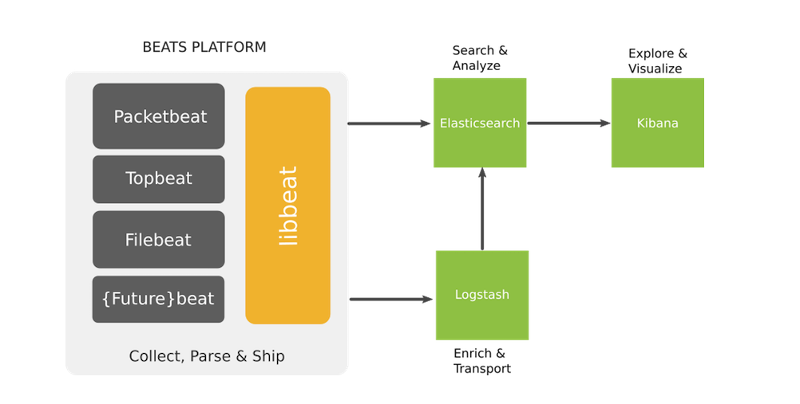
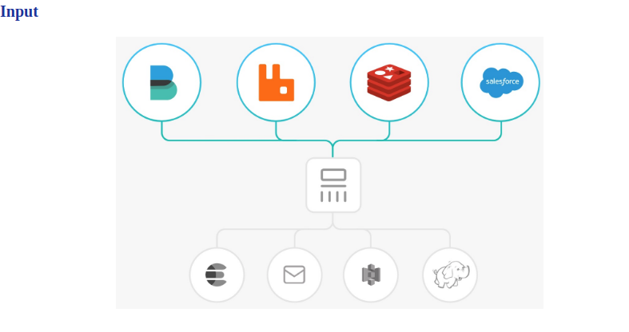
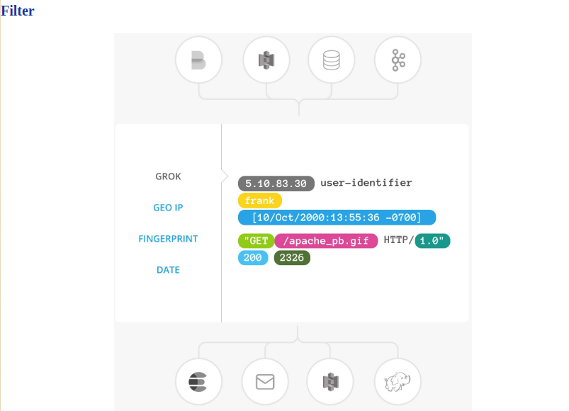
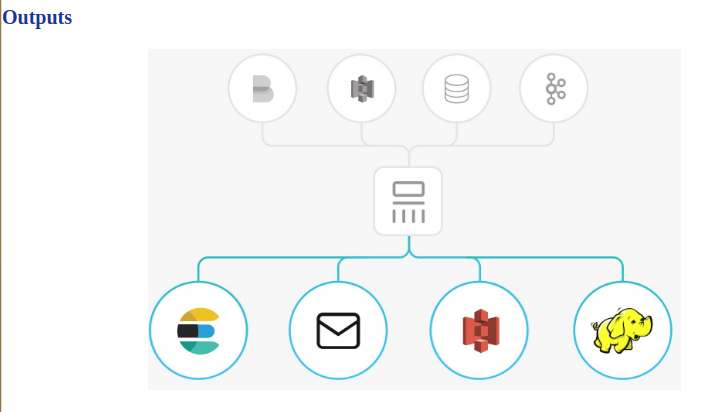

# Tìm hiểu filebeat và Logstach

## Mục lục

[1. Beats là gì? ](#1)

[2. Filebeat làm việc như thế nào ](#2)

[3. Logstash là gì? ](#3)

[4. Logstash hoạt động như thế nào ](#4)
- [4.1 Input](#4.1)
- [4.2 Filter](#4.2)
- [4.3 Output](#4.3)

---
## <a name="1">1. Beats là gì?</a>

Beats là những data shipper mã nguồn mở mà ta sẽ cài đặt như các agent trên các server mà chúng ta cần thu thập các sự kiện để gửi các kiểu dữ liệu khác nhau tới Elasticsearch. Beats có thể gửi dữ liệu trực tiếp tới Elasticsearch hay tới Logstash.

Beats là một platform trong đó có các project nhỏ sinh ra thực hiện trên từng loại dữ liệu nhất định.

ELK cần sử dụng các “beat” để làm shipper giúp gửi các loại dữ liệu từ client tới Server.

Các beat index pattern cần được cài đặt trên cả ELK server và các client. Trên ELK server, các beat sẽ kết hợp với các thành phần để lọc dữ liệu, đánh chỉ mục, hiển thị.

Một số beats pattern thường được dùng là:
- Packetbeat : Thực hiện gửi dữ liệu được capture từ các port về server.
- Topbeat : Như là một monitor agent, giúp chúng ta có thể thu thập các thông tin về phần cứng như là : CPU, RAM,…
- Filebeat : Giúp vận chuyển các log từ client về server.
- Winlogbeat : Giúp vận chuyển event log từ các client là máy OS Windows.
- Metricbeat : Thu thập các dữ liệu từ hệ điều hành, các dịch vụ như : Apache, HAProxy, MongoDB, Nginx,….

Mô hình beats platform:

Trong các beats pattern được kể ở trên thì filebeat thường được ưu tiên sử dụng tuy nhiên filebeat vẫn còn một số hạn chế cần lưu ý khi sử dụng như:
- Khó khăn đối với người mới sử dụng cú pháp YAML.
- Nếu cấu hình quá nhiều file log cần đẩy về thì File filebeat registry sẽ phình to rất nhanh do cần dung lượng để lưu trữ từng trạng thái của từng dòng log(dòng log đã được gửi đi hay chưa).
- Không nên cấu hình filebeat quét các filelog nhỏ hơn 1s bởi vì điều anfy sẽ khiến cho filebeat chiếm CPU một lượng đáng kể.
Sau đây chúng ta sẽ cùng đi xem filebeat làm việc như thế nào?

## <a name="2">2. Filebeat làm việc như thế nào</a>

Khi khởi động filebeat, nó sẽ khởi chạy một hay nhiều prospector, sẽ tìm kiếm các đường dẫn của tập tin tin mà ta đã khai báo. Với mỗi môt tập tin log mà prospector tìm thấy được, Filebeat sẽ khởi chạy một harvester. Mỗi một harvester đọc một tập tin log, và gửi các bản tin log này khi có dữ liệu mới tới spooler. Spooler là nơi tổng hợp các sự kiện và gửi dữ liệu đã tổng hợp được tới output mà ta đã cấu hình trên Filebeat.

Cấu trúc bên trong filebeat:

## <a name="3">3. Logstash là gì?</a>

Logstash là một công cụ mã nguồn mở thu thập dữ liệu có khả năng liên hợp theo thời gian thực. Logstash có thể hợp nhất dữ liệu từ các nguồn khác nhau và chuẩn hóa dữ liệu ở phần xử lý tiếp theo. Loại bỏ và đồng hóa tất cả dữ liệu đó trong một số use case cần phân tích và thể hiện trên biểu đồ.

Logstash có 3 thành phần chính cũng chính là 3 bước xử lý chính của logstash đó là:

- INPUT: Nó có thể lấy đầu vào từ TCP/UDP, các file, từ syslog, Microsoft Windows EventLogs, STDIN và từ nhiều nguồn khác. Chúng ta có thể lấy log từ các ứng dụng trên môi trường của chúng ta rồi đẩy chúng tới Logstash.
- FILTER: Khi những log này tới Server Logstash, có một số lượng lớn các bộ lọc mà cho phép ta có thể chỉnh sửa và chuyển đổi những event này. Ta có thể lấy ra các thông tin mà ta cần từ những event log.
- OUTPUT: Khi xuất dữ liệu ra, Logstash hỗ trợ rất nhiều các đích tới bao gồm TCP/UDP, email, các file, HTTP, Nagios và số lượng lớn các dịch vụ mạng. Ta có thể tích hợp Logstash với các công cụ tính toán số liệu (metric), các công cụ cảnh báo, các dạng biểu đồ, các công nghệ lưu trữ hay ta có thể xây dựng một công cụ trong môi trường làm việc của chúng ta.

## <a name="4">4. Logstash hoạt động như thế nào</a>

Đường ống xử lý sự kiện của Logstash có ba giai đoạn: input → filter → output. Các đầu vào tạo ra các sự kiện, bộ lọc sửa đổi chúng và các đầu ra sẽ chuyển chúng tới nơi khác. Đầu vào và đầu ra hỗ trợ codec cho phép bạn mã hóa hoặc giải mã dữ liệu khi nó vào hoặc thoát khỏi đường dẫn mà không phải sử dụng bộ lọc riêng biệt.

### <a name="4.1">4.1 Input</a>

Chúng ta sử dụng Input để lấy dữ liệu vào Logstash. Một số đầu vào thường được sử dụng là :
- File : đọc từ một tệp trên hệ thống, giống như lệnh UNIX tail -0F
- Syslog : nghe trên cổng 514 nổi tiếng cho các thông báo nhật ký hệ thống và phân tích cú pháp theo định dạng RFC3164.
- Redis : đọc từ máy chủ redis, sử dụng cả kênh redis và danh sách redis. Redis thường được sử dụng như một “broker” trong một mô hình Logstash tập trung, có hàng đợi các sự kiện Logstash từ các “shippers” từ xa.
- Beats : xử lý các sự kiện do beats gửi.

### <a name="4.2">4.2 Filter</a>

Filter là thiết bị xử lý trung gian trong đường dẫn Logstash. Chúng ta có thể kết hợp các bộ lọc với các điều kiện để thực hiện một hành động trên một sự kiện nếu nó đáp ứng các tiêu chí nhất định. Một số bộ lọc hữu ích bao gồm :
- Grok : phân tích cú pháp và cấu trúc văn bản tùy ý - chỉnh sửa định dạng log từ client gửi về. Grok hiện là cách tốt nhất trong Logstash để phân tích cú pháp dữ liệu nhật ký không được cấu trúc thành một thứ có cấu trúc và có thể truy vấn được. Với 120 mẫu được tích hợp sẵn trong Logstash, nhiều khả năng chúng ta sẽ tìm thấy một mẫu đáp ứng nhu cầu của mình.
- Mutate : thực hiện các phép biến đổi chung trên các trường sự kiện. Bạn có thể đổi tên, xóa, thay thế và sửa đổi các trường trong sự kiện của mình.
- Drop : xóa hoàn toàn sự kiện, ví dụ: debug events.
- Clone : tạo bản sao của sự kiện, có thể thêm hoặc xóa các trường.
- Geoip : thêm thông tin về vị trí địa lý của địa chỉ IP (cũng hiển thị biểu đồ tuyệt vời trong Kibana).

### <a name="4.3">4.3 Output</a>

Các đầu ra là pha cuối cùng của đường ống Logstash. Một sự kiện có thể đi qua nhiều đầu ra, nhưng một khi tất cả xử lý đầu ra đã hoàn tất, sự kiện đã hoàn tất việc thực thi của nó. Một số đầu ra thường được sử dụng bao gồm :
- Elasticsearch : gửi dữ liệu sự kiện tới Elasticsearch. Nếu chúng ta đang có kế hoạch để lưu dữ liệu trong một định dạng hiệu quả, thuận tiện, và dễ dàng truy vấn … Elasticsearch là con đường để đi.
- File : ghi dữ liệu sự kiện vào file trên bộ nhớ.
Graphite : gửi dữ liệu sự kiện tới graphite, một công cụ nguồn mở phổ biến để lưu trữ và vẽ đồ thị số liệu.
- Statsd : gửi dữ liệu sự kiện đến statsd, một dịch vụ lắng nghe và thống kê.
