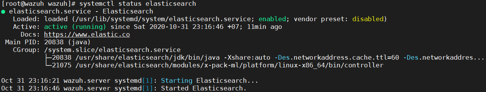

## Cài đặt elasticsearch
Thêm repo elasticsearch
```
rpm --import https://artifacts.elastic.co/GPG-KEY-elasticsearch
cat > /etc/yum.repos.d/elastic.repo << EOF
[elasticsearch-7.x]
name=Elasticsearch repository for 7.x packages
baseurl=https://artifacts.elastic.co/packages/7.x/yum
gpgcheck=1
gpgkey=https://artifacts.elastic.co/GPG-KEY-elasticsearch
enabled=1
autorefresh=1
type=rpm-md
EOF
```

Cài đặt elasticsearch
```
yum install elasticsearch-7.9.2 -y
```

Chỉnh sửa file cấu hình elasticsearch bằng câu lệnh `vim /etc/elasticsearch/elasticsearch.yml`. Tìm và chỉnh sửa các thông số sau đây
```
network.host: 192.168.112.10
node.name: node-1
cluster.initial_master_nodes: ["node-1"]
```

Bật và cho elasticsearch khởi động cùng hệ thống
```
systemctl daemon-reload
systemctl enable elasticsearch.service
systemctl start elasticsearch.service
```
Kiểm tra trạng thái của elasticsearch
```
systemctl status elasticsearch
```


Kiểm tra filebeat có kết nối được đến elasticseach không
```
filebeat setup --index-management -E setup.template.json.enabled=false
``` 


Kiểm tra hoạt động của elasticsearch
```
curl http://192.168.112.10:9200
```


## Caì đặt kibana
```
yum install kibana-7.9.2 -y
```
Phân quyền thư mục optimse và plugin. Đây là 2 thư mục để thêm wazuh
```
chown -R kibana:kibana /usr/share/kibana/optimize
chown -R kibana:kibana /usr/share/kibana/plugins
``` 

Cài đặt wazuh api app cho kibana plugin
```
cd /usr/share/kibana/
sudo -u kibana bin/kibana-plugin install https://packages.wazuh.com/wazuhapp/wazuhapp-3.13.2_7.9.2.zip
```
Cấu hình kibana bằng câu lệnh `vim /etc/kibana/kibana.yml`. Tìm và chỉnh sửa các thông sô sau
```
server.port: 5601
server.host: "192.168.112.10"
elasticsearch.hosts: ["http://192.168.112.10:9200"]
```

Tăng kích thước  heap size của Kibana để đảm bảo cài đặt các plugin của Kibana:
```
cat >> /etc/default/kibana << EOF
NODE_OPTIONS="--max_old_space_size=2048"
EOF
```

Khởi động và đặt cho kibana khởi động cùng hệ thống
```
systemctl daemon-reload
systemctl enable kibana.service
systemctl start kibana.service
```

Kiểm tra trang thái hoạt động của kibana
```
systemctl status kibana
```


## Cài đặt logstash
Cài đặt java cho máy 
```
yum install java-1.8.0-openjdk -y
```

Thêm repo cho logstash
```
rpm --import https://packages.elastic.co/GPG-KEY-elasticsearch
cat > /etc/yum.repos.d/elastic.repo << EOF
[elasticsearch-7.x]
name=Elasticsearch repository for 7.x packages
baseurl=https://artifacts.elastic.co/packages/7.x/yum
gpgcheck=1
gpgkey=https://artifacts.elastic.co/GPG-KEY-elasticsearch
enabled=1
autorefresh=1
type=rpm-md
EOF
```

## Cài đặt wazuh

Thêm repo wazuh
```
rpm --import https://packages.wazuh.com/key/GPG-KEY-WAZUH
cat > /etc/yum.repos.d/wazuh.repo <<\EOF
[wazuh_repo]
gpgcheck=1
gpgkey=https://packages.wazuh.com/key/GPG-KEY-WAZUH
enabled=1
name=Wazuh repository
baseurl=https://packages.wazuh.com/3.x/yum/
protect=1
EOF
```

Tiến hành cài đặt logstash
```
yum install logstash-7.9.2
systemctl daemon-reload
systemctl enable logstash
```
Tiến hành download file cấu hình wazuh cho logstash
```
curl -so /etc/logstash/conf.d/01-wazuh.conf https://raw.githubusercontent.com/wazuh/wazuh/v3.13.2/extensions/logstash/7.x/01-wazuh-remote.conf
```
Restart logstash
```
systemctl restart logstash
```
Cấu hình filebeat để dẫn log tới logstash trong file `vim /etc/filebeat/filebeat.ylm`

```
output.logstash:
        hosts: ["192.168.112.10:5044"]
        bulk_max_size: 1024
```

Kiểm tra kết quả bằng các lệnh sau
```
filebeat setup
filebeat test output
```
Nếu hiển thị kết quả dưới đây thì filebeat đã gửi log về logstash thành công


## Cài đặt wazuh

```
yum install wazuh-manager -y
``` 

Kiểm tra trạng thái
```
systemctl status wazuh-manager
```

 

Cài đặt wazuh API

cài đặt repo nodejs
```
curl --silent --location https://rpm.nodesource.com/setup_10.x | bash -
```

Cài đặt nodeJs 
```
yum install nodejs -y
```

Cài đặt wazuh api
```
yum install wazuh-api -y
```

Kiểm tra wazuh api 
```
systemctl status wazuh-api
``` 
 


## Cài đặt filebeat
Thêm repo filebeat
```
rpm --import https://packages.elastic.co/GPG-KEY-elasticsearch
cat > /etc/yum.repos.d/elastic.repo << EOF
[elasticsearch-7.x]
name=Elasticsearch repository for 7.x packages
baseurl=https://artifacts.elastic.co/packages/7.x/yum
gpgcheck=1
gpgkey=https://artifacts.elastic.co/GPG-KEY-elasticsearch
enabled=1
autorefresh=1
type=rpm-md
EOF
```

Cài đặt filebeat
```
yum install filebeat-7.9.2 -y
```
Cấu hình filebeat bằng câu lệnh sau `vim /etc/filebeat/filebeat.yml`

Tìm và chỉnh sửa file cấu hình theo các thông số sau.

Nếu bạn muốn gửi log đến logstash thì cấu hình như sau
```
    setup.kibana:
        hosts:"192.168.112.10:5601"
    output.logstash:
        hosts: ["192.168.112.10:5044"]
        bulk_max_size: 1024
```

trong filebeat có rất nhiều modules bạn  muốn bật hay tắt các modules thì vào trong đường dẫn `/etc/filebeat/modules.d`


Tải và cấu hình tempate alert cho elasticsearch
```
curl -so /etc/filebeat/wazuh-template.json https://raw.githubusercontent.com/wazuh/wazuh/v3.13.2/extensions/elasticsearch/7.x/wazuh-template.json
chmod go+r /etc/filebeat/wazuh-template.json
``` 
Tải module wazuh cho filebeat 
```
curl -s https://packages.wazuh.com/3.x/filebeat/wazuh-filebeat-0.1.tar.gz | sudo tar -xvz -C /usr/share/filebeat/module
```

Cấu hình thông số filebeat sử dụng lệnh `vim /etc/filebeat/filebeat.yml`
Tìm và thay thế  dòng 
```
output.elasticsearch.hosts: ['http://YOUR_ELASTIC_SERVER_IP:9200']
```
Thay thế `YOUR_ELASTIC_SERVER_IP` bằng ip của máy elasticsearch


Bật và cho filebeat khởi động cùng hệ thống
```
systemctl daemon-reload
systemctl enable filebeat.service
systemctl start filebeat.service
```

Kiểm tra trạng thái của filebeat
```
systemctl status filebeat
```


Nếu có lỗi không gửi log lên logstash thì kiểm tra modules filebeat trên logstash.

Truy cấp vào thư mục `cd /etc/logstash/conf.d`

Kiểm tra xem có modules không nếu không có thì tiến hành thêm file `filebeat.conf` với nội dung sau.

```
input {
  beats {
    port => 5044
  }
}

output {
  elasticsearch {
    hosts => ["http://192.168.112.10:9200"]
    index =>  "%{[@metadata][beat]}-%{[@metadata][version]}"
  }
}

```

Nếu wazuh bị lỗi thì thêm file `01-wazuh.conf` như sau.
```
# Wazuh - Logstash configuration file
## Remote Wazuh Manager - Filebeat input
input {
    beats {
        port => 5000
        codec => "json_lines"
    }
}

output {
    elasticsearch {
        hosts => ["192.168.112.10:9200"]
        index => "wazuh-alerts-3.x-%{+YYYY.MM.dd}"
    }
}
```
Khởi động lại logstash và filebeat rồi kiểm tra kết quả


Truy cập vào brower và nhập địa chỉ ip của máy ELK `192.168.112.10:5601`


Truy cập vào mục sau để vào wazuh app


Vậy là chúng ta đã cái đặt xong wazuh trên elk stack.

Chúc các bạn thành công