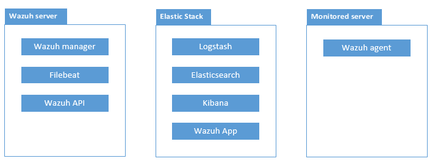
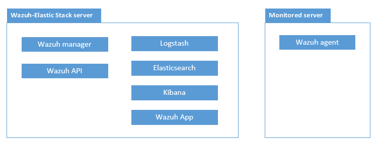
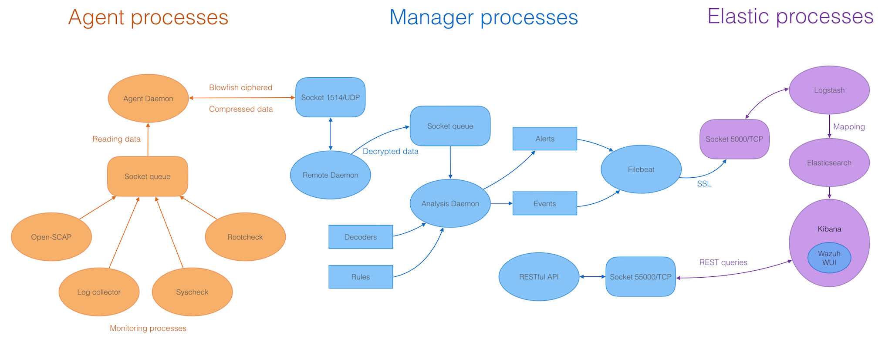

## 1. Kiến trúc của Wazuh

Mô hình kiến trúc của Wazuh được chia thành 2 dạng : 

 - Multi-node deployment
 - Single node deployment
 
### Multi-node deployment

Khi Wazuh server và Elasticsearch cluster chạy trên các host khác nhau, Filebeat được dùng để truyền một cách an toàn các cảnh báo, archived event tới Elasticsarch server sử dụng TLS.
Chú ý rằng multi-node cluster sẽ là multiple Elastic stack sererver.



### Single-node deployment

Wazuh và Elastic stack chạy với 1 single-node Elasticsearch cluster (số lượng agent < 50), có thể triển khai trên một single server. Ở triển khai này, Logstash sẽ đọc các cảnh báo, event từ Wazuh trực tiếp từ local file system và đẩy chúng tới local Elasticsearch instance.



## 2. Phương thức liên lạc và luồng dữ liệu



### 2.1. Agent-server communication

Wazuh agent sử dụng OESSEC message protocol để gửi các event thu thập được tới Wazhu server thông qua port 1514 (UDP hoặc TCP). Wazuh server giải mã và thực hiện rule-check với các event nhận được với công cụ phân tích. Các event ứng với các rule được bổ sung dữ liệu cảnh báo như rule-id và rule-name. Các event có thể được đẩy tới 1 hoặc cả 2 file sau, dựa vào việc có được event có tương ứng với rule hay không :

 - File `/var/ossec/logs/archives/archives.json` chứa tất cả các event dù có tương ứng với rule hay không.
 - File `/var/ossec/logs/alerts/alerts.json` chỉ chứa các event tương ứng với rule đã đặt ra.

OSSEC message protocol dùng 1 mã hóa 192-bit Blowfish với full 16-round implemetation.

### 2.2. Wazuh-elastic communication

Trên mô hình triển khai diện rộng, Wazuh server sử dụng Filebeat để chuyển dữ liệu về cảnh báo và event tới Logstash (5000/TCP) trên Elastic Stack server, sử dụng TLS. Với kiến trúc single-host, Logstash đọc trực tiếp từ local file system mà không cần dùng Filebeat.

Logstash định hình incoming data, và có thể là GeoIP, trước gửi tới Elasticsearch (port 9200/TCP). Một khi dữ liệu được index tới Elasticsearch, Kibana (port 5601/TCP) được dùng để khai thác và hiển thị thông tin.

Wazuh App chạy bên trong Kibana liên tục truy vấn tới RESTful API (port 55000/TCP trên Wazuh manager) để hiển thị cấu hình và thông tin trạng thái liên quan của server và agent, cũng như restart agent theo yêu cầu. Liên lạc này được mã hóa với TLS và được xác thực với username và password.

## 3. Lưu trữ dữ liệu

Các event về alert và non-alert được lưu trữ cùng nhau trong file trên Wazuh server và sau để gửi tới Elasticsearch. Các file này được viết với dạng JSON hoặc với plain text format. Các file này được nén hàng ngày và được đánh dấu với MD5 và SHA1 checksums. Cấu trúc thư mục và tên file như sau :
```sh
root@wazuh-server:/var/ossec/logs/archives/2017/Jan# ls -l
total 176
-rw-r----- 1 ossec ossec 234350 Jan  2 00:00 ossec-archive-01.json.gz
-rw-r----- 1 ossec ossec    350 Jan  2 00:00 ossec-archive-01.json.sum
-rw-r----- 1 ossec ossec 176221 Jan  2 00:00 ossec-archive-01.log.gz
-rw-r----- 1 ossec ossec    346 Jan  2 00:00 ossec-archive-01.log.sum
-rw-r----- 1 ossec ossec 224320 Jan  2 00:00 ossec-archive-02.json.gz
-rw-r----- 1 ossec ossec    350 Jan  2 00:00 ossec-archive-02.json.sum
-rw-r----- 1 ossec ossec 151642 Jan  2 00:00 ossec-archive-02.log.gz
-rw-r----- 1 ossec ossec    346 Jan  2 00:00 ossec-archive-02.log.sum
-rw-r----- 1 ossec ossec 315251 Jan  2 00:00 ossec-archive-03.json.gz
-rw-r----- 1 ossec ossec    350 Jan  2 00:00 ossec-archive-03.json.sum
-rw-r----- 1 ossec ossec 156296 Jan  2 00:00 ossec-archive-03.log.gz
-rw-r----- 1 ossec ossec    346 Jan  2 00:00 ossec-archive-03.log.sum
```

Việc Rotation và backup các file nén được khuyến khích, tùy theo khả năng lưu trữ của Wazuh Manger server. Sử dụng `cron` job để rà soát các file nén.

Ngoài ra, bạn có thể lựa chọn việc bỏ qua việc lưu trữ các file nén, và sử dụng Elasticsearch cho các tài liệu lưu trữ, đặc biệt nếu bạn chạy Elasticsearch snapshot backup hoặc multi-node Elasticsearch cluster cho shard replica. Bạn có thể sử dụng `cron` job để di chuyển các index đã được snapshot tới một server lưu trữ và đánh dấu chúng với MD5 và SHA1.