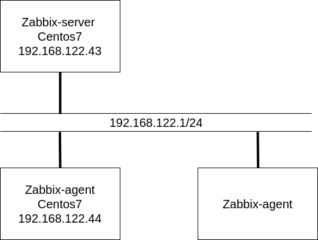
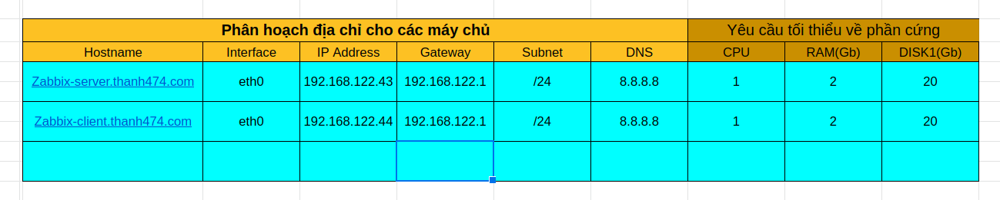
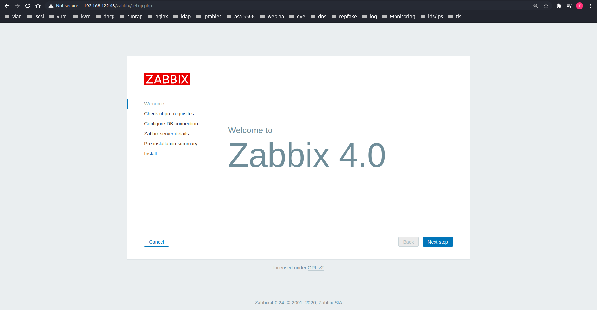
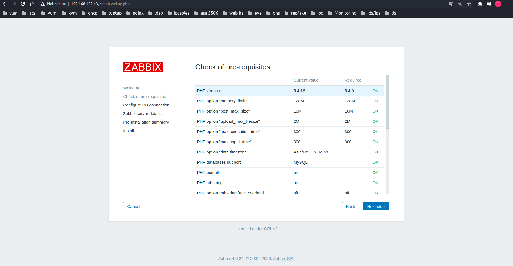
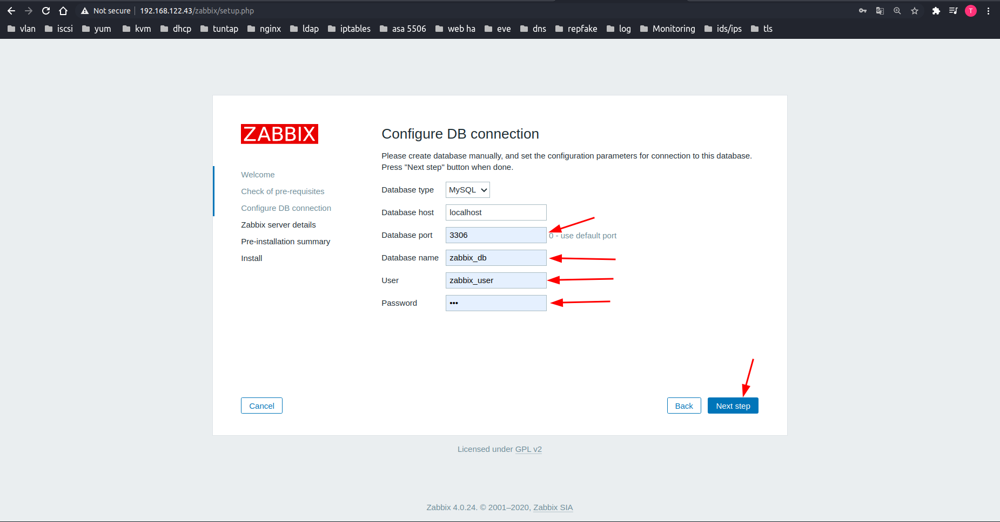
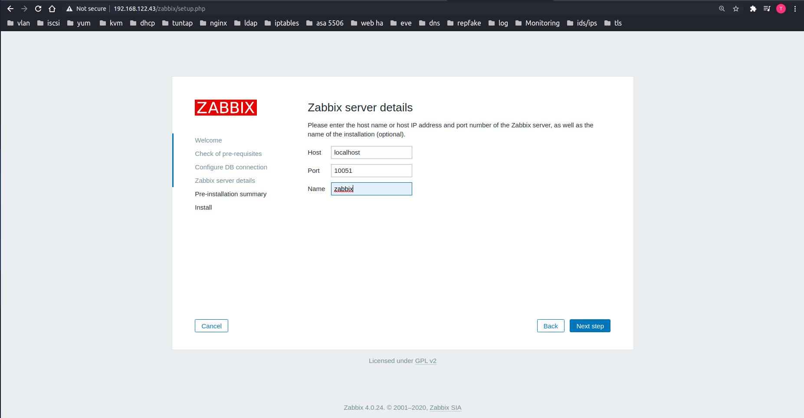
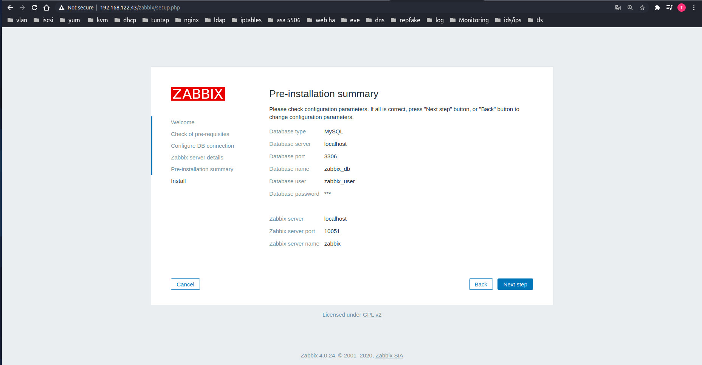
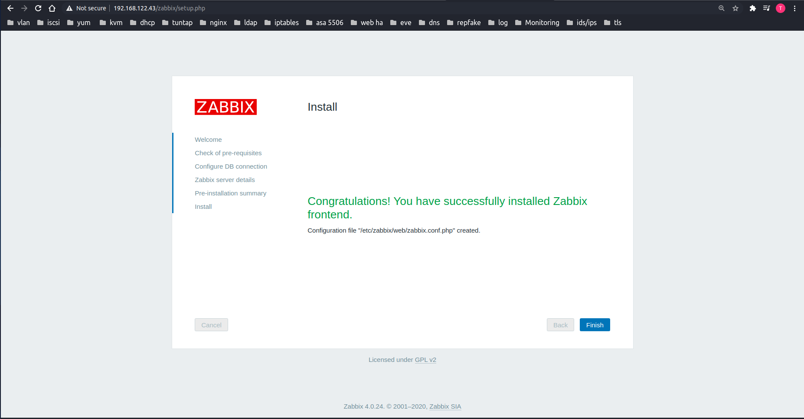
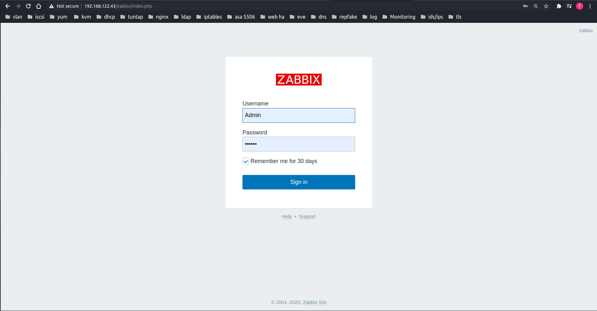
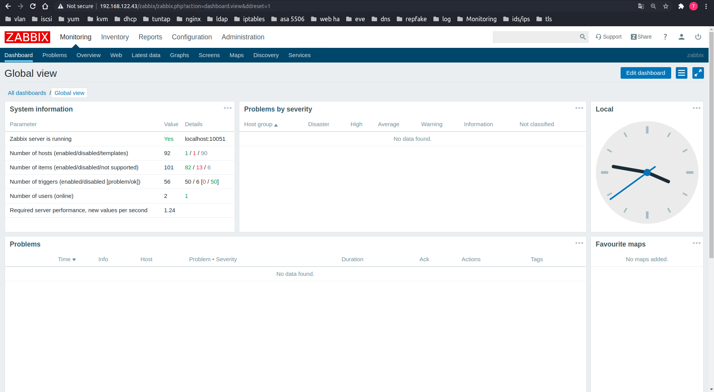

# Hướng dẫn cài đặt Zabbix 4.0 LTS trên CentOS 7

Zabbix là một giải pháp monitor các thiết bị mạng, mã nguồn mở, có nhiều tính năng đặc biệt và khả năng tùy biến cao. Zabbix có thể theo dõi các thông số về mạng và tình trạng của server, trạng thái của các thiết bị mạng, hỗ trợ các cách thức cảnh báo có độ tùy biến cao qua email, sms, telegram, slack. Chỉ cần cài đặt agent trên máy chủ Linux và Windows để theo dõi số liệu thống kê như tải CPU, sử dụng mạng, disk…Các thức cài đặt triển khai dễ dàng. 

# Mục lục
[1. Mô hình triển khai](#1)

[2. IP Planning](#2)

[3. Thiết lập ban đầu](#3)

[4. Các bước cài đặt](#4)

---

<a name="1"></a>
## 1. Mô hình triển khai
Mô hình triển khai một node zabbix-server, một hoặc nhiều các host zabbix client.



<a name="2"></a>
## 2. IP Planning


Lưu ý: Bạn có thể tùy chỉnh cấu hình theo số lượng host bạn muốn giám sát.

<a name="3"></a>
## 3. Thiết lập ban đầu

Cài đặt chuẩn bị server ban đầu bao gồm các thao tác: Đặt địa chỉ IP tĩnh cho server, đặt host-name, thiết lập firewalld, selinux.

Ở màn command line của server bạn thực hiện các câu lệnh dưới.

Cấu hình địa chỉ ip tĩnh cho zabbix server

```
nmcli con modify ens160 ipv4.addresses 10.10.10.115/24
nmcli con modify ens160 ipv4.gateway 10.10.10.1
nmcli con modify ens160 ipv4.dns 8.8.8.8
nmcli con modify ens160 ipv4.method manual
nmcli con modify ens160 connection.autoconnect yes
```

Tắt firewalld và selinux.
```

sudo systemctl disable firewalld
sudo systemctl stop firewalld


hostnamectl set-hostname zabbix

sed -i 's/SELINUX=enforcing/SELINUX=disabled/g' /etc/sysconfig/selinux
sed -i 's/SELINUX=enforcing/SELINUX=disabled/g' /etc/selinux/config
```

Update các gói cài đặt

```
yum install epel-release -y
yum update -y
```

Restart lại server để cập nhật cấu hình mới.
```
init 6
```


<a name="4"></a>

## 4. Các bước cài đặt

**Bước 1**: Download repo zabbix và cài đặt một số package: zabbix-server, mariadb, php, http
```
rpm -ivh https://repo.zabbix.com/zabbix/4.0/rhel/7/x86_64/zabbix-release-4.0-1.el7.noarch.rpm
yum -y install zabbix-server-mysql zabbix-web-mysql mysql mariadb-server httpd php
```
**Bước 2**: Create Database
Start service mariadb và tự động start khi khởi động lại server.
```
systemctl start mariadb
systemctl enable mariadb
```
Thiết lập password root cho mysql
```
[root@zabbix ~]# mysql_secure_installation

NOTE: RUNNING ALL PARTS OF THIS SCRIPT IS RECOMMENDED FOR ALL MariaDB
      SERVERS IN PRODUCTION USE!  PLEASE READ EACH STEP CAREFULLY!

In order to log into MariaDB to secure it, we'll need the current
password for the root user.  If you've just installed MariaDB, and
you haven't set the root password yet, the password will be blank,
so you should just press enter here.

Enter current password for root (enter for none):
OK, successfully used password, moving on...

Setting the root password ensures that nobody can log into the MariaDB
root user without the proper authorisation.

Set root password? [Y/n] Y
New password:
Re-enter new password:
Password updated successfully!
Reloading privilege tables..
 ... Success!
```

Tạo một database cho zabbix
```
Login database mysql

[root@zabbix ~]# mysql -u root -p
Enter password:
Welcome to the MariaDB monitor.  Commands end with ; or \g.
Your MariaDB connection id is 11
Server version: 5.5.60-MariaDB MariaDB Server

Copyright (c) 2000, 2018, Oracle, MariaDB Corporation Ab and others.
Type 'help;' or '\h' for help. Type '\c' to clear the current input statement.

Tạo database có tên zabbix_db cho zabbix server
MariaDB [(none)]> create database zabbix_db character set utf8 collate utf8_bin;
Query OK, 1 row affected (0.00 sec)


Gán quyền cho user zabbix_user với mật khẩu là password cho database zabbix_db.
MariaDB [(none)]> grant all privileges on zabbix_db.* to zabbix_user@localhost identified by 'password';
Query OK, 0 rows affected (0.00 sec)

Áp dụng thay đổi và thoát khỏi mysql.
MariaDB [(none)]> flush privileges;
Query OK, 0 rows affected (0.00 sec)

MariaDB [(none)]> exit;
Bye
[root@zabbix ~]#
```

**Bước 3**: Import database zabbix
```
cd /usr/share/doc/zabbix-server-mysql-4.0.3
gunzip create.sql.gz
mysql -u root -p zabbix_db < create.sql
```
**Bước 4**: Config Database
```
sed -i 's/# DBHost=localhost/DBHost=localhost/g' /etc/zabbix/zabbix_server.conf
sed -i "s/DBName=zabbix/DBName=zabbix_db/g" /etc/zabbix/zabbix_server.conf
sed -i "s/DBUser=zabbix/DBUser=zabbix_user/g" /etc/zabbix/zabbix_server.conf
sed -i "s/# DBPassword=/DBPassword=password/g" /etc/zabbix/zabbix_server.conf
```
**Bước 5**: Configure PHP Setting
```
sed -i 's/max_execution_time = 30/max_execution_time = 600/g' /etc/php.ini
sed -i 's/max_input_time = 60/max_input_time = 600/g' /etc/php.ini
sed -i 's/memory_limit = 128M/memory_limit = 256M/g' /etc/php.ini
sed -i 's/post_max_size = 8M/post_max_size = 32M/g' /etc/php.ini
sed -i 's/upload_max_filesize = 2M/upload_max_filesize = 16M/g' /etc/php.ini
echo "date.timezone = Asia/Ho_Chi_Minh" >> /etc/php.ini
```
**Bước 6**: Restart service zabbix-server, http, mariadb
```
systemctl start zabbix-server
systemctl enable zabbix-server
systemctl start httpd
systemctl enable httpd
systemctl restart zabbix-server
systemctl restart httpd
systemctl restart mariadb
```

**Bước 7**: Cấu hình web dashboard zabbix

Vào trình duyệt web nhập: **http://ipserver/zabbix**

Do địa chỉ server của tôi ở đây là 192.168.122.43 nên tôi sẽ nhập link sau vào trình duyệt.

http://192.168.122.43/zabbix

Giao diện cài đặt ban đầu zabbix. Click Next step



Kiểm tra các thông số config php. Click Next step



Nhập thông số về database zabbix đã thiết lập ở **bước 2**



Zabbix server details



Pre-installation summary: Kiểm tra lại các thông tin và chọn next.



Kết thúc cài đặt. Click Finish




**Bước 8**: Login dashboard zabbix server
Truy cập địa chỉ trên trình duyệt: http://ip_zabbix_server

Sử dụng tài khoản default để login zabbix server Admin\zabbix



Login thành công.



Hy vọng những hướng dẫn trên giúp bạn triển khai zabbix server thành công!

