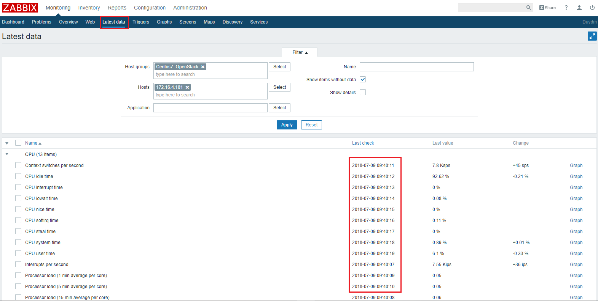
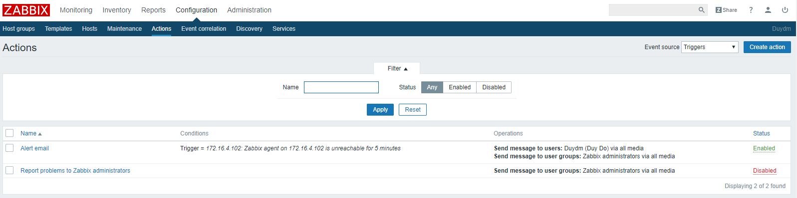
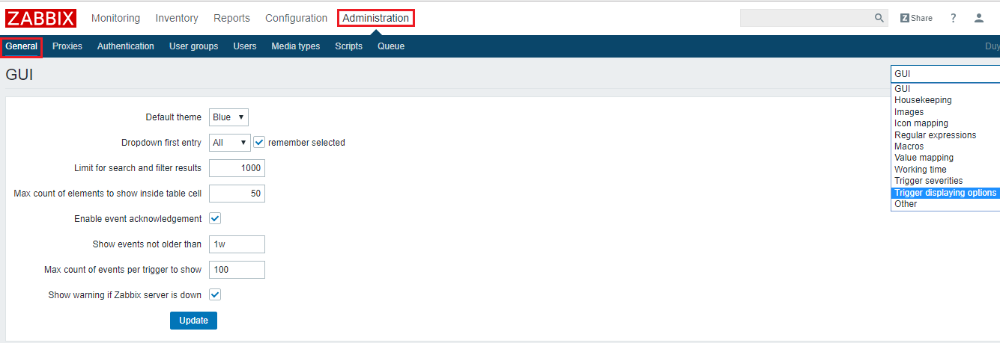
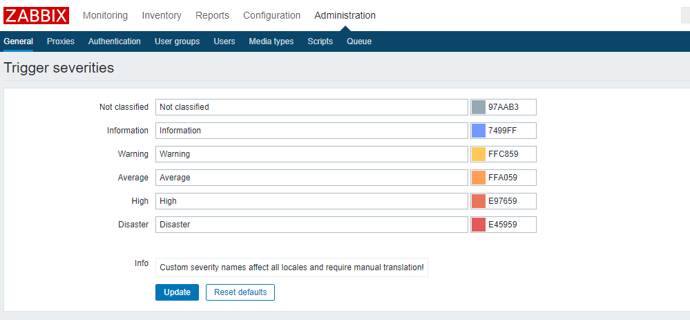
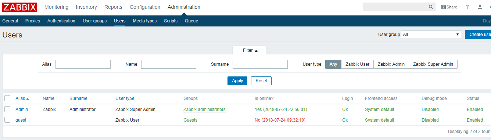

# Hướng dẫn thao tác trên Dashboard zabbix

Đây là giao diện tổng quan khi cài đặt zabbix thành công. Gồm nhiều mục lớn như Monitoring, Inventory, Reports, Configuration, Administrator. Trong các tab lớn sẽ bao gồm nhiều task thành phần nhỏ hơn.

## <a name="1"> 1. Tab Monitoring </a>

### <a name="1.1"> 1.1. Dashboard </a>

**Dashboard**: Là giao diện hiển thị các dashboard trực quan để người quản trị nhìn trực tiếp, người quản trị có thể tạo ra rất nhiều các dashboard khác nhau, nhưng tại một tab screen chỉ có thể xem được 1 dashboard bất kỳ nào đó.

Từ Dashboard có thể nhanh chống liên kết đến các thành phần như Graphs, Screens, Map bằng cách thêm các thành phần mong muốn vào mục Favourite graphs, Favourite Screen và Favourite map.

Gồm nhiều phần hiển thị nhỏ hơn:

+ Status of Zabbix

    Bảng này hiển thị trạng thái của zabbix server, số lượng các host, trigger, item, số người đang đăng nhập và trạng thái của các thông số trên ở 2 cột value và Details

    
+ System status: Hiển thị mức độ cảnh báo của từ host trong từng group

    

+ Problems: Tất cả các vấn đề xảy ra với các host trong các group thống kê theo thời gian.

    

    Các bảng để hiển thị sẵn graphs, screens, maps

    

    Có thể tùy chỉnh add thêm những gì muốn hiển thị theo ý muốn tương ứng với từng mục.

    Đối với mỗi bảng có thể tùy chỉnh thờ gian interval để update lại data

    Click vào dấu ... nhỏ để cấu hình như ở dưới

    

### <a name="1.2"> 1.2. Problems</a>
Problems: Hiển thị các vấn đề đối với từng device mà zabbix server thu thập dữ liệu về. Hỗ trợ cơ chế lọc theo ý người quản trị.

Có thể lọc theo các tiêu chí sau và có thể export ra file csv để lưu trữ lại.

Show: Recent problems (Hiển thị vấn đề hiện tại đang gặp phải), Problems (Hiển thị các vấn đề đã gặp phải), History (Lịch sử các vấn đề đã gặp phải)

Host group, Host, Application, Trigger, Problem, Host inventory, Tags, Show hosts in maintenance... là các lựa chọn để lọc thông tin, có thể lọc theo một tiêu chí hoặc kết hợp nhiều tiêu chí.
 
### <a name="1.3"> 1.3. Overview</a>

Overview: Là sự tổng hợp thông tin về data zabbix zerver thu thập được, có thể lọc them group -> host -> Kiểu data.

### <a name="1.4"> 1.4. Latest data</a>

Latest data: Dữ liệu mới nhất mà zabbix server thu thập được.

### <a name="1.5"> 1.5. Triggers</a>

Triggers: Là một điều kiện khi thỏa mãn điều kiện của Triggers mà người lập trình đặt ra thì sẽ thực hiện một hành động nào đó tiếp theo.

### <a name="1.6"> 1.6. Graphs</a>

Graphs:  Là các thông tin dữ liệu được biểu diễn dưới dạng biểu đồ theo thời gian thực ví dụ như trafiic qua interface của thiết bị, thông tin về tình trạng CPU, RAM, ổ cứng… Các thông tin này được định nghĩa trong các templates.

Hỗ trợ lọc theo group -> host -> Dạng graph

Tại một thời điểm chỉu xem được 1 thông số dạng graph của 1 server. Cung cấp cái nhìn đơn lẻ về một đối tượng nhất định cần giám sát

### <a name="1.7"> 1.7. Screen</a>

Screen: Là tập hợp các thông tin như Graphs, maps,data overview… vào chung một màn hình giám sát. Giúp người quản trị có thể lựa chọn các thông tin cần thiết hiển thị, giúp có cái nhìn tổng quát những thông tin mà người quản trọ mong muốn.

 ### <a name="1.8"> 1.8. Maps</a>

Maps: Là thành phân cung cấp khả năng giám sát hệ thống dưới hình thức mô hình mạng. Giúp người quản trị có cái nhìn tổng quan về hệ thống sống mạng dưới dạng sơ đồ, trong trường hợp có sự cố sẽ giúp người quản trị đánh giá tầm ảnh hưởng của thiết bị gặp sự cố và đưa ra giải pháp phù hợp.

### <a name="1.9"> 1.9. Discovery</a>

Discovery: Tính năng cho phép zabbix server tự động tìm kiếm các thiết bị được cài đặt zabbix agent đã cấu hình kết nối về zabbix server trong cùng mạng với zabbix server.

## <a name="2"> 2. Tab Configuration </a>

### <a name="2.1">2.1.Host group</a>

Host group: Tập hợp lại các host có chung một mục đích sử dụng hoặc người quản trị tâp hợp lại để phục vụ một mục đích quản lý chung.

### <a name="2.2">2.2. Templates</a>

Templates: Đây là tập hợp các thực thể có thể áp dụng cho các Host, một Template sẽ chứa trong nó các tập lệnh để truy vấn lấy dữ liệu, hiển thị thông tin dữ liệu lấy được, thông tin tình trạng thiết bị, hiển thị và thông báo lỗi…

Trong mỗi Template, các tệp lệnh được chia thành: items, triggers, graphs, applications, screens (có từ Zabbix 2.0),low-level discovery rules (có từ Zabbix 2.0), web scenarios (có từ Zabbix 2.2). Tùy theo giám sát thiết bị, dịch vụ, ứng dụng… nào thì các thành phần này được thiết lập khác nhau.

Có thể import template tự viết vào.

### <a name="2.3">2.3. Host</a>

Host: Là một máy tính, server, vps, chạy các hệ điều hành khác nhau hoặc một thực thể trong hệ thống mạng như là máy in, máy chấm công, máy photo, máy camera có hỗ trợ các giao thức mà monitor zabbix cung cấp.

### <a name="2.4">2.4. Maintance</a>

Maintance: Có thể xác định thời gian bảo trì cho máy chủ và group trong Zabbix. Có hai loại Maintance - với thu thập dữ liệu và không thu thập dữ liệu.

Ví dụ server của bạn off trong khoảng thời gian này để nâng cấp sửa chữa, thì maintance sẽ được lựa chọn cấu hình để không thu thập data trong khoảng thời gian đó. 

### <a name="2.5">2.5. Action</a>

Action: Nơi cấu hình, lựa chọn các kiểu thông báo khi có sự kiện xảy ra bởi cấu hình trigger. Người dùng phải tự định nghĩa các action theo mục đích.

### <a name="2.6">2.6. Event correlation</a>

Cho phép cấu hình tương quan giữa các sự kiến với độ chính xác vào và tùy biến linh hoạt.

### <a name="2.7">2.7. Discovery</a>

Thiết lập range IP, nếu trong range có có thiết bị nào mà cài đặt các giao thức mà Zabbix server hỗ trợ thì sẽ tự động thu thập data về

## <a name="3">3. Tab Administrator </a>

Chức năng của của tab Administrator là để cấu hình chung cho zabbix đối với user có quyền Admin

### <a name="3.1">3.1. General</a>

Mục này cho phép người quản trị cấu hình tùy chỉnh giao diện cho Zabbix Webinterface. 

Có thể tùy chỉnh rất nhiều giao diện như :

+ GUI: Cung cấp một số tùy chỉnh mặc định liên quan đến giao diện người dùng.

+ Default theme: Chủ đề mặc định của giao diện. Thường là màu xanh da trời.

+ Dropdown first entry: Chọn nó là mục đầu tiên trong Drop down.

+ Search/Filter elements limit: Số lượng tối đa hiển thị các hàng trong tìm kiếm và lọc.

+ Max count of elements to show inside table cell: Giới hạn hiển thị trong bảng.

+ Enable event acknowledges: Cho phép các event trong Zabbix kích hoạt.

+ Show events not older than (in days): Cho phép hiển thị trạng thái Trigger bao nhiêu ngày.

+ ax count of events per trigger to show: Số event được kích hoạt tối đa trong màn hình trạng thái.

+ Show warning if Zabbix server is down: Cho phép hiển thị một thông điệp cảnh báo khi không kết nối được Zabbix Server.

+ HouseKeeping: quy định các thời gian định kì được thực hiện bởi Zabbix . Quá trình xóa thông tin hết hạn và thông tin được xóa bởi người dùng .Có thể tùy chỉnh các dữ liệu được lưu tối đa trong bao lâu trên Zabbix. Gồm các phần có thể cấu hình như Event and alerts, Services, Audit, User sessions, History, Trends.

    + Enable internal housekeeping: Lựa chọn bật hoặc tính time để xóa bỏ thông tin.

    + Trigger data storage period: Khoảng thời gian dọn dẹp các thông in về việc lưu trữ data trigger

    + Internal data storage period: Khoảng thời gian dọn dẹp Internal data storage.

    + Network discovery data storage period: Khoảng thời gian dọn dẹp discovery data storage.

+ Images: Chứa tất cả các hình ảnh, icon, background được hiển thị trong Zabbix.

+ Icon mapping: Phần này cho phép tạo biểu tượng bản đồ của một host với các biểu tượng nhất định. Các thông tin trong các tùy chọn đều phục vụ cho việc tạo bản đồ.

    + Name: Tên icon map (duy nhất).

    + Mappings: Danh sách các ánh xạ mà Icon map tham chiếu đến.

    + Inventory field: List các danh sách thiết bị tồn tại.

    + Expression: Mô tả biểu thức chính quy.

    + Icon: Icon được dùng nếu biểu thức chính quy lỗi.

    + Default: icon mặc định được dùng.

+ Regular expressions: Tạo và quy ước các biểu thức chính quy.

+ Macros: Tạo các đoạn macro tương ứng với giá trị.

+ Value mapping: Tạo các giá trị tương ức với các mức.

+ Working time: Tham số toàn hệ thống xác định thời gian làm việc.

+ Trigger severities: Cấu hình màu hiển thị đối với các mức cảu trigger.

+ Trigger displaying options: Mầu sắc, hiệu ứng iển thị khi có event.

+ Other configuration parameters

### <a name="3.2">3.2. Proxies</a>

Cho phép cấu hình các Proxy trên giao diện Zabbix

+ Name: Tên của Proxy.

+ Mode: Chế độc của Proxy (active hoặc passive).

+ Encryption: Mã hóa kết nối từ Zabbix Server đến Proxy.

+ Last seen (age): Thời gian tại thời điểm kết nối cuối cùng với Proxy.

+ Host count: Số Host mà Proxy quản lý.

+ Item count: Số lượng Item mà Proxy sử dụng.

+ Required performance (vps): Hiệu suất Proxy.

+ Host: Danh sách các host mà proxy quản lý.
### <a name="3.4">3.3. Authentication</a>

Phương pháp xác thực người dùng Zabbix : Thẩm định nội bộ, LDAP và HTTP

### <a name="3.4">3.4. User groups</a>

Quản lý các nhóm trong Zabbix

### <a name="3.5">3.5. Users</a>

Tùy chỉnh các tài khoản user cho zabbix

Có thể tạo thêm các user khác với việc phân quyền tương ứng.

### <a name="3.6">3.6. Media types</a>

Các kiểu alert có thể được sử dụng trong zabbix

### <a name="3.7">3.7. Scripts</a>

### <a name="3.8">3.8. Queue</a>

Thông tin về hàng đợi trong quá trình cập nhật dữ liệu về từ các nguồn agent.

