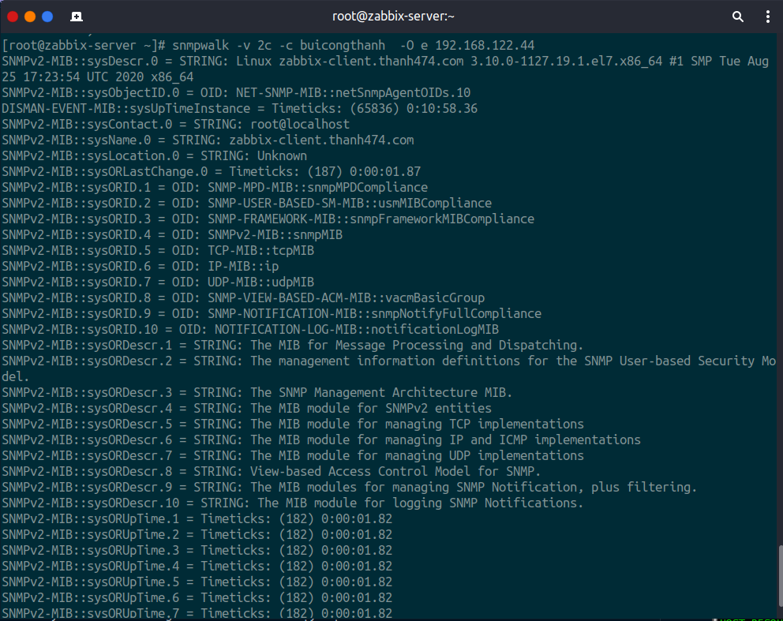
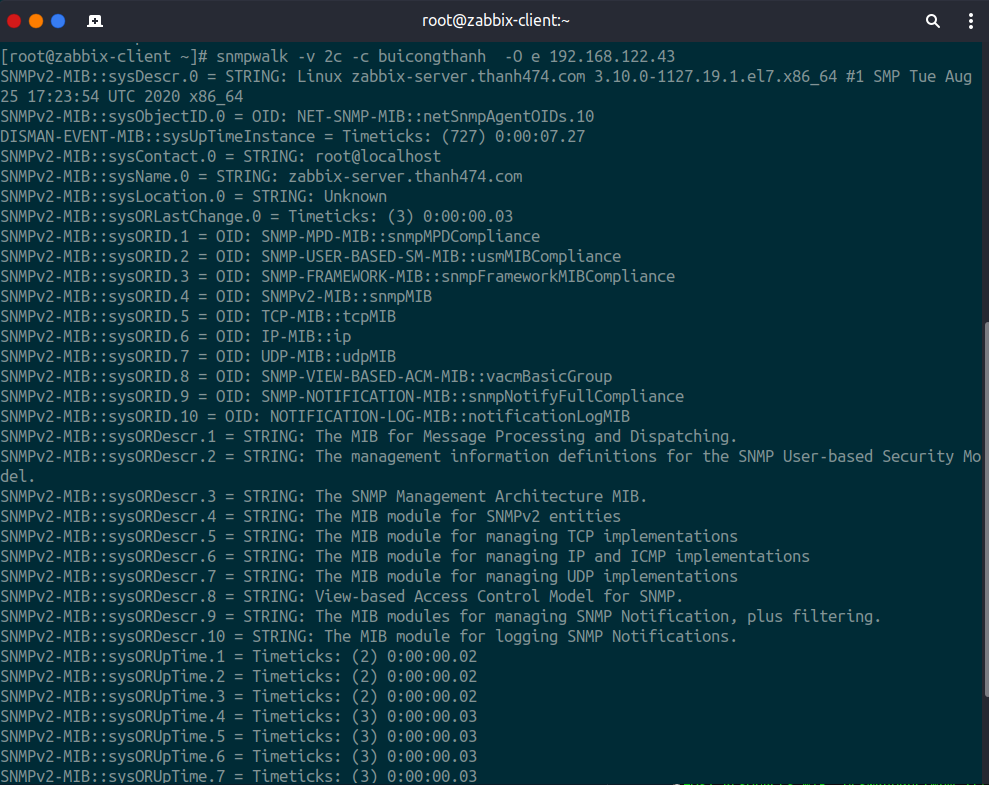
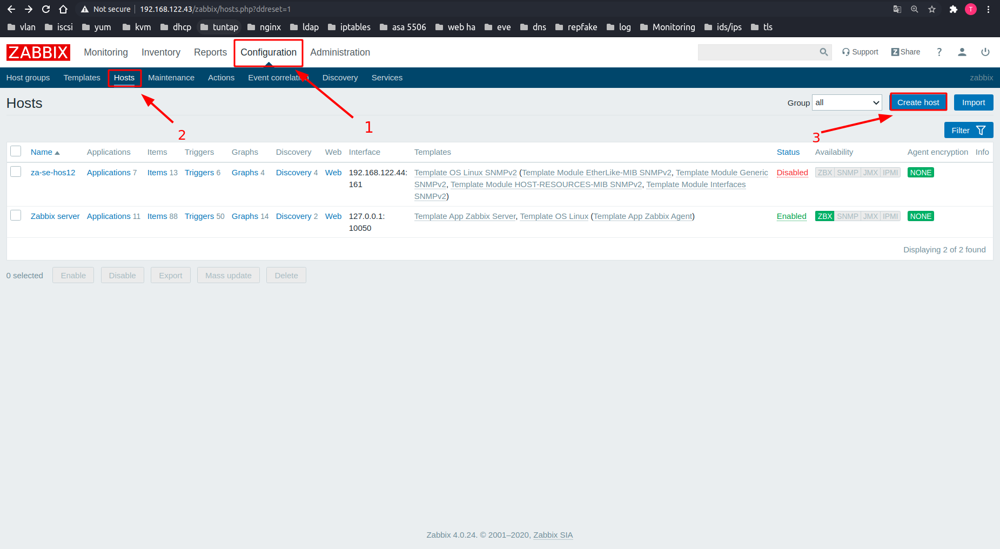
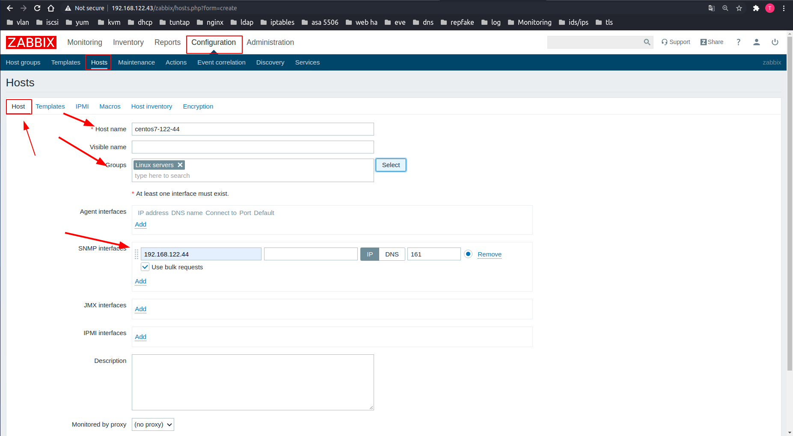
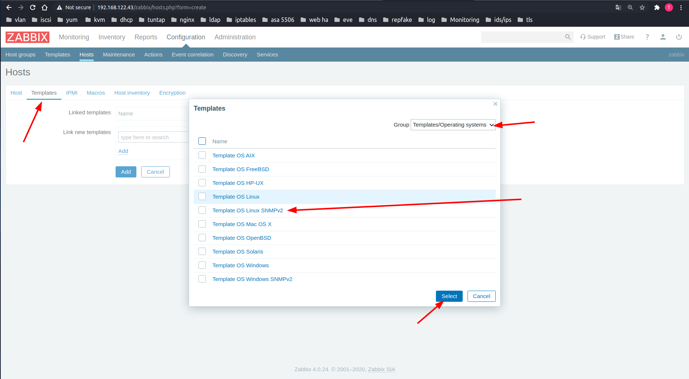
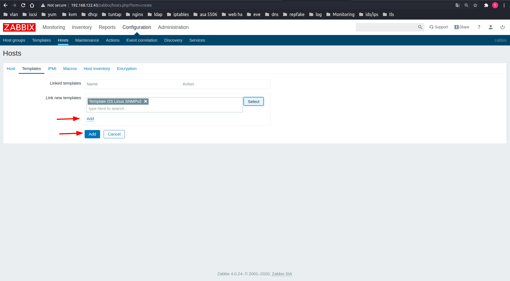
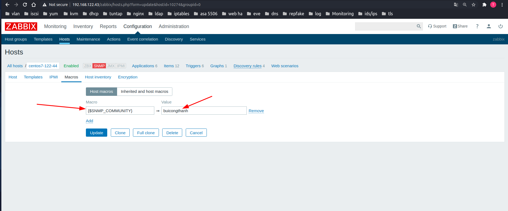
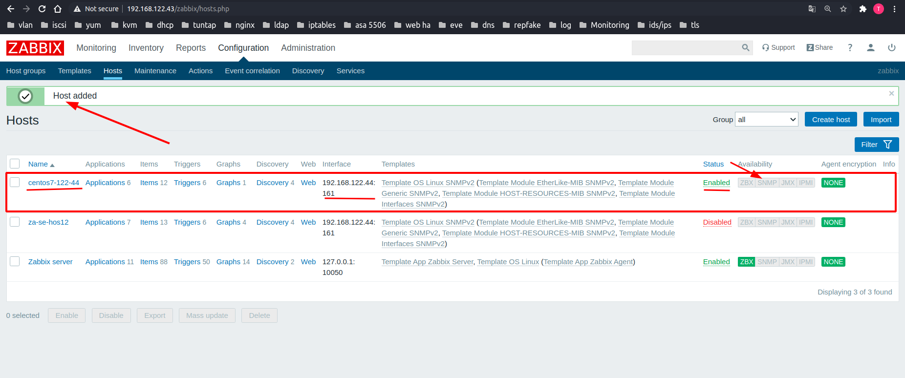
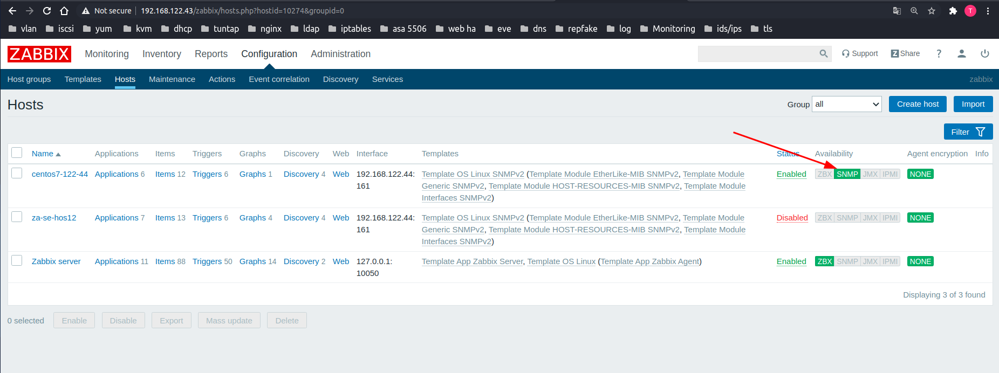
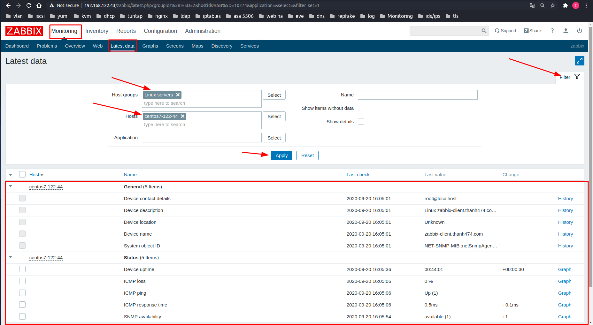

# Thêm agent và giám sát các agent bằng giao thức SNMP

# Mục lục
[1. Mô hình giám sát ](#1)

[2. Config SNMP trên zabbix-server Centos](#2)

[3. Config SNMP trên zabbix-agent Centos](#3)

[4. Cấu hình thêm agent host centos](#4)

[5. Cấu hình thêm agent host Windows 10](#5)

[6. Cấu hình thêm agent router](#6)

[7. Cấu hình thêm agent hypervisor](#7)


----
<a name="1" ></a>
## 1 Mô hình giám sát


<a name="2" ></a>
## 2. Config SNMP trên zabbix-server Centos

**Cài đặt**
```
    yum -y install net-snmp net-snmp-utils 
```

**Chỉnh sửa config**
```
    mv /etc/snmp/snmpd.conf /etc/snmp/snmpd.conf.bk
    touch /etc/snmp/snmpd.conf
    vi /etc/snmp/snmpd.conf
```
Thêm vào các dòng
```
    # Map 'buicongthanh' community to the 'ConfigUser'
    # Map '209ijvfwer0df92jd' community to the 'AllUser'
    #       sec.name        source          community
    com2sec ConfigUser      default         buicongthanh
    com2sec AllUser         default         209ijvfwer0df92jd
    # Map 'ConfigUser' to 'ConfigGroup' for SNMP Version 2c
    # Map 'AllUser' to 'AllGroup' for SNMP Version 2c
    #                       sec.model       sec.name
    group   ConfigGroup     v2c             ConfigUser
    group   AllGroup        v2c             AllUser
    # Define 'SystemView', which includes everything under .1.3.6.1.2.1.1 (or .1.3.6.1.2.1.25.1)
    # Define 'AllView', which includes everything under .1
    #                       incl/excl       subtree
    view    SystemView      included        .1.3.6.1.2.1.1
    view    SystemView      included        .1.3.6.1.2.1.25.1.1
    view    AllView         included        .1
    # Give 'ConfigGroup' read access to objects in the view 'SystemView'
    # Give 'AllGroup' read access to objects in the view 'AllView'
    #                       context model   level   prefix  read            write   notify
    access  ConfigGroup     ""      any     noauth  exact   SystemView      none    none
    access  AllGroup        ""      any     noauth  exact   AllView         none    none
```

- Lưu lại và thoát

Allow port UDP service SNMP
```
    firewall-cmd --permanent --add-port=161/udp
        
    firewall-cmd --reload
```
Restart service
```
	systemctl enable snmpd && systemctl start snmpd
```
<a name="3" ></a>
## 3. Config SNMP trên zabbix-agent  Centos ##

**Cài đặt**
```
    yum -y install net-snmp net-snmp-utils 
```

**Chỉnh sửa config**
```
    mv /etc/snmp/snmpd.conf /etc/snmp/snmpd.conf.bk
    touch /etc/snmp/snmpd.conf
    vi /etc/snmp/snmpd.conf
```
Thêm vào các dòng
```
    # Map 'buicongthanh' community to the 'ConfigUser'
    # Map '209ijvfwer0df92jd' community to the 'AllUser'
    #       sec.name        source          community
    com2sec ConfigUser      default         buicongthanh
    com2sec AllUser         default         209ijvfwer0df92jd
    # Map 'ConfigUser' to 'ConfigGroup' for SNMP Version 2c
    # Map 'AllUser' to 'AllGroup' for SNMP Version 2c
    #                       sec.model       sec.name
    group   ConfigGroup     v2c             ConfigUser
    group   AllGroup        v2c             AllUser
    # Define 'SystemView', which includes everything under .1.3.6.1.2.1.1 (or .1.3.6.1.2.1.25.1)
    # Define 'AllView', which includes everything under .1
    #                       incl/excl       subtree
    view    SystemView      included        .1.3.6.1.2.1.1
    view    SystemView      included        .1.3.6.1.2.1.25.1.1
    view    AllView         included        .1
    # Give 'ConfigGroup' read access to objects in the view 'SystemView'
    # Give 'AllGroup' read access to objects in the view 'AllView'
    #                       context model   level   prefix  read            write   notify
    access  ConfigGroup     ""      any     noauth  exact   SystemView      none    none
    access  AllGroup        ""      any     noauth  exact   AllView         none    none
```

- Lưu lại và thoát

Allow port UDP service SNMP
```
    firewall-cmd --permanent --add-port=161/udp
        
    firewall-cmd --reload
```
Restart service
```
	systemctl enable snmpd && systemctl start snmpd
```
**Kiểm tra kết nối.**

Kiểm tra đường truyền từ server đến client 
```
    snmpwalk -v 2c -c buicongthanh  -O e 192.168.122.44
```



Kiểm tra đường truyền từ   client đến server
```
    snmpwalk -v 2c -c buicongthanh  -O e 192.168.122.43
```


<a name="4" ></a>
# 4. Demo add host centos 7

Ở đây mình thêm và giám sát 1 host chạy hệ điều hành centos 7

Sau khi cấu hình SNMP trên 2 máy server và agent thì ta tiến hành add host vào zabbix.

4.1 Truy cập vào giao diện zabbix web interface.


4.2 Add host

Trên web dashboard của zabbix server click ```Configuration -> Hosts -> Create Host -> Host```



**Nhập thông tin host client**

Host name:  tên đặt để hiện thị trong zabbix cho dễ xem
Group:       tên đặt để hiện thị trong zabbix cho dễ quản lý
Agent interfaces:  Kiểu kết nối đến agent



**Lựa chọn template**

Chuyển sang tab ```Temaplates -> Select```



Lựa chọn ```Template``` phù hợp với client của bạn.

Click ```Add```



Chuyển sang tab ```Macros```

Thêm dòng sau vào ``{$SNMP_COMMUNITY} buicongthanh`` như trên hình. Bước này là khai báo community string cho zabbix có thê xác thực với agent.



Sau đó ấn ``add`` hay ``update``

Add host thành công



Chờ một lúc để client kết nối tới zabbix server. Khi biểu tượng zabbix agent đổi màu xanh là ta đã add host thành công.



Sau đó kiểm tra các thông số  được agent gửi về máy zabbix server.



Vậy là ta đã cấu hình thêm agent và giám sát agent centos 7 thông qua giao thức snmp.

<a name="5" ></a>
## 5. Thêm và giám sát host windown 10

Comming soon 

<a name="6" ></a>
## 6. Thêm và giám sát thiết bị mạng router hay switch

Comming soon 

<a name="7" ></a>
## 7. Thêm và giám sát hypervisor như VMWare ESxi

Comming soon 

