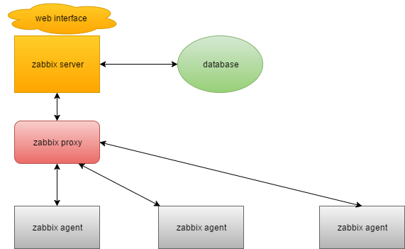
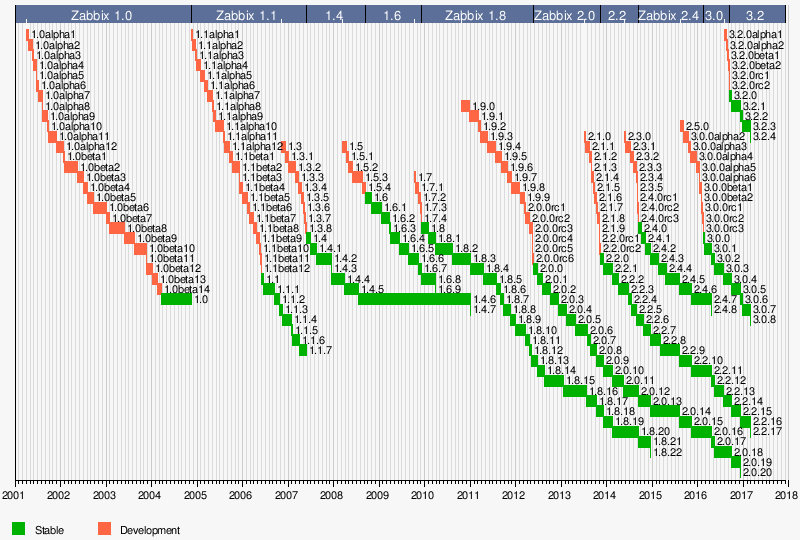
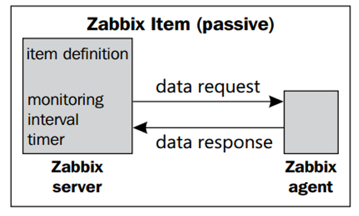
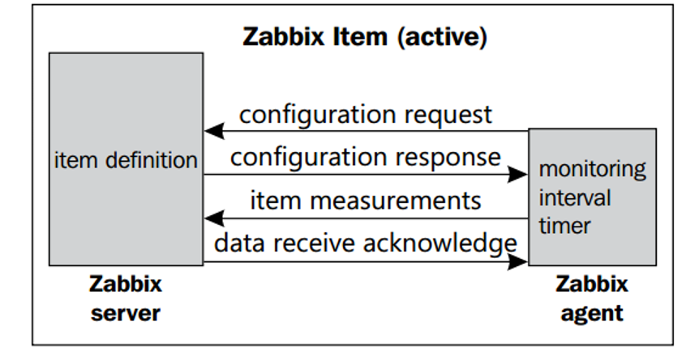

# Tìm hiểu về zabbix 

# Mục lục 
- [1. Tổng quan về Zabbix](#tongquan)
	+ [1.1 Zabbix là gì?](#khainiem)
	+ [1.2 Tại sao lại lựa chọn zabbix](#taisao)
	+ [1.3 Tính năng của zabbix](#tinhnang)
	+ [1.4 Cấu trúc của zabbix](#cautruc)
	+ [1.5 Yêu cầu](#yeucau)
	+ [1.6 Các phiên bản](#phienban)
	+ [1.7 Các khái niệm trong zabbix](#thuatngu)
- [2. Cơ chế hoạt động](#coche)
	+ [2.1 Giao thức giữa các thành phần trong zabbix](#giaothuc)
	+ [2.2 Giao thức giữa server-client](#check)

---

## <a name=tongquan>1. Tổng quan về Zabbix </a>

### <a name=khainiem>1.1 Khái niệm </a>

- Zabbix được tạo ra bởi Alexei Vladishev, và hiện đang được Zabbix SIA tích cực phát triển và hỗ trợ.

- Zabbix là một công cụ mã nguồn mở giải quyết cho ta các vấn đề về giám sát. Zabbix là phần mềm sử dụng các tham số của một mạng, tình trạng và tính toàn vẹn của Server cũng như các thiết bị mạng. Zabbix sử dụng một cơ chế thống báo linh hoạt cho phép người dùng cấu hình email hoặc sms để cảnh báo dựa trên sự kiện được ta thiết lập sẵn. Ngoài ra Zabbix  cung cấp báo cáo và dữ liệu chính xác dựa trên cơ sở dữ liệu. Điều này khiến cho Zabbix trở nên lý tưởng hơn.

- Tất cả các cấu hình của Zabbix thông qua giao diện web.  Việc lên kế hoạch và cấu hình một cách đúng đắn sẽ giúp cho việc giám sát trở nên dễ dàng và thuận tiện hơn. Zabbix đóng một vai trò quan trọng trong việc theo dõi hạ tầng mạng.

### <a name=tai sao>1.2 Tại sao lại chọn Zabbix </a>
 

- Giám sát cả Server và thiết bị mạng
- Dễ dàng thao tác và cấu hình
- Hỗ trợ máy chủ Linux, Solaris, FreeBSD …
- Đáng tin cậy trong việc chứng thực người dùng
- Linh hoạt trong việc phân quyền người dùng
- Giao diện web đẹp mắt
- Thông báo sự cố qua email và SMS
- Biểu đổ theo dõi và báo cáo
- Mã nguồn mở và chi phí thấp
- Mã hóa giúp giải thích các khả năng mã hóa thông tin liên lạc giữa các thành phần của Zabbix.

### <a name=tinhnang>1.3 Tính năng của Zabbix </a>

Zabbix là giải pháp giám sát mạng tích hợp cao cấp, cung cấp nhiều tính năng trong một gói.

#### **Open source**
- Là môt sản phẩm mã nguồn mở nên ta có thể tải về và sử dụng nó một cách miễn phí.
 

#### Thu thập dữ liệu

- Kiểm tra tính khả dụng và hiệu suất
- Hỗ trợ SNMP, IPMI, JMX, VMware monitoring
- Kiểm tra tùy chỉnh
- Thu thập dữ liệu mong muốn theo các khoảng thời gian tùy chỉnh
- Thực hiện bởi server, proxy, agents

### Thiết lập linh hoạt ngưỡng cảnh báo 

Bạn có thể tự thiết lập các ngưỡng cảnh báo hoặc tham khảo các ngưỡng có sẵn trong zabbix 

### Cảnh báo có tính cấu hình cao

- Gửi thông báo có thể được tùy chỉnh cho lịch trình leo thang, người nhận, loại phương tiện truyền thông
- Thông báo có thể được thực hiện có ý nghĩa và hữu ích bằng cách sử dụng các biến vĩ mô
- Cảnh báo tự động bao gồm các lệnh từ xa

### Biểu đồ thời gian thực

Các mục được giám sát ngay lập tức được vẽ đồ thị bằng cách sử dụng chức năng đồ thị được xây dựng sẵn

### Giám sát trên giao diện web 

### Sử dụng templates

- Nhóm các kiểm tra trong templates
- Các mẫu có thể kế thừa các templates khác

### API Zabbix

Zabbix API cung cấp giao diện lập trình cho Zabbix cho các thao tác hàng loạt, tích hợp phần mềm của bên thứ ba và các mục đích khác.

### Auto discovery

Hệ thống được cập nhật khi hệ thông có sự thay đổi Các thiết bị mới được thêm cần được tự độ phát hiện. 
Để theo dõi việc tự động thay đổi môi trường liên tục thay đổi được sử dụng tính năng Auto discovery.

Đây là một tính năng cho phép thực hiện tìm kiếm các phần tử mạng. Ngoài ra, nó sẽ tự động thêm các thiết bị mới và loại bỏ các thiết bị không còn là một phần của mạng. Nó cũng thực hiện việc khám phá các network interface, các port và các hệ thống file.

Auto discovery có thể được sử dụng để tìm ra trạng thái hiện tại trong mạng. Những thiết bị và dịch vụ nào hiện có trên mạng? Ngoài ra, nó giúp trong các vấn đề bảo mật. Nó giúp xác minh những cổng nào được kích hoạt.

Auto discovery có thể ping hoặc truy vấn mọi thiết bị trên mạng. Nếu mạng có Hệ thống Phát hiện xâm phạm (IDS), tính năng phát hiện tự động có thể kích hoạt báo động xâm nhập.

Phát hiện tự động đóng một phần thiết yếu trong giám sát mạng, một số công cụ  khác không cung cấp tính năng này. Đó là lý do tại sao các quản trị mạng nên chú ý auto discovery khi chọn công cụ giám sát mạng.

### Logical grouping
Trong các mạng lớn bao gồm nhiều thiết bị, khó để theo dõi và khắc phục tất cả các thiết bị trong quá trình giám sát mạng. Logical grouping cho phép kết hợp cùng một loại thiết bị lại với nhua. Kết quả là logical grouping giúp việc giám sát các mạng cấp doanh nghiệp dễ dàng hơn đáng kể.

Logical grouping cho phép kết hợp cùng một loại thiết bị mạng thành các nhóm. Đối với mỗi nhóm có thể được xác định những gì cần được theo dõi và những hành động nên được thực hiện trong trường hợp xảy ra lỗi. Ngoài ra, với việc Logical grouping có thể định cấu hình cài đặt hợp nhất cho tất cả phần tử của nhóm. Nếu một hoặc nhiều phần tử của nhóm ngừng hoạt động một cảnh báo sẽ được hiển thị.

Có thể tạo các nhóm lồng nhau cho các mạng lớn. Điều này có nghĩa là các nhóm có thể được tạo bên trong một nhóm khác. Kết quả là, việc quản lý các thiết bị mạng bên trong một mạng lớn trở nên dễ dàng hơn.

### Được viết bằng C, để thực hiện và tối ưu bộ nhớ 

### Zabbix proxy giám sát từ xa và cân bằng tải

## 1.4 Cơ chế thu nhận thông tin trong zabbix

Trong zabbix có 2 cơ chế thu nhân thông tin là Agent-based vs Agent-less

### **Agent-based**

Đây là một phần mềm được gọi là agent được cài đặt trên máy chủ local và các thiết bị cần monitor. Mục tiêu của nó là thu thập thông tin gửi về zabbix-server và có thể cảnh báo tới người quản trị.

Agent được cài đặt đơn giản nhẹ nhàng, tiêu thụ ít tài nguyên của server.

Lợi ích của việc sử dụng agent là phân tích sâu hơn, ngoài ra có thể chuẩn đoán được hiệu suất phần cứng, cung cấp khả năng cảnh bảo và report.

### **Agentless**

Agentless là một giải pháp không yêu cầu bất kỳ cài đặt agent riêng biệt nào. Phân tích mạng dựa trên giám sát package tiếp. Nó được sử dụng để giám sát tính sẵn sàng của mạng và hiệu suất. Tuy nhiên, nó không cung cấp bất kỳ thông tin chi tiết nào về lỗi.

Dựa trên giao thức SNMP hoặc WMI, được dựa trên một trạm quản lý trung tâm, giám sát tất cả các thiết bị mạng khác.

Việc cài đặt không ảnh hưởng đến hiệu suất của server . Quá trình triển khai dễ dàng hơn, không phải cập nhật thường xuyên từ các agent. Tuy nhiên lại không đi sâu thu thập được các số liệu, không cung cấp khả năng phân tích và báo cáo.

Trong khi zabbix-agent cung cấp những tính năng tuyệt vời trên một số nền tảng, nhưng cũng có trường hợp có những nên tảng không thể cài đặt được nó. Đối với trường hợp này phương thứ agentless được cung cấp bới zabbix server

Tính năng của Agentless

- Network Services Check: Zabbix server có thể kiểm tra một service đang lắng nghe trên port nào hoặc chúng phản hồi có đúng không. Phương thức này hiện tại support cho một số service như: FTP, IMAP, HTTP, HTTPS, LDAP, NNTP, POP3, SMTP, SSH, TCP and Telnet. Đối với các trường hợp không được xử lý bởi mục trước đó, Zabbix server có thể kiểm tra xem có gì đang lắng nghe trên cổng TCP hay không, thông báo nếu một dịch vụ có sẵn hay không.

	- TCP port availability
	- TCP port response time
	- Service check
        
- ICMP Ping:  Mặc dù đơn giản nhưng quan trọng, Zabbix có thể kiểm tra xem máy chủ có đang phản hồi các gói ping ICMP hay không. Vì vậy, nó có thể kiểm soát sự sẵn có của một máy chủ, cũng như thời gian phản hồi và mất gói tin.
Kiểm tra có thể được tùy chỉnh bằng cách thiết lập kích thước và số lượng gói tin, thời gian chờ và độ trễ giữa mỗi gói.

	- Server availability
	- ICMP response time
	- Packet loss

- Remote Check: Khi cấu hình agent zabbix không hỗ trợ, nhưng truy cập thông qua SSH hoặc Telnet sẵn sàng, một máy chủ Zabbix có thể chạy bất kỳ lệnh tùy chỉnh nào và sử dụng lệnh trả về của nó như là một giá trị được thu thập. Từ giá trị này có thể, ví dụ, để tạo ra các đồ thị và alert.

    - Executing commands via SSH or Telnet

## 1.4 Cấu trúc Zabbix 

### 1.4.1 Server

zabbix server  là thành phần trung tâm mà các agent báo cáo về tính có sẵn, toàn vẹn và số liệu thống kê

Máy chủ là kho trung tâm, trong đó lưu trữ tất cả các cấu hình, dữ liệu thống kê và dữ liệu hoạt động.

### 1.4.2 Database storage

Tất cả thông tin cấu hình cũng như dữ liệu thu thập được của Zabbix được lưu trữ trong cơ sở dữ liệu. 

Zabbix sử dụng MySQL, PostgreSQL, SQLite, Oracle hoặc IBM DB2 làm database

### 1.4.3 Web interface 

Để dễ dàng truy cập Zabbix từ mọi nơi và từ bất kỳ nền tảng nào, giao diện web được cung cấp. Giao diện là một phần của máy chủ Zabbix, và thông thường (nhưng không nhất thiết) chạy trên cùng một máy vật lý như máy chủ chạy.

**note** Giao diện web Zabbix phải chạy trên cùng một máy vật lý nếu dung SQLite làm sơ sở dữ liệu

### 1.4.4 Proxy

- Zabbix proxy có thể thay zabbix server thu thập dữ liệu 
- Zabbix Proxy là một giải pháp lý tưởng cho việc giám sát tập trung của các địa điểm từ xa, chi nhánh công ty, các mạng lưới không có quản trị viên nội bộ.
- Nó cũng có thể sử dụng để cân bằng tải

Zabibix proxy có thể có hoặc không 

### 1.4.5 Agent 

Cài trực tiếp lên máy mà bạn muốn giám sát. Nó sẽ lấy thông tin từ đó Agent sẽ thu thập thông tin hoạt động từ Server mà nó đang chạy và báo cáo dữ liệu này đến Zabbix Server để xử lý.

## 1.5 Yêu cầu

### Phần cứng 

Zabbix yêu cầu tối thiểu về RAM là 128, 256MB không gian trống của ổ đĩa cứng. Tuy nhiên số lượng ổ cứng tùy thuộc vào số lượng hosts và các thông số được giám sát.Phụ thuộc vào số lượng hosts được giám sát mà Zabbix yêu cầu tối thiểu các tài nguyên như sau: 

- Yêu cầu các phần cứng khác 

Cổng giao tiếp nối tiếp và một modem GSM nối tiếp được yêu cầu để sử dụng hỗ trợ thông báo qua SMS trong Zabbix. Bộ chuyển đổi USB-to-serial cũng sẽ hoạt động.

- Zabbix được thử nghiệm trên các nên tảng LinuxIBM AIX, FreeBSD, NetBSD, OpenBSD, HP-UX, Mac OS X, Solaris, Windows: tất cả các phiên bản máy tính để bàn và máy chủ từ năm 2000 (Agent Zabbix)

### Phần mềm 

Zabbix được xây dựng xung quanh một máy chủ web Apache, các công cụ cơ sở dữ liệu hàng đầu, và ngôn ngữ lập trình PHP.

Hệ thống quản lý cơ sở dữ liệu

Phần mềm sau đây để yêu cầu chạy giao diện Zabbix

### 1.6 Các phiên bản của Zabbix

### 1.7 Các thuật ngữ trong Zabbix

- Host: Thiết bị cần giám sát.
- Group: Nhóm thiết bị cần giám sát có các thuộc tính giống nhau.
- item: Một số dữ liệu mà bạn muốn nhận từ máy chủ lưu trữ 
- Trigger: Một biểu thức logic xác định một ngưỡng vấn đề. Khi dữ liệu nhận được ở trên ngưỡng, các trình kích hoạt sẽ đi từ 'Ok' sang trạng thái 'Problem'. 

tham khảo thêm tài liệu ở đây <a href="https://www.zabbix.com/documentation/3.0/manual/concepts/definitions">Definitions</a>

## 2. Các cơ chế hoạt động 

### 2.1 Các giao thức sử dụng zabbix 

- Giao thức giữa web interface và zabbix server là http

Mình dùng wireshark để kiểm tra 

Địa chỉ ip 192.168.76.128 chính là địa chỉ zabbix server 

Ngoài ra còn có giao thức json.RFC được sử dụng trong Zabbix <a href="https://www.zabbix.com/documentation/3.0/manual/api">Tham khảo</a>

- Việc truy xuất giữa zabbix server, web interface, agent truy xuất database bằng giao thức TCP kết nối đến port 3306 nếu sử dụng mysql bằng ngôn ngữ SQL

### 2.2 Cơ chế giữa server và client

Zabbix server thu thập thông tin từ Agent thông qua các item tương ứng. Các item có nhiều loại, tuy nhiên 2 loại chính là Active Item (Item chủ động) và Passive Item (Item bị động)

#### Zabbix Passive Check là gì?

- Đây là kiểu kiểm tra tương ứng với Item Zabbix Passive (bị động), kiểu này có đặc tính là công việc ưu cầu thông tin cần giám sát thuộc về Zabbix Server.
- Zabbix Server sẽ request thông tin cần tìm kiếm đến các Agent theo các khoảng thời gian (interval time) đã được cấu hình trong item tương ứng, lấy thông tin monitor và báo cáo lại về hệ thống ngay lập tức. Server khởi tạo kết nối, Agent luôn ở chế động lắng nghe kết nối từ Server.

Passive Check

- Tiến trình :
	
	+ Server mở kết nối TCP đến Zabbix Agent
	+ Server gửi ưu cầu thu thập thông tin với item tương ứng. Ví dụ : "agent.ping"
	+ Agent nhận ưu cầu, phân tích, thu thập dữ liệu và gửi trả về Server. Với item "agent.ping", kết quả trả về ở đây sẽ là "0" hoặc "1".
	+ Kết nối TCP đóng lại
- Nội dung gói tin "Server request" : 
	``agent.ping\n``
- Nội dung gói tin "Agent response" : 
	``<HEADER><DATALEN>1``
	
#### Zabbix Active Check là gì?

- Đây là kiểu kiểm tra tương ứng với Item Active (chủ động), đặc tính của kiểu này là công việc chủ động request thông tin cần giám sát thuộc về Zabbix Agent. Kiểu kiếm tra này hay dùng khi Zabbix Server không thể kết nối trực tiếp đến Zabbix Agent (có thể do chính sách firewall...)
- Zabbix Agent sẽ chủ động gửi request đến Zabbix Server nhằm lấy thông tin về các Item được Server chỉ định sẵn. Sau khi lấy được danh sách item thì Agent sẽ xử lý động lập rồi gửi tuần tự thông tin về cho Server. Server sẽ không khởi tạo kết nối nào mà chỉ trả lời request item list và nhận lại thông tin được trả về. Tuy nhiên nếu Agent trei hoặc chết thì Server sẽ không nhận được bất kỳ kết nối nào.

Active Check

- Tiến trình :
	+ Agent mở kết nối TCP đến Zabbix Server
	+ Agent yêu cầu danh sách item cần thu thập
	+ Server phản hồi với danh sách item tương ứng ( danh sách này đã được định sẵn trước đó, gồm item key, delay).
	+ Kết nối TCP đóng lại.
Agent bắt đầu thu thập thông tin tương ứng với danh sách item nhận được.

# 3. Tài liệu tham khảo

- https://www.zabbix.com/documentation/3.0
- https://github.com/hocchudong/ghichep-zabbix/blob/master/Zabbix/Phan%20biet%20Zabbix%20active%20check%20va%20Zabbix%20passive%20check.md

