# Cấu hình syslog tập trung.

# Mục lục.
[1. Syslog là gì.](#1)

[2.Cấu hình Syslog.](#2)

[3. Các bước thực hiện](#3)

- [3.1 Cấu hình trên Rsyslog-server](#3.1)

- [3.2 Cấu hình trên web-server](#3.2)

- [3.3 Cấu hình trên database](#3.2)

[4. Cấu hình đẩy log từ các device client về rsyslog server](#4)

- [4.1 Đẩy log ssh từ web-server về client](#4.1)

- [4.2 Đẩy log từ web-server về rsyslog-server](#4.2)

- [4.3 Đẩy log từ database về rsyslog-server](#4.3)


---
<a name ="1"></a>
## 1. Syslog.
Syslog là một giao thức client/server dùng để xử lý các file log Linux. Các file log có thể được lưu tại chính máy Linux đó, hoặc có thể di chuyển và lưu tại 1 máy khác. 

Một số đặc điểm của Syslog cần lưu ý : 
- Syslog có thể gửi qua UDP hoặc TCP.  
- Các dữ liệu log được gửi dạng cleartext.  
- Syslog mặc định dùng cổng 514. 

<a name ="2"></a>
## 2.Cấu hình Syslog.
### 2.1 Mô hình.
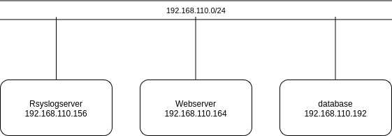
### 2.2 Ip planning.

Tên máy ảo|	Hệ điều hành|	IP address|	Subnet mask|	Default gateway
------|-----|----------|--------|-----
RsyslogServer| CentOS7|192.168.110.156|/24|192.168.110.1
webserver|CentOS7|192.168.110.164|/24|192.168.110.1
database|CentOS7|192.168.110.192|/24|192.168.110.1

<a name ="3"></a>
## 3. Các bước thực hiện
<a name ="3.1"></a>
### 3.1 Cấu hình trên Rsyslog-server.
**Chọn kiểu truyền tin sử dụng UDP hay TCP.**
```
vim etc/rsyslog.conf
```
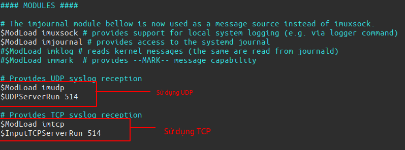

**Tạo file và thư mục lưu log được gửi về từ client.**

| Tên | Sử dụng| Áp dụng.
|---|---|---|
|%HOSTNAME%| Tạo tên thư mục là hostname của client | Tên thư mục|
|%fromhost-ip%| Tạo tên thư mục là địa chỉ IP của client| Tên thu mục|
|%SYSLOGFACILITY-TEXT%| Tạo tên file log là tên facility|Tên file log|
|%PROGRAMNAME%|  Tạo tên file log là tên chương trình| Tên file log|

Ví dụ.

```
$template RemoteServer, "/var/log/%HOSTNAME%/%SYSLOGFACILITY-TEXT%.log"
```
Với cú pháp này, các tệp cập nhật sẽ được nhóm theo tên máy client gửi log và sau đó theo cơ sở syslog.

Hoặc có thể là chọn hiển thị theo các khác.

```
$template RemoteServer, "/var/log/%fromhost-ip%/%SYSLOGFACILITY-TEXT%.log"
```

Với cú pháp này, các tệp cập nhật sẽ được nhóm theo tên địa chỉ client gửi log và sau đó theo cơ sở syslog.

Hoặc có thể là chọn hiển thị theo các khác.
Thêm các cách hiển thị vào cuối file ```etc/rsyslog.conf```

```
$template RemoteServer, "/var/log/%fromhost-ip%/%SYSLOGFACILITY-TEXT%.log"
*.*  ?RemoteServer
```
Với cách này sẽ hiển thị tên địa chỉ IP và cơ sở LOG.

Khởi động lại rsyslog và kiểm tra port 514.
```
systemctl restart rsyslog
lsof -i :514
```
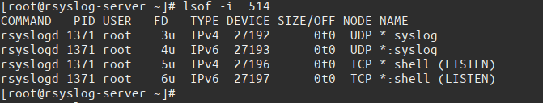

<a name ="3.2"></a>
## 3.2 Cấu hình trên web-server.
Đây là device gửi syslog đến rsyslog-server.


Chỉnh sửa dòng lệnh trong file ```/etc/rsyslog.conf```.

Chọn cách truyền.UDP.

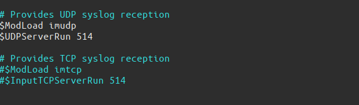

Viết thêm địa chỉ IP Rsyslog-server và các truyền UDP hay TCP.
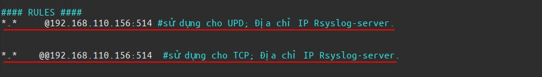

Trên client cũng phải truyền đúng với giao thức như trên server.
- `*.*  @IPserver:514` : Đối với giao thức UDP

- `*.*  @@IPserver:514` : Đối với giao thức TCP

Khởi động lại rsyslog.
```
systemctl restart rsyslog
```

<a name ="3.3"></a>
### 3.3 Cấu hình trên database.
 
Cấu hình tương tự như trên web-server.

Chỉnh sửa dòng lệnh trong file ```/etc/rsyslog.conf```.

Chọn cách truyền.UDP.


Viết thêm địa chỉ IP Rsyslog-server và các truyền UDP hay TCP.


Khởi động lại rsyslog.
```
systemctl restart rsyslog
```
### 3.4 Kiểm tra.
Kiểm tra trên rsyslog-server trên Rsyslog đã nhận và tạo đường dẫn file chưa.

Kiểm tra trên Rsyslog-server.
```
systemctl restart rsyslog
ll /var/log
```
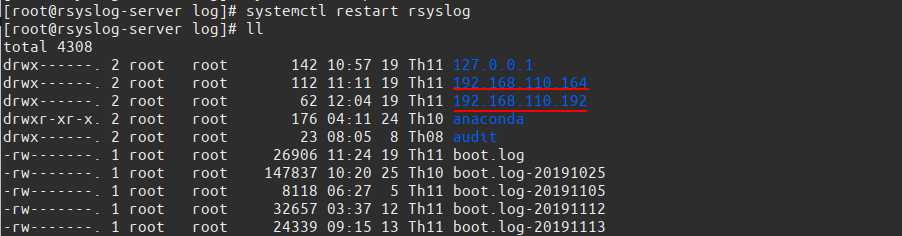

Ta thấy có 2 file là tên địa chỉ Ip của web-server và database.

<a name ="4"></a>
## 4. Cấu hình đẩy log từ các device client về rsyslog server.

<a name ="4.1"></a>
### 4.1 Đẩy log ssh từ web-server về client.
Thực hiện cấu hình trên máy Web-server.

Tạo và thêm các dòng vào file ``/etc/rsyslog.d/secure.conf``
```
vim /etc/rsyslog.d/secure.conf
```
```
module(load="imfile")
#/var/log/secure
input(type="imfile"
        File="/var/log/secure"
        Tag="Log_SSH"
        Severity="info"
        Facility="local2"
)
```
Trong đó:
- Sử dụng module.
- Module sử dụng: imfile (Text File Input Module)
- **File="/var/log/secure"** :là đường dẫn file log muôn đẩy.
- **Tag="Log_SSH"**  : là tên tag
- **Severity="info"**    :Là  các log từ mức cảnh báo info trở lên.
- **Facility="local2")**   :là cơ sở sinh log facility.

Khởi động lại các dịch vụ.
```
systemctl restart httpd
systemctl restart rsyslog
```
Kiểm tra trên rsyslog-server xem đã có log dẩy về chưa.
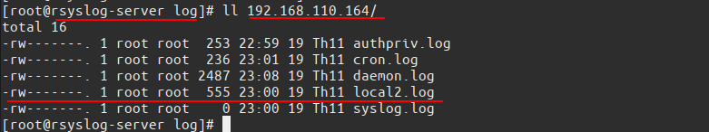

Đọc log ssh khi trên thời gian thực.
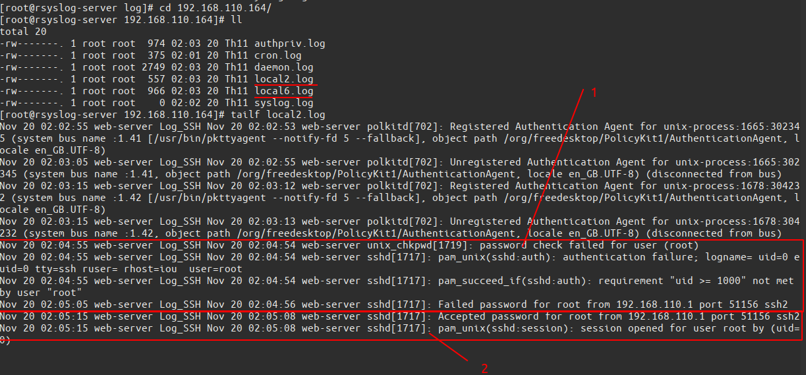

Trong đó :

- 1 là trường hợp nhập sai mật khẩu ssh.
- 2 là trường hợp nhập đúng mật khẩu ssh.

<a name ="4.2"></a>
### 4.2 Đẩy log từ web-server về rsyslog-server.

Thực hiện cấu hình trên web server.

Tạo và thêm các dòng vào file ``/etc/rsyslog.d/apache.conf``

```
vim /etc/rsyslog.d/apache.conf
```
```
module(load="imfile" PollingInterval="10") 

#access_log
input(  type="imfile"
       File="/var/log/httpd/access_log"     
       Tag="access_log"               
       Severity="info"                      
       Facility="local7")  

#error_log
input(  type="imfile"
       File="/var/log/httpd/error_log"
       Tag="error_log"
       Severity="info"
       Facility="local6")
```

Trong đó:
- Sử dụng module.
- Module sử dụng: imfile (Text File Input Module)
- **PollingInterval="10"**: Là sau 10 giây lại gửi tin nhắn 1 lần.
- **File="/var/log/httpd/access_log"** :là đường dẫn file log muôn đẩy.
- **Tag="access_log"**  : là tên tag
- **Severity="info"**    :Là  các log từ mức cảnh báo info trở lên.
- **Facility="local5")**   :là cơ sở sinh log facility.

Khởi động lại các dịch vụ.
```
systemctl restart httpd
systemctl restart rsyslog
```
Kiểm tra trên rsyslog-server xem đã có log dẩy về chưa.

Trên máy database kiểm tra thời gian và khởi động lại mysqld.
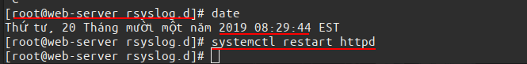

Ta thấy thời gian là 08:29:44 

Trên máy rsyslog-server đọc gói tin log được gửi về từ database lưu trong file ```/var/log/192.168.164```
```
tailf /var/log/192.168.110.164/local5.log
```
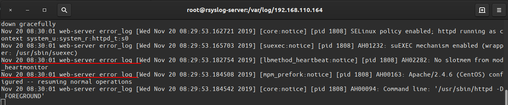
Ta thấy có các dòng log được ghi lại vào thời điểm 80:30:01.

Vậy log của httpd đã đưọc đẩy về rsyslog-server.

<a name ="4.3"></a>
### 4.3 Đẩy log từ database về rsyslog-server.

Thực hiện cấu hinh trên máy Database.

Tạo và thêm các dòng vào file ``/etc/rsyslog.d/mysqld.conf``
```
vim /etc/rsyslog.d/mysqld.conf
```
```
module(load="imfile")
#Mysql
input(  type="imfile"
        File="/var/log/mysqld.log"
        Tag="Mysql_Log"
        Severity="info"
        Facility="local1"
)
```
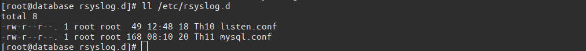
Khởi động lại các dịch vụ.
```
systemctl restart rsyslog
```
Kiêm tra trên rsyslog đã có log đẩy về chưa.

Trên máy database kiểm tra thời gian và khởi động lại mysqld.
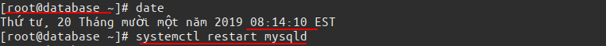
Ta thấy thời gian là 08:14:10

Trên máy rsyslog-server đọc gói tin log được gửi về từ database lưu trong file ```/var/log/192.168.192```
```
tailf /var/log/192.168.110.192/local1.log
```
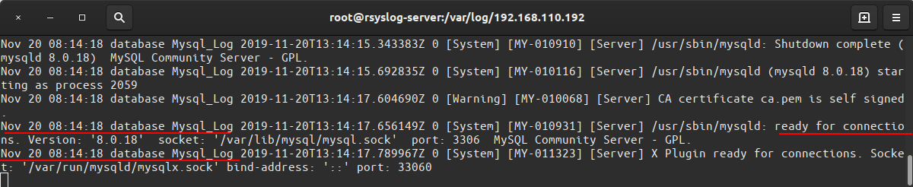
Ta thấy có các dòng log được ghi lại vào thời điểm 80:14:18.
Vậy log của mysql đã đưọc đẩy về rsyslog-server.


