# Tìm hiểu log và syslog.

#  Mục lục 

[1. Log là gì?](#1)

[2. Tổng quan Syslog](#2)
- [2.1 Mục đích của Syslog](#2.1)
- [2.2 Kiến trúc Syslog](#2.2)
- [2.4 Cấp độ cơ sở Syslog](#2.3)
- [2.5 Mức độ cảnh báo của Syslog](#2.5)

[3. Phân tích định dạng tin nhắn syslog](#3)
- [3.1 Phần PRI](#3.1)
- [3.2 Phần Header](#3.2)
- [3.3 Phần MSG](#3.3)

[4. Cách syslog hoạt động và gửi tin nhắn](#4)

[5. Quá trình phát triển ](#5)

[6. Tìm hiểu Rsyslog]($6)

[7. Tổng quan về Log tập trung](#7)


---

<a name="1"> </a>

## 1. Log là gì?

- Log ghi lại liên tục các thông báo về hoạt động của cả hệ thống hoặc của các dịch vụ được triển khai trên hệ thống và file tương ứng. Log file thường là các file văn bản thông thường dưới dạng “clear text” tức là bạn có thể dễ dàng đọc được nó, vì thế có thể sử dụng các trình soạn thảo văn bản (vi, vim, nano…) hoặc các trình xem văn bản thông thường (cat, tailf, head…) là có thể xem được file log.

- Các file log có thể nói cho bạn bất cứ thứ gì bạn cần biết, để giải quyết các rắc rối mà bạn gặp phải miễn là bạn biết ứng dụng nào. Mỗi ứng dụng được cài đặt trên hệ thống có cơ chế tạo log file riêng của mình để bất cứ khi nào bạn cần thông tin cụ thể thì các log file là nơi tốt nhất để tìm.

- Các tập tin log được đặt trong thư mục /var/log. Bất kỳ ứng dụng khác mà sau này bạn có thể cài đặt trên hệ thống của bạn có thể sẽ tạo tập tin log của chúng tại /var/log. Dùng lệnh ls -l /var/log để xem nội dung của thư mục này.

Ý nghĩa một số file log thông dụng có mặc định trên /var/log

- /var/log/messages – Chứa dữ liệu log của hầu hết các thông báo hệ thống nói chung, bao gồm cả các thông báo trong quá trình khởi động hệ thống.
- /var/log/cron – Chứa dữ liệu log của cron deamon. Bắt đầu và dừng cron cũng như cronjob thất bại.
- /var/log/maillog hoặc /var/log/mail.log – Thông tin log từ các máy chủ mail chạy trên máy chủ.
- /var/log/wtmp – Chứa tất cả các đăng nhập và đăng xuất lịch sử.
- /var/log/btmp – Thông tin đăng nhập không thành công
- /var/run/utmp – Thông tin log trạng thái đăng nhập hiện tại của mỗi người dùng.
- /var/log/dmesg – Thư mục này có chứa thông điệp rất quan trọng về kernel ring buffer. Lệnh dmesg có thể được sử dụng để xem các tin nhắn của tập tin này.
- /var/log/secure – Thông điệp an ninh liên quan sẽ được lưu trữ ở đây. Điều này bao gồm thông điệp từ SSH daemon, mật khẩu thất bại, người dùng không tồn tại, vv.

Một số log thường gặp

- Log SSH: /var/log/secure
```
[root@thanhbc ~]# tailf /var/log/secure | grep ssh 
Login thành công
Sep 17 08:04:29 thanhbc sshd[10709]: Accepted password for thanhbc from 66.0.0.254 port 58710 ssh2
---------------
Login thất bại
Sep 17 08:33:21 thanhbc sshd[11262]: Failed password for pak from 66.0.0.254 port 58954 ssh2
-----------------------
Login sai user
Sep 17 10:40:37 thanh sshd[10668]: Invalid user thanhbc from 66.0.0.254 port 60347

```

- Access log Apache:
```
[root@thanhbc httpd]# tailf /var/log/httpd/access_log
66.0.0.254 - - [17/Sep/2019:09:14:25 +0700] "GET / HTTP/1.1" 403 4897 "-" "Mozilla/5.0 (Windows NT 10.0; WOW64) AppleWebKit/537.36 (KHTML, like Gecko) coc_coc_browser/80.0.182 Chrome/74.0.3729.182 Safari/537.36"
```
- Error log Apache:
```
[root@thanhbc httpd]# tailf error_log
[Tue Sep 17 09:13:20.343905 2019] [core:notice] [pid 11438] SELinux policy enabled; httpd running as context system_u:system_r:httpd_t:s0
```

- Log ghi lại những lần đăng nhập thành công:
```
[root@thanhbc ~]# last -f /var/log/wtmp
hoặc utmpdump /var/log/wtmp
root     pts/3        66.0.0.254       Tue Sep 17 08:24   still logged in
thanhbc   pts/1        66.0.0.254       Tue Sep 17 08:19   still logged in
root     pts/2        66.0.0.254       Tue Sep 17 08:13   still logged in
thanhbc   pts/1        66.0.0.254       Tue Sep 17 08:04 - 08:18  (00:14)
```
- Log ghi lại những lần đăng nhập thất bại:
```
[root@thanhbc ~]# lastb -f /var/log/btmp | more
pak      ssh:notty    66.0.0.254       Tue Sep 17 08:33 - 08:33  (00:00)
```
<a name="2"></a>

## 2. Tổng quan Syslog

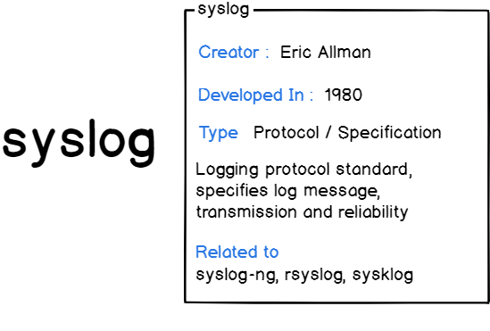


Syslog là một giao thức client/server là giao thức dùng để chuyển log và thông điệp đến máy nhận log. Máy nhận log thường được gọi là syslogd, syslog daemon hoặc syslog server. Syslog có thể gửi qua UDP hoặc TCP. Các dữ liệu được gửi dạng cleartext. Syslog dùng port 514.

Syslog được phát triển năm 1980 bởi Eric Allman, nó là một phần của dự án Sendmail, và ban đầu chỉ được sử dụng duy nhất cho Sendmail. Nó đã thể hiện giá trị của mình và các ứng dụng khác cũng bắt đầu sử dụng nó. Syslog hiện nay trở thành giải pháp khai thác log tiêu chuẩn trên Unix-Linux cũng như trên hàng loạt các hệ điều hành khác và thường được tìm thấy trong các thiết bị mạng như router Trong năm 2009, Internet Engineering Task Forec (IETF) đưa ra chuẩn syslog trong RFC 5424.

Trong chuẩn syslog, mỗi thông báo đều được dán nhãn và được gán các mức độ nghiêm trọng khác nhau. Các loại phần mềm sau có thể sinh ra thông báo: auth, authPriv, daemon, cron, ftp, dhcp, kern, mail, syslog, user,… Với các mức độ nghiêm trọng từ cao nhất trở xuống Emergency, Alert, Critical, Error, Warning, Notice, Info, and Debug.

<a name="2.1"></a>

## 2.1 Mục đích của Syslog
Syslog được sử dụng như một tiêu chuẩn, chuyển tiếp và thu thập log được sử dụng trên một phiên bản Linux. Syslog xác định mức độ nghiêm trọng (severity levels) cũng như mức độ cơ sở (facility levels) giúp người dùng hiểu rõ hơn về nhật ký được sinh ra trên máy tính của họ. Log (nhật ký) có thể được phân tích và hiển thị trên các máy chủ được gọi là máy chủ Syslog.

Giao thức syslog có những yếu tố sau:

- Defining an architecture (xác định kiến ​​trúc) : Syslog là một giao thức, nó là một phần của kiến ​​trúc mạng hoàn chỉnh, với nhiều máy khách và máy chủ.
- Message format (định dạng tin nhắn) : syslog xác định cách định dạng tin nhắn. Điều này rõ ràng cần phải được chuẩn hóa vì các bản ghi thường được phân tích cú pháp và lưu trữ vào các công cụ lưu trữ khác nhau. Do đó, chúng ta cần xác định những gì một máy khách syslog có thể tạo ra và những gì một máy chủ nhật ký hệ thống có thể nhận được.
- Specifying reliability (chỉ định độ tin cậy) : syslog cần xác định cách xử lý các tin nhắn không thể gửi được. Là một phần của TCP/IP, syslog rõ ràng sẽ bị thay đổi trên giao thức mạng cơ bản (TCP hoặc UDP) để lựa chọn.
- Dealing with authentication or message authenticity (xử lý xác thực hoặc xác thực thư): syslog cần một cách đáng tin cậy để đảm bảo rằng máy khách và máy chủ đang nói chuyện một cách an toàn và tin nhắn nhận được không bị thay đổi.

<a name="2.2"></a>

## 2.2 Kiến trúc Syslog
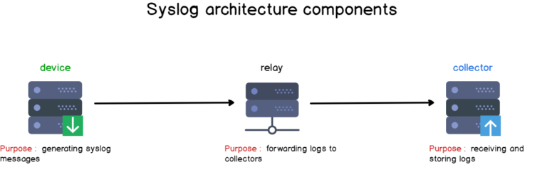

Một máy Linux độc lập hoạt động như một máy chủ máy chủ syslog của riêng mình. Nó tạo ra dữ liệu nhật ký, nó được thu thập bởi rsyslog và được lưu trữ ngay vào hệ thống tệp.

Đây là một tập hợp các ví dụ kiến ​​trúc xung quanh nguyên tắc này:

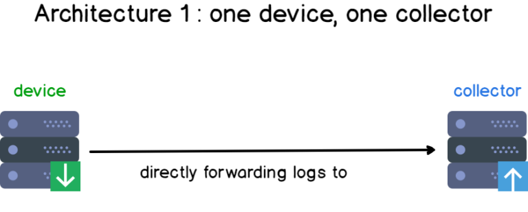
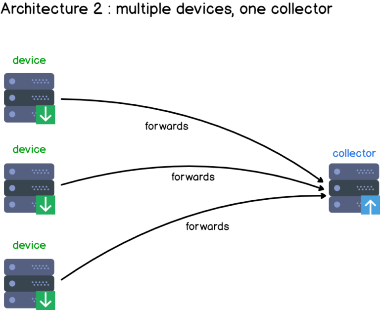
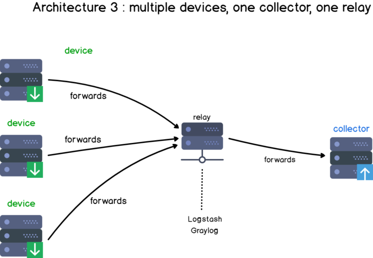

<a name="2.3"></a>

## 2.3 Định dạng tin nhắn Syslog?


Định dạng nhật ký hệ thống được chia thành ba phần, độ dài một thông báo không được vượt quá 1024 bytes:

- PRI : chi tiết các mức độ ưu tiên của tin nhắn (từ tin nhắn gỡ lỗi (debug) đến trường hợp khẩn cấp) cũng như các mức độ cơ sở (mail, auth, kernel).
- Header: bao gồm hai trường là TIMESTAMP và HOSTNAME, tên máy chủ là tên máy gửi nhật ký.
- MSG: phần này chứa thông tin thực tế về sự kiện đã xảy ra. Nó cũng được chia thành trường TAG và trường CONTENT.

<a name="2.4"></a>

## 2.4 Cấp độ cơ sở Syslog 
Syslog facility levels

Một mức độ cơ sở được sử dụng để xác định chương trình hoặc một phần của hệ thống tạo ra các bản ghi.
Theo mặc định, một số phần trong hệ thống của bạn được cung cấp các mức facility như kernel sử dụng kern facility hoặc hệ thống mail của bạn bằng cách sử dụng mail facility.
Nếu một bên thứ ba muốn phát hành log, có thể đó sẽ là một tập hợp các cấp độ facility được bảo lưu từ 16 đến 23 được gọi là “local use” facility levels.
Ngoài ra, họ có thể sử dụng tiện ích của người dùng cấp độ người dùng (“user-level” facility), nghĩa là họ sẽ đưa ra các log liên quan đến người dùng đã ban hành các lệnh.
Dưới đây là các cấp độ facility Syslog được mô tả trong bảng:


<a name="2.5"></a>

## 2.5 Mức độ cảnh báo của Syslog

Syslog severity 

Mức độ cảnh báo của Syslog được sử dụng để mức độ nghiêm trọng của log event và chúng bao gồm từ gỡ lỗi (debug), thông báo thông tin (informational messages) đến mức khẩn cấp (emergency levels).
Tương tự như cấp độ cơ sở Syslog, mức độ cảnh báo được chia thành các loại số từ 0 đến 7, 0 là cấp độ khẩn cấp quan trọng nhất
Dưới đây là các mức độ nghiêm trọng của syslog được mô tả trong bảng:

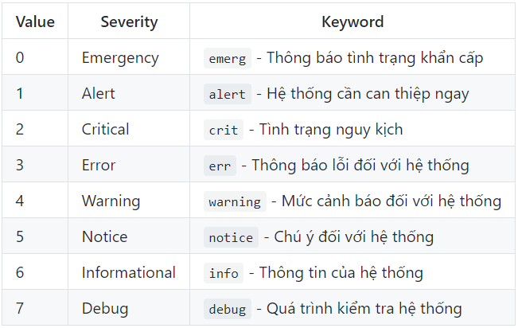

Ngay cả khi các bản ghi được lưu trữ theo tên cơ sở theo mặc định, bạn hoàn toàn có thể quyết định lưu trữ chúng theo mức độ nghiêm trọng.
Nếu bạn đang sử dụng rsyslog làm máy chủ syslog mặc định, bạn có thể kiểm tra các thuộc tính rsyslog để định cấu hình cách các bản ghi được phân tách.

<a name="3"></a>

## 3. Phân tích định dạng tin nhắn syslog

<a name="3.1"></a>

### 3.1 Phần PRI

Đoạn PRI là phần đầu tiên mà bạn sẽ đọc trên một tin nhắn được định dạng syslog.

Phần PRI hay Priority là một số được đặt trong ngoặc nhọn, thể hiện cơ sở sinh ra log hoặc mức độ nghiêm trọng, là một số gồm 8 bit:

- 3 bit đầu tiên thể hiện cho tính nghiêm trọng của thông báo.
- 5 bit còn lại đại diện cho sơ sở sinh ra thông báo.


Vậy biết một số Priority thì làm thế nào để biết nguồn sinh log và mức độ nghiêm trọng của nó.

Ta xét 1 ví dụ sau:

Priority = 191 Lấy 191:8 = 23.875 -> Facility = 23 (“local 7”) -> Severity = 191 – (23 * 8 ) = 7 (debug)


<a name="3.2"></a>

### 3.2 Phần Header


Header bao gồm:
- TIMESTAMP : được định dạng trên định dạng của Mmm dd hh:mm:ss – Mmm, là ba chữ cái đầu tiên của tháng. Sau đó là thời gian mà thông báo được tạo ra giờ:phút:giây. Thời gian này được lấy từ thời gian hệ thống.
Chú ý: nếu như thời gian của server và thời gian của client khác nhau thì thông báo ghi trên log được gửi lên server là thời gian của máy client
- HOSTNAME (đôi khi có thể được phân giải thành địa chỉ IP). Nó thường được đưa ra khi bạn nhập lệnh tên máy chủ. Nếu không tìm thấy, nó sẽ được gán cả IPv4 hoặc IPv6 của máy chủ.

<a name="3.3"></a>

### 3.3 Phần MSG
Phần này chứa thông tin các message. Phần này gồm 2 trường chính là:
- Tag: chứa thông tin message này là của ứng dụng hay dịch vụ naò.
- Content : Nội dung mà ứng dụng hay dịch vụ này muốn báo cáo thông tin.


<a name="4"></a>

## 4. Cách syslog hoạt động và gửi tin nhắn.

Chuyển tiếp nhật ký hệ thống là gì?

- Chuyển tiếp nhật ký hệ thống (syslog forwarding) bao gồm gửi log máy khách đến một máy chủ từ xa để chúng được tập trung hóa, giúp phân tích log dễ dàng hơn.
- Hầu hết thời gian, quản trị viên hệ thống không giám sát một máy duy nhất, nhưng họ phải giám sát hàng chục máy, tại chỗ và ngoài trang web.
- Kết quả là, việc gửi nhật ký đến một máy ở xa, được gọi là máy chủ ghi log tập trung, sử dụng các giao thức truyền thông khác nhau như UDP hoặc TCP.

Syslog có sử dụng TCP hoặc UDP không?
- Syslog ban đầu sử dụng UDP, điều này là không đảm bảo cho việc truyền tin. Tuy nhiên sau đó IETF đã ban hành RFC 3195 (Đảm bảo tin cậy cho syslog) và RFC 6587 (Truyền tải thông báo syslog qua TCP). Điều này có nghĩa là ngoài UDP thì giờ đây syslog cũng đã sử dụng TCP để đảm bảo an toàn cho quá trình truyền tin.
- Syslog sử dụng port 514 cho UDP.

- Tuy nhiên, trên các triển khai log hệ thống gần đây như rsyslog hoặc syslog-ng, bạn có thể sử dụng TCP làm kênh liên lạc an toàn.

- Rsyslog sử dụng port 10514 cho TCP, đảm bảo rằng không có gói tin nào bị mất trên đường đi.


- Bạn có thể sử dụng giao thức TLS/SSL trên TCP để mã hóa các gói Syslog của bạn, đảm bảo rằng không có cuộc tấn công trung gian nào có thể được thực hiện để theo dõi log của bạn.

<a name="5"></a>

## 5. Quá trình phát triển 
**Syslog daemon** : xuất bản năm 1980, syslog daemon có lẽ là triển khai đầu tiên từng được thực hiện và chỉ hỗ trợ một bộ tính năng giới hạn (chẳng hạn như truyền UDP). Nó thường được gọi là daemon sysklogd trên Linux.

**Syslog-ng** : xuất bản năm 1998, syslog-ng mở rộng tập hợp các khả năng của trình nền syslog gốc bao gồm chuyển tiếp TCP (do đó nâng cao độ tin cậy), mã hóa TLS và bộ lọc dựa trên nội dung. Bạn cũng có thể lưu trữ log vào cơ sở dữ liệu trên local để phân tích thêm.

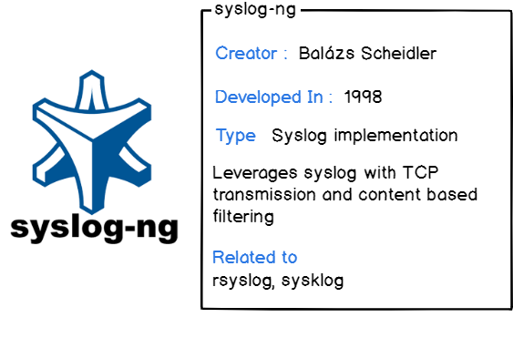

**Rsyslog** – “The rocket-fast system for log processing” được bắt đầu phát triển từ năm 2004 bởi Rainer Gerhards rsyslog là một phần mềm mã nguồn mở sử dụng trên Linux dùng để chuyển tiếp các log message đến một địa chỉ trên mạng (log receiver, log server) Nó thực hiện giao thức syslog cơ bản, đặc biệt là sử dụng TCP cho việc truyền tải log từ client tới server. Hiện nay rsyslog là phần mềm được cài đặt sẵn trên hầu hết hệ thống Unix và các bản phân phối của Linux như : Fedora, openSUSE, Debian, Ubuntu, Red Hat Enterprise Linux, FreeBSD…

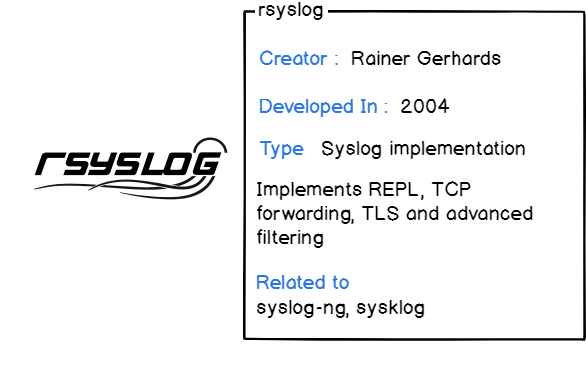

<a name="6"></a>

## 6. Tìm hiểu Rsyslog

Nếu bạn đang sử dụng một bản phân phối Linux hiện đại (như máy Ubuntu, CentOS hoặc RHEL), máy chủ syslog mặc định được sử dụng là rsyslog.
Rsyslog là một sự phát triển của syslog, cung cấp các khả năng như các mô đun có thể cấu hình, được liên kết với nhiều mục tiêu khác nhau (ví dụ chuyển tiếp nhật ký Apache đến một máy chủ từ xa).
Rsyslog cũng cung cấp tính năng lọc riêng cũng như tạo khuôn mẫu để định dạng dữ liệu sang định dạng tùy chỉnh.
Modules Rsyslog:
Rsyslog có thiết kế kiểu mô-đun. Điều này cho phép chức năng được tải động từ các mô-đun, cũng có thể được viết bởi bất kỳ bên thứ ba nào. Bản thân Rsyslog cung cấp tất cả các chức năng không cốt lõi như các mô-đun. Do đó, ngày càng có nhiều mô-đun. Có 6 modules cơ bản:

- Output Modules
- Input Modules
- Parser Modules
- Message Modification Modules
- String Generator Modules
- Library Modules

### Tìm hiểu file cấu hình rsyslog.conf

Dưới đây là file cấu hình mặc định của file rsyslog.conf đã bỏ comment:


Cơ bản trên file rsyslog.conf mặc định cho chúng ta thấy nơi lưu trữ các log tiến trình của hệ thống:
```
authpriv.*                                              /var/log/secure
mail.*                                                  -/var/log/maillog
cron.*                                                  /var/log/cron
*.emerg                                                 :omusrmsg:*
uucp,news.crit                                          /var/log/spooler
local7.*                                                /var/log/boot.log
```
Cấu hình trên được chia ra làm 2 trường:
Trường 1: Trường Seletor

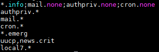

Trường Seletor : Chỉ ra nguồn tạo ra log và mức cảnh bảo của log đó.
Trong trường seletor có 2 thành phần và được tách nhau bằng dấu “.“

Trường 2: Trường Action

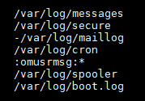

Trường Action:là trường để chỉ ra nơi lưu log của tiến trình đó. Có 2 loại là lưu tại file trong localhost hoặc gửi đến IP của máy chủ Log

Đối với các dòng lệnh như sau:
```
mail.info         /var/log/maillog
```
Khi đó lúc này bản tin log sẽ mail lại với mức cảnh báo từ info trở lên. Cụ thể là mức notice,warn,… nếu bạn chỉ muốn nó log lại mail với mức là info bạn phải sử dụng như sau: **mail.=info /var/log/maillog**

```
mail.* 
```
Lúc này kí tự * đại diên cho các mức cảnh báo. Lúc này nó sẽ lưu hết các level của mail vào trong thư mục. Tượng tự khi đặt *. thì lúc này nó sẽ log lại tất cả các tiến trình của hệ thống vào một file. Nếu bạn muốn log lại tiến trình của mail ngoại trừ mức info bạn có thể dùng kí tự “!” VD: **mail.!info**

```
*.info;mail.none;authpriv.none;cron.none                /var/log/messages
```
Lúc này tất các log từ info của tiến trình hệ thống sẽ được lưu vào trong file log messages nhưng đối với các log của mail, authpriv và cron sẽ không lưu vào trong messages. Đó là ý nghĩa của dòng **mail.none;authpriv.none;cron.none**


<a name="7"></a>

## 7. Tổng quan về Log tập trung

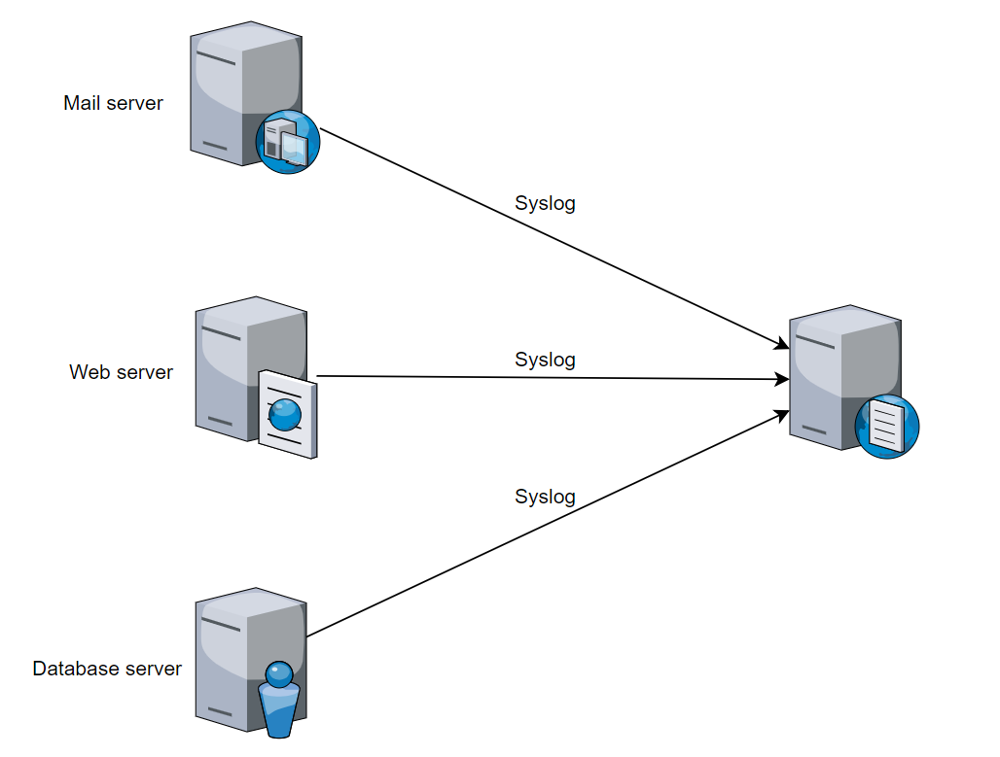

- Nếu bạn là quản trị viên hệ thống Linux , có lẽ bạn dành nhiều thời gian để duyệt các tệp nhật ký của mình để tìm thông tin liên quan về các sự kiện trong quá khứ.

- Hầu hết thời gian, bạn không làm việc với một máy đơn lẻ, nhưng với nhiều máy Linux khác nhau, mỗi máy có bộ lưu trữ nhật ký cục bộ riêng.
- Bây giờ nếu bạn đã duyệt nhật ký cho nhiều máy khác nhau, bạn sẽ phải kết nối riêng với từng máy, xác định vị trí nhật ký và cố gắng tìm thông tin mà bạn đang tìm kiếm.

- Điều này là tất nhiên trong trường hợp bạn có thể truy cập vật lý vào máy, giả định rằng máy đã hoạt động và bạn không bị từ chối quyền truy cập vào máy.

Điều gì xảy ra nếu chúng ta có thể truy cập các tệp nhật ký từ một điểm duy nhất?

- Log tâp trung là quá trình tập trung, thu thập, phân tích… các log cần thiết từ nhiều nguồn khác nhau về một nơi an toàn để thuận lợi cho việc phân tích, theo dõi hệ thống.

Tại sao lại phải sử dụng log tập trung?

- Do có nhiều nguồn sinh log
- Có nhiều nguồn sinh ra log, log nằm trên nhiều máy chủ khác nhau nên khó quản lý.
- Nội dung log không đồng nhất (Giả sử log từ nguồn 1 có có ghi thông tin về ip mà không ghi thông tin về user name đăng nhập mà log từ nguồn 2 lại có) -> khó khăn trong việc kết hợp các log với nhau để xử lý vấn đề gặp phải.
- Định dạng log cũng không đồng nhất -> khó khăn trong việc chuẩn hóa
Đảm bảo tính toàn vẹn, bí mật, sẵn sàng của log.
- Do có nhiều các rootkit được thiết kế để xóa bỏ logs.
- Do log mới được ghi đè lên log cũ -> Log phải được lưu trữ ở một nơi an toàn và phải có kênh truyền đủ đảm bảo tính an toàn và sẵn sàng sử dụng để phân tích hệ thống.

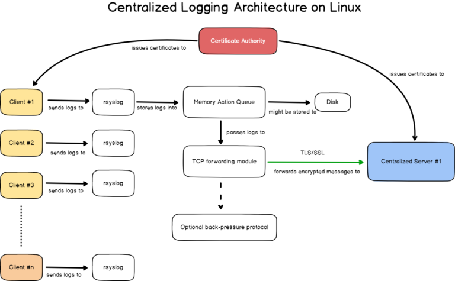

Ưu điểm:

- Giúp quản trị viên có cái nhìn chi tiết về hệ thống -> có định hướng tốt hơn về hướng giải quyết
- Mọi hoạt động của hệ thống được ghi lại và lưu trữ ở một nơi an toàn (log server) -> đảm bảo tính toàn vẹn phục vụ cho quá trình phân tích điều tra các cuộc tấn công vào hệ thống
- Log tập trung kết hợp với các ứng dụng thu thập và phân tích log khác nữa giúp cho việc phân tích log trở nên thuận lợi hơn -> giảm thiểu nguồn nhân lực.

Nhược điểm:

- Bạn có nguy cơ quá tải máy chủ syslog của mình: với cấu ​​trúc này, bạn đang đẩy các bản ghi đến một máy chủ từ xa. Hậu quả là, nếu một máy bị tấn công và bắt đầu gửi hàng ngàn log messages, có nguy cơ làm quá tải máy chủ log.
- Nếu máy chủ nhật ký của bạn bị hỏng, bạn sẽ mất khả năng xem tất cả các nhật ký được gửi bởi khách hàng. Hơn nữa, nếu máy chủ ngừng hoạt động, máy khách sẽ bắt đầu lưu trữ thư cục bộ cho đến khi máy chủ khả dụng trở lại, do đó không gian đĩa ở phía máy khách sẽ dần bị đầy.