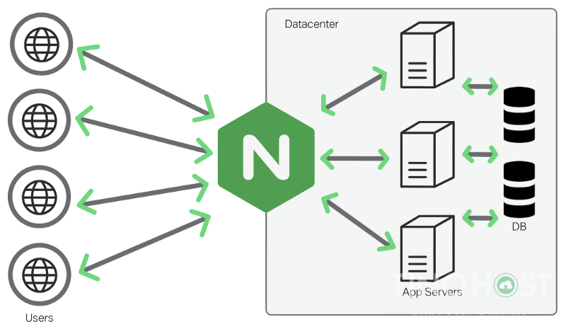
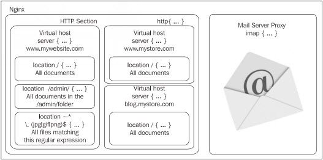

# Tìm hiểu Nginx Web Server

## Mục lục

[1. Tổng quan về web server](#1)

[2. Giới thiệu web server ](#2)

[3. Giới thiệu Nginx web server](#3)
- [3.1 Kiến trúc của Nginx.](#3.1)
- [3.2 Cách NGINX hoạt động](#3.2)
- [3.3 Các tính năng của NGINX](#3.3)
- [3.4 So sánh Nginx và apache](#3.4)

[4. Giới thiệu các module trong Nginx](#4)

---

## 1. Tổng quan về web server

Là máy tính mà trên đó cài đặt phần mềm phục vụ web, đôi khi người ta cũng gọi chính phần mềm đó là web server. Tất cả các web server đều hiểu và chạy được các file *.htm và *.html. Tuy nhiên mỗi web server lại phục vụ một số kiểu file chuyên biệt chẳng hạn như llS của Microsoft dành cho *.asp, *.aspx…; Apache, Nginx dành cho *.php…; Sun Java system web server của SUN dành cho *.jsp…

Ở phần lõi của máy chủ web là một dịch vụ web phục vụ nội dung tĩnh cho một trình duyệt bằng cách tải một tập tin từ đĩa và chuyển nó lên mạng, tới một người sử dụng trình duyệt web. Sự trao đổi hoàn toàn này được thực hiện gián tiếp thông qua một trình duyệt và một máy chủ kết nối tới một thiết bị khác sử dụng HTTP. Bất kỳ máy tính nào cũng có thể vào trong một dịch vụ web bằng cách cài đặt phần mềm dịch vụ và kết nối internet.

## 2 Giới thiệu web server
Máy chủ Web Server là máy chủ có dung lượng lớn, tốc độ cao, được dùng để lưu trữ thông tin như một ngân hàng dữ liệu, chứa những website đã được thiết kế cùng với những thông tin liên quan khác. (các mã Script, các chương trình, và các file multimedia)

Web Server có khả năng gửi đến máy khách những trang Web thông qua môi trường Internet sử dụng các giao thức như  HTTP, HTTPS và các giao thức khác.

Tất cả các Web Server đều có một địa chỉ IP (IP Address) hoặc cũng có thể có một Domain Name. Giả sử khi bạn đánh vào thanh Address trên trình duyệt của bạn một dòng http://www.abc.com sau đó gõ phím Enter bạn sẽ gửi một yêu cầu đến một Server có Domain Name là www.abc.com. Server này sẽ tìm trang Web có tên là index.htm rồi gửi nó đến trình duyệt của bạn.

Bất kỳ một máy tính nào cũng có thể trở thành một Web Server bởi việc cài đặt lên nó một chương trình phần mềm Server Software và sau đó kết nối vào Internet.

Khi máy tính của bạn kết nối đến một Web Server và gửi đến yêu cầu truy cập các thông tin từ một trang Web nào đó, Web Server Software sẽ nhận yêu cầu và gửi lại cho bạn những thông tin mà bạn mong muốn.

Giống như những phần mềm khác mà bạn đã từng cài đặt trên máy tính của mình, Web Server Software cũng chỉ là một ứng dụng phần mềm. Nó được cài đặt, và chạy trên máy tính dùng làm Web Server, nhờ có chương trình này mà người sử dụng có thể truy cập đến các thông tin của trang Web từ một máy tính khác ở trên mạng (Internet, Intranet).

Web Server còn có thể được tích hợp với CSDL (Database), hay điều khiển việc kết nối vào CSDL để có thể truy cập và kết xuất thông tin từ CSDL lên các trang Web và truyền tải chúng đến người dùng.

Server phải hoạt động liên tục 24/24 giờ, 7 ngày một tuần và 365 ngày một năm, để phục vụ cho việc cung cấp thông tin trực tuyến. Vị trí đặt server đóng vai trò quan trọng trong chất lượng và tốc độ lưu chuyển thông tin từ server và máy tính truy cập.

## 3. Giới thiệu Nginx web server. 

NGINX là một phần mềm web server mã nguồn mở, sử dụng kiến trúc hướng sự kiện (event-driven) không đồng bộ (asynchronous). Mục tiêu ban đầu để phục vụ HTTP cache nhưng sau được áp dụng vào reverse proxy, HTTP load balancer và các giao thức truyền mail như IMAP4, POP3, và SMTP

NGINX là một phần mềm web server mã nguồn mở đáng tin cậy

NGINX chính thức ra đời vào tháng 10/2014. Đây là phần mềm giúp server có tốc độ và khả năng mở rộng lớn nhất, đồng thời, xử lý và thao tác trên hàng nghìn kết nối cùng lúc. Do đó, rất nhiều “ông lớn” công nghệ hiện nay đều lựa chọn NGINX như Google, Adobe, Netflix, WordPress…

### 3.1 Kiến trúc của Nginx.

Khi được khởi chạy service, nginx khởi tạo môt tiến trình chủ và cũng là tiến trình duy nhất tồn tại trong bộ nhớ Master Process. Tiến trình này không chịu trách nhiệm tự xử lý bất kỳ request nào từ phía client mà thay vào đó nó sinh ra các tiến trình con gọi là Worker Process để xử lý các request này.

Để định nghĩa cho các Worker Process này, chúng ta cần sử dụng tệp tin cấu hình để xác định số tiến trình, số lượng kết nối , tài khoản và nhóm tài khoản mà mỗi Worker Process chạy

### 3.2 Cách NGINX hoạt động 

Về cơ bản, NGINX cũng hoạt động tương tự như các web server khác. Khi bạn mở một trang web, trình duyệt của bạn sẽ liên hệ với server chứa website đó. Server sẽ tìm kiếm đúng file yêu cầu của website và gửi về cho bạn. Đây là một trình tự xử lý dữ liệu single – thread, nghĩa là các bước được thực hiện theo một trình tự duy nhất. Mỗi yêu cầu sẽ được tạo một thread riêng.

Tuy nhiên, NGINX hoạt động theo kiến trúc bất đồng bộ (asynchronous) hướng sự kiện (event driven). Nó cho phép các threads tương đồng được quản lý trong một tiến trình (process). Mỗi process hoạt động sẽ bao gồm các thực thể nhỏ hơn, gọi là worker connections dùng để xử lý tất cả threads.

Worker connections sẽ gửi các yêu cầu cho worker process, worker process sẽ gửi nó tới master process, và master process sẽ trả lời các yêu cầu đó. Đó là lý do vì sao một worker connection có thể xử lý đến 1024 yêu cầu tương tự nhau. Nhờ vậy, NGINX có thể xử lý hàng ngàn yêu cầu khác nhau cùng một lúc.

### 3.3 Các tính năng của NGINX.

Máy chủ NGINX có nhiều tính năng và ưu điểm vượt trội trong lập trình:

- Có thể xử lý hơn 10.000 kết nối cùng lúc với bộ nhớ thấp;
- Phục vụ tập tin tĩnh (static files) và lập chỉ mục tập tin;
- Tăng tốc proxy ngược bằng bộ nhớ đệm (cache); cân bằng tải đơn giản và khả năng chịu lỗi;
- Hỗ trợ tăng tốc với bộ nhớ đệm của FastCGI, uWSGI, SCGI, và các máy chủ memcache;
- Kiến trúc modular; tăng tốc độ nạp trang bằng nén gzip tự động;
- Hỗ trợ mã hoá SSL và TLS;
- Cấu hình linh hoạt; lưu lại nhật ký truy vấn;
- Chuyển hướng lỗi 3XX-5XX;
- Rewrite URL (URL rewriting) dùng regular expressions;
- Hạn chế tỷ lệ đáp ứng truy vấn;
- Giới hạn số kết nối đồng thời hoặc truy vấn từ 1 địa chỉ;
- Khả năng nhúng mã PERL;
- Hỗ trợ và tương thích với IPv6; Xem thêm bài viết IPv6 là gì?
- Hỗ trợ WebSockets;
- Hỗ trợ truyền tải file FLV và MP4.

### 3.4 So sánh Nginx và apache

Khác biệt giữa Apache Server và NGINX server là gì?

So với Apache server, NGINX server có khá nhiều ưu điểm

Sự khác biệt cơ bản nhất của NGINX server và Apache server  là trong cách kết nối được xử lý bởi hai phần mềm.

Trong khi Apache sử dụng cơ chế chia luồng (forked threaded), hoặc keep-alive, giữ một kết nối mở cho mỗi người dùng thì NGINX sử dụng một vòng lặp sự kiện không bị chặn (non-blocking event loop), giúp các kết nối vùng (pools connection) hoạt động không đồng bộ thông qua các tiến trình công việc. Nhờ đó, NGINX hỗ trợ CPU và RAM không bị ảnh hưởng bởi những thời điểm có lượng truy cập cao.

Bên cạnh đó, trong khi Apache server có thể xử lý cả nội dung tĩnh bằng cách sử dụng các phương pháp dựa trên file thông thường và nội dung động bằng cách nhúng một bộ xử lý của ngôn ngữ  thì NGINX chỉ xử lý được nội dung tĩnh. Vì vậy, cần phải cấu hình server này và bộ vi xử lý dựa trên những giao thức mà nó có thể kết nối được.

So với Apache, NGINX mang nhiều ưu điểm. NGINX sở hữu hầu hết các tính năng của Apache. Bên cạnh đó, nó có ưu thể hơn so với Apache nhờ tốc độ xử lý các truy vấn cực cao và hiệu suất sử dụng bộ nhớ máy chủ. Đặc biệt nhất chính là server này lại sử dụng rất ít Ram và CPU đối với một khối lượng truy vấn cực kỳ lớn.

## 4.Giới thiệu các module trong Nginx
 
Module HTTP Core là thành phần chứa tất cả các khối, chỉ thị và các biến cơ bản của máy chủ HTTP. Mặc định module này được cài đặt trong khi biên dịch, nhưng không được bật lên khi Nginx chạy, việc sử dụng module này là không bắt buộc

Module này là 1 trong những module tiêu chuẩn lớn nhất của Nginx – nó cung cấp 1 số lượng lớn các chỉ thị và biến. Để có thể hiểu được tất cả các yếu tố này và vai trò của chúng, chúng ta sẽ bắt tay vào tìm hiểu 3 khối chỉ thị chính: http, server và location.

- Khối http : Được khai báo ở phần đầu của tập tin cấu hình. Nó cho phép chúng ta định nghĩa các chỉ thị và các khối từ tất cả các module liên quan đến khía cạnh HTTP của Nginx. Khối chỉ thị này có thể được khai báo nhiều lần trong tập tin cấu hình, và các giá trị chỉ thị được chèn trong khối http sau sẽ ghi đè lên các chỉ thị nằm trong khối http trước đó

- Khối server : Khối này cho phép chúng ta khai báo 1 website. Nói cách khác, 1 website cụ thể (được nhận diện bởi 1 hoặc nhiều hostname) được thừa nhận bới Nginx và nhận cấu hình của chính nó. Khối này chỉ có thể được dùng bên trong khối http.

- Khối location : Cho phép chúng ta định nghĩa 1 nhóm các thiết lập được áp dụng cho 1 vị trí cụ thể trên website (thể hiện qua URL của website đó). Khối location có thể được dùng bên trong 1 khối server hoặc nằm chồng bên trong 1 khối location khác.

Trong biểu đồ trên, khu vực HTTP, được định nghĩa bởi khối http, bao quanh toàn bộ các cấu hình liên quan đến web. Nó cũng chứa 1 hoặc nhiều khối server, định nghĩa các tên miền của các website mà chúng ta có. Với mỗi website này, chúng ta có thể định nghĩa nhiều khối location mà cho phép chúng ta áp dụng các thiết lập bổ sung đến 1 URI yêu cầu cụ thể của website hoặc các URI yêu cầu khớp 1 mẫu nào đó.