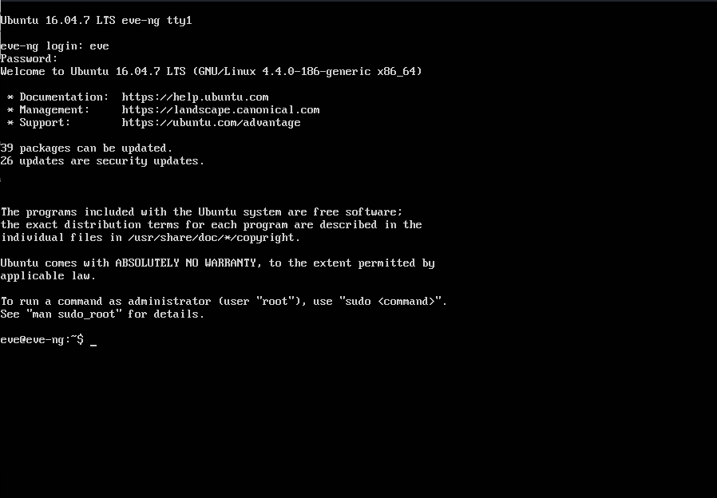
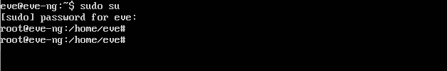
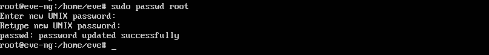
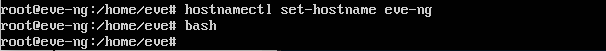
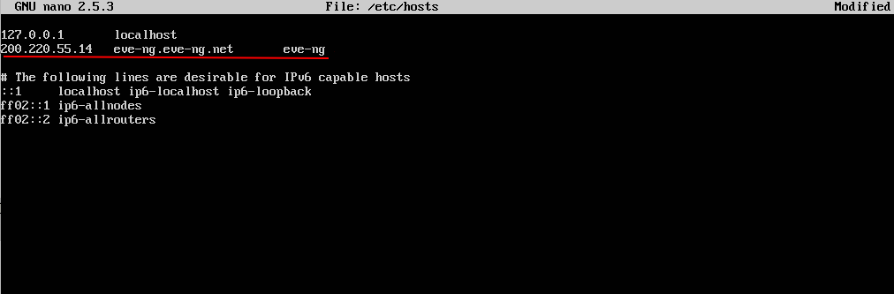
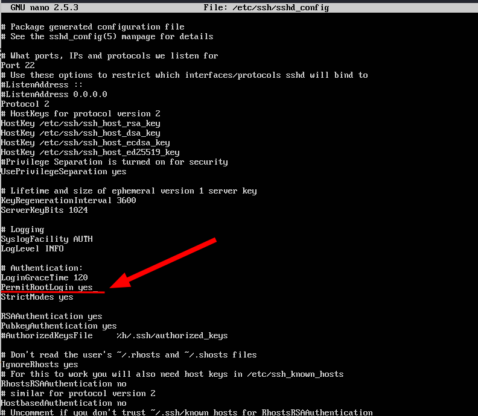
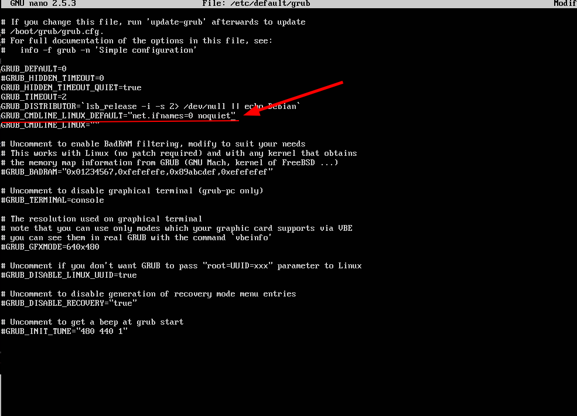
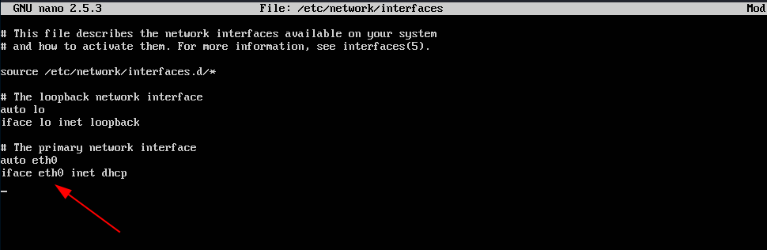
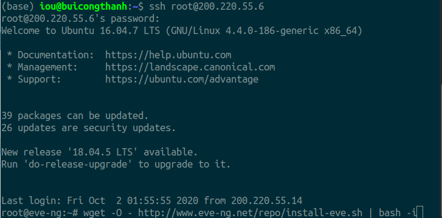

yêu cầu đã cài đặt xong ubuntu server 16.04 LTS 




Đăng nhập với tài khoản root vào ubuntu server




Tạo tài khoản root trên ubuntu server để dử dụng được quyền cao nhất.



Thay đổi tên hostname của máy



Thay đổi địa chỉ host 




Chỉnh sửa file cấu hinh ssh để tài khoản root có thể đăng nhập được



Khởi động lại ssh 
```
sudo service ssh restart 
```
Chỉnh sửa trình từ boot của chương trình grub vào hệ thống.



Hoặc ta có thể sử dụng câu lệnh sau để thực hiện. Chức năng tương tự thao tác trên.
```
sed -i -e 's/GRUB_CMDLINE_LINUX_DEFAULT=.*/GRUB_CMDLINE_LINUX_DEFAULT="net.ifnames=0 noquiet"/' /etc/default/grub
```

Sau đó cập nhật grub của máy tính
```
update-grub
```
Sau đó thay đổi tên interface vì khi ta thay đổi chương trình grub khi boot lại nó sẽ không nhận interface cũ mà ubuntu server tạo ra. Bước này rất quan trọng.



Sau đó khởi động lại server
```
init 6
```


Phần 2: Cài đặt gói cài đặt  quan trong nhất của eve-ng

Cài đặt bằng câu lệnh

```
wget -O - http://www.eve-ng.net/repo/install-eve.sh | bash -i
```

Nếu không có lệnh `wget` thì ta  cần cài đặt lệnh theo cú pháp sau:

```
sudo apt-get install wget -y 
```

Sau đó thực hiện lại




Khi cài đặt xong thì ta cần khởi động lại máy server

```
reboot
```


Phần 3 : Cấu hình cài đặt eve-ng

Để  đê dang thao tác và cấu hình thêm các device vào eve-ng thì ta cần cài đặt giao diện dồ họa cho ubuntu server


```
sudo apt-get install ubuntu-desktop
```

