# Hướng dẫn cài đặt worppress trên censtos 7.
# Mục lục

[1. Wordpress là gì.](#1)


[2. Cài đặt wordpress.](#2)
- [2.1. Cài đăt Apache.](#2.1)
- [2.2. Cài đặt MySQL (MariaDB).](#2.2)
- [2.2. Cài PHP.](#2.2)
- [2.4. Tạo một MySQL Database và User cho wordpress.](#2.4)
- [2.5. Cài và cấu hình wordpress.](#2.5)

[3. Cấu hình thêm tên miền](#3)
- [3.1 Cài đặt tên miền](#3.1)
- [3.2 Cấu hình apache ](#3.2)
- [3.3 Cấu hình wordpress](#3.3)
--------
<a name="1"></a>
##  1. Wordpress là gì.
Wordpress là môi công cụ tạo website và viết blog miễn phí, mã nguồn mở sử dụng PHP và MySQL. Wordpress hiện là một CMS ( Content Management Systems) phổ biến nhất trên internet, có rất nhiều plugin để mở rộng chức năng của nó. 

<a name="2"></a>

## 2. Cài đặt wordpress.
Trước khi cài wordpress ta phải cài LAMP stack ( Linux, Apache, MySQL, PHP) cho máy  Centos 7.

<a name="2.1"></a>
### 2.1. Cài đăt Apache.
Apache web server là một web server nổi tiếng bậc nhất trên thế giới hiện nay để quản lý website.

Cài đăt apache trên máy Centos 7.
``` 
yum install httpd -y 
```
Sau khi web server được cài đặt ta bật dịch vụ đó lên và đặt khởi động cùng hệ thống.

```
systemctl start httpd
systemctl enable httpd
```
Kiểm tra apache đã được cài đặt thành công trên Centos 7 hay chưa có thể sử dụng các cấu lệnh: ``netstat``, ``netlet``, hoặc sử dụng trình duyệt web.

Kiểm tra cổng 80 xem có hoạt động không vì apache sử dụng cổng 80.
- Sử dụng lệnh:
    ``` 
    yum install lsof -y
    lsof -i :80
    ```


<a name="2.2"></a>
### 2.2. Cài đặt MySQL (MariaDB).
MariaDB là một hệ quản trị cơ sở dữ liệu quan hệ mã nguồn mở, nó được tạo ra như một nhánh phần mềm của MySQL được sử dụng rộng rãi. MariaDB dựa trên SQL.

Cài đặt MariaDB trên centos 7:
```
yum install mariadb-server mariadb -y
```
Cài đặt xong ta bật dịch vụ.
```
systemctl start mariadb
```

Tiếp đến đổi mất khẩu cho tài khoản root trong MariaDB.
```
mysql_secure_installation
```
Tiếp đến làm theo hướng dẫn nhập mật khẩu mới và yes.

Cuối cùng là khởi động MariaDB.
```
systemctl enable mariadb.service
```

Kiểm tra MariaDB.
```
mysql -u root -p
```
Tiếp đến nhập mật khẩu vừa setup.

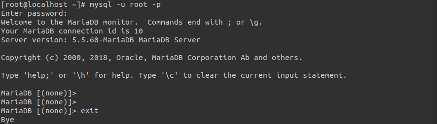

Như vậy là đã thành công cài mariadb.

<a name="2.2"></a>
### 2.2. Cài PHP.
PHP là một phần của quá trình hoạt động của webserver có trách nhiệm xử lý code để mô phỏng nội dung động. Nó sẽ chạy lệnh kết hớp với hệ cơ sở dữ liệu của MySQL ( MariaDB) để nhận thông tin và xử lý rồi đưa ra kết quả trên webserver.

Cài PHP trên centos 7.
```
yum install php php-mysql -y 
```
Tiếp đến khởi động lại Apache webserver để  PHP cùng hoạt động.
```
systemctl restart httpd.service
```
Tiếp theo ta nên cài một số modun hỗ  trợ cho PHP.

Để xem thư viện modun PHP.
```
yum search php-
yum install php-fpm
yum install php-gd
```
Kiểm tra apache webserver có sử dụng được PHP hay không thì ta thêm 1 file php vào đường đẫn **/var/www/html** đây là đường đẫn file sử dụng của apache webserver.
```
echo "<?php phpinfo(); ?>" >>  /var/www/html/info.php
```
Khởi động lại apache
```
systemctl restart httpd
```
Kiểm tra trên máy Centos 7
```
php -v
```
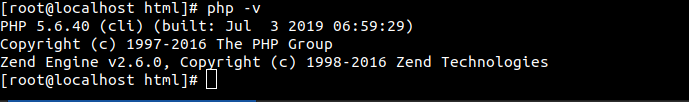

Kiểm tra xen đã cài đặt thành công php chưa ta mở trình duyệt web gõ:
```
http://192.168.122.40/info.php
```
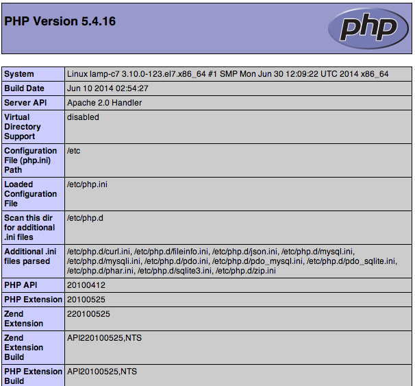

Như vậy là php đã hoạt động trên apache.

<a name="2.4"></a>
### 2.4. Tạo một MySQL Database và User cho wordpress.
Wordpress sử dụng môt cở sở sữ liệu quan hệ để quản lý thông tin cho các trang web và người sử dụng. Vì đã cài MariaDB nên ta tạo  môt database và một user để làm việc với wordpress.

Cài đặt, cấu hình với MySQL trên centos 7.

Login vào root ( administrative) account của MySQL.
```
mysql -u root -p
```
Nhâp pass và vào giao diện của MySQL.

Tạo môt database mới để sử dụng cho wordpress. Ở đây tôi đặt tên là *wordpress*.
```
create database worspress;
```
Tạo user mới và đặt mật khẩu.
```
create user 'thanhbc'@'192.168.122.40' identified by 'i2u';
```
Phân quyền cho user.
```
use wordpress;
grant all privileges on wordpress to 'thanhbc'@'192.168.122.40' identified by 'i2u';
```
Cập nhật các thay đổi trên.
```
flush privileges;
```
Sau đó thoát ra khỏi giao diện của MySQL.
```
exit
```

<a name="2.5"></a>
### 2.5. Cài và cấu hình wordpress.
Tải gói cài đặt wordpress từ trang chủ wordpress.org

Cài đặt wordpress trên centos 7.
```
yum install wget -y
wget http://wordpress.org/latest.tar.gz
```

Giải nén file vừa tải về ta được 1 thư mục là wordpress.
```
tar xzvf latest.tar.gz
```
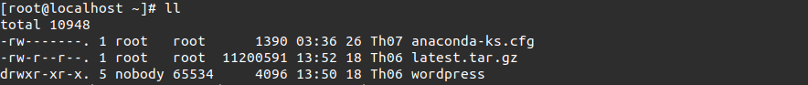

Di chuyển file **wordpress** đến **/var/www/html**.
```
mv wordpress /var/www/html
```
Kiểm tra thự mục đã được di chuyển chưa.
```
cd /var/www/html/wordpress
ll
```
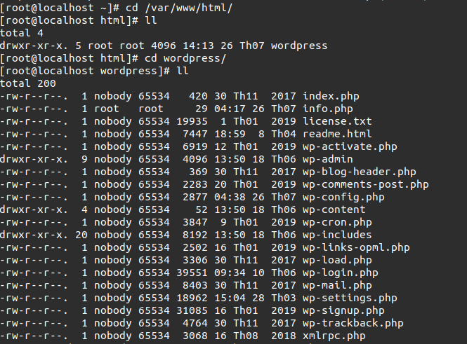

Cấu hình MySQL cho wordpress.

File cấu hình chính của wordpress có tên là wp-config.php. Ta có một file backup cấu hình được đính kèm với wordpress ta sao chép nó vào file wp-config.php để cấu hình.
```
mv wp-config-sample.php wp-config.php
```
Tiếp đến sử dụng vim để chỉnh sửa thông số cần thiết.
```
vim wp-config.php
```
Tìm kiếm và sửả các thông số sau.

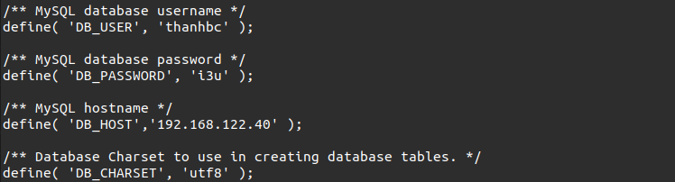

Trong đó:
- **DB_USER** : tên user được tạo trong database.
- **DB_PASSWORD** : Mật khẩu đặt cho user trên.
- **DB_HOST**  : đia chỉ IP của máy chủ cài wordpress lưu database.
Đây là các thông sô đã được setup từ phần tạo database và user cho wordpress ở phần trước. Lưu file và đóng file.

Kiểm tra trên Ubuntu 19.06.

Mở trình duyệt web và gõ.
```
http://192.168.122.40/wordpress
```
Tại đây nó sẽ báo lỗi và cần cập nhật lên phiên bản PHP 5.6.20 trở lên.

Cấu hình nâng cấp PHP trên Centos 7.

Làm theo các câu lệnh sau để cập nhật lên PHP 5.6.40.
```
rpm -Uvh https://dl.fedoraproject.org/pub/epel/epel-release-latest-7.noarch.rpm
rpm -Uvh https://rpms.remirepo.net/enterprise/remi-release-7.rpm
```
Chỉnh sửa một sô thông số trong file **/etc/yum.repos.d/remi.repo**.
```
vim  /etc/yum.repos.d/remi.repo
```

- Chỉnh **enabled=0** thành **enabled=1**.

    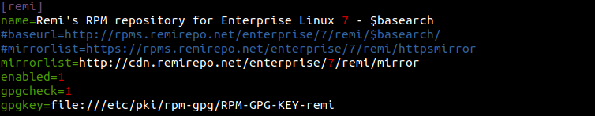
- Chỉnh **enabled=0** thành **enabled=1**.

    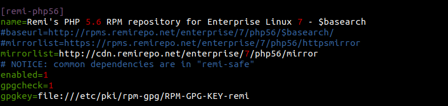

Sau đó lưu file và thoát.

Tiến hànhh upgrade lên PHP 5.6.40.
```
yum -y upgrade php*
```
Khởi động lại apache.
```
systemctl restart httpd
```

Kiểm tra  trên Ubuntu 19.04.

Mở trình duyệt web và gõ.
```
http://192.168.122.40/wordpress
```
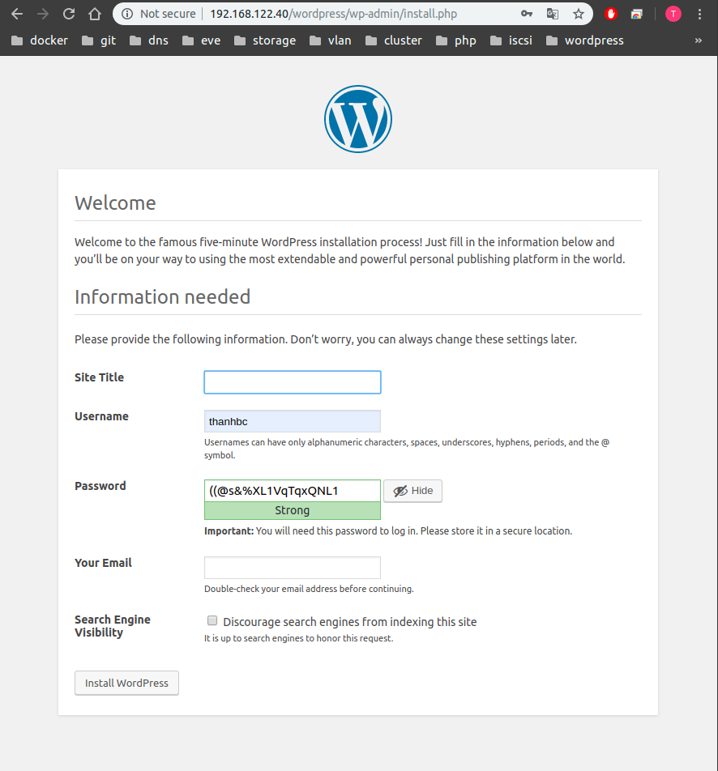

Như vậy là đã cài thành công wordpress trên centos 7.

Tiếp theo cài đặt theo hướng dẫn để tạo 1 trang blog wordpress.

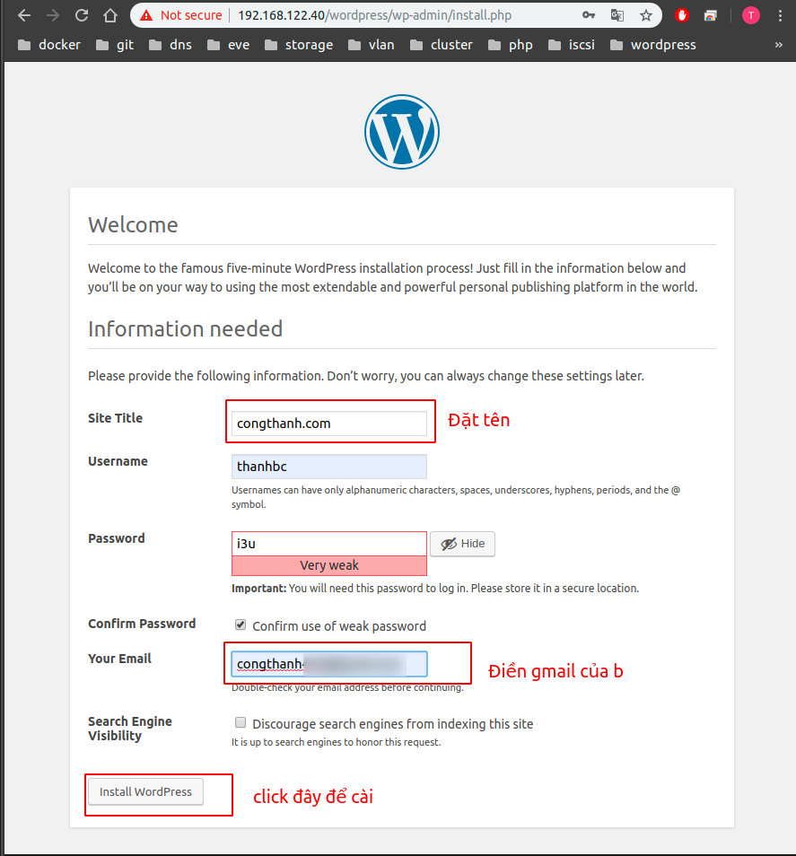

Vậy  là ta đã cài đặt thành công wordpress trên centos 7.

<a name="3"></a>
## 3. Cài đặt tên miền cho trang wordpress

### 3.1 Cài đặt tên miền.
Mua tên miền và trỏ tên miền về địa chỉ host

Ở đây tôi mua 1 tên miền có tên là **congthanhxxxx.xxx** tại công ty [Nhân Hòa](https://nhanhoa.com/)

Tiếp đến truy cập vào trang quản trị tên miền của nhân hòa là [zonedns.vn](https://zonedns.vn/)

Đăng nhập vào hệ thống. Tài khoản và mật khẩu được gửi về từ nhân hòa.

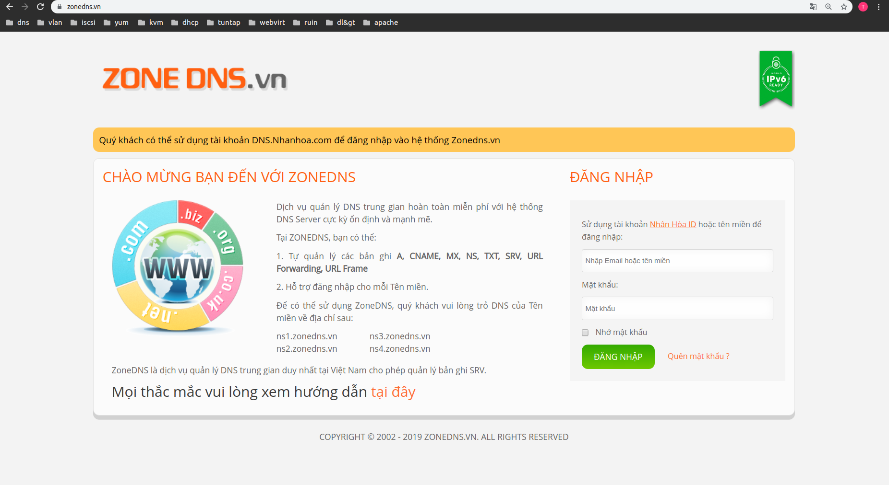

Tiếp đến ta trỏ tên miền đến địa chỉ IP host qua các bản ghi.

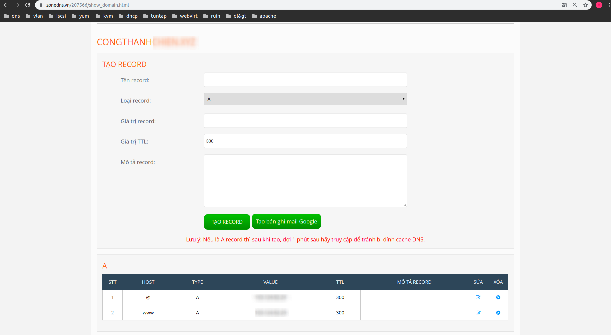

Lưu lại và thoát.

### 3.2 Cấu hình apache 
Cấu hình apache sử dụng virtualhost .

Tạo file lưu virtualhost. 
```
touch /etc/httpd/conf.d/congthanhchien.xyz
```
Thêm các dòng sau vào file.
```
<VirtualHost *:80>
    ServerName congthanhchien.xyz
    DocumentRoot "/var/www/html/wordpress/"
    <Directory "/var/www/html/wordpress">
       DirectoryIndex index.php
       Options FollowSymLinks
       AllowOverride none
       Require all granted
    </Directory>
</VirtualHost>
```

Lưu lại và khởi động lại apache.
```
systemctl restart httpd
```
### 3.3 Cấu hình wordpress
Sau đó mở trình duyệt web lên và gõ đường dẫn. ``http://192.168.122.40/wordpress/wp-admin``

Tiếp đến sửa đổi tên đường dẫn của wordpress để sử dụng tên miền.

Ta vào mục. Setting -> General 

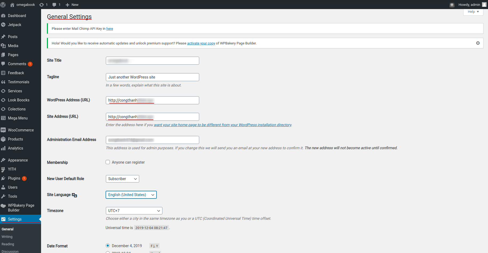

Lưu lại và tải lại trang.

Kiểm tra mở trình web lên gõ ``http://congthanhxxxx.xxx`` trang web đã cài thành công.
