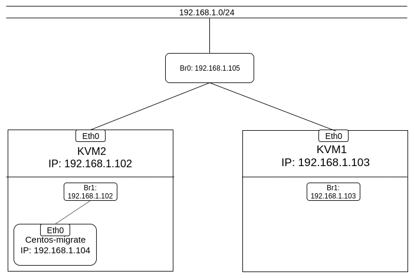
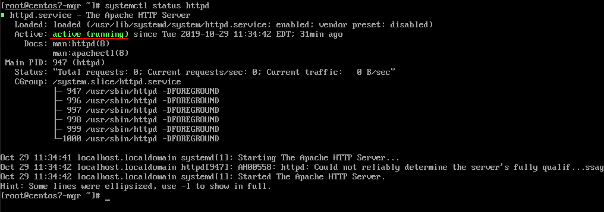
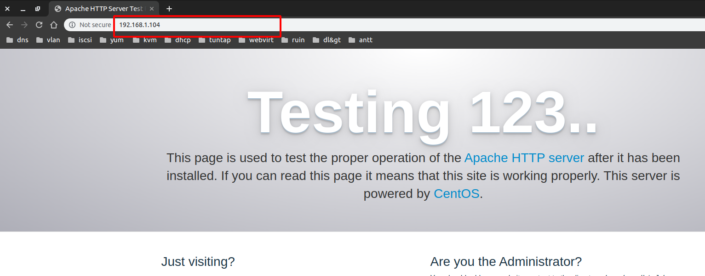

# sử dụng live migrate.

## 1. Sử dụng storage migrate với bridge.


Trong bài viết này tôi sẽ storage migrate vm Centos-mgr từ KVM2 sang KVM1.
### 1.1 Mô hình và IP Planning.
Mô hình.



#### IP planning.
|  Tên máy ảo  | Hệ điều hành    |IP address | Subnet mask |Default gateway|
|------|------|-------|-----|-------|
|KVM1| Centos7|192.168.1.103| /24| 192.168.1.1|
|KVM2| Centos7| 192.168.1.102| /24|192.168.1.1|

<a name ="4.2"></a>

### 1,2 Cài đặt storage migrate.

#### Cấu hình phân giải tên miền.

Để có thể live migrate giữa 2 KVM host thì 2 máy này cần biết tên miền của nhau. Bạn có thể cấu hình dịch vụ DNS phân dải tên miền cho các 2 máy này. Đây là mô hình lap có ít máy nên tôi sẽ cấu hình luôn trong file ``/etc/hosts``.

Thực hiện các thao tác sau trên lần lượt các máy

Trên máy KVM1.

Đổi tên hostname.
```
hostnamectl set-hostname kvm1
bash
```
Chỉ ra tên miền và địa chỉ của máy KVM host còn lại trong file ``/etc/hosts`` Thêm dòng sau vào cuối file.
```
echo "192.168.1.103 kvm1" >> /etc/hosts
echo "192.168.1.102 kvm2" >> /etc/hosts
```
Reboot lại máy.

Trên máy KVM2.

Đổi tên hostname.
```
hostnamectl set-hostname kvm2
bash
```
Chỉ ra tên miền và địa chỉ của máy KVM host còn lại trong file ``/etc/hosts`` Thêm dòng sau vào cuối file.
```
echo "192.168.1.103 kvm1" >> /etc/hosts
echo "192.168.1.102 kvm2" >> /etc/hosts
```

#### Cập nhật QEMU lên phiên bản mới nhất.

**Thực hiện trên 2 máy KVM1 và KVM2.**

Kiểm tra  phiên bản QEMU hiện tại.
```
/usr/libexec/qemu-kvm -version
```


Cài đặt  và sử dụng gói repo mới.
```
yum -y install centos-release-qemu-ev
sed -i -e "s/enabled=1/enabled=0/g" /etc/yum.repos.d/CentOS-QEMU-EV.repo
```
Cài đặt qemu-kvm.
```
yum --enablerepo=centos-qemu-ev -y install qemu-kvm-ev
```

Khởi động lại libvirtd.
```
systemctl restart libvirtd
```
Kiểm tra lại phiên bản xem đã cập nhật thành công  chưa.
```
/usr/libexec/qemu-kvm -version
```


Vì là môi trương lab nên tôi tắt firewalld và SElinux.
```
systemctl stop firewalld
setenforce 0
```
Nếu không muốn tắt firewalld thì sử dụng các lệnh sau để allows các port.
```
firewall-cmd --add-service={libvirt,libvirt-tls} --permanent
firewall-cmd --add-port=49152-49215/tcp --permanent
firewall-cmd --reload
```

Tiếp theo tạo 1 file disk trên KVM1 có dung lượng bằng với dung lượng của VM centos7-mgr trên KVM2.

#### Thực hiện trên KVM2.

Xem kích thước file disk của VM centos7-mgr trên KVM2.
```
ll /var/lib/libvirt/images/
```


Ta thấy file disk có dung lượng **10739318784 MiB**


#### Thực hiện trên KVM1.
Tạo file disk có cùng dung lượng trên KVM1.

```
qemu-img create -f qcow2 /var/kvm/images/centos7-mgr.qcow2 10739318784
```


Vì file disk chưa được lưu gì nên nó có dung lượng sử dụng là **197120 MiB**.

### 1.3. Tiến hành live storage migrate.

Khởi động VM centos7-mgr trên KVM2.


Trên máy VM centos7-mgr.

Cài đặt apache.




Tiến hành migrate trên KVM2.
```
virsh migrate --live --copy-storage-all centos7-mgr qemu+tcp://192.168.1.103/system
```
Trong quá trình live storage migrate thì tôi kiểm tra ping và kiếm tra apache thấy chúng vẫn hoạt động bình thường không xảy ra bất kỳ sự cố hay sự gián đoạn nào.


Hình ảnh này cho thấy máy VM centos7-mgr đã được chuyển sang KVM1 nhưng đang trong tráng thái pause vì nó đang trong quá trình copy dữ liệu từ KVM2 sang KVM1.

Quá trình nay copy này hơi lâu nhưng các hoạt động trong VM centos7-mgr vẫn diễn ra bình thường.



Quá trình copy đã xong.


Ta thấy VM trên KVM2 có trạng thái shutoff và VM trên KVM1 đã có trang thái running.  Kiểm tra lại các dịch vụ vẫn hoạt động bình thường.
