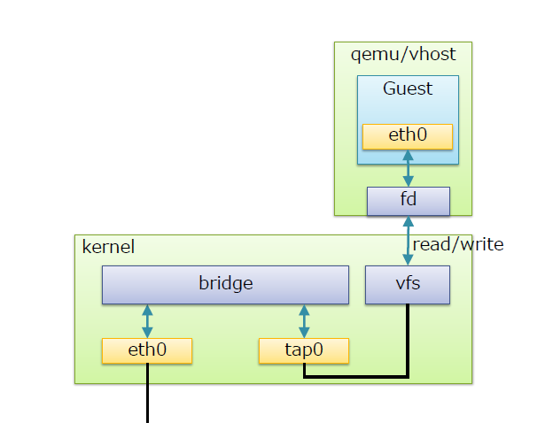
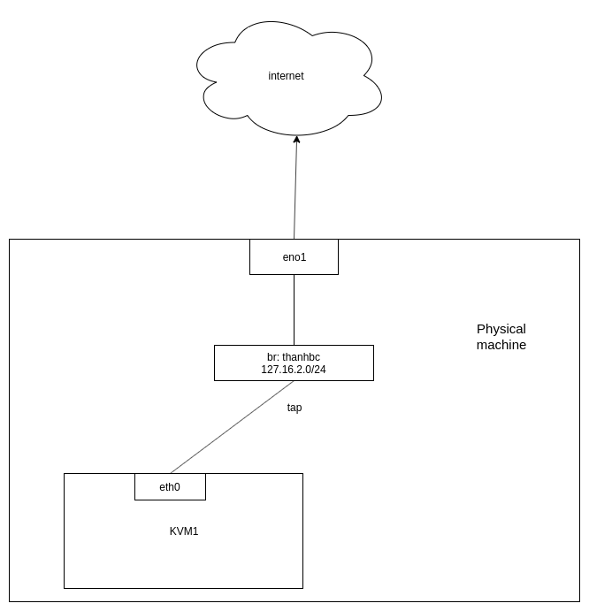
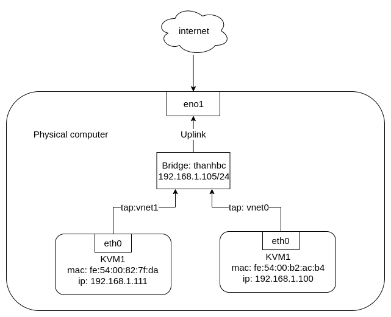
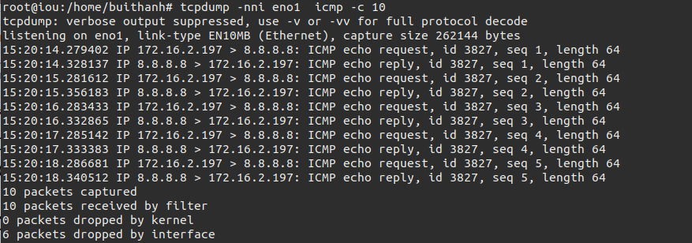
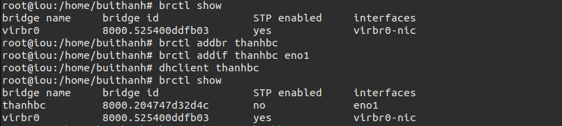
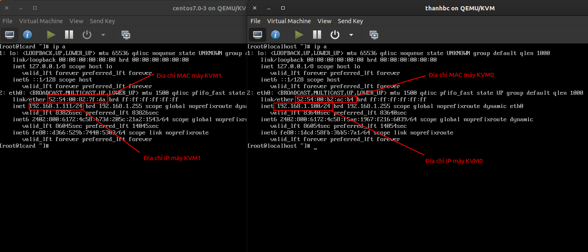
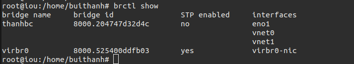
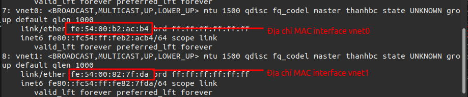
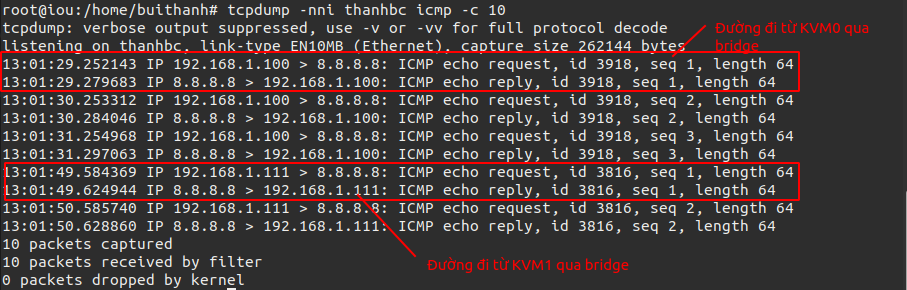
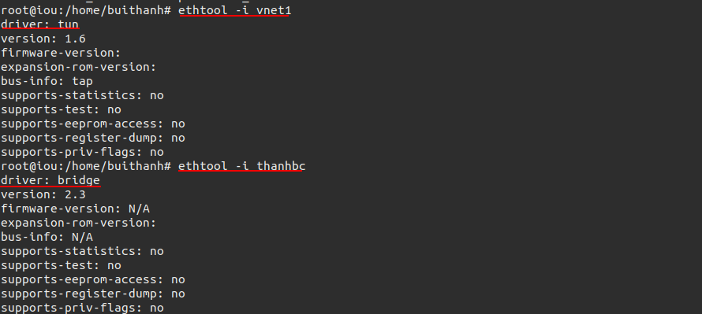

# Tìm hiểu linux bridge trong kvm.

## 1. Linux bridge là gì ?

Linux bridge cung cấp môi trường ảo hóa phần network trong kvm. Sử dụng để kết nối máy ảo và máy tính thật ra ngoài internet thông qua switch ảo này. Linux bridge thường sử dụng kết hợp với hệ thống ảo hóa KVM-QEMU.


Linux Bridge thật ra chính là một switch ảo và được sử dụng với ảo hóa KVM/QEMU. Nó là 1 module trong nhân kernel. Sử dụng câu lệnh brctl để quản lý

## 2. Cấu trúc của Linux bridge.



Tap interface.
- tap interface là một khái niệm về phần mềm được sử dụng để nói với Linux bridge là chuyến tiếp frame Ethernet vào nó. Hay nói cách khác, máy ảo kết nối tới tap interface sẽ có thể nhận được các khung frame Ethernet thô. Và do đó, máy ảo VM có thể tiếp tục được mô phỏng như là một máy vật lý ở trong mạng.

vfs ( virtual file system): tạo 1 phân vùng để nhận gói tin forward data từ máy ảo  thông qua forward database.

fd (forward database): là cổng giao tiếp chuyển tiếp dữ liệu giữa máy ảo với bridge. 

Bridge: có chức năng giống với swtich layer 2.

Port: có chức năng tương đương với port của switch thật.

## 3. Cách hoạt động.


Khi có 1 gói tin từ máy ảo muốn đi ra mạng internet thì

Bước 1: Gói tin tư máy ảo đi ra cổng eth0 của máy ảo đó.

bước 2: Gói tin từ cổng eth0 đi đến forward database.

Bước 3: Từ forward database gửi gói tin đến vùng vfs

Bước 4: Kernel lấy gói tin từ vùng vfs chuyển đến bridge qua các tap interface.

Bước 5: Từ Bridge gửi gói tin qua eth0 của máy thật và đi ra ngoài internet.

## 4. Các tính năng.
STP: Spanning tree protocol: giao thức chống vòng lặp gói tin trong mạng.

VLAN: Virtual LAN: các mạng LAN ảo, có thể cô lập các vùng trong LAN.

FDB: forward database: chuyển tiếp gói tin theo database nâng cao hiệu suật sử dụng của switch.

## 5. Mô hình lab.

Mô hình.

<<<<<<< HEAD


=======


Kiểm tra bridge 
```
brctl show
```
>>>>>>> linux bridge
Tạo linux bridge bằng lệnh:
```
brctl addbr thanhbc
```
gắn bridge vào card mạng eno1 để đi ra ngoài internet.

```
brctl addif thanhbc eno1
```

cấu hình dhcp cho bridge để tự động có địa chỉa IP.
```
dhclient thanhbc
```
<<<<<<< HEAD

Khi ta ở trên máy tính thật sử dụng tcpdump để bắt gói tin xem gói tin có đi qua bridge thanhhbc hay không.
```
tcpdump -nni thanhbc icmp -c 10
```



ta thấy có địa chỉ nguồn là 172.16.2.197 là địa chỉ của máy tính kvm  đi qua bridge thanhbc đến mạng 8.8.8.8

=======



Kiểm tra network trên 2 máy áo KVM1 và KVM2.



Khi ta bật 2 máy ảo lên kiểm tra thì thấy nó sẽ tự tạo nên 2 interface mới là vnet1 và vnet2.


Kiểm tra network trên máy thật.


ta thấy trên interface vnet1 có địa chỉ **fe:54:00:82:7f:da**
giống với địa chỉ MAC trên máy ảo KVM1 **fe:54:00:82:7f:da**. Vậy máy ảo sưr dụng tap có tên là vnet1 để kết nối với linux bridge.

Ta thầy điều tương tự với interface vnet0.

Kiểm tra tiến hành bắt gói tin icmp trên bridge thanhbc trong khi 2 máy ảo đồng thời ping  đến internet
.
>>>>>>> linux bridge


<<<<<<< HEAD
=======
kiểm tra thiết bị.

>>>>>>> linux bridge
