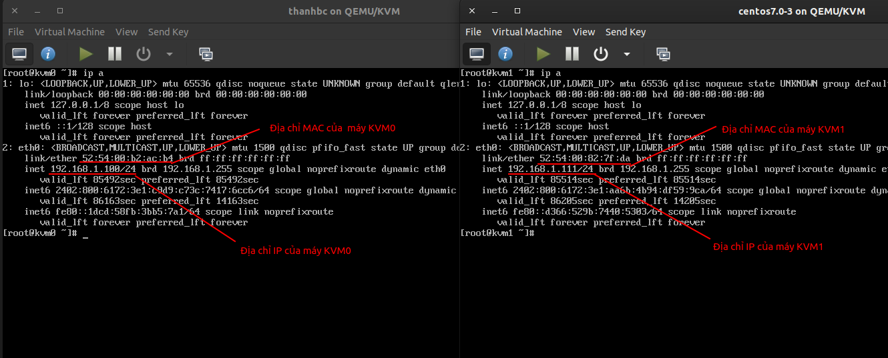
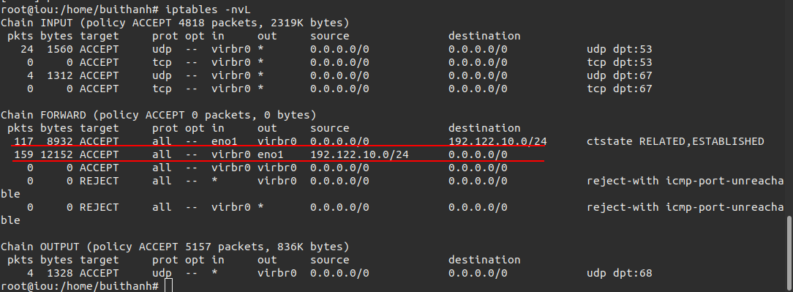
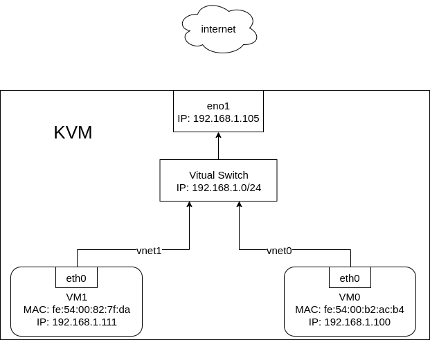

# Tìm hiểu NAT và Host-only trong kvm.

## Cơ chế NAT trong linux bridge.
Máy vậy lý sẽ tạo ra một virtual router được vận hành dưới chế độ NAT.

Sử dụng các rule trong  bảng NAT của máy tính vật lý đề định tuyến cho các máy ảo.


Điều này có nghĩa là bất kì máy ảo nào được kết nối tới nó, sử sử dụng địa chỉ IP của máy host để liên lạc ra bên ngoài. Các máy ở mạng ngoài không thể liên lạc với máy guest ở bên trong khi router ảo hoạt dộng trong chế độ NAT.

Chế độ NAT network coi libvirt server như là một router, các lưu lượng của máy ảo xuất hiện từ địa chỉ của server để ra ngoài.

Hạn chế: Virtual network mặc định hoạt động ở chế độ NAT-baased. Không may, nó thường tự động thêm các rule iptable cho dù bạn có muốn hay không


Trên máy vật lý tiến hành bắt gói tin icmp.
```
tcpdump -nni eno1 icmp -c 10
```


Trên máy vật lý tiến hành bắt gói tin icm trên interface virbr0.
```
tcpdump -nni virbr0 icmp -c 10
```


Như vậy qua trình chuyển đổi địa chỉ được hiểu bằng hình sau.


Xem iptable trên máy tính vậy lý ta thấy.



## Host-only trong KVM
Cấu trúc và cách hoat động tương tự như Linux bridge nhưng không có đường uplink kết nối ra interface của máy vật lý.

Việc cấu hình và tạo mạng isolate sẽ tự tạo thêm bridge ảo mới cho mạng. không cần tạo trước như mạng bridge network.

các máy ảo kết nối tới switch ảo có thể liên lạc với nhau và với host, nhưng lưu lượng của chúng sẽ không được đi ra ngoài host – cũng như không thể nhận các kết nối từ bên ngoài vào.


