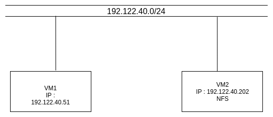
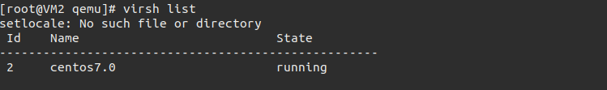
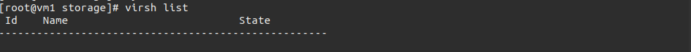

# Hướng dẫn cài đặt và sử dung live miragtion.
## 1. Live migration là gì.

KVM hỗ trợ live migration cung cấp khả năng di chuyển ác máy ảo đang chạy giữa các host vật lý mà không làm gián đoạn dịch vụ. Khả năng live migration là trong suốt với người dùng, các máy ảo vẫn duy trì trạng thái bật, kết nối mạng vẫn đảm bảo và các ứng dụng của người dùng vẫn tiếp tục duy trì trong khi máy ảo được đưa sang một host vật lý mới.

KVM cũng cho phép lưu lại trạng thái hiện tại của máy ảo để cho phép lưu trữ và khôi phục trạng thái đó vào lần sử dụng tiếp theo.

## 2. Cài đặt và sử dụng.
### 2.1 Mô hình và IP planning.
Mô hình.



IP planning
|  Tên máy ảo  | Hệ điều hành    |IP address | Subnet mask |Default gateway| Cài đặt
|------|------|-------|-----|-------|-----|
| VM1 |  Centos 7| 192.122.40.51 | /24| 192.122.40.1|KVM|
|VM2 |  Centos 8|192.122.40.51| /24 |192.122.40.1|KVM và NFS|

### 2.2 Cài đặt.
#### 2.2.1 Cài đặt trên VM2.
Trên VM2 cài NFS:
```
yum install nfs-utils nfs-utils-lib
```

Tạo thu mục share
```
mkdir storage
```

Chia sẻ thư mực này với các máy KVM host bằng cách ghi các thông tin như sau vào trong file /etc/exports

```
/root/storage 192.122.40.51/24(rw,sync,no_root_squash)
```

Địa chỉ IP bên trên là địa chỉ IP của máy KVM host

Sau đó cập nhật file export để nfs hoạt động.
```
exportfs -a
```

Khởi động dịch vụ nfs.
```
systemctl start rpcbind nfs-server
```
Khởi động NFS cùng server khi bật máy.
```
systemctl enable rpcbind nfs-server
```
Kiểm tra các port sử dụng bởi NFS.
```
rpcinfo -p
```
Tiếp đến ta cấu hình firewall để NFS client được phép truy cập.
```
sudo firewall-cmd --permanent --add-service=nfs
sudo firewall-cmd --permanent --add-service=mountd
sudo firewall-cmd --permanent --add-service=rpc-bind
sudo firewall-cmd --permanent --add-port=2049/tcp
sudo firewall-cmd --permanent --add-port=2049/udp
sudo firewall-cmd --reload
```
Kiểm tra mountpoint trên server. 
```
showmount -e localhost
```

Cài đặt trong KVM.

Khi cài đặt VM ta cần sao lưu file disk của VM vào thư mục đã mount với thư mục được share của NFS server. Khi cài máy ảo xong ta cần thêm thông tin sau vào trong file xml của VM bằng cách dùng lệnh ```vish edit tên-VM```

```
    <disk type='file' device='disk'>
      <driver name='qemu' type='qcow2' cache='none'/>
      <source file='/root/storage/centos7.0.qcow2'/>
      <target dev='vda' bus='virtio'/>
      <address type='pci' domain='0x0000' bus='0x04' slot='0x00' function='0x0'/>
    </disk>
```

Thêm vào cache=’none’ để tránh migrate tránh mất dữ liệu. Sau đó reboot lại VM. Các bước này nên thực hiện ngay sau cài VM kể cả bạn chưa có ý định live migrate ngay lúc này bởi vì khi cần migrate có thể thực hiện được luôn mà không cần phải reboot VM khi đã cài các ứng dụng lên.

Kết nối giữa 2 KVM host.

Để có thể live migrate giữa hai host thì hai host này cần phải kết nối được với nhau. Để làm được việc này ta thực hiện các bước sau ở trên cả hai máy .

```
sed -i 's/#listen_tls = 0/listen_tls = 0/g' /etc/libvirt/libvirtd.conf 
sed -i 's/#listen_tcp = 1/listen_tcp = 1/g' /etc/libvirt/libvirtd.conf
sed -i 's/#tcp_port = "16509"/tcp_port = "16509"/g' /etc/libvirt/libvirtd.conf
sed -i 's/#listen_addr = "192.122.0.1"/listen_addr = "0.0.0.0"/g' /etc/libvirt/libvirtd.conf
sed -i 's/#auth_tcp = "sasl"/auth_tcp = "none"/g' /etc/libvirt/libvirtd.conf
sed -i 's/#LIBVIRTD_ARGS="--listen"/LIBVIRTD_ARGS="--listen"/g' /etc/sysconfig/libvirtd
```

Restart lại libvirt trên 2 máy
```
systemctl restart libvirtd
```


#### 2.2.2 Cài đặt trên VM1.

Cài đặt NFS.
```
yum install nfs-utils -y
```
Khởi động dịch vụ nfs.
```
systemctl start rpcbind nfs
```
Khởi động NFS cùng server khi bật máy.
```
systemctl enable rpcbind nfs
```
Tạo thư mục storage.
```
mkdir storage
```
mount với thư mục đã share.
```
mount 192.122.40.202:/root/storage storage
```
Kiểm tra Vm trên 2 máy KVM.



trên VM1 chưa có máy ảo nào và VM2 đang có máy ảo đang hoạt động.

Cuối cùng tiến hành migrate 2 máy VM2 đến VM1.

```
virsh migrate --live centos7.0 qemu+tcp://192.122.40.51/system
```

Vậy là chúng ta đã live migrate thành công
