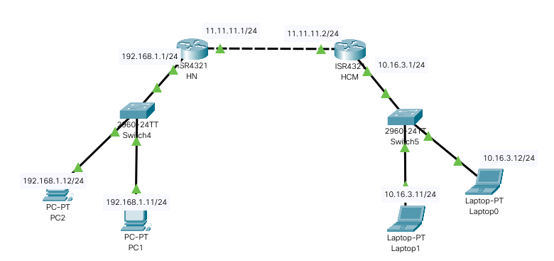
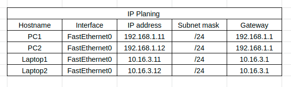
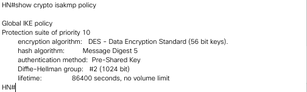
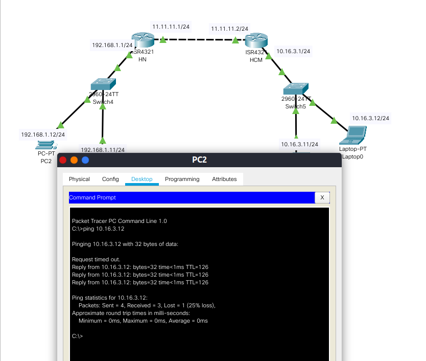
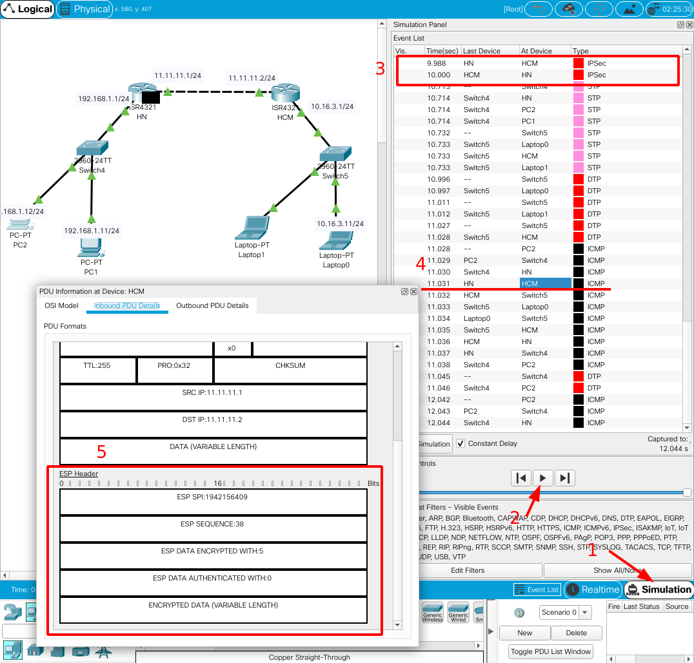

# Hướng dẫn cấu hình VPN site to site.

---

## Mục lục

[1.Cấu hình VPN site-to-site](#1)
- [1.1 Sơ đồ bài lab](#1.1)
- [1.2 Thực hiện bài cấu hình](#1.2)

---

## Đề bài: Thiết lập một kênh truyền VPN dạng site-to-site giữa 2 router HN và HCM.

## 1. Sơ đồ bài lab

Thông số cấu hình các cổng của mỗi máy như trên hình.

Switch để chế độ mặc định chưa chia VLAN và không cấu hình gì thêm

## 2. Thực hiện cấu hình

### 2.1 Cấu hình ip tĩnh cho các end device.

Vì các máy chưa cài DHCP nên chúng ta phải đặt địa chỉ IP tĩnh cho từng máy. Việc này làm cho chúng ta dễ nhận biết gói tin sẽ di chuyển trong mạng và đến địch như thế nào một cách rõ hơn.

### 2.2 Cấu hình cơ bản trên 2 router HN và HCM

Cấu hình trên router HN.

    HN>
    HN>ena
    HN#conf t
    Enter configuration commands, one per line.  End with CNTL/Z.
    HN(config)#int g0/0/0
    HN(config-if)#ip add 192.168.1.1 255.255.255.0
    HN(config-if)#no shut
    HN(config-if)# exit
    HN(config)# int g0/0/1
    HN(config-if)#ip add 11.11.11.1 255.255.255.0
    HN(config-if)#no shut
    HN(config-if)#exit
    HN(config)#ip route 0.0.0.0 0.0.0.0 11.11.11.2 #Mọi gói tin không có trong bảng routing table sẽ được chuyển qua 11.11.11.2

Cấu hình trên router HCM

    HCM>
    HCM>ena
    HCM#conf t
    Enter configuration commands, one per line.  End with CNTL/Z.
    HCM(config)#int g0/0/0
    HCM(config-if)#ip add 10.16.3.1 255.255.255.0
    HCM(config-if)#no shut
    HCM(config-if)# exit
    HCM(config)# int g0/0/1
    HCM(config-if)#ip add 11.11.11.2 255.255.255.0
    HCM(config-if)#no shut
    HCM(config-if)#exit
    HCM(config)#ip route 0.0.0.0 0.0.0.0 11.11.11.1 #Mọi gói tin không có trong bảng routing table sẽ được chuyển qua 11.11.11.1

### 2.3 Cấu hình VPN site to site  giữa 2 router HN và HCM.

#### `Bước 1: Cấu hình ISAKMP (hay còn gọi là IKE SA) `

ISAKMP (Internet Securyti Association and Key Management Protocol) IKE SA ( Internet Key Exchange Security Association) được sử dụng đề thương lượng về key và các thông số securiry dùng để thiết lập 1 kênh giao tiếp an toàn bao gồm các phần:
- Thuật toán Hash
- Thuật toán mã hóa: ở đây mình sử dụng thuật toán DES.
- Số nhóm khóa ( group key) của Diffle-Hellman
- Phương thức chứng thực
- Xác định thông tin key và peer.

Bắt đầu tiến hành cấu hình trên router HN

    HN>
    HN>ena
    HN#conf t
    Enter configuration commands, one per line.  End with CNTL/Z.
    HN(config)#crypto isakmo policy 10
    HN(config-isakmp)#hash md5
    HN(config-isakmp)#encryption des
    HN(config-isakmp)#group 2
    HN(config-isakmp)#authentication pre-share
    HN(config-isakmp)#exit
    HN(config)#crypto isakmp key cisco123 address 11.11.11.2 //xác định thông tin key và peer

Cấu  hình tương tự trên router HCM

    HCM>
    HCM>ena
    HCM#conf t
    Enter configuration commands, one per line.  End with CNTL/Z.
    HCM(config)#crypto isakmo policy 10
    HCM(config-isakmp)#hash md5
    HCM(config-isakmp)#encryption des
    HCM(config-isakmp)#group 2
    HCM(config-isakmp)#authentication pre-share
    HCM(config-isakmp)#exit
    HCM(config)#crypto isakmp key cisco123 address 11.11.11.1 //xác định thông tin key và peer

Khi cấu hình xong ta có thể kiểm tra bằng câu lệnh

    HN#show crypto isakmp  policy

Thầy kết quả như trên là ta đã thành công bước 1. Tiếp tục chuyển sang bước 2 nào.

#### `Bước 2: Cấu hinh IPSec Transform-Set (ISAKMP/IKE SA)`

Mục địch phase 2 là sử dụng IKE SA cho việc thỏa thuận IPSec SA để thiết lập IPSec tunnel bao gồm các chức năng như sau.
- Thiết lập các thông sô IPSec SA dựa trên IKE SA ở phase 1.
- Trao đổi định kỳ IPSec SA đảm bảo độ an toàn.

Bắt đầu cấu hình trên router HN.

    HN>
    HN>ena
    HN#conf t
    Enter configuration commands, one per line.  End with CNTL/Z
    HN(config)#crypto ipsec transform-set MYSET esp-md5-hmac //sử dụng giao thức esp để đóng gói dữ liệu và băm bằng md5
    HN(config)#crypto ipsec transform-set MYSET esp-des //sử dụng giao thức esp để đóng gói dữ liệu và mã hóa bằng thuật toán DES
    HN(config)#crypto ipsec security-association lifetime seconds 1800 //Thời gian tồn tại của IPSec SA
Cấu hình tương tự trên router HCM

    HCM>
    HCM>ena
    HCM#conf t
    Enter configuration commands, one per line.  End with CNTL/Z
    HCM(config)#crypto ipsec transform-set MYSET esp-md5-hmac //sử dụng giao thức esp để đóng gói dữ liệu và băm bằng md5
    HCM(config)#crypto ipsec transform-set MYSET esp-des //sử dụng giao thức esp để đóng gói dữ liệu và mã hóa bằng thuật toán DES
    HCM(config)#crypto ipsec security-association lifetime seconds 1800 //Thời gian tồn tại của IPSec SA

#### `Bước 3: Cấu hình Access Control List(ACL)`

Cấu hình ACL giúp xác định luồng dữ liệu nào sẽ dc mã hóa và cho đi qua tunnel

Cấu hình trên router HN

    HN(config)# access-list 100 permit ip 192.168.1.0 0.0.0.255 10.16.3.0 0.0.0.255
Cấu hình trên router HCM

    HCM(config)# access-list 100 permit ip 10.16.3.0 0.0.0.255 192.168.1.0 0.0.0.255

#### `Bước 4: Cấu hình Crypto Map`

Crypto map sẽ tập hợp toàn bộ thông tin chúng ta định nghĩa ở các bước trên gồm peer address, ACL, transform set. Một vài lưu ý về crypto map:
- Chỉ có thể sử dụng 1 crypto map trên 1 interface.
- Có thể sử dụng cùng 1 crypto map trên nhiêu interface khác nhau.

Bắt đầu cấu hình trên HN

    HN>
    HN>ena
    HN#conf t
    Enter configuration commands, one per line.  End with CNTL/Z
    HN(config)#crypto map MYMAP 10 ipsec-isakmp
    HN(config-crypto-map)# set peer 11.11.11.2 //thiết lập peer của kết nối
    HN(config-crypto-map)# set transform-set MYSET
    HN(config-crypto-map)#match address 100

Cấu hình tương tự như trên router HN chỉ đổi địa chỉ peer.

    HCM>
    HCM>ena
    HCM#conf t
    Enter configuration commands, one per line.  End with CNTL/Z
    HCM(config)#crypto map MYMAP 10 ipsec-isakmp
    HCM(config-crypto-map)# set peer 11.11.11.1 //thiết lập peer của kết nối
    HCM(config-crypto-map)# set transform-set MYSET
    HCM(config-crypto-map)#match address 100

#### `Bước 5: Đưa crypto map lên interface`

Cấu hình trên router HN

    HN(config)#interface   g0/0/1
    HN(config-if)# crypto map MYMAP

Cấu hình trên router HCM

    HCM(config)#interface   g0/0/1
    HCM(config-if)# crypto map MYMAP

Như vậy là ta đã cấu hình xong VPN site to site

### 3. Kiểm tra VPN tunnle

Ta kiểm tra 2 phần là: Gói tin đã được mã hóa chưa và gói tin có đi qua tunnel hay không.

###  3.1 Kiểm tra đường truyền.

Ta sẽ sử dụng lệnh `ping`. Ta  ping từ máy tính PC2 tới Laptop0

Như vậy ta đã thấy đường truyền đã thông.

### 3.2 Kiểm tra gói tin.

Kiểm tra xem gói tin đã được mã hóa hay chưa. Ta sử dụng tính năng bắt gói tin trên packet tracer như sau.

1: Bắt đầu chuyển qua chế độ `Simulation` để bắt gói tin.

2: Mở terminal trên PC2 bắt đầu ping đên Laptop0. Tiếp đến chọn vào nút bắt đầu bắt gói tin.

Sau một thời gian bắt gói tin thì ta thấy:

3: Đã thấy giao thức IPSec Được sử dụng trên đoạn đường từ HN đên HCM và ngược lại (không thấy trên các đoạn đường khác). Chính tỏ  đã được thiết lập tunnel giữa 2 router HN và HCM.

4: Bắt và đọc gói tin ICMP trên đường từ router HN đến HCM

5: đọc gói tin theo frame. Ta thấy có frame ESP Header. Chứng minh gói tin đã được mã hóa và đóng gói trong ESP header.

Vậy là chúng ta đã cài đặt và cấu hính thành công VPN site to site trên router. 

Chúc các bạn cấu hình thành công.

