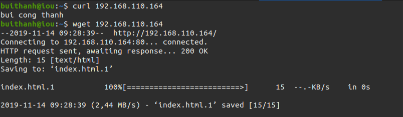
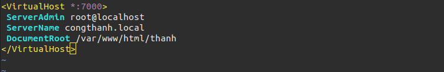
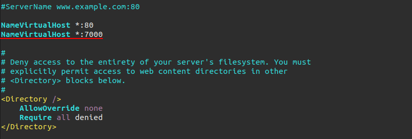
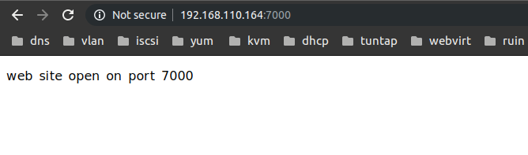
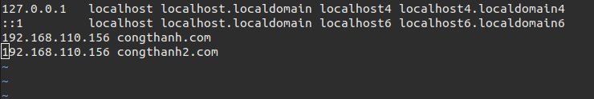
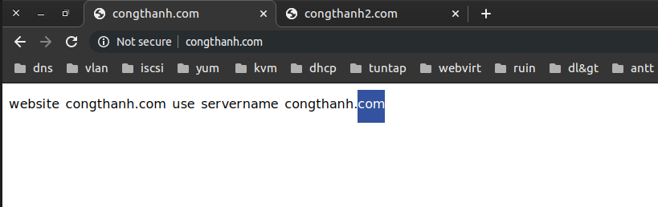
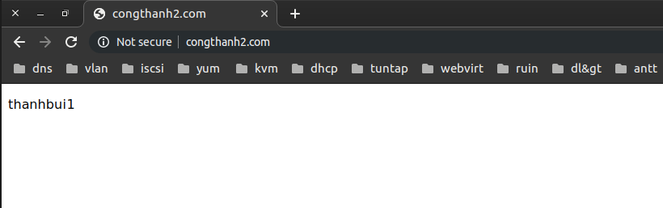
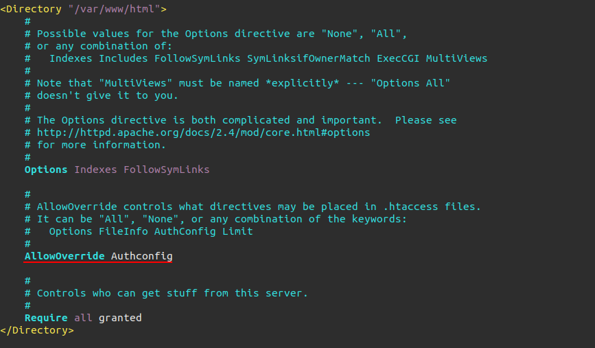

# Cài đặt và sủ dụng Apache trên Centos 7.

Mục Lục.

[1. Apache là gì](#1)

[2. Cài đặt web server](#2)

[3. Cấu hình httpd](#3)

- [3.1 DocumentRoot](#3.1)

- [3.2 Add new port](#3.2)

- [3.3 Name virtual host](#3.3)

- [3.4  Basic authentication](#3.4)

---
<a name ="1"></a>
## 1. Apache là gì.

Apache - tên chính thức là Apache HTTP Server - đây là một phần mềm web server miễn phí có mã nguồn mở. Một sản phẩm được phát triển và điều hành bởi hệ thống Apache Software Foundation. Và đây cũng một trong những web server được sử dụng phổ biến nhất hiện nay chiếm khoảng 54%.

Các yêu cầu được gửi tới máy chủ sử dụng dưới phương thức HTTP. Khi bạn sử dụng trình duyệt này, bạn chỉ cần nhập địa chỉ IP hoặc URL và nhấn ENTER. Sau đó, máy sẽ tiếp nhận địa chỉ IP hoặc URL mà bạn đã nhập vào. Chức năng này có được là do cài đặt trên web server.

<a name ="2"></a>
## 2. Cài đặt web server.

Cài đặt apache trên CentOS7
```
yum install httpd -y
```

Kiểm tra lại đã cài thành công chưa.
```
rpm -q httpd
```
Khởi động httpd.
```
systemctl restart httpd
```
Kiểm tra đã khởi động chưa.
```
systemctl status httpd
ps -C httpd
```

Khởi động httpd cùng hệ thống.
```
systemctl enable httpd
```

Có một cách kiểm tra khác là sử dụng gói phần mềm **Wget**. Cài đặt **wget**.
```
yum install wget -y 
```

Truy cập default website.
```
wget 192.168.110.154
```


Lúc này nó sẽ đọc file html trong thư mục **/var/www/html/index.html** và port mặc định là 80.

Ta có thể thay đổi những thứ hiện thị trên web site bằng cách sửả file index.html này.
```
echo 'Welcome to my website' > /var/www/html/index.html
```

<a name ="3"></a>
## 3. Cấu hình httpd.

File cấu hình httpd được lưu tại thư mục **/etc/httpd**.

<a name ="3.1"></a>
### 3.1 DocumentRoot.

Đây là file chứa các thông tin được hiển thị trên trang web.

Có thể sử dụng nhiều loại định dạng khác nhau như html, php, . . . 

```
cd /var/www/html/
```
Thêm file index cho default host.
```
echo 'bui cong thanh' > /var/www/html/index.html
```
Kiểm tra thư mục **/etc/httpd/conf.d** xem có file **congthanh.conf** nếu có thì tiên hành khởi động lại httpd.
```
systemctl restart httpd
```

Kiêm tra lại website vửa tạo.

```
curl 192.168.110.164
wget 192.168.110.164
```


Cấu hình firewall để bên ngoài có thể truy cập được vào trang web.
```
firewall-cmd --zone=public --add-port=80/tcp
firewall-cmd --reload
```
Kiểm tra xem đã thành công chưa.


<a name ="3.2"></a>
### 3.2 Add new port.

Tạo tên cho virtual host băng cách thêm vào trong file **/etc/httpd/conf/httpd.conf**
```
echo 'NameVirtualHost *:7000' >> /etc/httpd/conf/httpd.conf
```
Thêm tên của servername vào file **/etc/httpd/conf.d/thanh.conf**
```
vim /etc/httpd/conf.d/thanh.conf
```


Mở nghe port 7000 để có thể truy cập web site.


Khởi động lại và kiểm tra xem đã thành công chưa.
```
systemctl restart httpd
```
Kiểm tra 



Sử dụng lệnh.
```
wget 192.168.110.164:7000
curl 192.168.110.164:7000
```


<a name ="3.3"></a>
### 3.3 Virtual hosts.

Không giống như Debian, CentOS không có tệp cấu hình virtual host cho trang web mặc định của nó. Thay thế cấu hình mặc định sẽ đưa ra một trang lỗi tiêu chuẩn khi không tìm thấy tệp chỉ mục ở vị trí mặc định (/ var / www / html).

Ta có thể cấu hình nhiều host trên 1 virtual host.
Nếu bạn có 1 IP public thì bạn có thể trỏ đến virtual host.

Đây là môi trường lab nên tôi sử dụng 2 máy tính 1 máy làm client truy cập trang web và 1 máy làm web server.

Tạo host trên file **/etc/hosts**.
```
echo '192.168.110.156 congthanh.com' >> /etc/hosts
echo '192.168.110.156 congthanh2.com' >> /etc/hosts
```


Mỗi virtual host có thể sử dụng chung port nhưng phải sử dụng các nameserver khác nhau hay host khác nhau để truy cập. 

Cấu hình virtual hosts tại file **/etc/httpd/conf.d/**.
```
vim /etc/httpd/conf.d/congthanh.com.conf
```
Thêm các dòng sau để  mở thêm virtual host.
```
<VirtualHost *:80>
    ServerName congthanh.com
    #ServerAlias www.congthanh.com
    ServerAdmin root@localhost
    DocumentRoot "/var/www/html/congthanh.com"
    <Directory "/var/www/html/congthanh.com">
       DirectoryIndex index.html
       Options FollowSymLinks
       AllowOverride All
       Require all granted
    </Directory>
</VirtualHost>
```

Trong đó.
- **Servername**: tên miền/địa chỉ IP mà bạn muốn đặt.
- **ServerAdmin**:  mỗi web sẽ có 1 admin quản trị, đây là nơi khai báo địa chỉ email của người quản trị website.
- **DocumentRoot**: đường dẫn của thư mục sẽ được gọi khi người dùng truy cập vào domain được cấu hình. Có thể nằm ở bất kỳ phân vùng nào. thường mặc định tại **/var/www/html**.
- Thẻ **Directory**: 
    - DirectoryIndex: Khi các bạn truy cập vào thư mục ( không chỉ rõ cụ thể là file nào) thì file trong trường này sẽ được gọi.
    - Option: Option này cho phép bạn truy cập theo symbolic link 
    - AllowOverride: chỉ định chỉ thị nào được khai báo trong tệp .htaccess có thể ghi đè chỉ thị cấu hình.
    - Require:cho phép tất cả các máy khác được truy cập vào thư mục đang được cấu hình.

Tạo file index.html để tạo nội dung hiển thị lên trang web.
```
echo 'website congthanh.com use servername congthanh.com' >> /var/www/html/congthanh.com/index.html
```
Cấu hình SElinux bảo vệ thông qua ports.
```
semanage port -a -t ftp_port_t -p tcp 80
```
Nếu trả về kết quả lỗi.
```
-bash: semanage: command not found
```
như sau thì tiếp tục làm các bước nếu không bị lỗi thì thôi.
```
yum provides /usr/sbin/semanage
yum whatprovides /usr/sbin/semanage
yum install policycoreutils-python -y
```
Kiểm tra. Sử dụng máy client truy cập vào tên miền có virtual host



Cấu hình thêm 1 host trên virtual host.

Thêm các dòng sau vào file **/etc/httpd/conf.d/congthanh.com.conf**
```
<VirtualHost *:80>
    ServerName congthanh2.com
    ServerAdmin root@localhost
    DocumentRoot "/var/www/html/congthanh2.com"
    <Directory "/var/www/html/congthanh2.com">
       DirectoryIndex index.html
       Options FollowSymLinks
       AllowOverride All
       Require all granted
    </Directory>
</VirtualHost>
```

Khởi động lại httpd.
```
systemctl restart httpd
```
Kiểm tra lại xem hosts trên tên miền mới đã hoạt động chưa.


Như vậy ta đã thành công trong việc tạo và sử dụng virtual host.

<a name ="3.4"></a>
### 3.4  Basic authentication.

Ta có thể cài đặt tài khoản và mật khẩu cho mỗi người dùng truy cập vào máy.

Sử dụng file **.htpasswd**. Trong đó có 2 trường:
- User: tên tài khoản muốn đăng nhập.
- Password : được mã hóa không thể đọc bằng clear text.

Tạo tài khoản cho nguwoif dùng mới. sử dụng câu lệnh.
```
htpasswd -c /var/www/.htpasswd thanhbc
```


Bật xác thực **AllowOverride** để kiểm duyệt qua mật khẩu trong **<Directoty "/var/www/html">**

```
vim /etc/httpd/conf/httpd.conf
```


restart lại apache để cập nhật thay đổi.
```
systemctl restart httpd
```

Truy cập lại vào trang web.


Như vậy là đã thành công việc cấu hình basic auth bằng password

