# Cài đặt HA cluster sử dụng pacemaker và corosync (Phần 1)

## Mục lục 

[1. High Availability (HA) là gì?](#1)

[2. Môi trường cài Apache High Availability](#2)

- [2.1 Môi trường cài đặt](#2.1)
- [2.2 Sơ đồ vật lý](#2.2)
- [2.3 Sơ đồ network](#2.3)
- [2.4 IP Planning](#2.4)

[3. Các bước cài đặt](#3)
- [3.1 Cài đặt storage iSCSI](#3.1)
- [3.2 Cài đặt trên các node](#3.2)
- [3.3 Cài đặt Web server](#3.3)
- [3.4 Cài đặt pacemaker](#3.4)
- [3.5 Cài đặt fencing](#3.5)

---

## 1. High Availability (HA) là gì?

Cụm từ HA được sử dụng rộng rãi trong giới tin học có nghĩa là những hệ thống IT với độ sẵn sàng cao, hoạt động liên tục và luôn sẵn sàng cung cấp dịch vụ hay tài nguyên cho người dùng cuối. HA là một phương pháp thiết kế hệ thống để đạt được hiệu suất và tính sẵn sàng cao nhất mà không vướng phải bất cứ gián đoạn nào như hệ thống đơn lẻ.

Mô hình của nó như sau: 

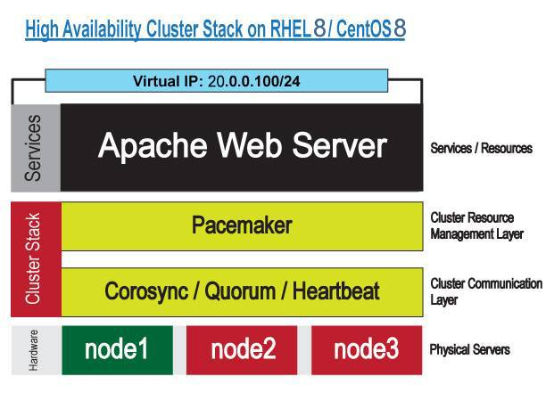

Pacemaker là gì?

Pacemaker  là một phần mềm mã nguồn mở dành cho HA, còn đc gọi là “Cluster Resource Manager”.

- Lớp Cluster Resource Management Layer có những đặc điểm sau:

    + Start and Stop cluster Resources

    + Monitoring cluster Resources

    + Migrating cluster Resources

    + Grouping cluster resources

    + Location Checks

Corosync là gì?

- Corosync là một hệ thống liên lạc bên trong cluster với chức năng xác định node lỗi và chuyển tài nguyên sang những node đang hoạt động khác.

##  2. Môi trường cài Apache High Availability

### 2.1 Môi trường cài đặt
+ OS: CentOS8 4.18.0-193.el8.x86_64
+ Httpd :  Apache/2.4.37 (centos)
+ Pacemaker: pacemaker-1.1.15-11.el7_3.4.x86_64
+ Corosync: corosync-2.4.0-4.el7.x86_64

Ta sẽ thực hiện cấu hình một cụm 3 node Apache Web Server sử dụng Pacemaker và Corosync. Ngoài ra ta cần cấu hình filesystem sử dụng iSCSI storage server trên một máy Linux khác và sau đó sử dụng nó trên mạng nội bộ.

### 2.2 Sơ đồ vật lý
Sơ đồ như sau:

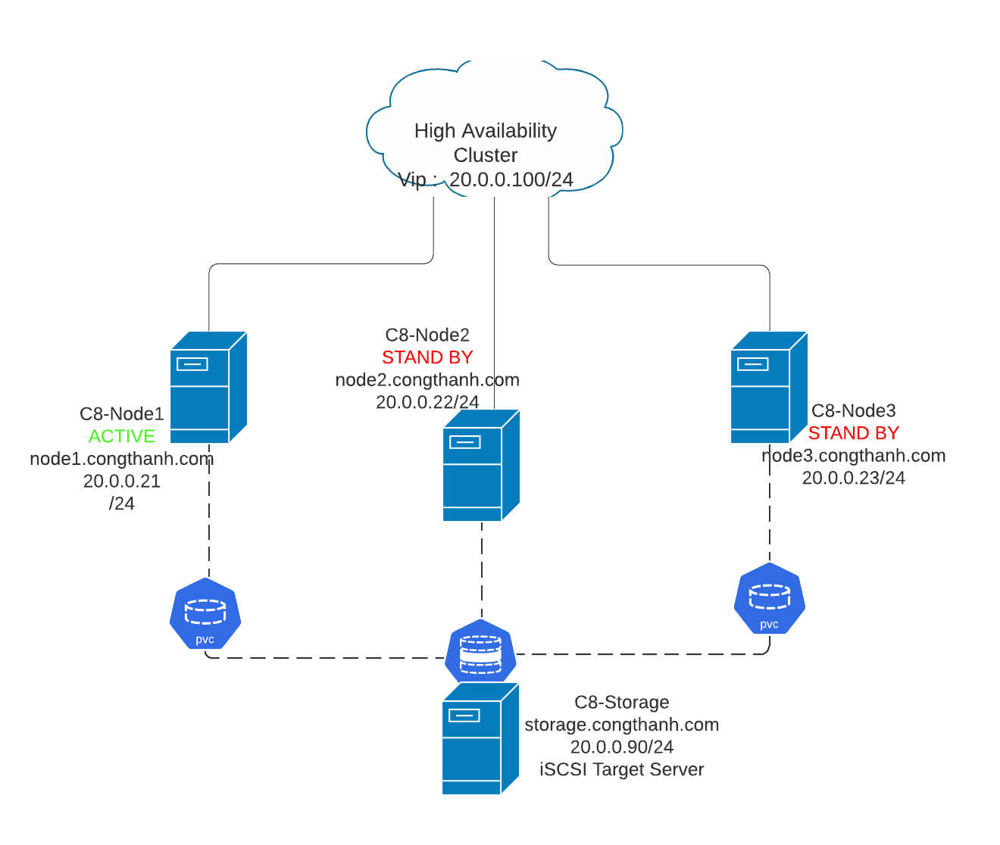

### 2.3 Sơ đồ network 

Sơ đồ network như sau

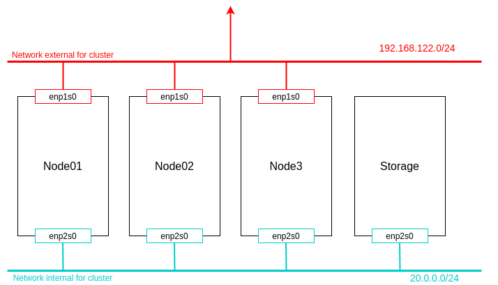

### 2.4 IP Planning

IP Planning

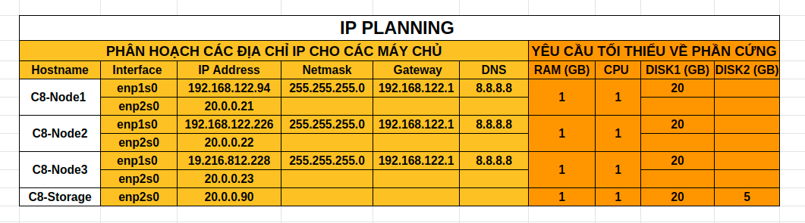

## 3. Các bước cài đặt

### 3.1 Cài đặt storage iSCSI 

## Cấu hình bước này trên tất cả các node.

### Bước 1: Edit Host File

Mở file `etc/host` 

    vim /etc/host

Viết các dòng sau vào file.

    20.0.0.21 node1 node1:congthanh.com
    20.0.0.22 node2 node2:congthanh.com
    20.0.0.23 node3 node3:congthanh.com
    20.0.0.90 storage storage:congthanh.com
    20.0.0.99 client client.congthanh.com

## Các bước cài đặt trên `storage` iSCSI target

### Bước 2: Setup iSCSI Storage server

Shared storage là một thành phần quan trọng trong HA Cluster. Tất cả server trong cluster đều phải có quyền truy nhập vào hệ thống này. Shared storage chứa dữ liệu của ứng dụng nên các node truy xuất vào đều sử dụng dữ liệu như nhau. Ta sẽ cấu hình iSCSI cho storage server:

Cài gói

    yum install targetcli -y

Setup LVM cho storage.

Giả sử ta có một đĩa 10GB mới gắn vào storage server. Ta sẽ tạo 2 LVMs gồm một cho Fencing and một cho Apache Server data directory. Sư dụng lệnh để kiểm tra

    fdisk -luc | grep sd

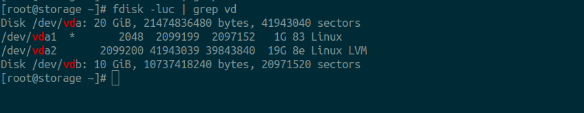
 

Phân vùng 

    fdisk /dev/vdb 

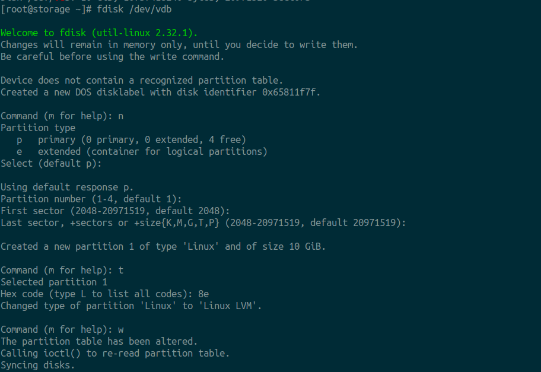

Tạo physical volume.

    [root@storage ~]# pvcreate /dev/vdb1
    Physical volume “/dev/sdb1” successfully created

Tạo volume group cluster_vg

    [root@storage ~]# vgcreate cluster_vg /dev/vdb1
    Volume group “cluster_vg” successfully created

Tạo logical volume vơi tên fence_lv có size là 1GB

    [root@storage ~]# lvcreate -L 1G -n fence_lv cluster_vg
    Logical volume “fence_lv” created

Tạo logical volume tên data_lv với toàn bộ phân vùng còn lại.
    
    [root@storage ~]# lvcreate -l 100%FREE -n data_lv cluster_vg
    Logical volume “data_lv” created

### Bước 3: Setup iSCSI Targets 

Trước khi cấu hình iSCSI, hãy làm quen với một và thuật ngữ sau:

    - iqn là viết tắt của iSCSI Qualified Name, đó là định dạng đặt tên chính thức, ví dụ: iqn.yyyy.mm.com.domain

    - Target: là một vùng storage nằm trên iSCSI server

    - LUN: Logical Unit Number, một LUN là một volume được sử dụng như một thiết bị (block device), nó giống như việc gắn 1 ổ cứng vào máy chủ.

Giờ ta sẽ dùng các lệnh `targetcli` để tạo storage chia sẻ giữa các node trong cluster:

    [root@storage ~]# targetcli 

Gõ lệnh trên vào terminal và thực hiện các lệnh sau:

    cd /backstores/block
    create ap_dir /dev/mapper/cluster_vg-data_lv
    create fence_dev /dev/mapper/cluster_vg-fence_lv
    cd /iscsi
    create iqn.2020-06.com.congthanh:storage
    cd iqn.2020-06.com.congthanh:storage/tpg1/acls
    create iqn.2020-06.com.congthanh:node1
    create iqn.2020-06.com.congthanh:node2
    create iqn.2020-06.com.congthanh:node3
    cd /iscsi/iqn.2020-06.com.congthanh:storage/tpg1/
    set attribute authentication=0
    cd /iscsi/iqn.2020-06.com.congthanh:storage/tpg1/luns
    create /backstores/block/ap_dir
    create /backstores/block/fence_dev
    cd /
    saveconfig
    exit

Sau khi cấu hình ta sẽ có cây như sau.

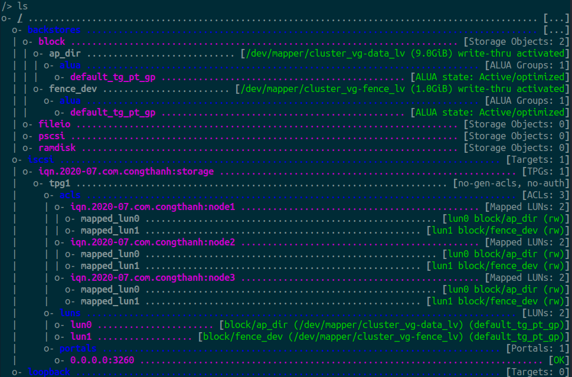

Sau đó khởi động lại service và thiết lập cho service khởi động cùng hệ thống:

    [root@storage ~]# systemctl start target
    [root@storage ~]# systemctl enable target 

Cấu hình firewall mở port cho iSCSI service.

    [root@storage ~]# firewall-cmd --permanent --add-port=3260/tcp
    [root@storage ~]# firewall-cmd --reload

## 3.2 Cài đặt trên các node 

### Các bước tiếp theo cài đặt trên 3 node `C8-Node1`, `C8-Node2`, `C8-Node3`

### Bước 4: Cấu hình iSCSI Initiator 

Initiator là một endpoint tạo một a SCSI session và gửi các lệnh SCSI. Sau khi đã setup storage server, ta cần chuẩn bị các node để kết nối iSCSI target.

Cài gói

    [root@node1 ~]# yum install iscsi-initiator-utils -y

Tạo và update các initiatorname trên các node tương ứng

Trên node `C8-node1`:

    [root@node1 ~]# echo "InitiatorName=iqn.2020-07.com.congthanh:node1" > /etc/iscsi/initiatorname.iscsi

Trên node `C8-node2`:

    [root@node2 ~]# echo "InitiatorName=iqn.2020-07.com.congthanh:node2" > /etc/iscsi/initiatorname.iscsi

Trên node `C8-node3`:

    [root@node3 ~]# echo "InitiatorName=iqn.2020-07.com.congthanh:node3" > /etc/iscsi/initiatorname.iscsi

Discover Server

    [root@node1 ~]# iscsiadm -m discovery -t st -p 20.0.0.90

Sau đó khởi động lại service và thiết lập cho service khổi động cùng hệ thống:

    systemctl start iscsid
    systemctl enable iscsid
### Bước 5: Add iSCSI targets trên các nodes

Để add iSCSI targets ta dùng lệnh sau:

    [root@node1 ~]# iscsiadm -m node -T iqn.2020-07.com.congthanh:storage -p 20.0.0.90 -l

Sau khi thêm iSCSI thành công sẽ có kết quả như sau.

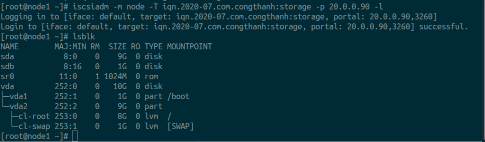

Như ta thấy trên hinh đã có thêm 2 ổ cứng mới được gắn và là sda và sdb lần lượt có dung lượng là 9GB và 1GB đây là 2 vùng nhớ được chia và câú hình iSCSI trên máy storage có tên lần lượt à cluster_vg-data_lv và cluster_vg-fence_lv.

### Bước 6: Phân vùng và mount các vùng iscsi vừa thêm trên tất cả các node.

Ví dụ làm trên node1, các node còn lại làm tương tự

    fdisk /dev/sda

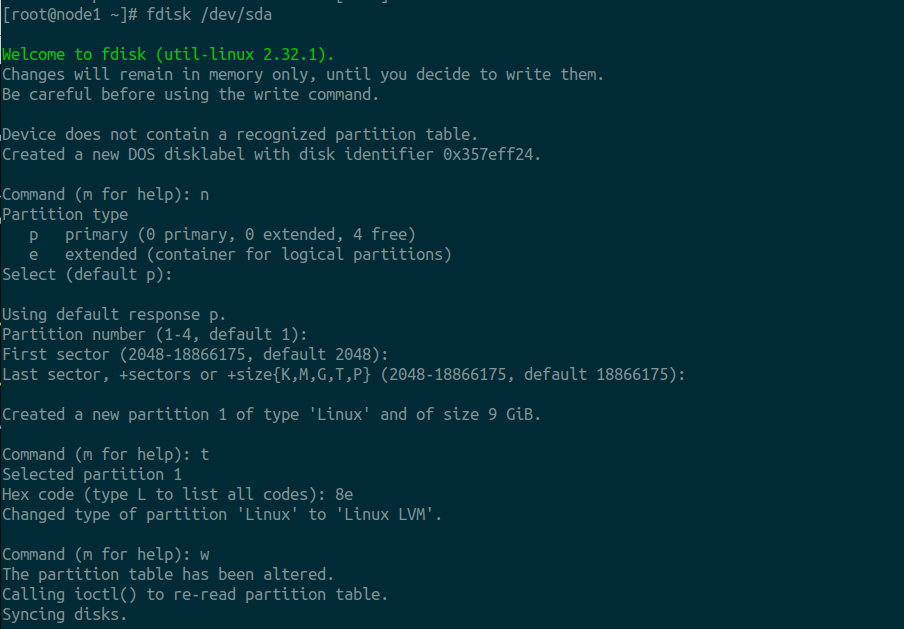

Tiếp theo định dạng cho phân vùng vừa tạo.

    [root@node1 ~]# pvcreate /dev/sda1 
    Physical volume "/dev/sda1" successfully created.
    [root@node1 ~]# vgcreate data_vg /dev/sda1 
    Volume group "data_vg" successfully created
    [root@node1 ~]# lvcreate -l 100%FREE -n data_lv data_vg
    Logical volume "data_lv" created.
    [root@node1 ~]# 

Tiếp theo format vùng nhớ với định dạng ext4.

    mkfs.ext4 /dev/mapper/data_vg-data_lv

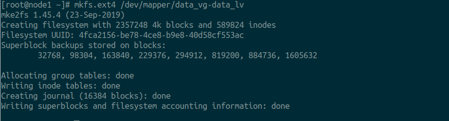

## 3.3 Cài đặt Web server

### Bước 7: Cài đặt  apache web server trên tất cả các node.

Cài đặt apache server

    dnf install httpd -y 

Cấu hình httd.conf trên tất cả các node

    nano /etc/httpd/conf/httpd.conf

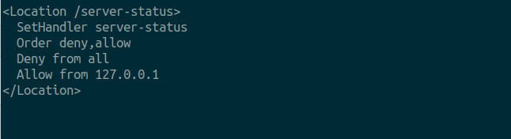

Mount thư mục root của web server vào phân vùng vừa tạo

    mount /dev/mapper/data_vg-data_lv /var/www/html

Set Selinux Policies cho thưc mục web server root

    restorecon -R /var/www/

Sau khi làm xong các bước trên ta kiểm tra lại xem phân vùng đã được mount chưa.

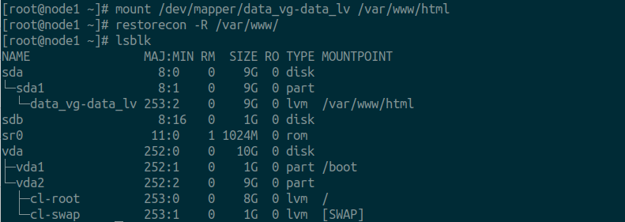

Như ta thấy phân vùng data_vg-data_lv đã được mount đến thư mục /var/www/html

Tiếp đến ta mở port Firewalll

    firewall-cmd --permanent --add-service=http
    firewall-cmd --reload

Tiếp đến ta khởi động apache service và đăt service khởi động cùng hệ thống.

    [root@node1 ~]# systemctl start httpd
    [root@node1 ~]# systemctl enable httpd

##### Note phần này có thể tạo file html trên bất kỳ node nào để kiểm tra xem tất cả các node đã được mount với máy storage chưa 

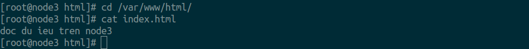

Ví dụ: tôi tạo file index.html trên máy node3 

Restart lại các node và mount lại thứ mục webserver root đến phần vùng share storage.

Vào trình duyệt web nhập đia chỉ IP của các node xem có webserver có cùng sử dụng chung storage không.

## 3.4 Cài đặt pacemaker 

### Bước 8: Cài đăt và cấu hình pacemaker 

### Các bước tiếp theo cài đặt trên 3 node `C8-Node1`, `C8-Node2`, `C8-Node3`

Cài đặt pacemaker

    dnf --enablerepo=HighAvailability -y install pacemaker pcs 

Đặt service khởi động cùng hệ thống

    systemctl enable --now pcsd

Mở port cho firewall
    
    firewall-cmd --permanent --add-service=high-availability
    firewall-cmd --add-service=high-availability
    firewall-cmd --reload

Setup administrator account. Ta phải set password trên tất cả các node.

    passwd hacluster 

Sau khi setup password trên tất cả các node, cluster đã có thể kết nối đến tất cả các node. Chạy lệnh sau trên node 1

    [root@node1 ~]#  pcs host auth node1 node2 node3

Tạo cluster trên node1.

    [root@node1 ~]# pcs cluster setup apache_ha node1 node2 node3

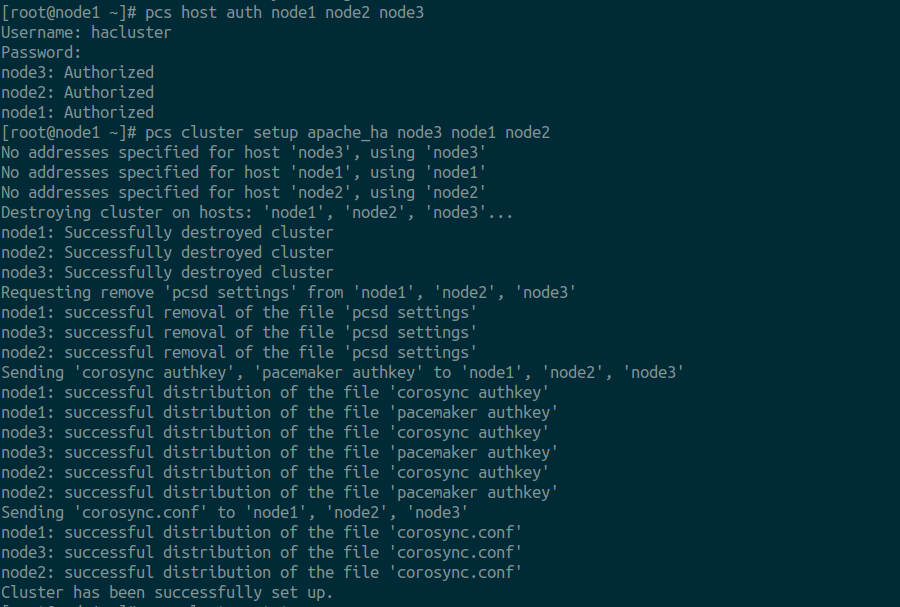

Enable và Verify Cluster Service

    [root@node1 ~]# pcs cluster start --all
    [root@node1 ~]# pcs cluster enable --all

Tiếp tục verifying bằng lệnh sau:

    [root@node1 ~]# pcs cluster status

Kiểm tra lại kêt quả.

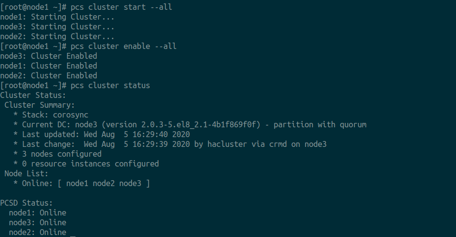

## 3.5 Cài đặt fencing

### Bước 9: Cấu hình cài đặt fencing.

Fencing là khái niệm để cách ly node khi một node nào đó bị lỗi. Cơ chế này nhằm để bảo vệ dữ liệu và ngăn chặn phá hỏng cluster. Nếu không có Fencing, dữ liệu có thể bị lỗi khi một node có vấn đề.

Trong pacemaker, fencing được gọi là STONISH. Ta sẽ add STONISH này vào các node:

Cài đặt gói Fencing Agent Package

    dnf --enablerepo=HighAvailability -y install fence-agents-scsi

Ta sẽ add và sử dụng phân vùng /dev/sdc disk và tạo LVM fence_lv 

    fdisk /dev/sdb

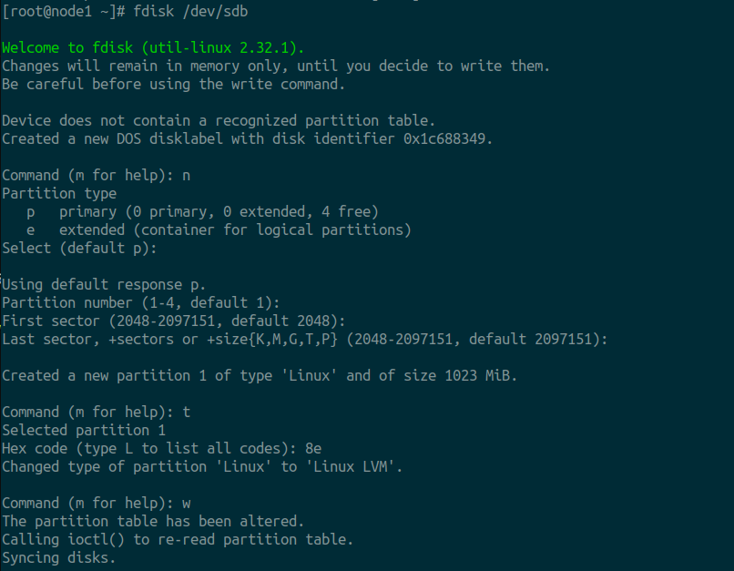

Tiếp đên tạo các logical volume 
    
    pvcreate /dev/sdb1

    vgcreate fence_vg /dev/sdb1

    lvcreate -l 100%FREE -n fence_lv fence_vg

Tạo Fencing Device

    pcs stonith create Fence_Dev fence_scsi pcmk_host_list="node1 node2 node3" devices=/dev/mapper/fence_vg-fence_lv meta provides=
    
Kiểm tra cấu hình stonith

    pcs stonith config Fence_Dev

Sau đó reboot lại các node.

Kiểm tra lại hoạt động của cluster và fencing

    pcs status.

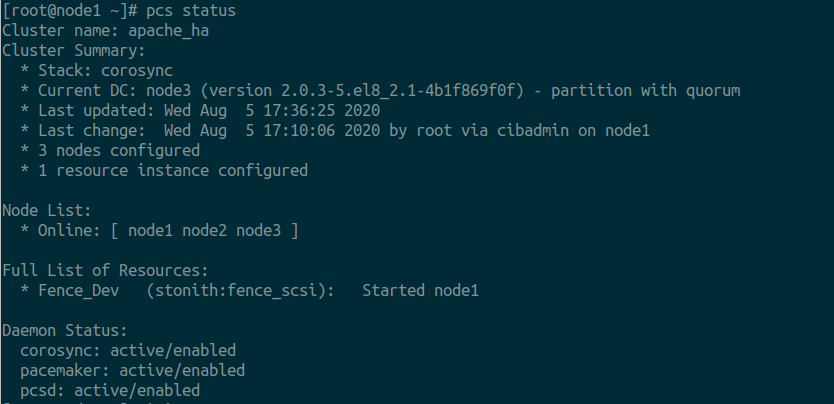

Như vậy là ta đã cấu hình thành công Ha_cluster trên web server apache.

Tiếp theo ta sẽ thêm một số resource cho cluster phòng cho trường hợp 1 trong các node bị hỏng ta có thể khôi phục lại.
