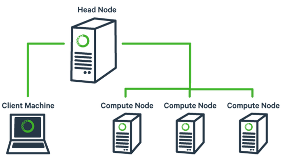

# Tìm hiểu cluster và cluster service.

## Mục lục 

[1. Giới thiệu về cluster.](#1)

[2. Mô hình chung của hệ thống Server Cluster.](#2)

[3. Các ưu điểm của hệ thống Server Cluster](#3)

[4. Các thuật ngữ trong hệ thống Server Cluster](#4)

[5. Các thành phần của Cluster Service.](#5)

[6.Nguyên tắc hoạt động của Server Cluster.](#6)

[7. Quá trình failover và failback](#7)

***

## 1. Giới thiệu về cluster.
Cluster là một kiến trúc nhằm đảm bảo nâng cao khả năng sẵn sàng cho các hệ thống mạng. Clustering bao gồm nhiều server riêng lẻ được liên kết và hoạt động cùng với nhau trong một hệ thống. Các server này giao tiếp với nhau để trao đổi thông tin và giao tiếp với mạng bên ngoài để thực hiện các yêu cầu. Khi có lỗi xảy ra các dịch vụ trong cluster hoạt động tương tác với nhau để duy trì tính ổn định và độ sẵn sàng cao cho hệ thống.

## 2.Mô hình chung của hệ thống Server Cluster. 
Server Cluster là một mô hình được đưa ra nhằm đáp ứng được các nhu cầu ngày càng gia tăng trong việc truy xuất các ứng dụng có tính chất quan trọng như thương mại điện tử, database …

Các ứng dụng này phải có khả năng chịu được lỗi cao, luôn đáp ứng được tính sẵn sàng và khả năng có thể mở rộng hệ thống khi cần thiết.

Các khả năng của Server Cluster giúp cho hệ thống có thể tiếp tục được hoạt động và cung cấp dịch vụ luôn luôn được sẵn sàng. Ngay cả khi hệ thống có thể xảy ra lỗi như hỏng ổ đĩa hay server bị down.

Mô hình Server Cluster bao gồm nhiều server riêng lẻ được liên kết và hoạt động cùng với nhau trong một hệ thống. Các server này giao tiếp với nhau để trao đổi thông tin lẫn nhau và giao tiếp với bên ngoài để thực hiện các yêu cầu. Khi có lỗi xảy ra, các service trong Cluster hoạt động tương tác với nhau để duy trì tính ổn định và tính sẵn sàng cao cho Cluster.

## 3.Các ưu điểm của hệ thống Server Cluster

- Cung cấp tính sẵn sàng cao : Hệ thống Server Cluster cung cấp tính luôn sẵn sàng cho các ứng dụng và các service ngay cả khi các thành phần hardware hay software bị lỗi.
    - Khi một server trong Cluster bị fail, quyền sở hữu tài nguyên của nó như là các ổ đĩa và IP address tự động chuyển tới một server khác còn hoạt động.
- Cung cấp khả năng dễ mở rộng: Khi các ứng dụng trong Cluster sử dụng tài nguyên hệ thống vượt quá khả năng của nó, ta có thể dễ dàng add thêm node vào cluster để đáp ứng nhu cầu truy cập hay dễ dàng thêm vào nhiều bộ xử lý hoặc thêm bộ nhớ RAM vào các node trong cluster.

- Cung cấp sự dễ dàng trong quản lý: Ta có thể dùng Cluster Administrator tools để quản lý một Cluster như là một hệ thống đơn và quản lý một ứng dụng khi chúng chạy trên một server đơn.

    - Có thể di chuyển các ứng dụng giữa các server khác nhau bên trong một Cluster.

    - Có thể chuyển đổi lượng công việc giữa các server hay đặt server ở trạng thái không hoạt động cho kế hoạch bảo trì.

    - Có thể giám sát trạng thái của Cluster, tất cả các node và tài nguyên từ bất kỳ nơi nào trong mạng.

## 4. Các thuật ngữ trong hệ thống Server Cluster

- Cluster : Là một hệ thống song song và được phân phối bởi một nhóm các server dành riêng để chạy những ứng dụng đặc biệt nào đó và kết nối với nhau để cung cấp khả năng chịu lỗi (faul tolerance) và load balance. Cluster dùng để cung cấp tính luôn sẵn sàng cho việc truy cập

- Node : Là một server thuộc một Cluster nào đó mà trên đó các ứng dụng và Cluster service được cài đặt

- Failover : Quá trình failover có thể xảy ra một cách tự động. Khi một node trong Cluster bị hỏng, các resource group của nó sẽ được chuyển tới một hay nhiều node trong Cluster mà còn hoạt động được. Quá trình tự động failover tương tự như lập kế hoạch cho việc tái chỉ định quyền sở hữu các resource.

    - Failover yêu cầu xác định các resource group nào đang chạy trên node bị hỏng và các node nào nên giữ quyền sở hữu các resource group đó.

    - Tất cả các node trong Cluster mà có khả năng giữ các resource group đó tiến hành đàm phán với nhau để lấy quyền sở hữu. Quá trình đàm phán dựa trên khả năng của node, tải hiện hành, khả năng phản hồi ứng dụng hay danh sách node ưu tiên.

    - Danh sách node ưu tiên là một phần của các thuộc tính trong resource group và được dùng để chỉ định một resource group tới một node. Khi việc đàm phán quyền sở hữu resource group được hoàn tất, tất cả các node trong Cluster cập nhật database của chúng và tiếp tục theo dõi node sở hữu resource group đó

- Failback : Khi một node trở lại phục vụ, Cluster trả lại quyền sở hữu tài nguyên cho nó và nó sẵn sàng để thực hiện yêu cầu

- Quorum resource : Trong mỗi Cluster, Quorum resource chứa đựng và duy trì những thông tin cấu hình cần thiết cho việc phục hồi Cluster Resource. Các Cluster resource bao gồm các phần cứng vật lý như là các ổ đĩa, các network card và các thực thể logic như là các địa chỉ IP, các ứng dụng và cơ sở dữ liệu của ứng dụng. Mỗi node trong Cluster sẽ có quyền sở hữu các resource cục bộ. Tuy nhiên, Cluster cũng có các resource chung như các thiết bị lưu trữ chung và private network card. Mỗi node trong Cluster đều có khả năng truy cập tới các resource chung này. Một resource chung đặc biệt được biết như là Quorum resource – là một ổ đĩa vật lý trong dãy các ổ đĩa chung của Cluster đóng một vai trò quan trọng trong các hoạt động của Cluster. Nó phải được dành riêng cho hoạt động của các node như tạo một Cluster hay thêm node.
    
- Resource group : Resource group là một tập hợp logic của các resource trong một Cluster. Một resource group tiêu biểu được tạo ra bởi các resource liên kết logic với nhau như là các ứng dụng và các thiết bị ngoại vi và dữ liệu kết hợp với các ứng dụng đó. Resource group cũng có thể chứa đựng các thực thể của cluster và chỉ được liên kết khi cần như là các server ảo và địa chỉ IP. Một resource group tại một thời điểm chỉ được sở hữu bởi một node và các resource riêng lẻ bên trong group đó phải tồn tại trên node đó. Các node khác trong Cluster không thể sở hữu các resource group khác nhau trong cùng một resource group.

## 5. Các thành phần của Cluster Service

Cluster service chạy trên mỗi node trong server cluster và điều khiển mọi hoạt động của server cluster. Cluster service bao gồm nhiều thành phần software làm việc cùng với nhau. Các thành phần này thực hiện việc theo dõi, duy trì tính ổn định và vận chuyển các resource từ một node qua một node khác

- Resource DLLs : Cho mỗi ứng dụng chịu trách nhiệm theo dõi, điều khiển và khôi phục ứng dụng đó. Ví dụ : Resource DLL sao lưu và phục hồi các thuộc tính của ứng dụng trong Cluster database, mang resource online và offline và kiểm tra trạng thái của resource đó. Khi cần thiết phải thực hiện failover, Resource DLL làm việc cùng với Resource Monitor và Failover Manager để đảm bảo quá trình failover được thực hiện dễ dàng.
    
- Checkpoint Manager : Để đảm bảo cho việc Cluster service có thể phục hồi từ một resource bị lỗi, Checkpoint Manager kiểm tra các khóa registry khi một resource được mang online và ghi dữ liệu checkpoint lên quorum resource khi resource này offline.
    - Một vài ứng dụng chứa thông tin cấu hình tại cục bộ thay cho việc chứa thông tin trong cơ sở dữ liệu cấu hình Cluster. Nếu một ứng dụng yêu cầu chứa đựng cục bộ thông tin có thể failover, Checkpoint Manager cung cấp cho yêu cầu này bằng cách duy trì một bản sao của thông tin cục bộ hiện hành này trên Quorum resource. Đối với các ứng dụng chứa thông tin cấu hình trong registry trên server, Checkpoint Manager theo dõi dữ liệu này khi ứng dụng đang online. Khi có sự thay đổi xảy ra, Checkpoint Manager cập nhật quorum resource với dữ liệu cấu hình hiện hành.

- Database Manager : Chạy trên mỗi node và duy trì một bản sao lưu cục bộ của cơ sở dữ liệu cấu hình Cluster – chứa những thông tin về những thực thể vật lý và logic trong một Cluster. Những thực thể này bao gồm bản thân Cluster, các node thành viên, các resource group, các loại resource và những mô tả của các loại resource đặc biệt như là các ổ đĩa và địa chỉ IP. Database Manager dùng Global Update Manager cho việc cập nhật lẫn nhau (replicate) tất cả những thay đổi tới các node khác trong cluster. Theo cách này, những thông tin cấu hình được duy trì qua Cluster nay cả khi một node bị hỏng và khi Administrator thay đổi cấu hình Cluster trước khi node đó quay trở lại phục vụ.
    - Database Manager cũng cung cấp một interface chứa những thay đổi trong cơ sở dữ liệu cấu hình Cluster thông qua các thành phần Cluster service khác như là Failover Manager và Node Manager. Interface này dùng để tạo ra những thay đổi tương tự như interface dùng để tạo ra những thay đổi tới registry qua Windows Programming Interface (API). Những thay đổi khác này được Database Manager tiếp nhận để cập nhật cho các node khác trong cluster qua Global Update Manager.
- Failover Manager : Quản lý các resource và các resource group. Nó chịu trách nhiệm tắt hay khởi động các resource, quản lý các resource liên quan và chuẩn bị cho một quá trình failover các resource group. Để thực hiện các hoạt động này, nó tiếp nhận resource và thông tin trạng thái hệ thống từ các thành phần Cluster trên một node và từ Resource Monitors. Resource Monitors cung cấp môi trường thực hiện cho resource DLLs và cung cấp sự giao tiếp giữa resource DLLs và Failover Manager.
    - Failover Manager: Là thành phần xác định node nào trong Cluster nên sở hữu resource group. Khi cần thiết phải failover một resource group, Failover Manager trên mỗi node trong Cluster làm việc cùng nhau để tái chỉ định quyền sở hữu cho resource group đó.
    - Dựa trên cách mà resource group được cấu hình, Failover Manager có thể cục bộ khởi động lại resource bị hỏng hay có thể làm cho resource đó offline đối với các resource liên quan với nó và sau đó chuẩn bị cho một quá trình failover.
- Global Update Manager : Được dùng bởi các thành phần bên trong cluster như Failover Manager hay Database Manager để mang những cập nhật thay đổi tới mỗi node trong Cluster. Khi quá trình cập nhật xảy ra, nó bắt đầu tại một node client và một node khác được bổ nhiệm theo dõi việc cập nhật để đảm bảo việc cập nhật được xảy ra trên tất cả các node. Node client yêu cầu node này gửi tới một global lock để thực hiện cập nhật. Nếu lock này chưa sẵn sàng, nó sẽ chờ. Khi lock này sẵn sàng node giám sát sẽ gán cho node client và chỉ định cập nhật tại cục bộ. Nếu node này cập nhật thành công mà quá trình update bị lỗi trên một node khác thì node này sẽ bị loại bỏ khỏi danh sách các node đang hoạt động và sự cập nhật tiến hành trên các node còn hoạt động khác. Nếu việc này xảy ra, quorum log sẽ được ghi lại để đảm bảo rằng node bị lỗi có thể nhận được tất cả các thông tin cấu hình cần thiết khi nó quay trở lại hoạt động.
- Log Manager : Cùng với Checkpoint Manager tương tác với nhau đảm bảo rằng recover log trên quorum resource chứa đựng dữ liệu cấu hình mới nhất và các checkpoint thay đổi. Nếu một hay nhiều node trong Cluster bị hỏng, các node còn hoạt động khác vẫn có thể thực hiện thay đổi cấu hình. Khi những node này bị hỏng, Database Manager sử dụng Log Manager để ghi lại sự thay đổi cấu hình lên Quorum resource.
    - Khi các node bị lỗi quay trở lại phục vụ, chúng đọc vị trí của quorum resource trong local cluster. Các cơ chế được xây dựng bên trong sẽ dò tìm trong cơ sở dữ liệu cũ những quorum resource nào không đúng. Sau đó Database Manager sẽ yêu cầu Log Manager cập nhật bản sao cục bộ của Cluster sử dụng file checkpoint trong Quorum resource và sau đó đối chiếu với file log trong Quorum disk. Kết quả là hoàn thành việc cập nhật Cluster.
- Event Log Replication Manager : Là một phần của Cluster service làm việc cùng với Log Service để sao chép các Event Log tới tất cả các node trong Cluster. Các sự kiện này được đánh dấu để cho thấy node nào mà sự kiện xảy ra trên đó.
    - Các sự kiện được ghi lại trên một node được sắp xếp, củng cố và gửi qua Event Log Replication Manager để broadcast tới các node đang hoạt động khác. Nếu một vài sự kiện được ghi lại trong một khoảng thời gian, mỗi sự kiện có thể broadcast một cách riêng lẻ, nhưng nếu nhiều sự kiện được ghi lại trong một khoảng thời gian ngắn, chúng được kết hợp với nhau trước khi broadcast. Các sự kiện được dán nhãn để cho biết node nào chúng được xảy ra. Các node khác tiếp nhận các sự kiện và ghi chúng lên local log.

- Membership Manager : Chịu trách nhiệm duy trì một một cái nhìn nhất quán về các node trong Cluster hiện đang hoạt động hay bị hỏng tại một thời điểm nhất định. Trọng tâm của thành phần này là thuật toán regroup được yêu cầu thực hiện bất cứ khi nào có dấu hiệu của một hay nhiều node bị lỗi.
    
- Node Manager : Chạy trên mỗi node và duy trì một danh sách cục bộ các node, các network, các network interface trong cluster. Qua sự giao tiếp giữa các node, Node Manager đảm bảo cho tất cả các node có cùng một danh sách các node đang hoạt động.
    - Node Manager dùng những thông tin trong cơ sở dữ liệu cấu hình Cluster để xác định các node nào được thêm vào hay bị loại bỏ khỏi Cluster. Node Manager trên mỗi node cũng theo dõi các node khác để tìm ra node bị lỗi. Để thực hiện việc theo dõi, nó gửi và nhận những message gọi là các heartbeat tới mỗi node trong Cluster. Nếu một node có một sự giao tiếp bị lỗi với một node khác, nó gửi broadcast một message tới các node khác sao cho tất cả các node nhận message này để xác nhận lại danh sách các node đang hoạt động trong cluster. Quá trình này gọi là một regroup event.
    - Node Manager cũng tham gia vào quá trình một node tham gia vào Cluster. Tại thời điểm một node được thêm vào Cluster, Node Manager trên node đó thành lập một quá trình giao tiếp với các Node Manager trên các node khác để thực hiện quá trình chứng thực.
- Resource Monitor : Cung cấp một interface giao tiếp giữa resource DLLs và Cluster service. Khi Cluster cần lấy dữ liệu từ một resource, Resource Monitor tiếp nhận yêu cầu và đẩy yêu cầu đó tới resource DLL thích hợp. Ngược lại, khi một resource DLL cần báo cáo trạng thái của nó hoặc thông báo cho Cluster service một sự kiện, resource đẩy thông tin này từ resource tới Cluster service

- Backup/Restore Manager :
    Cluster service đưa ra một API dùng để backup cơ sở dữ liệu cluster, BackupClusterDatabase. BackupClusterDatabase trước tiên tương tác với Failover Manager, sau đó đẩy yêu cầu tới node sở hữu quorum resource. Database Manager trên node đó sẽ được yêu cầu và sau đó tạo một bản backup cho quorum log file và các file checkpoint.
    Cluster service cũng đưa ra một API khác, RestoreClusterDatabase để restore cơ sở dữ liệu Cluster từ một backup path. API này có thể chỉ được yêu cầu tại cục bộ từ một trong các node của Cluster. Khi API được yêu cầu, trước tiên nó tắt Cluster service, restore cơ sở dử liệu Cluster từ bản backup, tạo một giá trị registry chứa backup path và sau đó khởi động lại Cluster service. Cluster service khi khởi động sẽ dò tìm yêu cầu restore và tiến hành restore cơ sở dữ liệu Cluster từ backup path tới Quorum resource.

## 6.Nguyên tắc hoạt động của Server Cluster.

Khi một node hay một application trong Cluster bị fail, Server Cluster có thể phản ứng bằng cách khởi động lại application bị lỗi hoặc phân tán công việc từ node bị fail tới các node khác còn hoạt động trong Cluster đó.

Cluster service kiểm tra tình trạng không hoạt động của các resource riêng biệt hay một node, và tự động di chuyển hay khởi động lại các ứng dụng, dữ liệu và file resource tới một node còn hoạt động trong Cluster. Quá trình này cho phép các resource như là database, file share và application duy trì tính sẵn sàng cao cho các ứng dụng của user và client.

Server Cluster đưa ra 2 cơ chế kiểm tra tình trạng không hoạt động khác nhau:

- **Detect Node Failure.**
    - Một cách định kỳ, mỗi node trao đổi các gói message với những node khác trong Cluster sử dụng private cluster network. Những message này được gọi là Heartbeat. Sự trao đổi Heartbeat cho phép mỗi node kiểm tra tính sẵng sàng của các node khác và các ứng dụng của chúng. Nếu một server bị fail trong việc phản hồi 1 Heartbeat, các server còn hoạt động bắt đầu một quá trình Failover để đàm phán quyền sở hữu đối với các tài nguyên và ứng dụng của node bị fail. Việc đàm phán này sử dụng Challenge và Defense protocol.
    Việc bị fail trong quá trình phản hồi Heartbeat có thể xảy ra trong nhiều sự kiện như là computer failure, network interface failure, network failure, hay trong lúc hoạt động cao bất thường nào đó. Thông thường, khi tất cả các node giao tiếp với nhau, Configuration Database Manager gửi Global Configuration Database update tới mỗi node. Tuy nhiên, khi fail trong quá trình trao đổi heartbeat xảy ra, Log Manager cũng lưu lại cấu hình database thay đổi tới Quorum Resource. Nó đảm bảo các node còn hoạt động có thể truy cập thông tin cấu hình Cluster mới nhất và dữ liệu registry cục bộ trên node trong quá trình phục hồi

- **Detect Resource Failure.**
    - Failover Manager và Resource Monitors làm việc cùng với nhau để dò tìm và khôi phục resource bị fail. Resource Monitors theo dõi trạng thái của resource bằng cách kiểm tra định kỳ các resource sử dụng Resource DLLs. Việc kiểm tra vòng gồm hai bước, một query LookAlive lướt qua và một query lâu hơn, cuối cùng – IsAlive. Khi Resource Monitor dò tìm một resource bị fail, nó thông báo cho Failover Manager và tiếp tục giám sát resource này.

Failover Manager duy trì trạng thái của các resource và resource group. Nó cũng chịu trách nhiệm thực hiện việc phục hồi khi một resource bị fail và sẽ yêu cầu Resource Monitor phản hồi tới user tình trạng hoạt động hay không hoạt động của resource.

Sau khi resource bị fail được tìm thấy, Failover Manager có thể thực hiện việc phục hồi bằng cách khởi động lại một resource và các resource hay di chuyển toàn bộ resource group tới một node khác. Công việc phục hồi xác định đã được thực hiện bởi resource và resource group properties và node availability.

## 7. Quá trình failover và failback
Trong quá trình failover, một resource group được coi như là một failover unit, để đảm bảo resource được phục hồi đúng. Khi một resource được phục hồi từ trạng thái fail, Resource Monitor thông báo tới Failover Manager để tự động thực hiện quá trình failback các resource group dựa trên cấu hình của resource group failback properties.

Server Cluster network có thể là private ( chỉ có sự giao tiếp giữa các node với nhau), public ( giao tiếp giữa client với node), hay mixed (cả sự giao tiếp giữa các node và sự giao tiếp giữa client với node). Heartbeat được giao tiếp qua tất cả các loại network, tuy nhiên việc theo dõi heartbeat và cách mà Cluster thể hiện các heartbeat bị lỗi dựa trên các kiểu network sau :

- Trên private hay mixed network, cả hai đều có sự giao tiếp giữa các node, heartbeat được theo dõi để xác định node có hoạt động trong Cluster hay không.

- Trên public network, chỉ có sự giao tiếp giữa client với node, heartbeat được theo dõi chỉ để xác định network adapter của node có hoạt động hay không.

#### Ghi chú
*Đối với những Cluster có 2 node, dùng thông điệp unicast cho traffic trong nội bộ Cluster. Không dùng multicast.*

*Đối với những cluster có từ 3 node trở lên mà ở dạng mixed version các Cluster gửi những thông điệp unicast, không dùng multicast.*

**Heartbeat**: Là một UDP packet chuyển đổi giữa các node mỗi 1.2 giây một lần để xác định mỗi node trong Cluster vẫn hoạt động. Nếu một node thiếu hụt liên tiếp 5 heartbeat, node đó sẽ chuẩn bị một quá trình regroup event để đảm bảo rằng tất cả các node đi tới một sự nhất quán danh sách các node còn đang hoạt động.

**Regroup event**: Nếu một node thiếu hụt liên tiếp 5 heartbeat, một quá trình regroup event được xảy ra. Nếu node vẫn duy trì tính trạng không thể phản hồi, node đó sẽ được loại bỏ khỏi danh sách các node hoạt động. Nếu node không phản hổi này đang sở hữu một quorum resource, các node còn lại cũng bắt đầu một quá trình đàm phán quorum. Sau đó, quá trình failover được bắt đầu.

**Quá trình đàm phán quorum**: Quá trình đàm phán quorum xảy ra khi một node đang sở hữu một quorum resource bị lỗi hay không hoạt động, và các node còn lại sẽ xác định node nào sẽ giữ quyền sở hữu quorum resource. Mục đích của quá trình đàm phán quorum là tại một thời điểm đảm bảo rằng chỉ một node duy nhất được sở hữu quorum resource.

- Việc chỉ cho một node sở hữu quorum resource là rất quan trọng bởi vì nếu tất cả các giao tiếp giữa 2 hay nhiều node bị lỗi, nó có khả năng chia Cluster thành 2 hay nhiều phần riêng biệt để giữ cho nó vần tiếp tục hoạt động (split brain). Server Cluster ngăn ngừa nó bằng cách chỉ cho phép duy nhất một Cluster tách ra này có chứa node đang sở hữu quorum resource tiếp tục hoạt động như một Cluster. Bất kỳ node nào không thể giao tiếp với node đang sở hữu quorum resource, thì node đó sẽ không còn là node thành viên trong Cluster.

**Cách cluster giữ cho các resource group luôn sẵn sàng**: Cluster giữ cho các resource group luôn sẵn sàng bằng cách theo dõi trạng thái của các resource, mang các resource online, và tiến hành failover.

**Theo dõi trạng thái các resource**: Resource Monitor đưa ra 2 cách theo dõi trạng thái các resource trên node mà nó giám sát : Look Alive (resource xuất hiện là online) và IsAlive (kiểm tra chi tiết trạng thái online và hoạt động của resource là đúng chức năng).

**Cách Failover xảy ra**: Quá trình failover xảy ra khi một group hay một node đang sở hữu resource bị lỗi. Một resource bị lỗi có thể là lý do cho một group fail nếu ta cấu hình Affect the group cho resource đó.

Failover có hai dạng: Resource failure hay Group failure và Node failure hay mất sự giao tiếp giữa các node.

- **Resource failure hay Group failure**: Khi một resource bị hỏng quá trình sau sẽ xảy ra :
    - Resource Monitor dò tìm lỗi qua Looks Alive hay Is Alive hoặc qua một sự kiện được ghi bởi resource đó. Resource Monitor gọi điểm vào Is Alive của resource DLL để xác định resource đó bị hỏng:

    - Nếu Is Alive bị lỗi, trạng thái resource chuyển thành fail.
    - Nếu ta cấu hình cho resource khởi động lại khi bị lỗi, Failover Manager cố gắn khởi động lại resource để mang nó online trở lại. Nếu sự cố gắng mang resource online không đạt được hay vượt qua ngưỡng hay thời gian cho phép khởi động lại, Resource Monitor stop resource này.

    - Thông qua Resource Monitor, Failover Manager gọi Terminal entry point của resource DLL
    - Nếu resource này được cấu hình là Affect the group, quá trình làm việc được tiếp tục, ngược lại, nó sẽ kết thúc mà không có hoạt động nào khác. Khi cấu hình là Affect the group, Failover Manager trên các node trong cluster làm việc cùng với nhau để tái chỉ định quyền sở hữu cho group đó.

    - Trên node mà resource bị hỏng, Failover Manager kết thúc resource đó và các resource liên quan với nó.

    - Failover Manager trên node mà resource bị hỏng thông báo cho Failover Manager trên node sẽ sở hữu resource đó và cũng thông báo với Failover Manager trên tất cả các node khác cho sự thay đổi này.

    - Nếu bất kỳ resource nào được cấu hình lưu thông tin cấu hình trên cục bộ registry, Checkpoint Manager sẽ restore bản sao registry cho resource đó từ quorum resource

    - Node mà Failover Manager sẽ chuyển resource tới là duy nhất, sử dụng danh sách phụ thuộc để xác định thứ tự đúng.

    - Node mới sở hữu group sẽ điều khiển các resource của group đó thông qua Resource Monitor tương ứng. 
- **Node failure hay mất sự giao tiếp giữa các node**. Khi một node bị hỏng quá trình sau sẽ xảy ra.

    - Failover xảy ra khi một node bị hỏng khác với Failover xảy ra khi một resource bị hỏng. Trong Clustering, một node được coi là bị hỏng nếu nó mất sự giao tiếp với các node khác.

    - Nếu một node mất liên tiếp 5 heartbeat, nó được coi là bị hỏng và một quá trình regroup event được xảy ra. Sau khi một node bị hỏng, các node còn lại tiến hành đàm phán cho việc sở hữu các resource group. Failover Manager trên các node còn sử dụng được xác định quyền sở hữu các resource group dựa trên các node mà ta chỉ định có khả năng sở hữu các resouce group đó.
    - Thứ tự được chỉ định trong danh sách các node ưu tiên

Cách Failback xảy ra:
- Failback là quá trình Cluster service chuyển các resource group trả về node thích hợp hơn sau khi node này online trở lại.

- Node mà một group được trả về chuẩn bị một quá trình failback. Failover Manager trên node đó tương tác với Failover Manager trên node đang sở hữu group và tiến hành đàm phán sau đó chuyển quyền sở hữu resource group trở về node thích hợp hơn