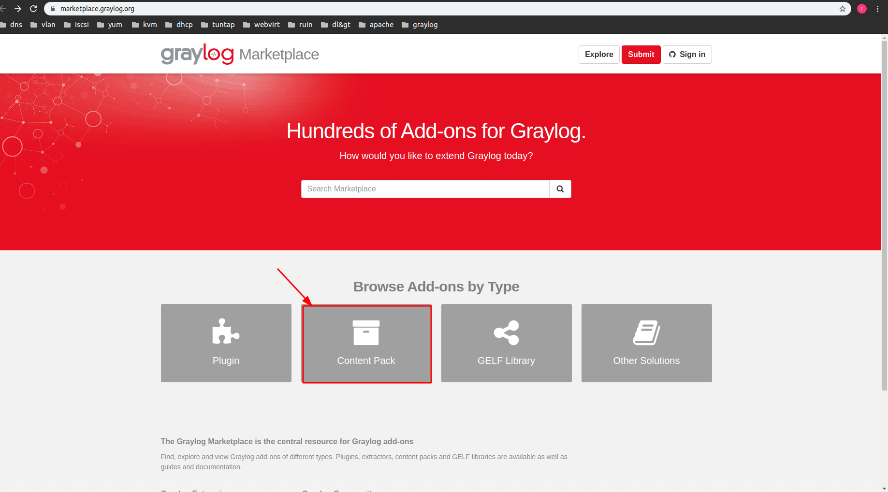
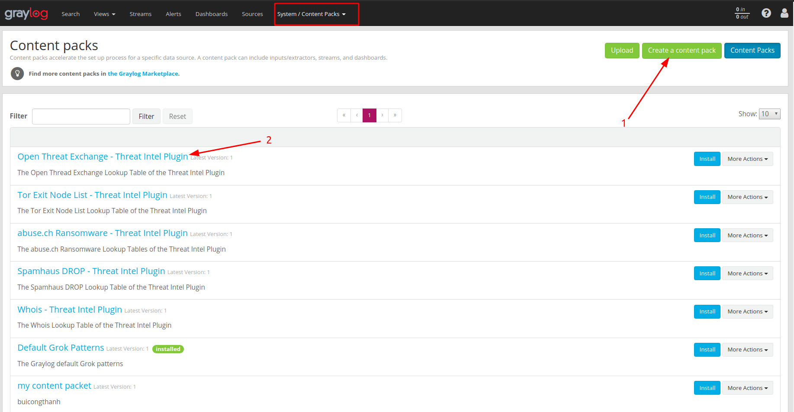
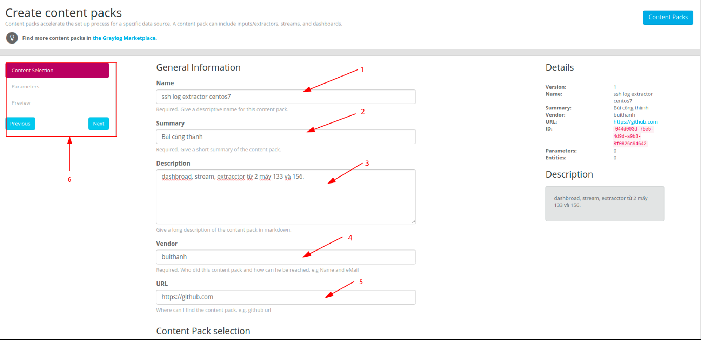
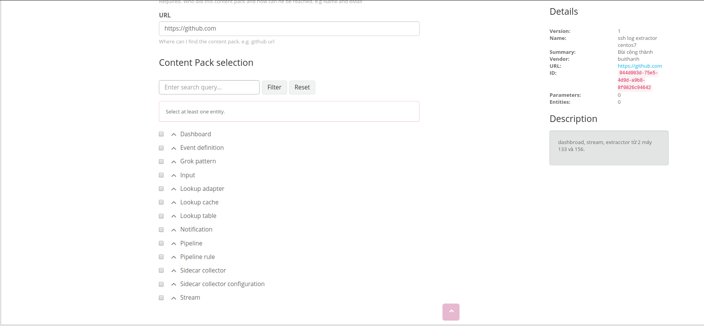
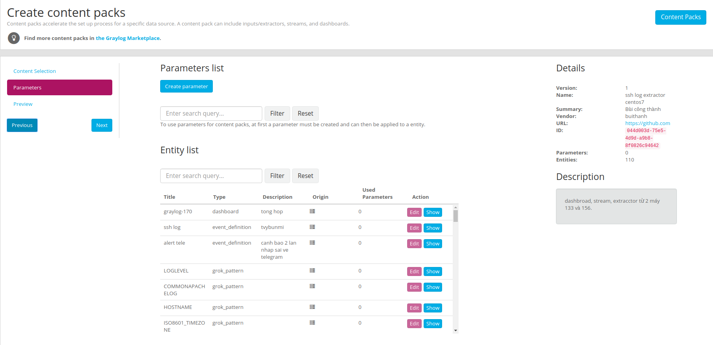
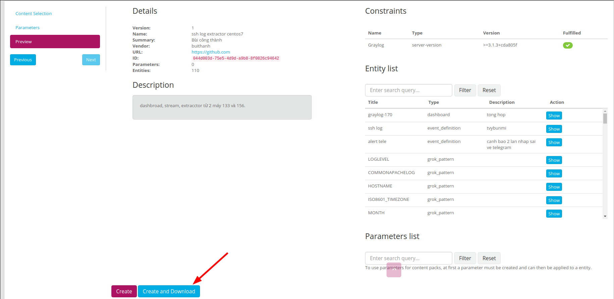
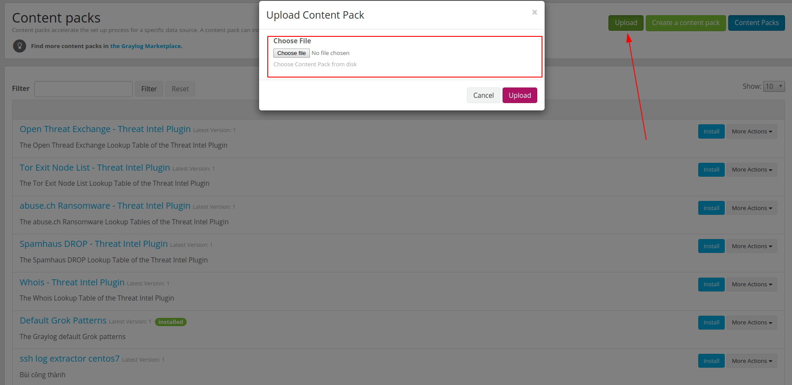
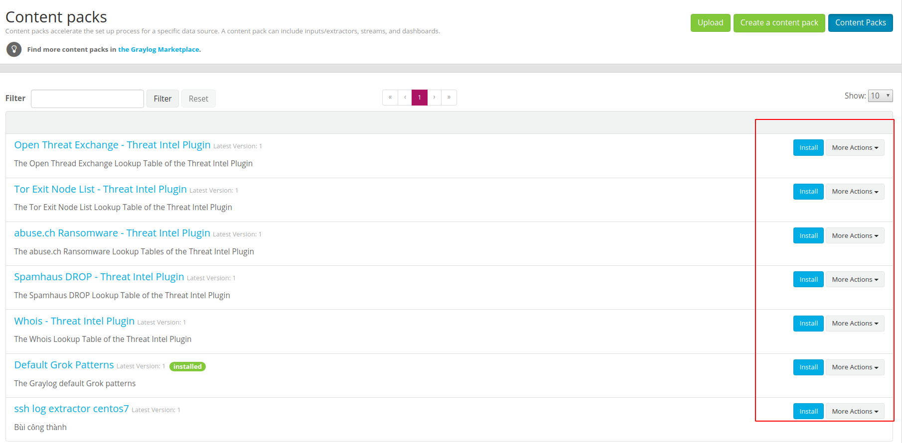

# Tìm hiểu Content packs trong graylog
Mục Lục

[1. Conten packs](#1)

[2. Tạo một content packs](#2)

[3. Upload content packs](#3)

---

## 1. Conten packs

content packs là một cách thuận tiện để chia sẻ cấu hình. content packs là một tệp JSON chứa một tập hợp các cấu hình của các thành phần Graylog. Tệp JSON này có thể được tải lên các phiên bản Graylog và sau đó được cài đặt. Người dùng đã dành thời gian để tạo input, pipeline và dashbroad cho một loại định dạng nhật ký nhất định, có thể dễ dàng chia sẻ những cài đặt cấu hình của mình với cộng đồng.

Ta có thể vào trang **https://marketplace.graylog.org/** sau để tìm và tải các content packs phù hợp với yêu cầu sử dụng của mình.

Ta có thể tạo content packs của mình và cũng có thể tải content pack của người khác về cài đặt và sử dụng nhưng ta phải cấu hình mô hình của mình giống với cài đặt của họ.

## 2. Tạo một content packs.

Để tạo content pack từ graylog của mình ta vào mục **System/Content Pack**.

Trong đó:
- 1 là tạo một content packs từ graylog của mình.
- 2 Là các content packs tải về và có thể cài đặt các content packs đó.

Chọn **Create content packs** để tạo content packs.

Trong đó:
- 1 Là điền tên của content packs sẽ được tạo ra.
- 2 Là sơ lược của content packs.
- 3 là mô tả ngắn về content packs.
- 4 là nhà cung cấp.
- 5 là đường link lưu trữ content packs có thể là github, driver,... Để người khác có thể tải về.
- 6 là các bước thực hiện tiếp theo.

Bên dưới cuối cùng là Content pack selection. Lựa chọn các mục được lưu vào trong content packs.

Quay về mục 6 để sang mục tiếp theo.

Tại đây có thể tạo các parameters list.

Tiến hành chuyển sang phần xem xét cuối cùng để hoàn tất tạo content packs.

Cuối cùng có 2 lựa chọn:
- Create là tạo ra content packs.
- Create and download: là tạo content pack và đồng thời tài về máy một file cấu hình JSON.

## 3. Upload content packs

Để upload một content pack vào graylog ta vào mục **System/Content packs**.

**Choose file** chọn file JSON đã tải về.

Hoặc có thể install các content pack tải về từ các content pack có sẵn trên mạng để sử dụng.

Tải thêm các content packs khác về từ **https://marketplace.graylog.org/**