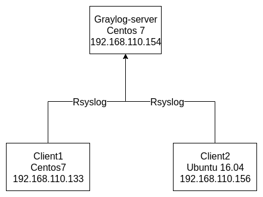

# Tìm hiểu và cài đặt Graylog-server 3.1

Mục lục.

---

[1. Mô hình và IP planning](#1)

[2. Cài đặt Graylog 3.1](#2)

- [2.1 Cài đặt môi trường và các gói phụ trợ](#2.1)

- [2.2 Cài đặt mongodb](#2.2)

- [2.3 Cài đặt elasticsearch](#2.3)

- [2.4 Cài đặt graylog-server](#2.4)

- [2.5 Đăng nhập vào giao diện của graylog-server](#2.4)

---

<a name ="1"></a>
## 1. Mô hình và IP planning
### 1.1 Mô hình
Graylog server triểu khai theo mô hình minimal setup (all-in-one).



### 1.2 IP planning
Thông số các máy sử dụng trong mô hình lab.


<a name ="2"></a>
## 2. Cài đặt Graylog 3.1

<a name ="2.1"></a>
### 2.1 Cài đặt môi trường và các gói phụ trợ

```
yum install java-1.8.0-openjdk-headless.x86_64
yum install epel-release -y
yum install pwgen -y
```
Vì là môi trường lab nên tôi tắt hết firewall và SELinux/
```
systemctl stop firewalld
setenforce 0
```

<a name ="2.2"></a>
### 2.2 Cài đặt mongodb
Tạo repo file cho monogodb.
```
vim /etc/yum.repos.d/mongodb-org.repo
```
Thêm các dòng sau vào file.

Ở đây sử dụng mongodb phiên bản 4.0
```
[mongodb-org-4.0]
name=MongoDB Repository
baseurl=https://repo.mongodb.org/yum/redhat/$releasever/mongodb-org/4.0/x86_64/
gpgcheck=1
enabled=1
gpgkey=https://www.mongodb.org/static/pgp/server-4.0.asc
```

Cài đặt Mongodb
```
yum install mongodb-org -y
``` 
Khởi động monodb và cho nó chạy cùng hệ thống.
```
systemctl daemon-reload
systemctl enable mongod.service
systemctl start mongod.service
```

<a name ="2.3"></a>
### 2.3 Cài đặt elasticsearch.

Đầu tiên cài đặt Elastic GPG key.
```
rpm --import https://artifacts.elastic.co/GPG-KEY-elasticsearch
```

Khởi tạo file repo cho elastic
```
vim /etc/yum.repos.d/elasticsearch.repo 
```
Thêm các dòng sau vào file repo elastic.
```
[elasticsearch-6.x]
name=Elasticsearch repository for 6.x packages
baseurl=https://artifacts.elastic.co/packages/oss-6.x/yum
gpgcheck=1
gpgkey=https://artifacts.elastic.co/GPG-KEY-elasticsearch
enabled=1
autorefresh=1
type=rpm-md
```
Tiến hành cài đặt elasticsearch.
```
yum install elasticsearch-oss -y
```

Chỉnh sửa 1 số thông số trong file cấu hình.
```
vim /etc/elasticsearch/elasticsearch.yml
```
tìm sửa và thêm các dòng sau
```
cluster.name: graylog
action.auto_create_index: false
```

Khởi động và cho nó chạy cùng hệ thống.
```
systemctl daemon-reload
systemctl enable elasticsearch.service
systemctl restart elasticsearch.service
```

<a name ="2.4"></a>
### 2.4 Cài đặt graylog-server.
Tải repo của graylog.
```
rpm -Uvh https://packages.graylog2.org/repo/packages/graylog-3.1-repository_latest.rpm
```
Cài đặt graylog từ repo vừa tải.
```
yum install graylog-server -y
```

Tạo chuỗi mã hóa và mật khẩu bí mật 
```
pwgen -N 1 -s 96
```
ta sẽ được một đoan mã lưu lại chuỗi này để có thể xác nhận được mật khẩu khi bị mã hóa.
```
ZUa4sfK4hnnsd7Ei3luhT2BYN0q3JHOCp9MRYthHKl6Ti5VgKXx5fAOtNs1nRzZQLOFMx3q2n847FRDOuOA7Nv7m0hnAe3UP
```
Tạo mật khẩu từ khóa vừa tạo.
```
echo -n 'thanhbc' | sha256sum 
```
Trong đó :
- **thanhbc** là mật khẩu bạn muốn đặt.
- **sha256sum** là kiểu mã hóa.
Nó sẽ cho ta đoanj mật khẩu được mã hóa. Luư lại đê tiếp túc cấu hình graylog-server.
```
88224c87a18db96564dbbaca2a79a5ee04d9882179896bd55c083e2d0fe13ab8
```

Cấu hình graylog-server.
```
vim /etc/graylog/server/server.conf
```
tìm và chính sửa 1 số trường.
```
http_bind_address = 192.168.110.154:9000
password_secret = ZUa4sfK4hnnsd7Ei3luhT2BYN0q3JHOCp9MRYthHKl6Ti5VgKXx5fAOtNs1nRzZQLOFMx3q2n847FRDOuOA7Nv7m0hnAe3UP
root_password_sha2 = 88224c87a18db96564dbbaca2a79a5ee04d9882179896bd55c083e2d0fe13ab8
```
Trong đó:
- **http_bind_address** : là địa chỉ ip của node graylog-server.
- **password_secret** : được tạo ra bởi cấu lệnh pwgen -N 1 -s 96 ta vừa tạo ở trên.
- **root_password_sha2** : là mật khẩu đã được mã hóa vừa tạo ở trên.

Khởi động và cho nó hoạt đông cùng hệ thống.
```
systemctl daemon-reload
systemctl enable graylog-server.service
systemctl start graylog-server.service
```

<a name ="2.5"></a>
### 2.5 Đăng nhập vào giao diện của graylog-server.
Mở trình duyệt web với địa chỉ ```http://192.168.110.154:9000``` và đăng nhập với tài khoản ``admin``, mật khẩu ``thanhbc``


Như vậy là ta đã cài đặt và cấu hình thành công graylog-server trên centos7 với mô hình  All-in-one.
