# Tìm hiểu Grok parttern

## 1 Grok parttern là gì.

Grok parttern: là một kỹ thuật extractors sử dụng để lọc các dữ liệu nhận vào thành các thông tin chung để thông kê và thuận tiện cho việc sử dụng

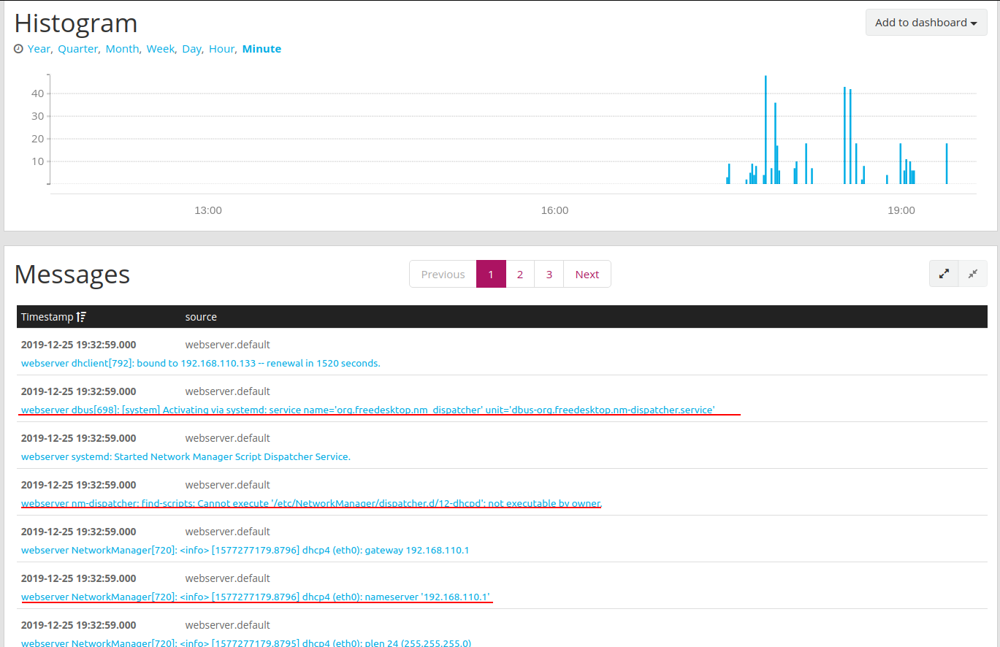

Như ta có thể thấy thì các tin nhắn gửi về  là ở các dạng chuỗi, ta cos thể đọc nó một cách liền mạch được nhưng nó rất mất thời gian cho thống kê và trích xuất.

Ta sử dụng Grok parttern để lọc, trích suất ra thành các trường.

Để sự dụng Grok parttern thì ta phải tìm hiểu các parttern trước.

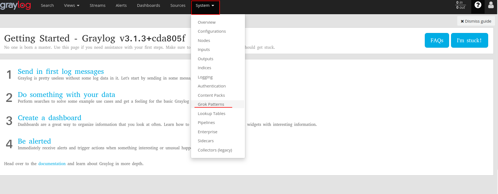

Tại đây có rất nhiều parttern đã được cung cấp sẵn cho chúng ta hoặc ta có thể tự tạo ra các parttern phù hợp với mục đích của chúng ta.

Ví dụ ở đây tôi có tạo 1 parttern để sử dụng cho việc lọc thông tin truy cập ssh.

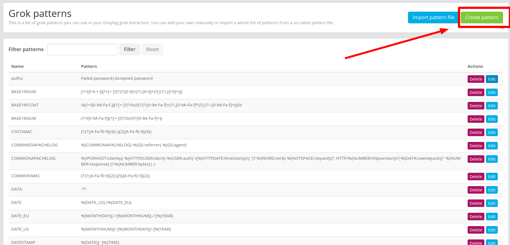

Kích vào đây để tạo parttern 

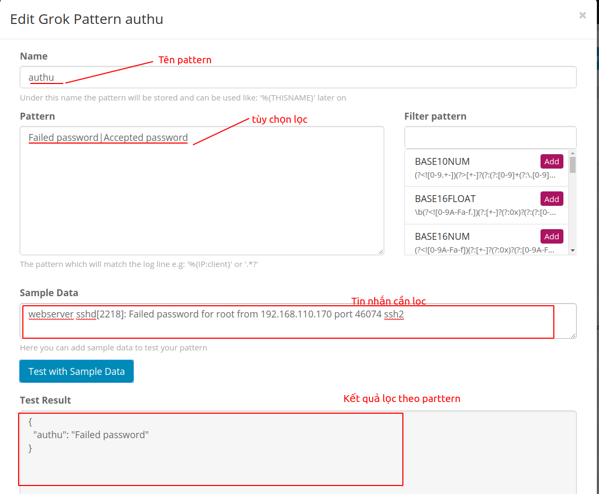


Ta có thể tạo grok parttern với giữ liệu là tin nhắn đầu vao.

## 2. Extractor grok parttern ssh.

trường hợp này lấy ví dụ cho tin nhắn ssh

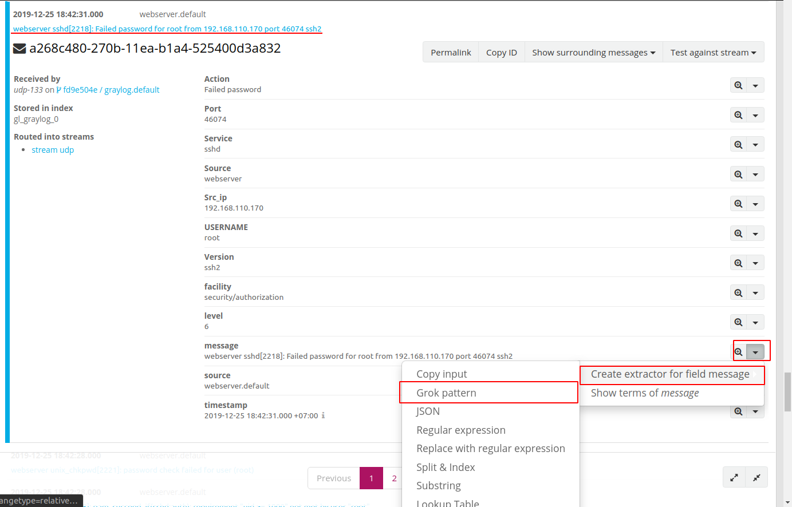

Sau đó nó sẽ hiện ra 1 trang có để chúng ta có thể viết các parttern áp dụng cho nhưng tin nhắn có định dạng như thế. 

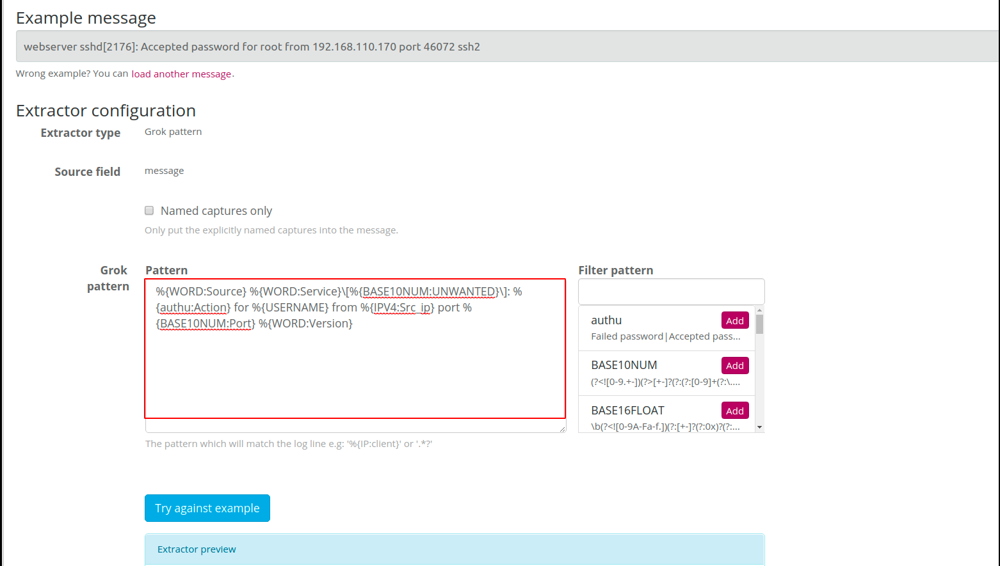

sau đó viết parttern vào 
```
%{WORD:Source} %{WORD:Service}\[%{BASE10NUM:UNWANTED}\]: %{authu:Action} for %{USERNAME} from %{IPV4:Src_ip} port %{BASE10NUM:Port} %{WORD:Version}
```

Bấm vào nút xanh **Try against example** để thực hiện và xem kết quả.

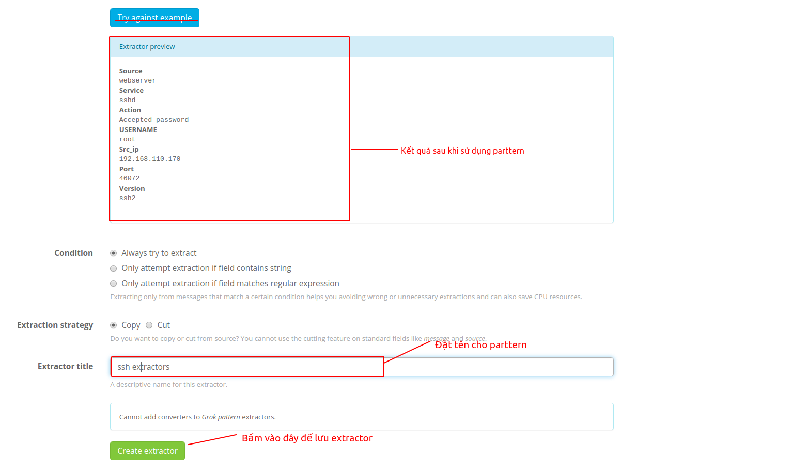

Như ta đã thấy từ tin nhắn trên đã cho ra các thành phần đã định danh một cách rõ ràng.

Sau đó ta đặt grok partten vào input mà ta cần.

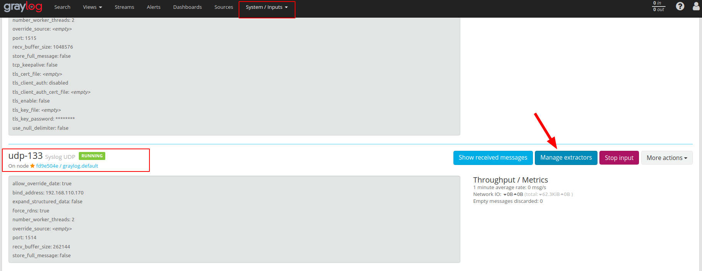

Tại đây ta thêm extractor vừa tạo vào.

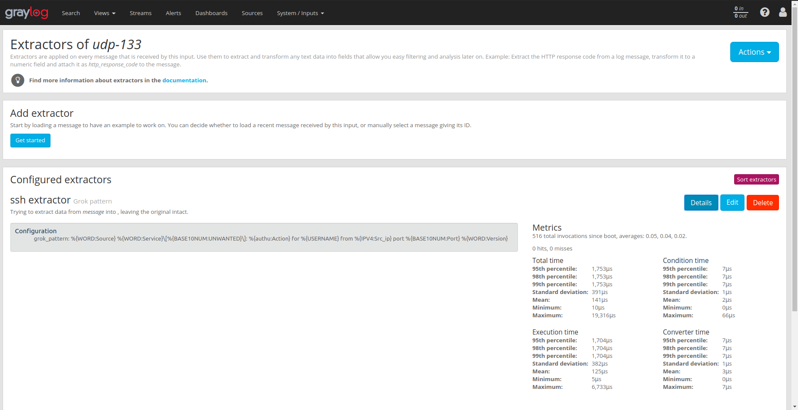

Kiểm tra kết quả.

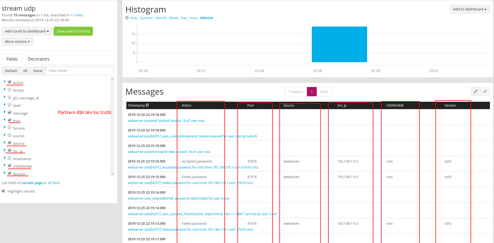

Vậy là ta đã extractor thành công tin nhắn ssh bằng grok parttern.

## 3. Extractor grok parttern apache log 

TIến hành làm các bước tương tự đề viết parttern cho tin nhắn apache log.

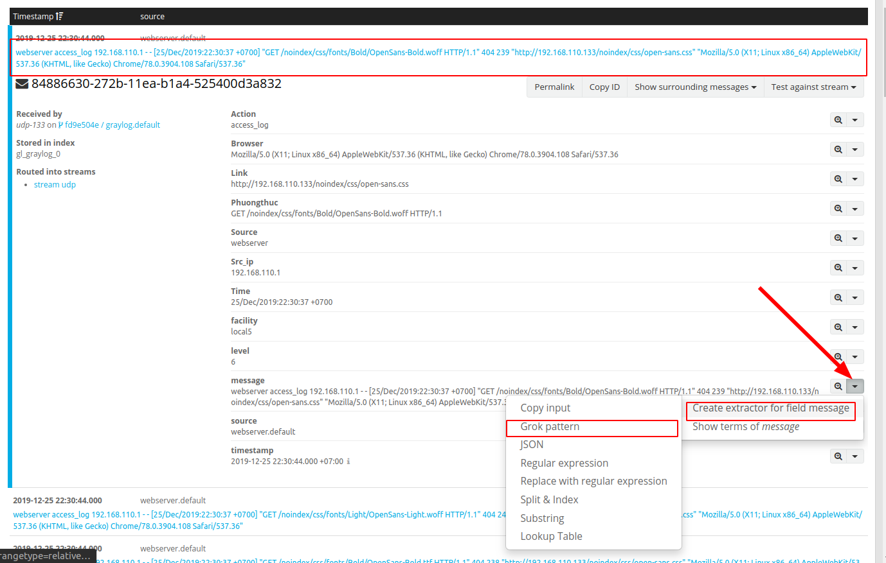

Trong khung parttern điền như sau để extractor tin nhắn.
```
: %{WORD:Source} %{WORD:Action} %{IPV4:Src_ip} - - \[%{DATA:Time}\] \"%{DATA:Phuongthuc}\" %{BASE10NUM:UNWANTED} %{BASE10NUM:UNWANTED} \"%{DATA:Link}\" \"%{DATA:Browser}\"
```
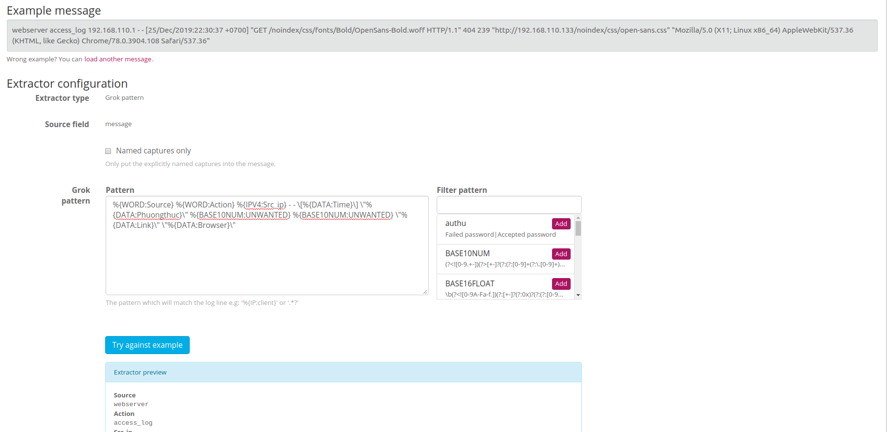


Kiểm tra parttern ấn nút **Try against example** và lưu lại.


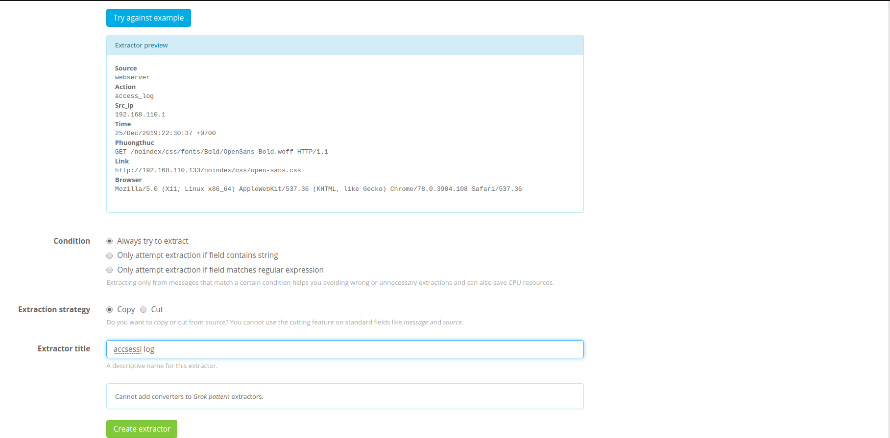

KIểm tra kết quả xem đã extractor dc các tin nhắn chưa.

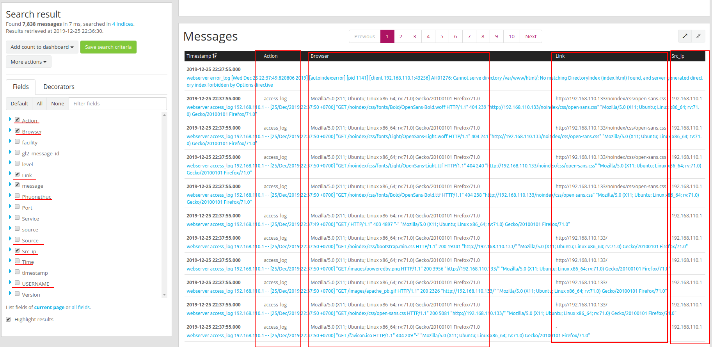

Vậy là đã extractor các tin nhắn apache log thành công.