# Tìm hiểu và sử dụng pipe line trong graylog

## 1. Pipe line 
Pipeline là kỹ thuật xử lý, phân tách, trích xuất các tin nhắn log được nhận. Nó sử dụng các rule và có thể kết nối đến một hoặc nhiều stream cho phép kiếm soát chi tiết việc xử lý các tin nhắn.

Các rule là các điều kiện trong đó có danh sách các hành động và không có luồng điều khiển và để điều khiến nó ta sử dụng các stages. Các stages như các nhóm điều kiện và hanh động chạy lân lượt theo thư tứ. Các stages cũng có mức đọ ưu tiên khac nhau, các stages có cùng mức độ ưu tiên thì sẽ chạy trên cùng 1 pipeline.

### 1.1 Cấu trúc pipeline.
Pipe line được thể hiện bằng các đoạn lênh. Dưới đây là một cấu trúc pipe line đơn giản.
```
pipeline "client01"
stage 0 match all
  rule "ssh login";
stage 1 match either
  rule "apache access";
  rule "anonymize source IPs";
end
```

dưới đây là hình ảnh GUI.
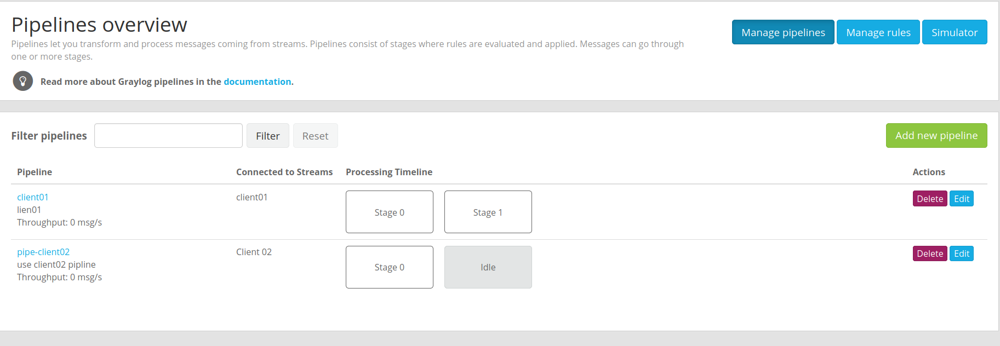

Ta thấy pipeline có thên là "client01" có 2 stages là 0 và 1. Trong các stages có các rules.

### 1.2 Rules

Rules là nền tảng của các pipeline. Chúng chứa các thông tin như sự thay đổi, định tuyến, và các tin nhắn.

Graylog sử dụng ngôn ngữ nhỏ để diễn đạt cách sử lý, sử dụng các quy tắc được định nghĩa trước để deẽ hiểu hơn và nhanh hơn, tối ưu hóa thời gian xủa lý.

Cấu trúc của rules.
```
rule "has firewall fields"
when
    has_field("src_ip") && has_field("dst_ip")
then
    //action
end
```
Để cho dễ hiều ta đi vào ví dụ cách sử dụng pipeline.
## 2. Sử dụng pipeline.

Trong bài này tôi sẽ sử dụng pipeline với messges của ssh log.

Trên web interface của graylog và **System/Pipelines**

Đầu tiene ta cần tạo các rules. Ta vào mục Manage rules.

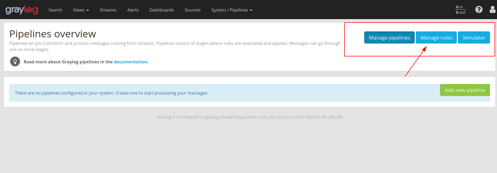

Bài này tối sử dụng pattenn để cho pipe line nên đầu tiên cần có pattern trước.

Toi có thể tạo  và thử grok pattern.

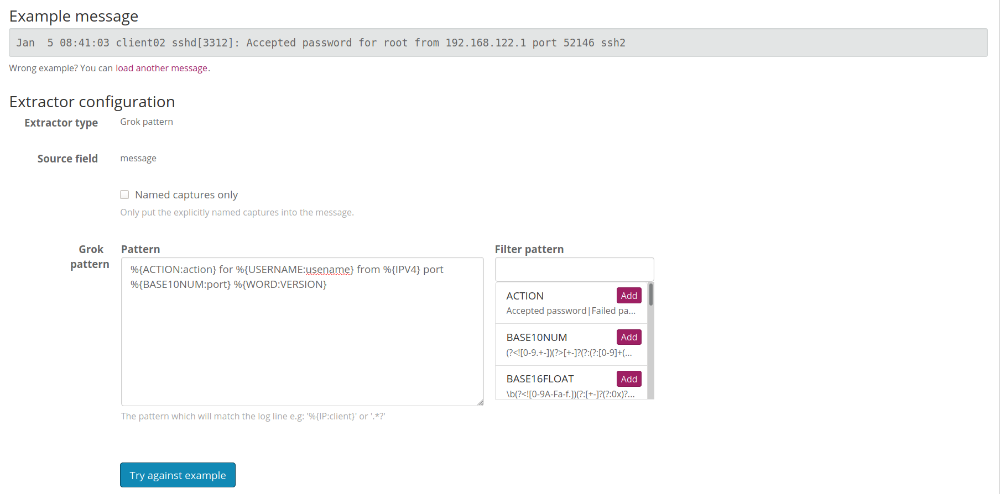

Kiểm tra kết quả.

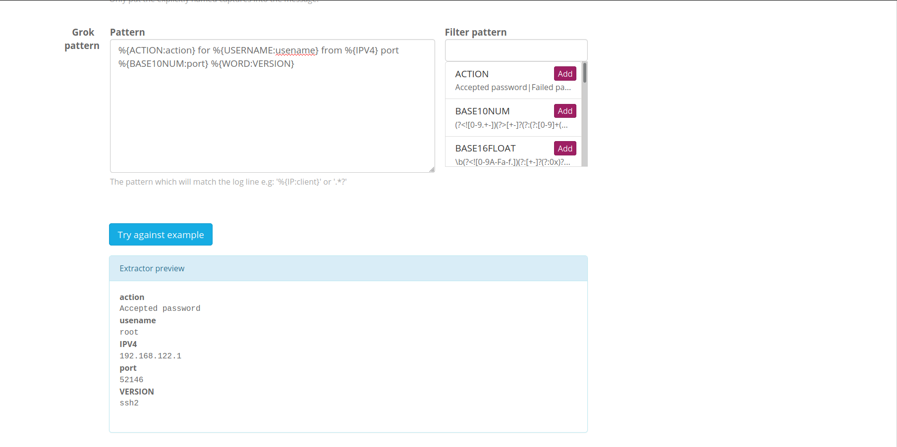

ta sẽ sử dụng pattern vào pipe line  bằng các copy vào hàm grok trong rule của pipe line.

Trên web interface của graylog và **System/Pipelines**

Đầu tiene ta cần tạo các rules. Ta vào mục Manage rules.


Sau khi vào chưa có rules nào, bấm vào **create rules** để tạo rule.

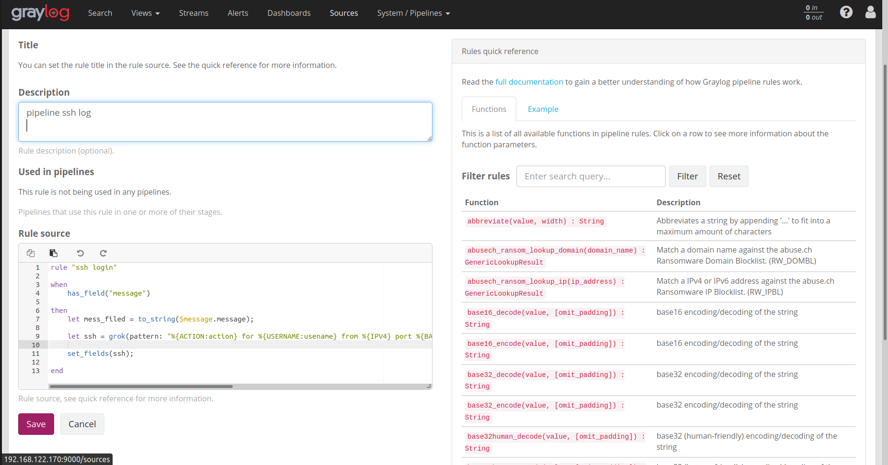

Trong đó:
- Desccription là mô tả về rule sử dụng làm gì.
- rule source là nơi để viết lệnh của rule đó.
```
rule "ssh login"
when 
    has_field("message")
then
    let mess_filed = to_string($message.message);

    let ssh = grok(pattern: "%{ACTION:action} for %{USERNAME:usename} from %{IPV4} port %{BASE10NUM:port} %{WORD:VERSION}", value: mess_filed, only_named_captures: true);
    set_fields(ssh); 
end
```
Sau đó lưu lại.

Tiếp đến ấn vào **Manage pipelines**.

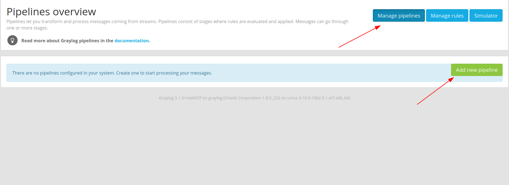
Tạo pipe line mới.

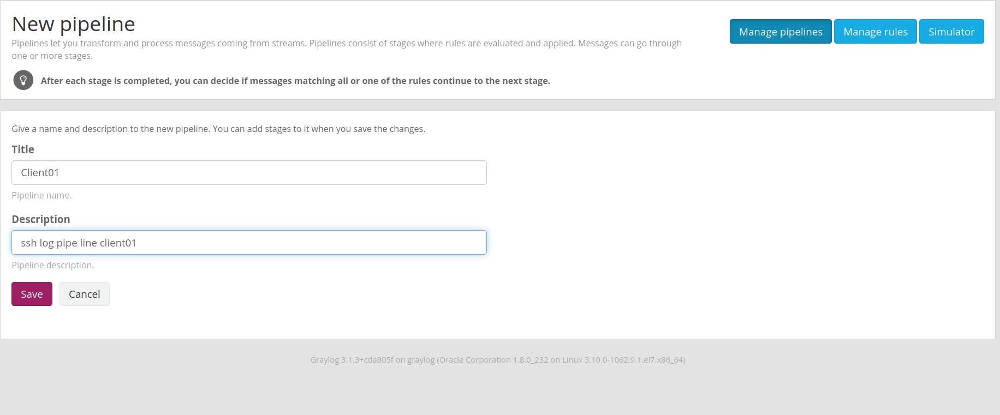

Lưu lại 
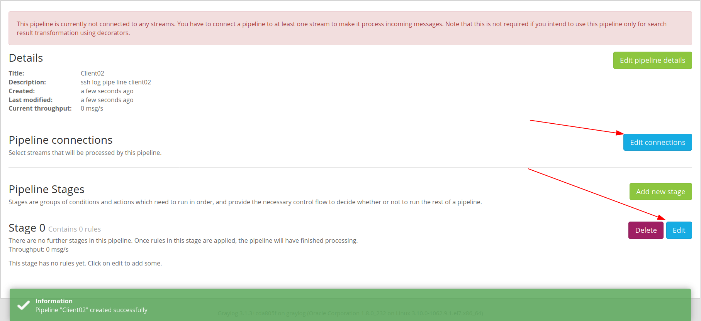

1 cài đặt pipeline trên stream.
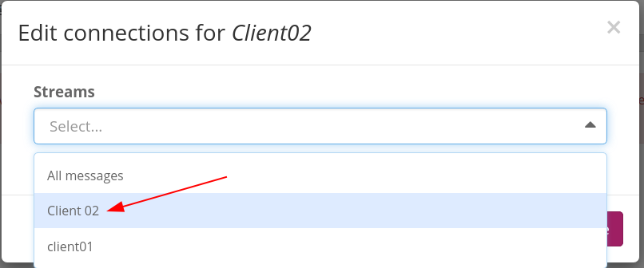

2 chọn rule cho stages.
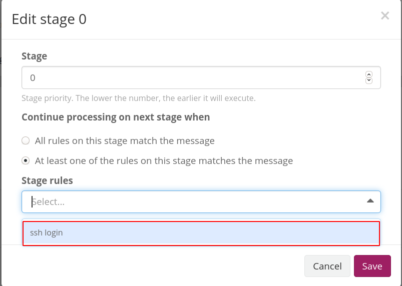

Lưu lại.

Đặt độ ưu tiên cho pipeline nếu không thì graylog sẽ không sử dụng pipe line.


Xắp xếp theo thứ tự sau.

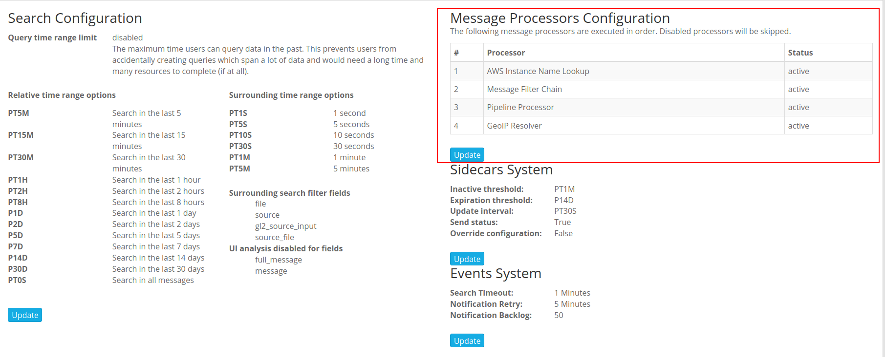

Sau đó kiểm tra kết quả.
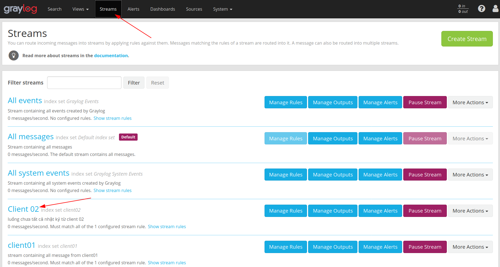

Gửi lại message ssh log và xem kết quả.
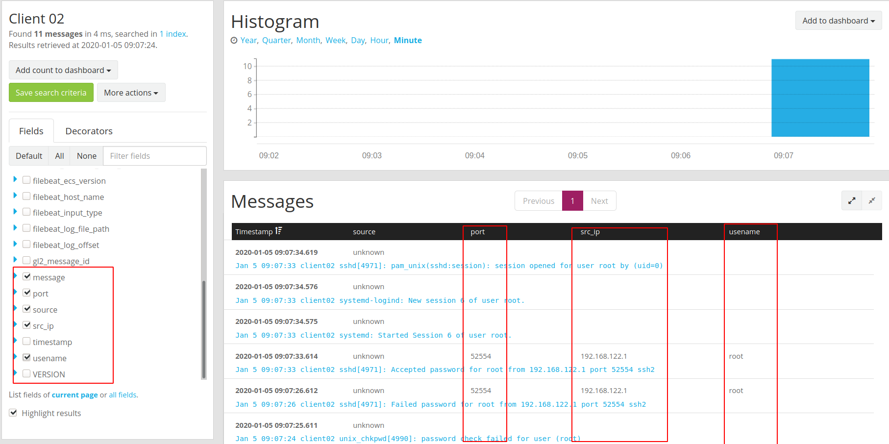

Vậy là đã cấu hình thành công sử dụng pipeline.


