# Cấu hình sử dụng TLS để mã hóa tin nhắn syslog.


Mục Lục.

[1. Giới thiệu về TLS.](#1)

[2. Cấu hình Rsyslog sử dụng TLS để mã hóa.](#2)
- [2.1 Mô hình và IP planning.](#2.1)
- [2.2 Cấu hình CA và Rsyslog-server.](#2.2)
- [2.3 Cấu hình Rsyslog](#2.3)
    - [2.3.1 Cấu hình trên Rsyslog-server](#2.3.1)
    - [2.3.2 Cấu hình trên client.](#2.3.2)
- [2.4 Kiểm tra hoạt động gửi log.](#2.4)

[3. Tài liệu tham khảo](#3)


---
<a name ="1"></a>
## 1. Giới thiệu về TLS.
TLS là chữ viết tắt của Transport Layer Security, nó cũng giúp bảo mật thông tin truyền giống như SSL. TLS là giao thực dựa trên tiêu chuẩn SSL v3.0.

SSL là chữ viết tắt của Secure Sockets Layer (Lớp socket bảo mật). Một loại bảo mật giúp mã hóa liên lạc giữa client và server. Công nghệ này đang lỗi thời và được thay thế hoàn toàn bởi TLS.


TLS sử dụng các chứng chi được cấp phát bới các tổ chức quản lý chứng chỉ và có mô hình hoạt động chung như sau.

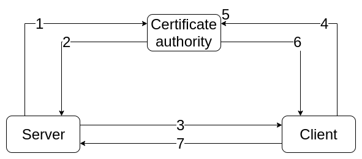

1. Server yêu cầu CA phát phát hành thẻ chứng thực cho server.
2. CA Kiểm tra tính hợp lệ và đinh danh của server rồi phát hành thẻ chứng thực cho server
3. Server chuyển thẻ chứng thực với đinh danh của server cho client.
4. CLient yêu cầu CA kiểm tra định danh của server.
5. Client kiểm tra và xác nhận tính hợp lệ của thẻ chứng thực của server.
6. CA trả về kết quả kiểm tra cho client: Hợp lệ.
7. Nếu nhận được kết qủa hợp lệ thì client chấp nhận (tin cậy) server và quá trình trao đổi thông tin giữa client và server bắt đầu.

syslog sử dụng TLS để xác thực, mã hóa thông tin các thông tin trước khi truyền.


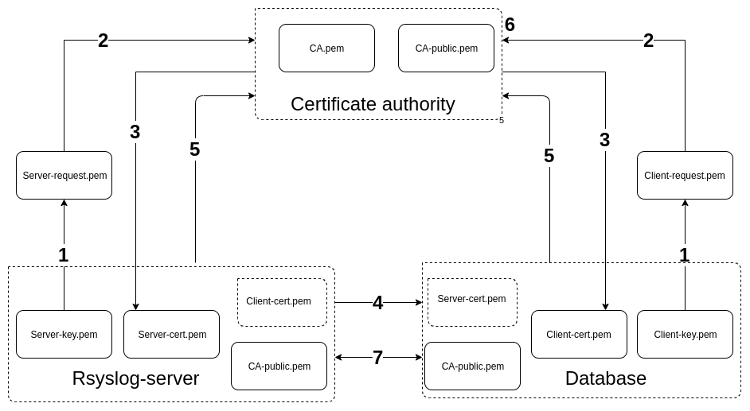

1. Rsyslog-server tạo private-key và tạo yêu cầu chứng thực.
2. Rsyslog-server yêu cầu chứng thực đến các CA. CA kiểm tra tính hợp lệ và đinh danh của chứng trực rồi phát hành chứng chị cho Rsyslog-server.
3. CA gửi chứng chỉ cho Rsyslog-server.
4. Rsyslog-server gửi chứng chỉ cho Database.
5. Database sử dụng chứng chị vửa nhận và CA-public được cung cấp yêu cầu CA xác minh chứng chỉ vửa nhận.
6. CA trả về kết quả hợp lệ thì database chấp nhận tin cậy Rsyslog-server.
7. Nếu nhận kết quả hợp lệ thì bắt đầu quá trình truyền tin.

``Các bước trên client là database lặp lại tương tự như trên Rsyslog-server``

<a name ="2"></a>
## 2. Cấu hình Rsyslog sử dụng TLS để mã hóa.

Điều kiển đầu tiên là bạn đã biết cấu hình rsyslog tập trụng rồi mới đên phần này.
Vì đây là bài làm mô hình lab và tự tạo chứng chỉ nên tôi  sử dụng Rsyslog-server làm nơi cung cấp CA.

<a name ="2.1"></a>
### 2.1 Mô hình và IP planning.

#### 2.1.1 Mô hình
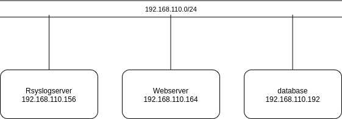


#### 2.1.2 IP planning.
Tên máy ảo|	Hệ điều hành|	IP address|	Subnet mask|	Default gateway
------|-----|----------|--------|-----
RsyslogServer| CentOS7|192.168.110.156|/24|192.168.110.1
webserver|CentOS7|192.168.110.164|/24|192.168.110.1
database|CentOS7|192.168.110.192|/24|192.168.110.1

<a name ="2.2"></a>
### 2.2 Cấu hình CA - Rsyslog-server.

Bước này có thể làm trên máy khác. Rồi gửi các file key và CA cho server và client.

#### Tạo chứng chỉ CA

Ta sử dụng ``gnutls`` để tự taoj chứng chỉ. Cài đặt như sau.
```
yum install gnutls-utils
```
Tạo private key cho CA
```
certtool --generate-privkey --outfile CA-key.pem
```

Tạo public key cho CA được generate từ CA-key vừa tạo. Sử dụng RSA.
```
certtool --generate-self-signed --load-privkey CA-key.pem --outfile CA.pem
```
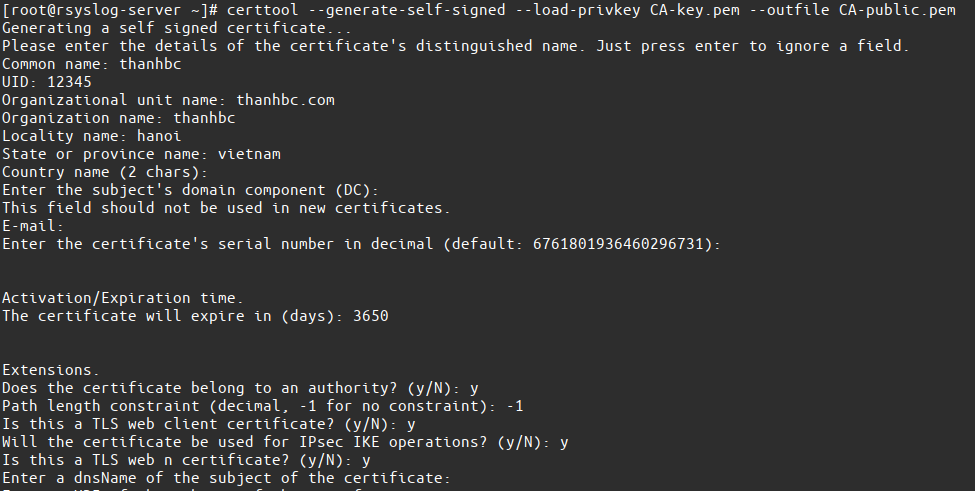

Trả lời các câu hỏi hiện ra.

#### Tạo private/public key cho Rsyslog-server.

Tạo private key cho Rsyslog-server cái này không được gửi ra bên ngoài phải giữ bí mật.
```
certtool --generate-privkey --outfile server-key.pem --bits 2048
```

Tạo public key hay gọi là server-request  key này được gen từ server-key.pem vừa tạo và đẻ gửi cho CA xác nhận.
```
certtool --generate-request --load-privkey server-key.pem --outfile server-request.pem
```
Điền 1 số thông tin cơ bản cần phải nhớ.
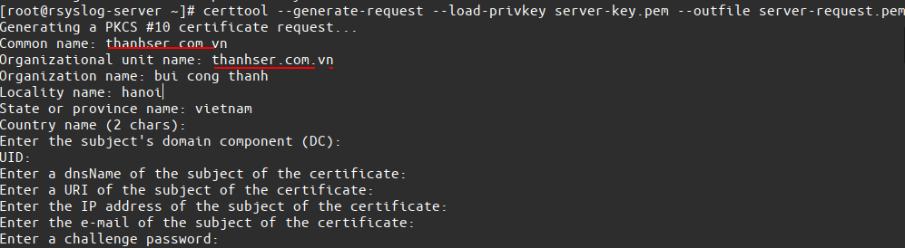

Xác thực server-request và sử dụng CA.pem, CA-key.pem để tạo chứng chỉ cho Rsyslog-server.
```
certtool --generate-certificate --load-request server-request.pem --outfile server-cert.pem --load-ca-certificate CA.pem --load-ca-privkey CA-key.pem
```
Điền một số thong tin đúng với các thông tin đã nhập trên.
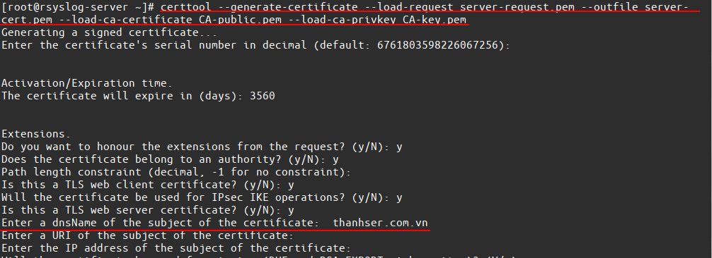

#### Tạo private/public key cho client.

Tạo private key cho client 
```
certtool --generate-privkey --outfile client-key.pem --bits 2048
```
Tạo public key hay gọi là client-request  key này được gen từ client-key.pem vừa tạo và đẻ gửi cho CA xác nhận.
```
certtool --generate-request --load-privkey client-key.pem --outfile client-request.pem
```

Điền 1 số thông tin cơ bản cần phải nhớ.
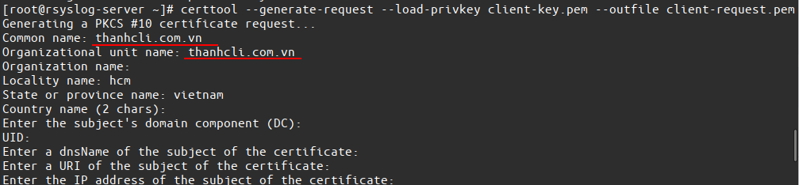

Xác thực client-request và sử dụng CA.pem, CA-key.pem để tạo chứng chỉ cho CLient.
```
certtool --generate-certificate --load-request client-request.pem --outfile client-cert.pem --load-ca-certificate CA.pem --load-ca-privkey CA-key.pem
```
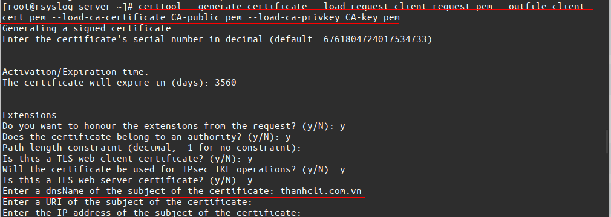

Sau khi quá trình hoàn tất ta có tất các các file sau.
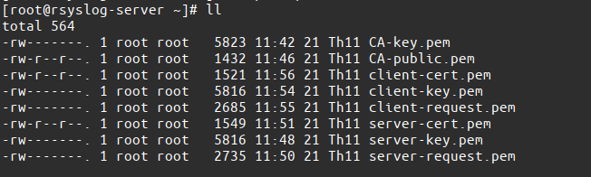

#### Gửi file CA.pem và các khóa của client đến client.
Sử dụng scp cho bảo mật.
```
scp CA.pem  client-* root@ip-client:/etc/pki/tls/private
```
#### Gửi file CA.pem và các khóa của server đến server.

Sử dụng scp cho bảo mật.
```
scp CA.pem  server-* root@ip-server:/etc/pki/tls/private
```
<a name ="2.3"></a>
### 2.3 Cấu hình Rsyslog

<a name ="2.3.1"></a>
#### 2.3.1 Cấu hình trên Rsyslog-server
Cài gói cần thiết

```
yum install rsyslog-gnutls
```

Sửa file `/etc/rsyslog.conf`

Thêm vào những dòng sau

```
# GTLS driver
$DefaultNetstreamDriver gtls
# Certificates
$DefaultNetstreamDriverCAFile /etc/pki/tls/private/CA.pem
$DefaultNetstreamDriverCertFile /etc/pki/tls/private/server-cert.pem
$DefaultNetstreamDriverKeyFile /etc/pki/tls/private/server-key.pem
# Authentication mode
$ActionSendServerStreamDriverAuthMode x509/name
$ActionSendServerStreamDriverPermittedPeer *.com.vn
# Only use TLS
$ActionSendServerStreamDriverMode 1
```
Trong đó:

**DefaultNetstreamDriverCAFile** Là đường dẫn đến file chứng chỉ của CA.

**DefaultNetstreamDriverCertFile** Là đường đẫn đến file chứng chị của server.

**DefaultNetstreamDriverKeyFile** Là đường dẫn đến file private key của server.

**ActionSendServerStreamDriverPermittedPeer** Hành động gửi trên host.

**ActionSendServerStreamDriverMode 1** Chỉ sử dụng TLS. để mã hóa trên TCP.

Khởi động lại Rsyslog 
```
systemctl restart rsyslog
```


<a name ="2.3.2"></a>
#### 2.3.2 Cấu hình trên client.
CLient là máy có tên Database.

Cài gói cần thiết

```
yum install rsyslog-gnutls -y
```

Sửa file `/etc/rsyslog.conf`

Thêm vào các dòng sau

```
# GTLS driver
$DefaultNetstreamDriver gtls
# Certificates
$DefaultNetstreamDriverCAFile /etc/pki/tls/private/CA.pem
$DefaultNetstreamDriverCertFile /etc/pki/tls/private/client-cert.pem
$DefaultNetstreamDriverKeyFile /etc/pki/tls/private/client-key.pem
# Auth mode
$ActionSendStreamDriverAuthMode x509/name
$ActionSendStreamDriverPermittedPeer server.com.vn
# Only use TLS
$ActionSendStreamDriverMode 1
```
Trong đó:

**DefaultNetstreamDriverCAFile** Là đường dẫn đến file chứng chỉ của CA.

**DefaultNetstreamDriverCertFile** Là đường đẫn đến file chứng chị của client.

**DefaultNetstreamDriverKeyFile** Là đường dẫn đến file private key của client.

**ActionSendServerStreamDriverPermittedPeer** Hành động gửi trên host.

**ActionSendServerStreamDriverMode 1** Chỉ sử dụng TLS. để mã hóa trên TCP.

Khởi động lại Rsyslog 
```
systemctl restart rsyslog
```

<a name ="2.4"></a>
## 2.4 Kiểm tra hoạt động gửi log.

Tôi sử dụng phần mềm wireshark để bắt và đọc các gói tin trên interface **vnet0** là interface được sử dụng để client gửi các gói tin syslog đến server.
### Khi chưa sử dụng TLS
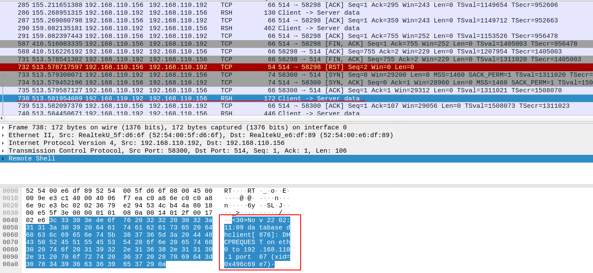

Ta có thể thấy thông điệp được gửi trong gói tin là dạng clear text. Có thể trực tiếp xem được.
### Khi cài đặt và sử dụng TLS.

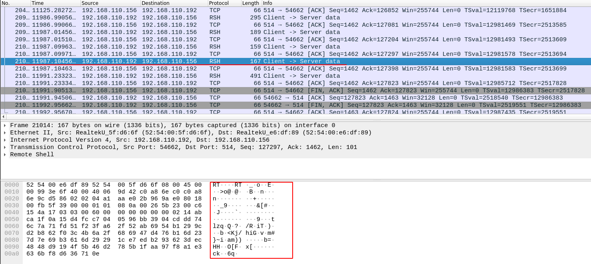

Ta có thể thấy thông điệp được gửi trong gói tin đã bị mã hóa không thể đọc được.
Vậy là thông tin của ta đã được an toàn.


<a name ="3"></a>
## 3. Tài liêu tham khảo.
1. https://devconnected.com/the-definitive-guide-to-centralized-logging-with-syslog-on-linux/#V_Encrypting_rsyslog_messages_with_TLS
2. https://github.com/niemdinhtrong/thuctapsinh/blob/master/NiemDT/Ghichep_log/docs/Rsyslog-tls.md
