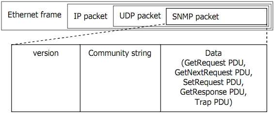

# Tìm hiểu về giao thức SNMP

Trong bài này mình trình bày gần như hoàn chỉnh các vấn đề về giao thức SNMP (Simple Network Management Protocol), từ nền tảng hoạt động của giao thức, ứng dụng vào việc quản lý các thiết bị trong mạng, tìm hiểu một số công cụ SNMP, đến việc lập trình phần mềm giám sát thiết bị và phần mềm cho phép được giám sát bằng SNMP.

# Mục lục 

[1: Giám sát hệ thống là gì ?](#1)

- [1.1 Các bài toán giám sát cơ bản](#1.1)
- [1.2 Các phương thức giám sát cơ bản](#1.2)

[2: Giới thiệu giao thức SNMP](#2)
- [2.1 Tổng quan về giao thức SNMP](#2.1)
- [2.2 Các phiên bản của giao thức SNMP](#2.2)

[3: Kiến trúc và thành phần trong SNMP](#3)
- [3.1 Kiến trúc trong SNMP](#3.1)
- [3.2 Các thành phần trong SNMP](#3.2)

[4: Management Information Base](#4)

[5: Các phương thức của SNMP ](#5)

[6: Các cơ chế bảo mật cho SNMP](#6)
- [6.1 Community string](#6.1)
- [6.2 View](#6.2)
- [6.3 SNMP access control list ](#6.3)

[7: Cấu trúc bản tin SNMP ](#7)

---

## 1: Giám sát hệ thống là gì ?
 

### 1.1 Giám sát thiết bị mạng 
Mở đầu, tôi sẽ đề cập đến 3 bài toán thuộc hàng phổ biến nhất trong các ứng dụng của SNMP. Để cho các bạn lần đầu tìm hiểu SNMP cảm thấy có hứng thú, tôi cũng sẽ cho các bạn thấy ứng dụng SNMP giải bài toán đó trông như thế nào.

Bài toán thứ nhất : Giám sát tài nguyên máy chủ 

+ Giả sử bạn có hàng ngàn máy chủ chạy các hệ điều hành (HĐH) khác nhau. Làm thế nào có thể giám sát tài nguyên của tất cả máy chủ hàng ngày, hàng giờ để kịp thời phát hiện các máy chủ sắp bị quá tải ? Giám sát tài nguyên máy chủ nghĩa là theo dõi tỷ lệ chiếm dụng CPU, dung lượng còn lại của ổ cứng, tỷ lệ sử dụng bộ nhớ RAM, ….

+ Bạn không thể kết nối vào từng máy để xem vì số lượng máy nhiều và vì các HĐH khác nhau có cách thức kiểm tra khác nhau.

+ Để giải quyết vấn đề này bạn có thể dùng một ứng dụng SNMP giám sát được máy chủ, nó sẽ lấy ược thông tin từ nhiều HĐH khác nhau. Ứng dụng này có thể trông giống như hình dưới đây :

    

Bài toán thứ hai : Giám sát lưu lượng trên các port của switch, router

+ Bạn có hàng ngàn thiết bị mạng (network devices) của nhiều hãng khác nhau, mỗi thiết bị có nhiều port. Làm thế nào để giám sát lưu lượng đang truyền qua tất cả các port của các thiết bị suốt 24/24, kịp thời phát hiện các port sắp quá tải ?

+ Bạn cũng không thể kết nối vào từng thiết bị để gõ lệnh lấy thông tin vì thiết bị của các hãng khác nhau có lệnh khác nhau.

+ Để giải quyết vấn đề này bạn có thể dùng một ứng dụng SNMP giám sát lưu lượng, nó sẽ lấy được thông tin lưu lượng đang truyền qua các thiết bị của nhiều hãng khác nhau. Ứng dụng này có thể trông giống như hình dưới đây :

    

Bài toán thứ ba : Hệ thống tự động cảnh báo sự cố tức thời 

+ Bạn có hàng ngàn thiết bị mạng và chúng có thể gặp nhiều vấn đề trong quá trình hoạt động như : một port nào đó bị mất tín hiệu (port down), có ai đó đã cố kết nối (login) vào thiết bị nhưng nhập sai username và password, thiết bị vừa mới bị khởi động lại (restart), …. Làm thế nào để người quản trị biết được sự kiện khi nó vừa mới xảy ra ?

+ Vấn đề này khác với hai vấn đề ở trên. Ở trên là làm thế nào cập nhật liên tục một số thông tin nào đó (biết trước sẽ lấy cái gì), còn ở đây là làm thế nào biết được cái gì xảy ra (chưa biết cái gì sẽ đến).

+ Để giải quyết bài toán này bạn có thể dùng ứng dụng thu thập sự kiện (event) và cảnh báo (warning) bằng SNMP, nó sẽ nhận cảnh báo từ tất cả các thiết bị và hiện nó lên màn hình hoặc gửi email cho người quản trị. Ứng dụng này có thể trông giống như hình dưới đây :

    

### 1.2 Hai phương thức giám sát Poll và Alert
Trước khi tìm hiểu SNMP, tôi muốn trình bày hai phương thức giám sát “Poll” và “Alert” (Có tài liệu gọi là Poll và Trap, hoặc Get và Trap). Đây là 2 phương thức cơ bản của các kỹ thuật giám sát hệ thống, nhiều phần mềm và giao thức được xây dựng dựa trên 2 phương thức này, trong đó có SNMP. Việc hiểu rõ hoạt động của Poll & Alert và ưu nhược điểm của chúng sẽ giúp bạn dễ dàng tìm hiểu nguyên tắc hoạt động của các giao thức hay phần mềm giám sát khác. Hoặc nếu bạn muốn tự phát triển một cơ chế giám sát của riêng bạn thì nó cũng là cơ sở để bạn xây dựng một nguyên tắc hoạt động đúng đắn.

### Phương thức Poll

Nguyên tắc hoạt động : Trung tâm giám sát (manager) sẽ thường xuyên hỏi thông tin của thiết bị cần giám sát (device). Nếu Manager không  hỏi  thì  Device  không  trả  lời,  nếu Manager hỏi thì Device phải trả lời. Bằng cách hỏi thường xuyên, Manager sẽ luôn cập nhật được thông tin mới nhất từ Device.

Ví dụ : Người quản lý cần theo dõi khi nào thợ làm xong việc. Anh ta cứ thường xuyên hỏi người thợ “Anh đã làm xong chưa ?”, và người thợ sẽ trả lời “Xong” hoặc “Chưa”.

### Phương thức Alert

Nguyên  tắc  hoạt  động  :  Mỗi  khi  trong Device xảy ra một sự kiện (event) nào đó thì Device sẽ tự động gửi thông báo cho Manager, gọi là Alert. Manager không hỏi thông tin định kỳ từ Device.

Ví dụ : Người quản lý cần theo dõi tình hình làm việc của thợ, anh ta yêu cầu người thợ thông báo cho mình khi có vấn đề gì đó xảy ra. Người thợ sẽ thông báo các sự kiện đại loại như “Tiến độ đã hoàn thành 50%”, “Mất điện lúc 10h”, “Có điện lại lúc 11h”, “Mới có tai nạn xảy ra”.

Device chỉ gửi những thông báo mang tính sự kiện chứ không gửi những thông tin thường xuyên thay đổi, nó cũng sẽ không gửi Alert nếu chẳng có sự kiện gì xảy ra. Chẳng hạn khi một port down/up thì Device sẽ gửi cảnh báo, còn tổng số byte truyền qua port đó sẽ không được Device gửi đi vì đó là thông tin thường xuyên thay đổi. Muốn lấy những thông tin thường xuyên thay đổi thì Manager phải chủ động đi hỏi Device, tức là phải thực hiện phương thức Poll.

### So sánh phương thức Poll và Alert 

Hai phương thức Poll và Alert là hoàn toàn khác nhau về cơ chế. Một ứng dụng giám sát có thể sử dụng Poll hoặc Alert, hoặc cả hai, tùy vào yêu cầu cụ thể trong thực tế.

### Poll hay Alert ?

Hai phương thức Poll và Alert có điểm thuận lợi và bất lợi ngược nhau, do đó nhiều trường hợp ta nên sử dụng kết hợp cả Poll lẫn Alert để đạt được hiệu quả kết hợp của cả hai.

Các ví dụ ứng dụng cơ chế Poll & Alert :

+ Giao thức Syslog : mỗi khi có sự kiện xảy ra thì thiết bị sẽ gửi bản tin syslog đến Syslog Server.

+ Phần mềm NetworkView, giám sát tình trạng các server bằng cách ping liên tục.

+ Giao thức STP, phát hiện loop trong mạng bằng cách gửi nhận các gói BPDU và gửi bản tin Topology change mỗi khi phát hiện thay đổi.

+ Trong quản lý người ta luôn thực hiện song song chế độ kiểm tra và báo cáo, thường xuyên kiểm tra để phát hiện vấn đề và báo cáo ngay khi xảy ra vấn đề.

## 2. Giới thiệu giao thức SNMP

### 2.1 Tổng quan về giao thức SNMP

SNMP là giao thức quản lý mạng đơn giản

SNMP là “giao thức quản lý mạng đơn giản”, dịch từ cụm từ “Simple Network Management Protocol”. Thế nào là giao thức quản lý mạng đơn giản ?

Giao thức là một tập hợp các thủ tục mà các bên tham gia cần tuân theo để có thể giao tiếp được với nhau. Trong lĩnh vực thông tin, một giao thức quy định cấu trúc, định dạng (format) của dòng dữ liệu trao đổi với nhau và quy định trình tự, thủ tục để trao đổi dòng dữ liệu đó. Nếu một bên tham gia gửi dữ liệu không đúng định dạng hoặc không theo trình tự thì các bên khác sẽ không hiểu hoặc từ chối trao đổi thông tin. SNMP là một giao thức, do đó nó có những quy định riêng mà các thành phần trong mạng phải tuân theo.

Một thiết bị hiểu được và hoạt động tuân theo giao thức SNMP được gọi là “có hỗ trợ SNMP” (SNMP supported) hoặc “tương thích SNMP” (SNMP compartible).

SNMP dùng để quản lý, nghĩa là có thể theo dõi, có thể lấy thông tin, có thể được thông báo, và có thể tác động để hệ thống hoạt động như ý muốn. VD một số khả năng của phần mềm SNMP :

+ Theo dõi tốc độ đường truyền của một router, biết được tổng số byte đã truyền/nhận.

+ Lấy thông tin máy chủ đang có bao nhiêu ổ cứng, mỗi ổ cứng còn trống bao nhiêu.

+ Tự động nhận cảnh báo khi switch có một port bị down.

+ Điều khiển tắt (shutdown) các port trên switch.

SNMP dùng để quản lý mạng, nghĩa là nó được thiết kế để chạy trên nền TCP/IP và quản lý các thiết bị có nối mạng TCP/IP. Các thiết bị mạng không nhất thiết phải là máy tính mà có thể là switch, router, firewall, adsl gateway, và cả một số phần mềm cho phép quản trị bằng SNMP. Giả sử bạn có một cái máy giặt có thể nối mạng IP và nó hỗ trợ SNMP thì bạn có thể quản lý nó từ xa bằng SNMP.

SNMP là giao thức đơn giản, do nó được thiết kế đơn giản trong cấu trúc bản tin và thủ tục hoạt động, và còn đơn giản trong bảo mật (ngoại trừ SNMP version 3). Sử dụng phần mềm SNMP, người quản trị mạng có thể quản lý, giám sát tập trung từ xa toàn mạng của mình.

Ưu điểm trong thiết kế của SNMP 

SNMP được thiết kế để đơn giản hóa quá trình quản lý các thành phần trong mạng. Nhờ đó các phần mềm SNMP có thể được phát triển nhanh và tốn ít chi phí.

SNMP được thiết kế để có thể mở rộng các chức năng quản lý, giám sát. Không có giới hạn rằng SNMP có thể quản lý được cái gì. Khi có một thiết bị mới với các thuộc tính, tính năng mới thì người ta có thể thiết kế “custom” SNMP để phục vụ cho riêng mình (trong chương 3 tác giả sẽ trình bày file cấu trúc dữ liệu của SNMP).

SNMP được thiết kế để có thể hoạt động độc lập với các kiến trúc và cơ chế của các thiết bị hỗ trợ SNMP. Các thiết bị khác nhau có hoạt động khác nhau nhưng đáp ứng SNMP là giống nhau. VD bạn có thể dùng 1 phần mềm để theo dõi dung lượng ổ cứng còn trống của các máy chủ chạy HĐH Windows và Linux; trong khi nếu không dùng SNMP mà làm trực tiếp trên các HĐH này thì bạn phải thực hiện theo các cách khác nhau.

### 2.2 Các phiên bản của SNMP 

SNMP có 4 phiên bản : SNMPv1, SNMPv2c, SNMPv2u và SNMPv3.

Các phiên bản này khác nhau một chút ở định dạng bản tin và phương thức hoạt động. Hiện tại SNMPv1 là phổ biến nhất do có nhiều thiết bị tương thích nhất và có nhiều phần mềm hỗ trợ nhất. Trong khi đó chỉ có một số thiết bị và phần mềm hỗ trợ SNMPv3. Do đó trong 3 chương đầu của tài liệu này tác giả sẽ trình bày các vấn đề theo chuẩn SNMPv1. Các phiên bản khác sẽ được trình bày trong chương 4.

## 3 Kiến trúc và thành phần trong SNMP

### 3.1 Kiến trúc trong SNMP 

Theo RFC1157 , kiến trúc của SNMP bao gồm 2 thành phần : các trạm quản lý mạng (network management station) và các thành tố mạng (network element).

### Network  management  station.
Network  management  station. thường  là  một  máy  tính  chạy  phần  mềm  quản  lý  SNMP  (SNMP management application), dùng để giám sát và điều khiển tập trung các network element.

### Network element
Network element là các thiết bị, máy tính, hoặc phần mềm tương thích SNMP và được quản lý bởi network management station. Như vậy element bao gồm device, host và application.

Một management station có thể quản lý nhiều element, một element cũng có thể được quản lý bởi nhiều management station. Vậy nếu một element được quản lý bởi 2 station thì điều gì sẽ xảy ra ? Nếu station lấy thông tin từ element thì cả 2 station sẽ có thông tin giống nhau. Nếu 2 station tác động đến cùng một element thì element sẽ đáp ứng cả 2 tác động theo thứ tự cái nào đến trước.

Ngoài ra còn có khái niệm SNMP agent. SNMP agent là một tiến trình (process) chạy trên network element, có nhiệm vụ cung cấp thông tin của element cho station, nhờ đó station có thể quản lý được element. Chính xác hơn là application chạy trên station và agent chạy trên element mới là 2 tiến trình SNMP trực tiếp liên hệ với nhau. Các ví dụ minh họa sau đây sẽ làm rõ hơn các khái niệm này :

+ Để dùng một máy chủ (= station) quản lý các máy con (= element) chạy HĐH Windows thông qua SNMP thì bạn phải : cài đặt một phần mềm quản lý SNMP (=application) trên máy chủ, bật SNMP service (= agent) trên máy con.

+ Để dùng một máy chủ (= station) giám sát lưu lượng của một router (= element) thì bạn phải : cài phần mềm quản lý SNMP (= application) trên máy chủ, bật tính năng SNMP (=agent) trên router.

### 3.2 Thành phần trong SNMP

### Object

Một thiết bị hỗ trợ SNMP có thể cung cấp nhiều thông tin khác nhau, mỗi thông tin đó gọi là một object. Ví dụ :

+ Máy tính có thể cung cấp các thông tin : tổng số ổ cứng, tổng số port nối mạng, tổng số byte đã truyền/nhận, tên máy tính, tên các process đang chạy, ….

+ Router có thể cung cấp các thông tin : tổng số card, tổng số port, tổng số byte đã truyền/nhận, tên router, tình trạng các port của router, ….

### OID
Mỗi object có một tên gọi và một mã số để nhận dạng object đó, mã số gọi là Object ID (OID). VD :

+ Tên thiết bị được gọi là sysName, OID là 1.3.6.1.2.1.1.5 .

+ Tổng số port giao tiếp (interface) được gọi là ifNumber, OID là 1.3.6.1.2.1.2.1.

+ Địa chỉ Mac Address của một port được gọi là ifPhysAddress, OID là 1.3.6.1.2.1.2.2.1.6.

+ Số byte đã nhận trên một port được gọi là ifInOctets, OID là 1.3.6.1.2.1.2.2.1.10.

Bạn hãy khoan thắc mắc ý nghĩa của từng chữ số trong OID, chúng sẽ được giải thích trong phần sau. Một object chỉ có một OID, chẳng hạn tên của thiết bị là một object. Tuy nhiên nếu một thiết bị lại có nhiều tên thì làm thế nào để phân biệt ? Lúc này người ta dùng thêm 1 chỉ số gọi là “scalar instance index” (cũng có thể gọi là “sub-id”) đặt ngay sau OID. Ví dụ :

+ Tên thiết bị được gọi là sysName, OID là 1.3.6.1.2.1.1.5; nếu thiết bị có 2 tên thì chúng sẽ được gọi là sysName.0 & sysName.1 và có OID lần lượt là 1.3.6.1.2.1.1.5.0 & 1.3.6.1.2.1.1.5.1.

+ Địa chỉ Mac address được gọi là ifPhysAddress, OID là 1.3.6.1.2.1.2.2.1.6; nếu thiết bị có 2 mac address  thì  chúng  sẽ  được  gọi  là  ifPhysAddress.0  &  ifPhysAddress.1  và  có  OID  lần  lượt  là 1.3.6.1.2.1.2.2.1.6.0 & 1.3.6.1.2.1.2.2.1.6.1.

+ Tổng số port được gọi là ifNumber, giá trị này chỉ có 1 (duy nhất) nên OID của nó không có phân cấp con và vẫn là 1.3.6.1.2.1.2.1.

Ở hầu hết các thiết bị, các object có thể có nhiều giá trị thì thường được viết dưới dạng có sub-id. VD một thiết bị dù chỉ có 1 tên thì nó vẫn phải có OID là sysName.0 hay 1.3.6.1.2.1.1.5.0. Bạn cần nhớ quy tắc này để ứng dụng trong lập trình phần mềm SNMP manager.

Sub-id không nhất thiết phải liên tục hay bắt đầu từ 0. VD một thiết bị có 2 mac address thì có thể chúng được gọi là ifPhysAddress.23 và ifPhysAddress.125645.

OID của các object phổ biến có thể được chuẩn hóa, OID của các object do bạn tạo ra thì bạn phải tự mô tả chúng. Để lấy một thông tin có OID đã chuẩn hóa thì SNMP application phải gửi một bản tin SNMP có chứa OID của object đó cho SNMP agent, SNMP agent khi nhận được thì nó phải trả lời bằng thông tin ứng với OID đó.

VD : Muốn lấy tên của một PC chạy Windows, tên của một PC chạy Linux hoặc tên của một router thì SNMP application chỉ cần gửi bản tin có chứa OID là 1.3.6.1.2.1.1.5.0. Khi SNMP agent chạy trên PC Windows, PC Linux hay router nhận được bản tin có chứa OID 1.3.6.1.2.1.1.5.0, agent lập tức hiểu rằng đây là bản tin hỏi sysName.0, và agent sẽ trả lời bằng tên của hệ thống. Nếu SNMP agent nhận được một OID mà nó không hiểu (không hỗ trợ) thì nó sẽ không trả lời.

Một trong các ưu điểm của SNMP là nó được thiết kế để chạy độc lập với các thiết bị khác nhau. Chính nhờ việc chuẩn hóa OID mà ta có thể dùng một SNMP application để lấy thông tin các loại device của các hãng khác nhau.

Object access 

Mỗi object có quyền truy cập là READ_ONLY hoặc READ_WRITE. Mọi object đều có thể đọc được nhưng

chỉ những object có quyền READ_WRITE mới có thể thay đổi được giá trị. VD : Tên của một thiết bị (sysName) là READ_WRITE, ta có thể thay đổi tên của thiết bị thông qua giao thức SNMP. Tổng số port của thiết bị (ifNumber) là READ_ONLY, dĩ nhiên ta không thể thay đổi số port của nó.

## 4. Management Information Base 

MIB (cơ sở thông tin quản lý) là một cấu trúc dữ liệu gồm các đối tượng được quản lý (managed object), được dùng cho việc quản lý các thiết bị chạy trên nền TCP/IP. MIB là kiến trúc chung mà các giao thức quản lý trên TCP/IP nên tuân theo, trong đó có SNMP. MIB được thể hiện thành 1 file (MIB file), và có thể biểu diễn thành 1 cây (MIB tree). MIB có thể được chuẩn hóa hoặc tự tạo.

Hình sau minh họa MIB tree :

Một node trong cây là một object, có thể được gọi bằng tên hoặc id. Ví dụ :

+ Node iso.org.dod.internet.mgmt.mib-2.system có OID là 1.3.6.1.2.1.1, chứa tất cả các object liên quan  đến  thông  tin  của  một  hệ  thống  như  tên  của  thiết  bị  (iso.org.dod.internet.mgmt.mib-2.system.sysName hay 1.3.6.1.2.1.1.5).

+ Các OID của các hãng tự thiết kế nằm dưới iso.org.dod.internet.private.enterprise. Ví dụ : Cisco nằm dưới iso.org.dod.internet.private.enterprise.cisco hay 1.3.6.1.4.1.9, Microsoft nằm dưới iso.org.dod.internet.private.enterprise.microsoft hay 1.3.6.1.4.1.311. Số 9 (Cisco) hay 311 (Microsoft) là số dành riêng cho các công ty do IANA cấp. Nếu Cisco hay Microsoft chế tạo ra một thiết bị nào đó, thì thiết bị này có thể hỗ trợ các MIB chuẩn đã được định nghĩa sẵn (như mib-2) hay hỗ trợ MIB được thiết kế riêng. Các MIB được công ty nào thiết kế riêng thì phải nằm bên dưới OID của công ty đó.

Các objectID trong MIB được sắp xếp thứ tự nhưng không phải là liên tục, khi biết một OID thì không chắc chắn có thể xác định được OID tiếp theo trong MIB. VD trong chuẩn mib-2 thì object ifSpecific  và object atIfIndex nằm kề nhau nhưng OID lần lượt là 1.3.6.1.2.1.2.2.1.22 và 1.3.6.1.2.1.3.1.1.1.

Muốn hiểu được một OID nào đó thì bạn cần có file MIB mô tả OID đó. Một MIB file không nhất thiết phải chứa toàn bộ cây ở trên mà có thể chỉ chứa mô tả cho một nhánh con. Bất cứ nhánh con nào và tất cả lá của nó đều có thể gọi là một mib.

Một manager có thể quản lý được một device chỉ khi ứng dụng SNMP manager và ứng dụng SNMP agent cùng hỗ trợ một MIB. Các ứng dụng này cũng có thể hỗ trợ cùng lúc nhiều MIB.

Trong chương này chúng ta chỉ đề cập đến khái niệm MIB ngắn gọn như trên. Chương 3 sẽ mô tả chi tiết cấu trúc của file MIB.

### 5. Các phương thức của SNMP 
Giao thức SNMPv1 có 5 phương thức hoạt động, tương ứng với 5 loại bản tin như sau :

Mỗi bản tin đều có chứa OID để cho biết object mang trong nó là gì. OID trong GetRequest cho biết nó muốn lấy thông tin của object nào. OID trong GetResponse cho biết nó mang giá trị của object nào. OID trong SetRequest chỉ ra nó muốn thiết lập giá trị cho object nào. OID trong Trap chỉ ra nó thông báo sự kiện xảy ra đối với object nào.

### 1. GetRequest 

Bản tin GetRequest được manager gửi đến agent để lấy một thông tin nào đó. Trong GetRequest có chứa OID của object muốn lấy. VD : Muốn lấy thông tin tên của Device1 thì manager gửi bản tin GetRequest OID=1.3.6.1.2.1.1.5 đến Device1, tiến trình SNMP agent trên Device1 sẽ nhận được bản tin và tạo bản tin trả lời.

Trong một bản tin GetRequest có thể chứa nhiều OID, nghĩa là dùng một GetRequest có thể lấy về cùng lúc nhiều thông tin.

### 2. GetNextRequest 

Bản tin GetNextRequest cũng dùng để lấy thông tin và cũng có chứa OID, tuy nhiên nó dùng để lấy thông tin của object nằm kế tiếp object được chỉ ra trong bản tin.

Tại sao phải có phương thức GetNextRequest ? Như bạn đã biết khi đọc qua những phần trên : một MIB bao gồm nhiều OID được sắp xếp thứ tự nhưng không liên tục, nếu biết một OID thì không xác định được OID kế tiếp. Do đó ta cần GetNextRequest để lấy về giá trị của OID kế tiếp. Nếu thực hiện GetNextRequest liên tục thì ta sẽ lấy được toàn bộ thông tin của agent.

### 3. SetRequest 

Bản tin SetRequest được manager gửi cho agent để thiết lập giá trị cho một object nào đó. Ví dụ :

+ Có thể đặt lại tên của một máy tính hay router bằng phần mềm SNMP manager, bằng cách gửi bản tin SetRequest có OID là 1.3.6.1.2.1.1.5.0 (sysName.0) và có giá trị là tên mới cần đặt.

+ Có thể shutdown một port trên switch bằng phần mềm SNMP manager, bằng cách gửi bản tin có

OID là 1.3.6.1.2.1.2.2.1.7 (ifAdminStatus) và có giá trị là 2

* ifAdminStatus có thể mang 3 giá trị là UP (1), DOWN (2) và TESTING (3).

Chỉ những object có quyền READ_WRITE mới có thể thay đổi được giá trị.

### 4.GetResponse 

Mỗi khi SNMP agent nhận được các bản tin GetRequest, GetNextRequest hay SetRequest thì nó sẽ gửi lại bản tin GetResponse để trả lời. Trong bản tin GetResponse có chứa OID của object được request và giá trị của object đó.

### 5.Trap 

Bản tin Trap được agent tự động gửi cho manager mỗi khi có sự kiện xảy ra bên trong agent, các sự kiện này không phải là các hoạt động thường xuyên của agent mà là các sự kiện mang tính biến cố. Ví dụ : Khi có một port down, khi có một người dùng login không thành công, hoặc khi thiết bị khởi động lại, agent sẽ gửi trap cho manager.

Tuy nhiên không phải mọi biến cố đều được agent gửi trap, cũng không phải mọi agent đều gửi trap khi xảy ra cùng một biến cố. Việc agent gửi hay không gửi trap cho biến cố nào là do hãng sản xuất device/agent quy định.

Phương thức trap là độc lập với các phương thức request/response. SNMP request/response dùng để quản lý còn SNMP trap dùng để cảnh báo. Nguồn gửi trap gọi là Trap Sender và nơi nhận trap gọi là Trap Receiver. Một trap sender có thể được cấu hình để gửi trap đến nhiều trap receiver cùng lúc.

Có 2 loại trap : trap phổ biến (generic trap) và trap đặc thù (specific trap). Generic trap được quy định trong các chuẩn SNMP, còn specific trap do người dùng tự định nghĩa (người dùng ở đây là hãng sản xuất SNMP device). Loại trap là một số nguyên chứa trong bản tin trap, dựa vào đó mà phía nhận trap biết bản tin trap có nghĩa gì.

Theo SNMPv1, generic trap có 7 loại sau : coldStart(0), warmStart(1), linkDown(2), linkUp(3), authenticationFailure(4), egpNeighborloss(5), enterpriseSpecific(6). Giá trị trong ngoặc là mã số của các loại trap. Ý nghĩa của các bản tin generic-trap như sau :

+ coldStart : thông báo rằng thiết bị gửi bản tin này đang khởi động lại (reinitialize) và cấu hình của nó có thể bị thay đổi sau khi khởi động.

+ warmStart : thông báo rằng thiết bị gửi bản tin này đang khởi động lại và giữ nguyên cấu hình cũ.

+ linkDown : thông báo rằng thiết bị gửi bản tin này phát hiện được một trong những kết nối truyền thông (communication link) của nó gặp lỗi. Trong bản tin trap có tham số chỉ ra ifIndex của kết nối bị lỗi.

+ linkUp : thông báo rằng thiết bị gửi bản tin này phát hiện được một trong những kết nối truyền thông của nó đã khôi phục trở lại. Trong bản tin trap có tham số chỉ ra ifIndex của kết nối được khôi phục.

+ authenticationFailure : thông báo rằng thiết bị gửi bản tin này đã nhận được một bản tin không được chứng thực thành công (bản tin bị chứng thực không thành công có thể thuộc nhiều giao thức khác nhau như telnet, ssh, snmp, ftp, …). Thông thường trap loại này xảy ra là do user đăng nhập không thành công vào thiết bị.

+ egpNeighborloss : thông báo rằng một trong số những “EGP neighbor”  của thiết bị gửi trap đã bị coi là down và quan hệ đối tác (peer relationship) giữa 2 bên không còn được duy trì.

+ enterpriseSpecific : thông báo rằng bản tin trap này không thuộc các kiểu generic như trên mà nó là một loại bản tin do người dùng tự định nghĩa.

Người dùng có thể tự định nghĩa thêm các loại trap để làm phong phú thêm khả năng cảnh báo của thiết bị như : boardFailed, configChanged, powerLoss, cpuTooHigh, v.v…. Người dùng tự quy định ý nghĩa và giá trị của các specific trap này, và dĩ nhiên chỉ những trap receiver và trap sender hỗ trợ cùng một MIB mới có thể hiểu ý nghĩa của specific trap. Do đó nếu bạn dùng một phần mềm trap receiver bất kỳ để nhận trap của các trap sender bất kỳ, bạn có thể đọc và hiểu các generic trap khi chúng xảy ra; nhưng bạn sẽ không hiểu ý nghĩa các specific trap khi chúng hiện lên màn hình vì bản tin trap chỉ chứa những con số.

Đối với các phương thức Get/Set/Response thì SNMP Agent lắng nghe ở port UDP 161, còn phương thức trap thì SNMP Trap Receiver lắng nghe ở port UDP 162.

## 6. Các cơ chế bảo mật cho SNMP
Một SNMP management station có thể quản lý/giám sát nhiều SNMP element, thông qua hoạt động gửi request và nhận trap. Tuy nhiên một SNMP element có thể được cấu hình để chỉ cho phép các SNMP management station nào đó được phép quản lý/giám sát mình.

Các cơ chế bảo mật đơn giản này gồm có : community string, view và SNMP access control list.

### 6.1 Community string 

Community string là một chuỗi ký tự được cài đặt giống nhau trên cả SNMP manager và SNMP agent, đóng vai trò như “mật khẩu” giữa 2 bên khi trao đổi dữ liệu. Community string có 3 loại : Read-community, Write-Community và Trap-Community.

Khi  manager  gửi GetRequest,  GetNextRequest đến agent  thì  trong bản tin gửi  đi  có  chứa  Read- Community. Khi agent nhận được bản tin request thì nó sẽ so sánh Read-community do manager gửi và Read-community mà nó được cài đặt. Nếu 2 chuỗi này giống nhau, agent sẽ trả lời; nếu 2 chuỗi này khác nhau, agent sẽ không trả lời.

Write-Community được dùng trong bản tin SetRequest. Agent chỉ chấp nhận thay đổi dữ liệu khi write- community 2 bên giống nhau.

Trap-community nằm trong bản tin trap của trap sender gửi cho trap receiver. Trap receiver chỉ nhận và lưu trữ bản tin trap chỉ khi trap-community 2 bên giống nhau, tuy nhiên cũng có nhiều trap receiver được cấu hình nhận tất cả bản tin trap mà không quan tâm đến trap-community.

Community string có 3 loại như trên nhưng cùng một loại có thể có nhiều string khác nhau. Nghĩa là một agent có thể khai báo nhiều read-community, nhiều write-community.

Trên hầu hết hệ thống, read-community mặc định là “public”, write-community mặc định là “private” và trap-community mặc định là “public”.

Community string chỉ là chuỗi ký tự dạng cleartext, do đó hoàn toàn có thể bị nghe lén khi truyền trên mạng. Hơn nữa, các community mặc định thường là “public” và “private” nên nếu người quản trị không thay đổi thì chúng có thể dễ dàng bị dò ra. Khi community string trong mạng bị lộ, một người dùng bình thường tại một máy tính nào đó trong mạng có thể quản lý/giám sát toàn bộ các device có cùng community mà không được sự cho phép của người quản trị.

### 6.2 View 

Khi manager có read-community thì nó có thể đọc toàn bộ OID của agent. Tuy nhiên agent có thể quy định chỉ cho phép đọc một số OID có liên quan nhau, tức là chỉ đọc được một phần của MIB. Tập con của MIB này gọi là view, trên agent có thể định nghĩa nhiều view. Ví dụ : agent có thể định nghĩa view interfaceView bao gồm các OID liên quan đến interface, storageView bao gồm các OID liên quan đến lưu trữ, hay AllView bao gồm tất cả các OID.

Một view phải gắn liền với một community string. Tùy vào community string nhận được là gì mà agent xử lý trên view tương ứng. Ví dụ : agent định nghĩa read-community “inf” trên view interfaceView, và “sto” trên storageView; khi manager gửi request lấy OID ifNumber với community là “inf” thì sẽ được đáp ứng do ifNumber nằm trong interfaceView; nếu manager request OID hrStorageSize với community “inf” thì agent sẽ  không  trả  lời  do  hrStorageSize  không  nằm  trong  interfaceView;  nhưng  nếu  manager  request hrStorageSize với community “sto” thì sẽ được trả lời do hrStorageSize nằm trong storageView.

Việc định nghĩa các view như thế nào tùy thuộc vào từng SNMP agent khác nhau. Có nhiều hệ thống không hỗ trợ tính năng view.

### 6.3 SNMP access control list 

Khi manager gửi không đúng community hoặc khi OID cần lấy lại không nằm trong view cho phép thì agent sẽ không trả lời. Tuy nhiên khi community bị lộ thì một manager nào đó vẫn request được thông tin. Để ngăn chặn hoàn toàn các SNMP manager không được phép, người quản trị có thể dùng đến SNMP access control list (ACL).

SNMP ACL là một danh sách các địa chỉ IP được phép quản lý/giám sát agent, nó chỉ áp dụng riêng cho giao thức SNMP và được cài trên agent. Nếu một manager có IP không được phép trong ACL gửi request thì agent sẽ không xử lý, dù request có community string là đúng.

Đa số các thiết bị tương thích SNMP đều cho phép thiết lập SNMP ACL.

### 7. Cấu trúc bản tin SNMP 
SNMP chạy trên nền UDP. Cấu trúc của một bản tin SNMP bao gồm : version, community và data.

+ Version : v1 = 0, v2c = 1, v2u = 2, v3 = 3.

+ Phần Data trong bản tin SNMP gọi là PDU (Protocol Data Unit). SNMPv1 có 5 phương thức hoạt động tương ứng 5 loại PDU. Tuy nhiên chỉ có 2 loại định dạng bản tin là PDU và Trap-PDU; trong đó các bản tin Get, GetNext, Set, GetResponse có cùng định dạng là PDU, còn bản tin Trap có định dạng là Trap-PDU.

Tóm tắt
+ Có 2 phương pháp giám sát là Hỏi/Trả lời (Poll) và tự động thông báo khi xảy ra sự kiện (Alert). Để giám sát tốt ta cần kết hợp cả 2 kỹ thuật này.

+ SNMP là giao thức quản lý mạng TCP/IP, được thiết kế để có thể mở rộng thêm các chức năng và độc lập kiến trúc của các thiết bị.

+ 2 thành phần trong SNMP gọi là Network Management Station và Network Element, còn có thể được gọi là SNMP manager và SNMP agent.

+ ObjectID là định danh của một đối tượng có thể giám sát được, các thao tác get/set thông tin của đối tượng đều thông qua định danh của nó.

+ MIB là một cấu trúc dữ liệu mô tả tập hợp các đối tượng có liên quan nhau. Để SNMP manager có thể giám sát được SNMP agent thì cả hai phải hỗ trợ cùng một MIB.

+ SNMPv1 có 5 phương thức : GetRequest, GetNextRequest, SetRequest, GetResponse và Trap.

+ SNMP có một số cơ chế bảo mật đơn giản như : community string, view và SNMP Access Control List.

## Tham khảo 

https://vi.wikipedia.org/wiki/SNMP

https://chandat.net/kien-thuc/cong-nghe/network-giao-thuc-snmp-simple-network-management-protocol/