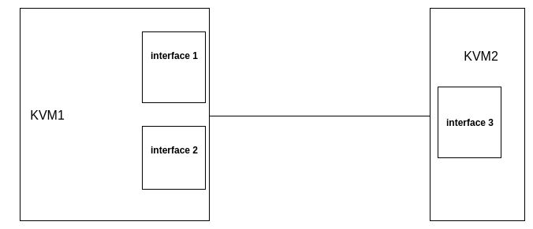
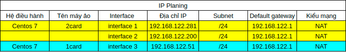
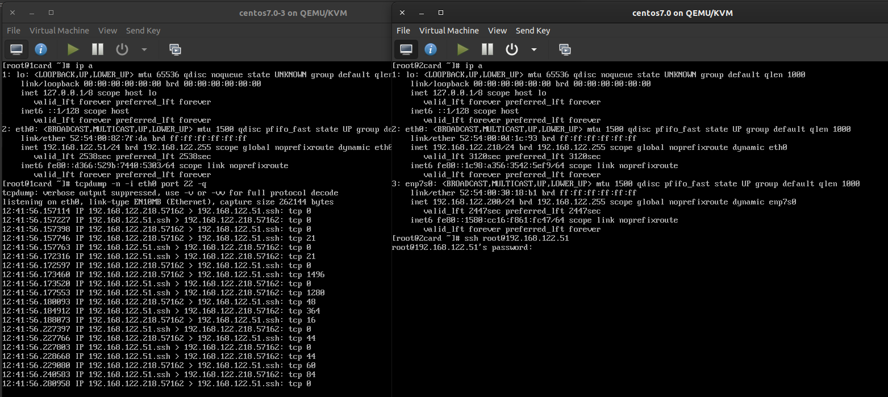
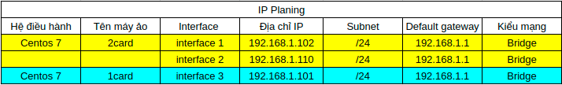
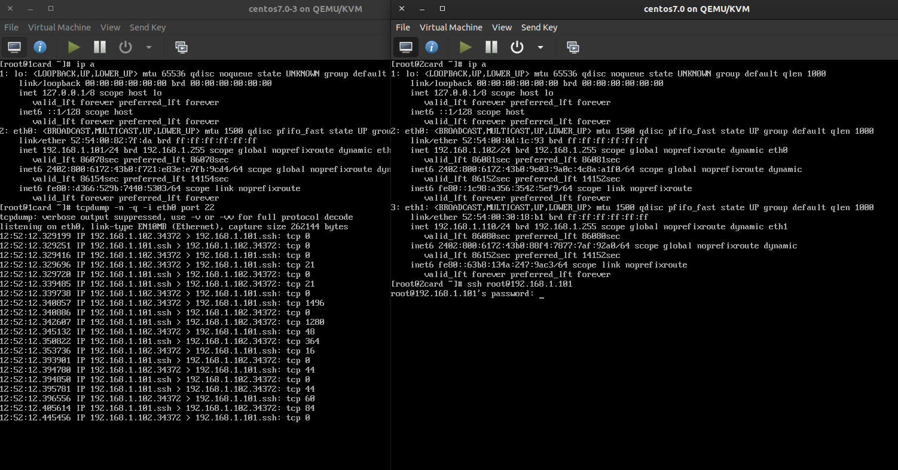

Bài 1: Bắt gói tin khi 2 máy sử dụng 1 kiểu mạng NAT.
Sơ đồ.

ip planning.

Kết quả.

sử dụng card mạng có địa chỉ 192.168.122.218 không sử dung địa chỉ 192.168.122.200.

Bài 2: Bắt gói tin khi 2 máy sử dụng 1 kiểu mạng bridge.

ip planning

kết quả 

